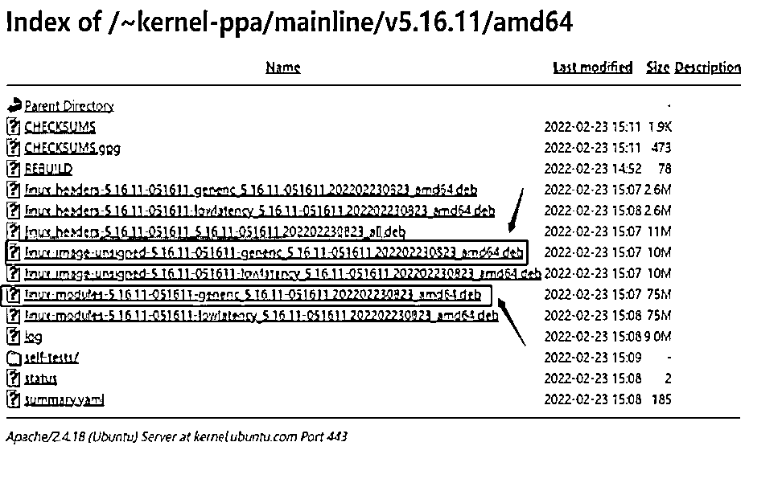

# CVE-2022-0847(Dirty Pipe)Linux 内核提权漏洞预警与修复方案 - i 春秋 - 博客园

> 原文：[`www.cnblogs.com/ichunqiu/p/15984971.html`](https://www.cnblogs.com/ichunqiu/p/15984971.html)

**漏洞摘要**

2022 年 3 月 7 日 RedHat 官网公布了编号为 CVE-2022-0847 的内核提权漏洞。此漏洞是安全研究员 Max Kellermann 在克服解决下载访问日志无法解压时发现的。该漏洞可以向一个只读文件写入任意的数据，并且影响 Linux 内核 5.8 及以后版本。攻击者可以利用网上公开的 exploit 从普通用户权限提升到特权用户。

漏洞名称：CVE-2022-0847 Linux 内核提权漏洞

漏洞类型：内核漏洞

修复版本：Linux 5.16.11, 5.15.25 and 5.10.102

综合评价：<利用难度> 容易

　　　　　<威胁等级> 高危

**01 漏洞详情**

Linux 内核中的函数 copy_page_to_iter_pipe 和 push_pipe 没有对新的 pipe_buffer 结构体的 flags 成员初始化。此时的值就是原来 pipe_buffer 结构体中的 flags 成员值。所以一个普通权限用户可以利用这个漏洞向一个只读文件写入任意内容。

**02 影响范围**

Linux 内核 5.8 及以后的版本。

**03 修复建议**

Linux 5.16.11、5.15.25 和 5.10.102 等内核版本已修复该漏洞，可通过升级内核进行修复，升级现有 linux 内核版本。

以 Ubuntu 为例，从 kernel.ubuntu.com 网站手动下载可用的最新 Linux 内核，点击你所选择的 Linux 内核版本链接，找到你对应的架构（“Build for XXX”）的那部分。（见下图）

下载符合以下格式的两个文件（其中 X.Y.Z 是目标版本号）：

linux-modules-X.Y.Z-generic-*.deb

linux-image-X.Y.Z-generic-*.deb

在终端中改变到文件所在的目录，然后执行此命令手动安装内核：

重启系统，使用新内核：

检查内核是否修改成功：

**04 参考链接**

1、https://dirtypipe.cm4all.com/

2、https://access.redhat.com/security/cve/cve-2022-0847

**3、***https://git.kernel.org/pub/scm/linux/kernel/git/torvalds/linux.git/commit/?id=9d2231c5d74e13b2a0546fee6737ee4446017903***