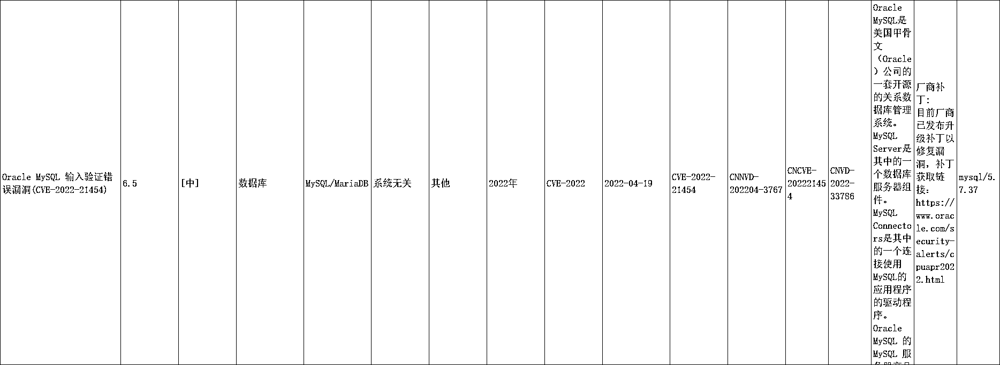
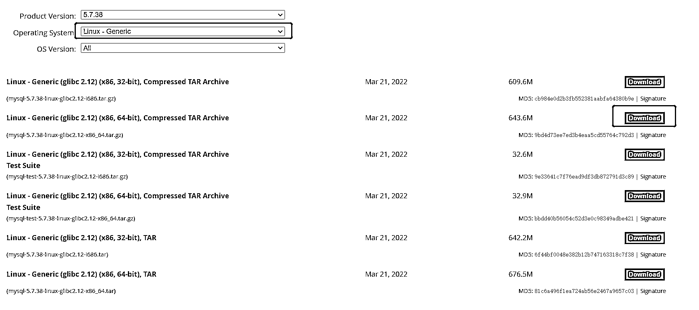

# CVE-2022-21454:漏洞整改 mysql5.7.37 升级至 5.7.38 tar 包升级 - 我爱睡莲 - 博客园

> 原文：[`www.cnblogs.com/avasteven/p/16540432.html`](https://www.cnblogs.com/avasteven/p/16540432.html)

问题描述：对数据库服务器进行漏扫，发现一些中高位漏洞需要整改，有些数据库需要升级到最新版



漏洞修改指导链接：https://www.oracle.com/security-alerts/cpuapr2022.html

漏洞编号：CVE-2022-21454

数据库版本：keepalived+MySQL5.7.37 主从架构

操作系统：redhat7.5

官方建议：升级至 MySQL5.7.37 之后以及 8.0.28 之后，也就是现有的 5.7.38 和 8.0.29。mysql5.7.37->mysql5.7.38 升级

| CVE-2022-21454 | MySQL Server | Server: Group Replication Plugin | MySQL Protocol | No | 6.5 | Network | Low | Low | None | Un- changed | None | None | High | 5.7.37 and prior, 8.0.28 and prior |

MySQL5.7.38 下载地址：https://downloads.mysql.com/archives/community/



升级方式为替换原安装目录的逻辑升级方式

## 1.确认原库环境，ip，版本，检查 processlist 是否有业务进程，现在备库上进行升级，停止集群和 VIP，停止主从关系

```
mysql> select @@version; +------------+
| @@version  |
+------------+
| 5.7.37-log |
+------------+
1 row in set (0.00 sec)

mysql> show processlist; +--------+--------------+--------------------+-------+---------+------+----------+------------------+
| Id     | User         | Host               | db    | Command | Time | State    | Info             |
+--------+--------------+--------------------+-------+---------+------+----------+------------------+
| 342942 | i6000collect | 20.32.98.133:39186 | mysql | Sleep   |  186 |          | NULL             |
| 343056 | root         | localhost          | NULL  | Query   |    0 | starting | show processlist |
+--------+--------------+--------------------+-------+---------+------+----------+------------------+
2 rows in set (0.00 sec)
```

## 2.备份数据库数据，备份安装目录

备份数据库

```
[root@db01 backup]# /soft/mysql/bin/mysqlpump -uroot -p -S /home/data/db_gwyy/mysql.sock --set-gtid-purged=off --all-databases --single-transaction --default-parallelism=4 > /home/backup/0801_all_db.sql
```

备份安装目录

```
[root@db02 soft]# cp -r mysql mysql.0801.bak
```

## 3.解压安装包

```
[root@db01 soft]# tar xvf mysql-5.7.38-linux-glibc2.12-x86_64.tar 
mysql-test-5.7.38-linux-glibc2.12-x86_64.tar.gz
mysql-5.7.38-linux-glibc2.12-x86_64.tar.gz
[root@db01 soft]# tar -zxvf mysql-5.7.38-linux-glibc2.12-x86_64.tar.gz 
```

## 4.关停集群和 VIP，两个节点都操作

```
[root@db01 soft]# systemctl stop keepalived
[root@db02 soft]# systemctl stop keepalived
```

## 5.关停备库

```
mysql> stop slave;
Query OK, 0 rows affected (0.01 sec)

mysql> set global innodb_fast_shutdown = 0;
Query OK, 0 rows affected (0.00 sec)

mysql> select @@innodb_fast_shutdown; +------------------------+
| @@innodb_fast_shutdown |
+------------------------+
|                      0 |
+------------------------+
1 row in set (0.00 sec)
```

关闭数据库

```
mysql> shutdown;
Query OK, 0 rows affected (0.00 sec)
```

## 6.替换安装目录

```
[root@db02 soft]# mv mysql /tmp/ [root@db02 soft]# mv mysql-5.7.38-linux-glibc2.12-x86_64 mysql
[root@db02 soft]# chown -R mysql.mysql mysql
```

检查最新 mysql 目录是否为安装的版本

```
[root@db02 soft]# /soft/mysql/bin/mysql -V /soft/mysql/bin/mysql  Ver 14.14 Distrib 5.7.38, for linux-glibc2.12 (x86_64) using  EditLine wrapper
```

## 7.启动 mysql

使用 mysql 用户启动数据库

```
[mysql@db02 ~]$ sh /home/data/db_gwyy/bin/startup.sh 
[mysql@db02 ~]$ 
[mysql@db02 ~]$ ps -ef | grep mysql
root 333452 333451  0 10:09 pts/0    00:00:00 /soft/mysql/bin/mysql -uroot -p -S/home/data/db_gwyy/mysql.sock
root 335921 333913  0 10:18 pts/1    00:00:00 su - mysql
mysql 335922 335921  0 10:18 pts/1    00:00:00 -bash
mysql 335994      1  1 10:18 pts/1    00:00:00 /bin/sh /soft/mysql/bin/mysqld_safe --defaults-file=/home/data/db_gwyy/conf/gwyy.cnf --datadir=/home/data/db_gwyy/data
mysql 337619 335994 34 10:18 pts/1    00:00:03 /soft/mysql/bin/mysqld --defaults-file=/home/data/db_gwyy/conf/gwyy.cnf --basedir=/soft/mysql --datadir=/home/data/db_gwyy/data --plugin-dir=/soft/mysql/lib/plugin --log-error=/home/data/db_gwyy/log/mysql.err --open-files-limit=65000 --pid-file=/home/data/db_gwyy/mysql.pid --socket=/home/data/db_gwyy/mysql.sock --port=13306 mysql 337659 335922  0 10:19 pts/1    00:00:00 ps -ef
mysql 337660 335922  0 10:19 pts/1    00:00:00 grep --color=auto mysql
```

## 8.mysql5.7.37->升级 mysql5.7.38

报错

```
[mysql@db02 ~]$ /soft/mysql/bin/mysql_upgrade -S /home/data/db_gwyy/mysql.sock -uroot -p
Enter password: 
Checking if update is needed.
Checking server version.
Running queries to upgrade MySQL server.
mysql_upgrade: [ERROR] 3161: Storage engine MyISAM is disabled (Table creation is disallowed).
```

修改配置文件

```
#disabled_storage_engines        ="MyISAM,FEDERATED"
```

重启数据库使参数生效

```
[mysql@db02 ~]$ sh /home/data/db_gwyy/bin/shutdown.sh 
Enter password: 
[mysql@db02 ~]$ sh /home/data/db_gwyy/bin/startup.sh
```

重新升级数据字典

```
[mysql@db02 ~]$ /soft/mysql/bin/mysql_upgrade -S /home/data/db_gwyy/mysql.sock -uroot -p
Enter password: 
Checking if update is needed.
Checking server version.
Running queries to upgrade MySQL server.
Checking system database.
mysql.columns_priv                                 OK
mysql.db                                           OK
mysql.engine_cost                                  OK
mysql.event OK
mysql.func                                         OK
mysql.general_log                                  OK
mysql.gtid_executed                                OK
mysql.help_category                                OK
mysql.help_keyword                                 OK
mysql.help_relation                                OK
mysql.help_topic                                   OK
mysql.innodb_index_stats                           OK
mysql.innodb_table_stats                           OK
mysql.ndb_binlog_index                             OK
mysql.plugin                                       OK
mysql.proc                                         OK
mysql.procs_priv                                   OK
mysql.proxies_priv                                 OK
mysql.server_cost                                  OK
mysql.servers                                      OK
mysql.slave_master_info                            OK
mysql.slave_relay_log_info                         OK
mysql.slave_worker_info                            OK
mysql.slow_log                                     OK
mysql.tables_priv                                  OK
mysql.time_zone                                    OK
mysql.time_zone_leap_second                        OK
mysql.time_zone_name                               OK
mysql.time_zone_transition                         OK
mysql.time_zone_transition_type                    OK
mysql.user                                         OK
The sys schema is already up to date (version 1.5.2).
Checking databases.
hzh01.t1                                           OK
hzh02.t2                                           OK
sys.sys_config                                     OK
Upgrade process completed successfully.
Checking if update is needed.
```

再次重启数据库，验证升级的有效性

```
[mysql@db02 ~]$ sh /home/data/db_gwyy/bin/shutdown.sh 
Enter password: 
[mysql@db02 ~]$ sh /home/data/db_gwyy/bin/startup.sh 
```

## 9.验证数据库版本

```
mysql> status --------------
/soft/mysql/bin/mysql  Ver 14.14 Distrib 5.7.38, for linux-glibc2.12 (x86_64) using EditLine wrapper

Connection id: 3 Current database:    
Current user:        root@localhost
SSL:            Not in use
Current pager:        stdout
Using outfile: '' Using delimiter:    ;
Server version: 5.7.38-log MySQL Community Server (GPL)
Protocol version: 10 Connection:        Localhost via UNIX socket
Server characterset:    utf8
Db     characterset:    utf8
Client characterset:    utf8
Conn.  characterset:    utf8
UNIX socket: /home/data/db_gwyy/mysql.sock
Uptime: 1 min 37 sec

Threads: 1  Questions: 6  Slow queries: 0  Opens: 108  Flush tables: 1  Open tables: 101  Queries per second avg: 0.061
--------------
```

备库启用相关参数

```
mysql> set global slave_net_timeout=8; 
Query OK, 0 rows affected (0.00 sec)

mysql> set global read_only=1; 
Query OK, 0 rows affected (0.00 sec)

mysql> set global super_read_only=1; 
Query OK, 0 rows affected (0.00 sec)
```

## 10.升级主库

参照备库，升级完验证相关参数

## 11.启动集群

```
[root@db01 soft]# systemctl start keepalived
[root@db02 ~]# systemctl status keepalived
```

## 12.验证数据库连接

验证集群及 VIP，业务，数据库连接是否正常