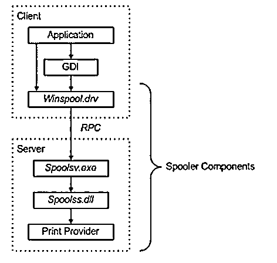

# CVE-2022-21999 - SecIN 社区 - 博客园

> 原文：[`www.cnblogs.com/SecIN/p/16562037.html`](https://www.cnblogs.com/SecIN/p/16562037.html)

一、 漏洞信息

CVE-2022-21999（CVE-2022–22718）是微软 2 月周二补丁所爆出来的打印机本地提权漏洞。其本质上是 CVE-2020-1030 的绕过。

二、 测试环境及漏洞复现

## 测试环境

POC：[`github.com/ly4k/SpoolFool`](https://github.com/ly4k/SpoolFool)

靶机： win10 x64 专业版，1909

## 漏洞复现

三、 漏洞成因分析

## Print Spool

1.  主要组件

Print Spooler 是打印后台处理服务，即管理所有本地和网络打印队列及控制所有打印工作。如果此服务被停用，本地计算机上的打印将不可用。主要组件如下图所示：

具体组件信息微软官方文件有详细阐述，感兴趣的同学可通过参考链接 1 进行查阅。

2.Spool directory

当用户打印文档时，打印作业被 spool 送到一个预定的位置，称为 spool directory。另外 spool directory 在每台打印机设备上都是可以配置（修改）的，而且它会赋予所有用户拥有 FILE_ADD_FILE 权限。

通过在打印机的注册表项设置 spool
directory 的值来支持单个 spool directory。

3.Point and Print

Point and Print 是为驱动程序分发而设计的多种打印机共享技术之一。在 Point and Print 中，驱动程序（v4 之前的型号）和配置文件会自动从打印服务器下载。安装可通过自定义的 Point and Print DLL 进行扩展。该 DLL 是通过在打印机配置中定义 CopyFiles 注册表项来实现的。

4.相关函数

Print spool 提供以下四个函数用于管理配置数据

以上函数去执行与 print`s Key(pValueName 控制)相关的注册表操作。

当我们通过上述函数修改 print 的配置时，有一个大前提就是打印机需要以 PRINTER_ACCESS_ADMINISTER 权限被打开。

## 成因分析

1.  SetPrinterDataEx 分析

带有 CopyFiles 注册表项的 SetPrinterDataEx 会导致 spooler 自动加载在 Module 值中分配的 Point and Print DLL。其调用链如下：

用户层调用 SetPrinterDataEx 函数，Winspool 会向本地 Print Spooler（LocalSpl）发送一个 RPC 请求，后者会将请求 route 到 SplSetPrinterDataEx 中的本地打印提供程序实现。

在 localspl.dll!SplSetPrinterDataEx 中会对 pKeyName 的值进行匹配

当 pszKeyName 以”CopyFiles\”字符串开头时触发 Load 事件，会调用 SplCopyFileEvent 去处理。

SplCopyFileEvent 首先通过调用 SplGetPrinterDataEx 获取模块路径长度，为其申请相应的内存，接着再次通过 SplGetPrinterDataEx 获取模块完整路径。最后将要加载的模块路径传入 SplLoadLibraryTheCopyFileModule。

调试信息如下：

SplLoadLibraryTheCopyFileModule 会对模块路径进行验证，只有通过验证后才可以加载 DLL。

MakeCanonicalPath 将模块路径转换为规范路径。

IsModuleFilePathAllowed 函数将验证模块规范路径是否在 system 路径或者打印机驱动目录下。

*   System 路径：DLL 只能直接在 C:\Windows\System32\路径下才可以（不包括下层目录）。
*   打印机驱动目录路径：DLL 可以在打印机驱动目录下的任意路径。

Tips：匹配算法是通过是将模块规范路径去掉其前四个字节后，进行匹配的。即?\C:\Windows\System32\spool\drivers\x64
printers\变为 C:\Windows\System32\spool\drivers\x64
printers\。此种方法存在一定的缺陷，漏洞利用也是针对这种检查方式的绕过。

2.漏洞点分析

Spooler 在加载 Point and Print DLL 时会依次搜索一下两个路径：

*   %SYSTEMROOT%\System32 % SYSTEMROOT% System32
*   %SYSTEMROOT%\System32\spool\drivers<ENVIRONMENT><DRIVERVERSION> %

我们可以从第二个路径做文章，也就是打印机驱动程序目录，我们可以利用一个不存在的版本（4）驱动程序目录来进行利用。如果我们能够创建具有读写权限的目录，那么 missing path 可能存在代码执行机会。然后可以将任意 DLL 放置到文件路径中，并通过
SetPrinterDataEx 调用它。

四、 漏洞利用分析

## 利用流程

1.  创建打印机

为获取 PRINTER_ACCESS_ADMINISTER 权限，要在本地创建一台新的打印机。

2.设置 Spool directory

通过 SetPrinterDataEx 设置 Spool directory，获取一个拥有 FILE_ADD_FILE 的权限的文件目录。

这里需要特殊说明一下，在使用 CVE-2020-1030 漏洞补丁更新后，SetPrinterDataEx 在设置 Spool directory 时会对其传入的路径进行一次检查。

IsValidSpoolDirectory 将要设置的 Spool directory 路径转换为规范路径后，测试其是否具有 GENERIC_WRITE 权限。

验证成功后，在打印机注册表项对 Spool directory 进行更改。

3.符号链接

设置自定义 Spool directory 目的是我们想通过它去执行任意 DLL，但在通过我们对 SetPrinterDataEx 可知，其在加载 DLL 前会对其路径进行一次检查（必须是 system 路径或打印机驱动目录），此时我就可以通过符号链接（重解析）来绕过。

即让自定义的路径\localhost\C$/spooldir)指向 C:\Windows\System32\spool\drivers\x64\，至于这里为什么要用 UNC 路径，后面会进行解释。

AppVTerminator 的 Dllmain 可直接结束当前进程（spoolsv.exe）。

Spooler 被强制结束后，会触发其恢复机制，从而达到重启服务的目的。

Spooler 重启之后会通过 localspl!SplCreateSpooler
调用 localspl!BuildPrinterInfo 时会创建 spool directory。在 localspl!BuildPrinterInfo
赋予 FILE_ADD_FILE 权限之前，进行最后检查以确保目录路径不在打印机驱动程序目录中。

Tips：此项路径检查同样是在 CVE-2020-1030 的补丁中添加。

综上所述，想要成功加载一个 DLL 我们必须保证以下两点：

BuildPrinterInfo 检查时，保证 Spool directory 路径不以

*   C:\ Windows\System32\spool\drivers\x64\开头
*   SplLoadLibraryTheCopyFileModule 检查时，保证 Spool directory 路径以 C:\ Windows\System32\spool\drivers\x64\开头

这样看起来好像很矛盾，但它的检查算法(IsModuleFilePathAllowed)是存在缺陷的（去掉前 4 个字节匹配），因此我们可以将 Spool directory 设置为 UNC 路径，例如\localhost\CKaTeX parse error: Undefined control sequence: \spooldir at position 1: \̲s̲p̲o̲o̲l̲d̲i̲r̲\printers\,经过设置软连接后，它的规范路径是\?\UNC\localhost\C$\Windows\System32\spool\drivers\x64\printers\，因此去掉前四个字节后与 C:\Windows\System32\spool\drivers\x64\也不匹配。成功过掉检查后，BuildPrinterInfo 就会给 Spool directory（C:\Windows\System32\spool\drivers\x64\）赋予 FILE_ADD_FILE 权限。

5.写入 DLL 并加载

Spooler 服务成功重启后，我们可以将想要执行的 DLL 文件写入到 C:\Windows\system32\spool\DRIVERS\x64\4，然后通过 SplLoadLibraryTheCopyFileModule 去加载（以 SYSTEM 权限加载）。

## 符号链接

CVE-2022-21999 实际上是 CVE-2020-1030 的绕过，其核心是 UNC 路径和符号链接。这里简单介绍一下符号链接。

符号链接是将自己链接到一个目标文件或目录的路径上。当系统识别到符号链接时，它会跳转到符号链接所指向的目标中去，而不改变此时的文件路径。实际上，我认为这就是高级快捷方式。

如下图所示，为打印机驱动程序目录创建符号链接\localhost\C$\Users\jiabin3\AppData\Local\Temp\c0e601f7-92b2-4167-b18f-3a23c65eaa94。然后可以看到，打开此路径之后
，其内部的目录（文件）结构与打印机驱动程序目录是一致的。唯一的区别是他们的路径不一样，我认为这是一种高级映射方式。

## 参考链接

1.  Print Spool 组件介绍

[`docs.microsoft.com/en-us/windows-hardware/drivers/print/introduction-to-spooler-components`](https://docs.microsoft.com/en-us/windows-hardware/drivers/print/introduction-to-spooler-components)

2.  Windows Print Spooler Privilege
    Escalation

[`research.ifcr.dk/spoolfool-windows-print-spooler-privilege-escalation-cve-2022-22718-bf7752b68d81`](https://research.ifcr.dk/spoolfool-windows-print-spooler-privilege-escalation-cve-2022-22718-bf7752b68d81)

3.  Windows 符号链接

[`sspai.com/post/66834`](https://sspai.com/post/66834)