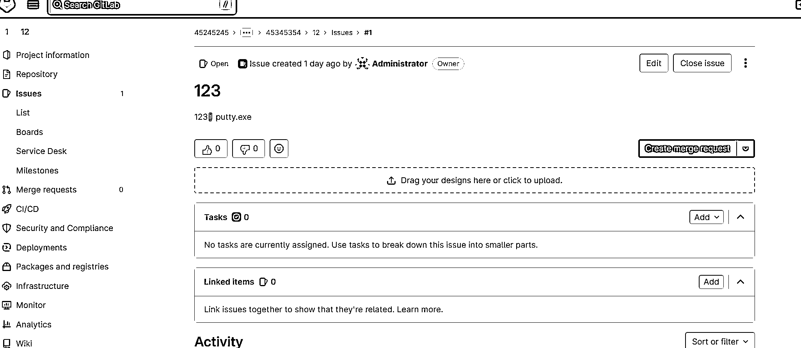
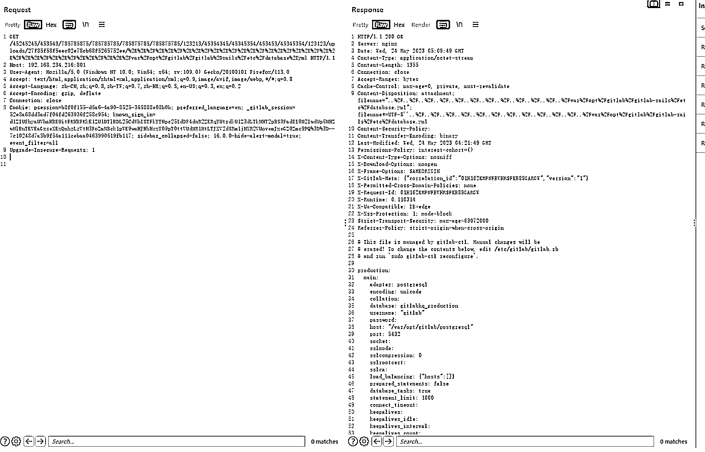
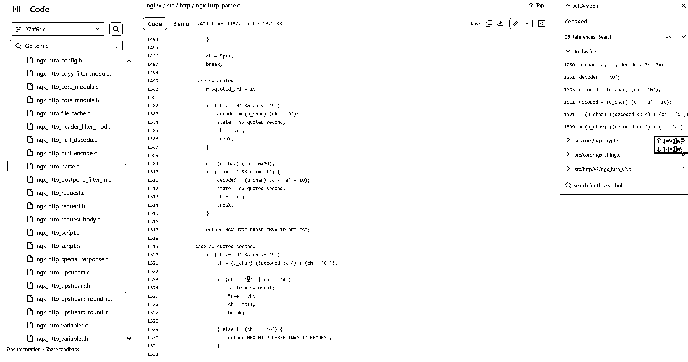

# CVE-2023-2825-GitLab 目录穿越 poc - mt0u - 博客园

> 原文：[`www.cnblogs.com/mt0u/p/17459012.html`](https://www.cnblogs.com/mt0u/p/17459012.html)

# Gitlab CVE-2023-2825 目录穿越漏洞

# 前言

昨天 GitLab 出了一个版本目录穿越漏洞(CVE-2023-2825)，可以任意读取文件。当时我进行了黑盒测试并复现了该漏洞。

> “ An unauthenticated malicious user can use a path traversal vulnerability to read arbitrary files on the server when an attachment exists in a public project nested within at least five groups. “

这个漏洞的利用条件非常特殊,需要一个至少嵌套了五层 group 的公开项目”。
看到这个描述，我就觉得这个漏洞非常有趣。很容易想到一种奇怪的情况，即构造五层目录后，再利用五次”../“，恰好到达根目录。
修复漏洞的 commit:
[`gitlab.com/gitlab-org/gitlab/-/commit/2ddbf5464954addce7b8c82102377f0f137b604f`](https://gitlab.com/gitlab-org/gitlab/-/commit/2ddbf5464954addce7b8c82102377f0f137b604f)

# 漏洞利用

Gitlab 环境搭建完成之后，我成功验证了我的猜想。这个漏洞非常简单,用了几分钟成功复现了该漏洞。

## 创建 group 嵌套项目

首先 创建一个嵌套 group 的项目
Gitlab 的 group 可以嵌套 一个 group 可以有多个子 group.
嵌套的 group 的项目需要按照下面的这种 url 访问
/a/b/c/d/e/f/g/proj

## 添加项目附件

添加项目之后 发起一个 issus 这时候可以添加附件


## 下载文件

修改文件下载地址 多次尝试构造得到 poc.



成功读取文件

# 漏洞分析

这个 POC 看起来很奇怪，有着数个目录，后半部分的 URL 还被编码了。
但是为什么会出现这个漏洞? 这里面出现了三个问题:
:::info
这个漏洞为什么会出现在 uri 上?
为什么后面的 uri 要 url 编码?
为什么要构造 5 层以上目录?
:::
我们先来看看 gitlab 的架构

```
Nginx( C )-> Workhorse(gitlab 自己的中间件 Go) -> Unicorn(新版本为 puma) (Ruby) 
```

用户发起的请求要经过两个中间件的转发才会到 puma 后端

## Nginx

```
location / {
  client_max_body_size 0;
  gzip off;

  ## https://github.com/gitlabhq/gitlabhq/issues/694
  ## Some requests take more than 30 seconds.
  proxy_read_timeout      300;
  proxy_connect_timeout   300;
  proxy_redirect          off;

  proxy_http_version 1.1;

  proxy_set_header    Host                $http_host;
  proxy_set_header    X-Real-IP           $remote_addr;
  proxy_set_header    X-Forwarded-For     $proxy_add_x_forwarded_for;
  proxy_set_header    X-Forwarded-Proto   $scheme;
  proxy_set_header    Upgrade             $http_upgrade;
  proxy_set_header    Connection          $connection_upgrade_gitlab;

  proxy_pass http://gitlab-workhorse;
} 
```

用户发起的请求 第一步需要先通过 nginx
nginx 会对 uri 进行校验
如果目录穿越超过了目录层数 就会返回 400 状态码 请求也不会转发到后端

```
/a/b/../../../ 
```

但是如果我们把目录穿越的部分进行 url 编码呢?

```
/a/b/%2E%2F%2E%2E%2F%2E%2E%2F%2E%2E%2F 
```

结果还是 400
分析 nginx 的代码后，不难发现在处理复杂的 URI 时，nginx 会对 URL 编码的部分进行解码。
[`github.com/nginx/nginx/blob/27af6dcb48d8e7ba5c07eba8f0157262222bcf18/src/http/ngx_http_parse.c#L1499`](https://github.com/nginx/nginx/blob/27af6dcb48d8e7ba5c07eba8f0157262222bcf18/src/http/ngx_http_parse.c#L1499)



因此，我们不能仅仅依赖简单的编码方式来绕过这个限制。相反，我们需要构造 5 层目录来欺骗 nginx，这样就可以成功绕过校验了。
一旦通过了校验，nginx 会将未经解码处理的 URL 传递给 Workhorse。

## Workhorse

下载文件的请求在 Workhorse 里面没有命中自定义的路由 会直接转发到 puma

## Puma

在 Rails 中，处理路由的方式略有不同于 nginx。
Rails 匹配路由参数时，不会对 URL 进行解码。
让我们来看一下与 uploads 相关的路由，其中 filename 参数使用了正则表达式来匹配 URL / 后面的字符串。

```
scope path: :uploads do
  # Note attachments and User/Group/Project/Topic avatars
  get "-/system/:model/:mounted_as/:id/:filename",
  to: "uploads#show",
  constraints: { model: %r{note|user|group|project|projects\/topic|achievements\/achievement}, mounted_as: /avatar|attachment/, filename: %r{[^/]+} }
...... 
```

Rails 会对获取到的参数进行 URL 解码，并成功将带有 “../“ 的路径作为参数传递给 uploads#show，最终成功读取任意文件。

```
# This should either
#   - send the file directly
#   - or redirect to its URL
#
def show
  return render_404 unless uploader&.exists?

  ttl, directives = *cache_settings
  ttl ||= 0
  directives ||= { private: true, must_revalidate: true }

  expires_in ttl, directives

  file_uploader = [uploader, *uploader.versions.values].find do |version|
    version.filename == params[:filename]
  end

  return render_404 unless file_uploader

  workhorse_set_content_type!
  send_upload(file_uploader, attachment: file_uploader.filename, disposition: content_disposition)
end
def send_upload(file_upload, send_params: {}, redirect_params: {}, attachment: nil, proxy: false, disposition: 'attachment')
  content_type = content_type_for(attachment)

  if attachment
    response_disposition = ActionDispatch::Http::ContentDisposition.format(disposition: disposition, filename: attachment)

    # Response-Content-Type will not override an existing Content-Type in
    # Google Cloud Storage, so the metadata needs to be cleared on GCS for
    # this to work. However, this override works with AWS.
    redirect_params[:query] = { "response-content-disposition" => response_disposition,
                                "response-content-type" => content_type }
    # By default, Rails will send uploads with an extension of .js with a
    # content-type of text/javascript, which will trigger Rails'
    # cross-origin JavaScript protection.
    send_params[:content_type] = 'text/plain' if File.extname(attachment) == '.js'

    send_params.merge!(filename: attachment, disposition: disposition)
  end

  if image_scaling_request?(file_upload)
    location = file_upload.file_storage? ? file_upload.path : file_upload.url
    headers.store(*Gitlab::Workhorse.send_scaled_image(location, params[:width].to_i, content_type))
    head :ok
  elsif file_upload.file_storage?
    send_file file_upload.path, send_params
  elsif file_upload.class.proxy_download_enabled? || proxy
    headers.store(*Gitlab::Workhorse.send_url(file_upload.url(**redirect_params)))
    head :ok
  else
    redirect_to cdn_fronted_url(file_upload, redirect_params)
  end
end 
```

# 漏洞深入利用

漏洞利用的时候注意要足够数量的 group 才能从储存目录穿越到根目录 5 层可能不够

读取文件时会作为 git 用户组的权限进行读取
gitlab 的文件权限十分严格
redis pg 数据库的文件无法访问
但是可以访问一些配置文件 部分私钥凭据 全部的 git 仓库数据 等

# 利用条件

存在可以达到根目录的嵌套可公开访问到的 group 项目 而且存在附件(issus 评论 等)
或
普通用户权限 手动创建 多层 group 和项目

# 影响范围

gitlab-ee/ce == 16.0.0

# 修复方法

更新 gitlab 到 16.0.1
[`about.gitlab.com/update/`](https://about.gitlab.com/update/)

文章转自[Gitlab CVE-2023-2825 一个罕见的目录穿越漏洞 - 白帽酱の博客 (rce.moe)](https://rce.moe/2023/05/25/Gitlab-CVE-2023-2825/)