# Django SQL 注入漏洞分析（CVE-2022-28346） - 合天网安实验室 - 博客园

> 原文：[`www.cnblogs.com/hetianlab/p/17390237.html`](https://www.cnblogs.com/hetianlab/p/17390237.html)

## 漏洞简介

Django 在 2022 年发布的安全更新，修复了在 QuerySet 的 annotate()， aggregate()， extra() 等函数中存在的 SQL 注入漏洞。

### 影响版本

2.2<= Django Django <2.2.28 3.2<= Django Django <3.2.13 4.0<= Django Django <4.0.4

需要使用了 annotate 或者 aggregate 或 extra 方法

## 环境搭建

### 搭建特定版本的 django 项目

利用 pycharm 创建一个 python 项目

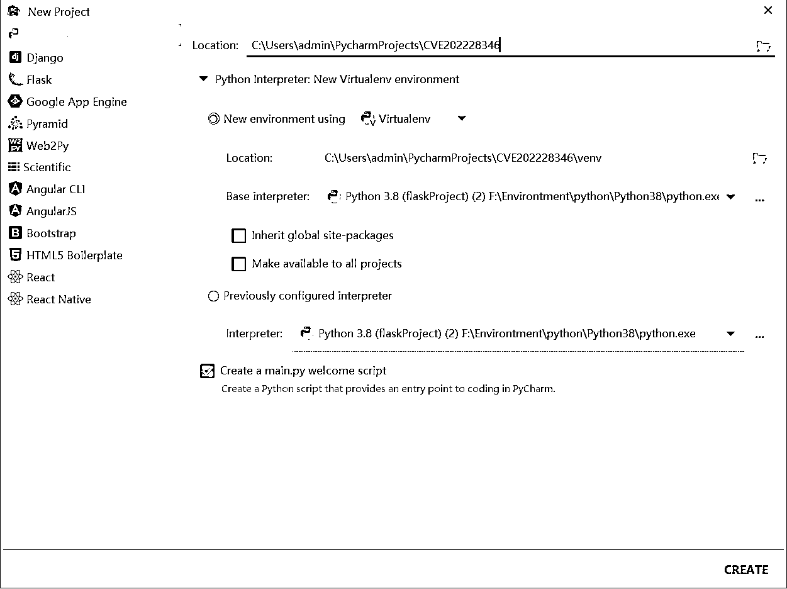​

创建完成项目后在 Settings 中找到 Project: CVE202228346 对应的 Python Interpreter

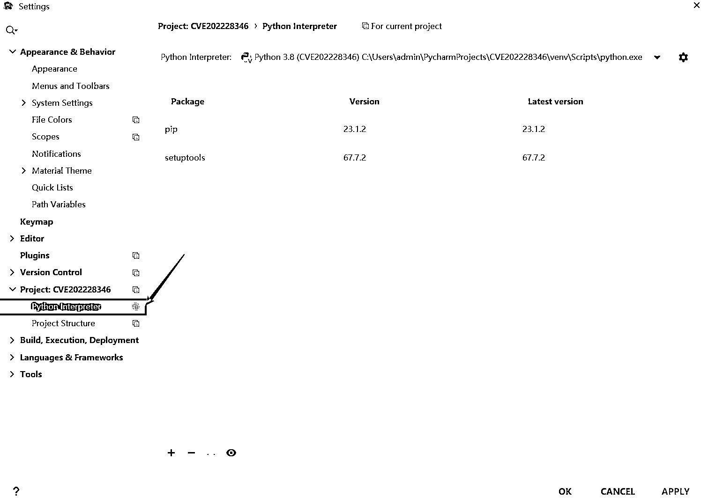添加存在问题的 Django 版本

​

在 Terminal 中执行命令，创建 django 项目

`django-admin startproject CVE202228346`​

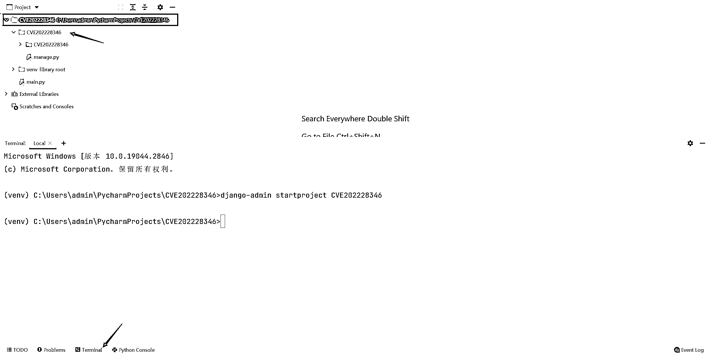​

配置启动设置

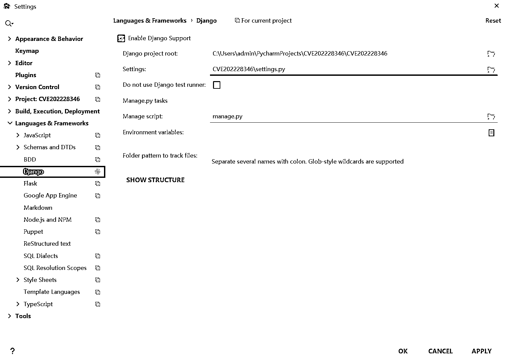​

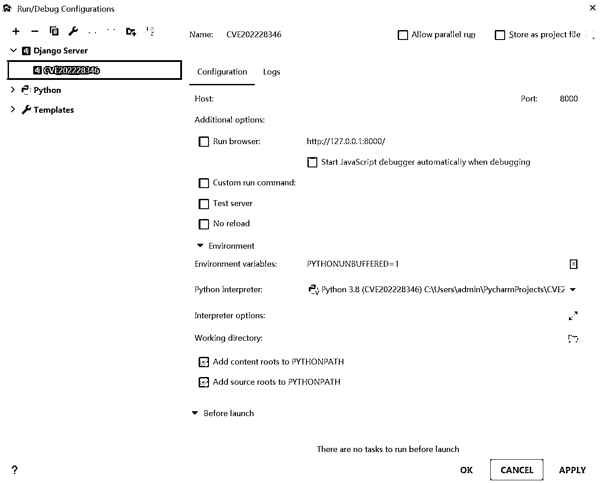​

运行后就启动了最简单的 django 项目

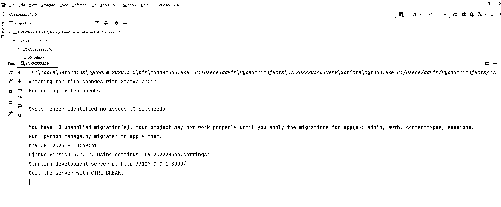​

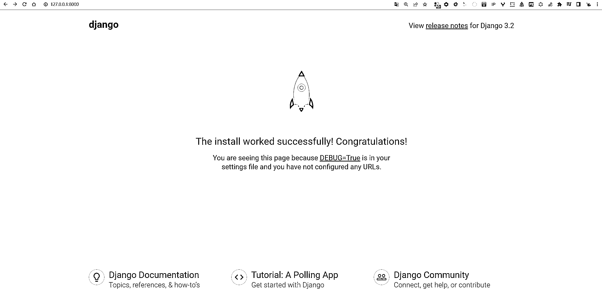

‍

### 编写配置漏洞代码

折腾来折腾去，出现了很多问题，一度想要放弃说直接采用 docker ，但是在不断的试错下，最终还是编写成功

因为对 python 的 django 不太熟悉，所以其中可能更多的是比较偏向于基础的操作

【----帮助网安学习，以下所有学习资料免费领！加 vx：yj009991，备注 “博客园” 获取！】

　① 网安学习成长路径思维导图
　② 60+网安经典常用工具包
　③ 100+SRC 漏洞分析报告
　④ 150+网安攻防实战技术电子书
　⑤ 最权威 CISSP 认证考试指南+题库
　⑥ 超 1800 页 CTF 实战技巧手册
　⑦ 最新网安大厂面试题合集（含答案）
　⑧ APP 客户端安全检测指南（安卓+IOS）

进入到项目目录下创建命令 创建第一个应用

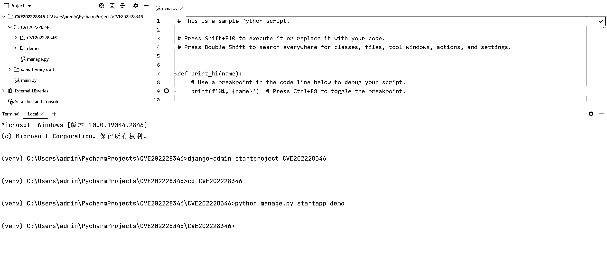​

在 settings.py 中添加配置

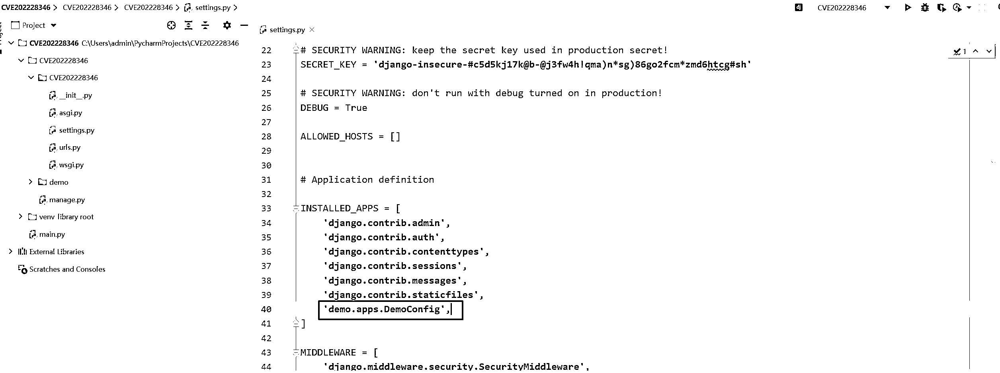在 urls.py 中添加 对应的 url，urls.py 相当于路由解析器，将路由解析到对应的 views.py 中对应的函数上

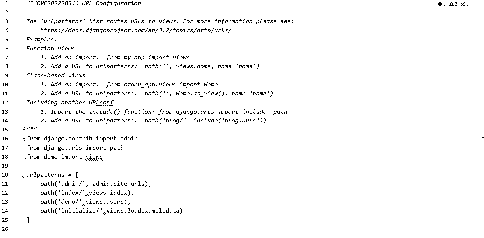​

```
urlpatterns = [
    path('admin/', admin.site.urls),
    path('index/',views.index),
    path('demo/',views.users),
    path('initialize/',views.loadexampledata)
]
```

‍

models.py 是创建表结构的时候使用，通过类的定义，可以创建一个表


```
from django.db import models
​
# Create your models here.
class User(models.Model):
    name = models.CharField(max_length=200)
​
    def __str__(self):
        return self.name
```

‍

views.py 主要定义了对应路由所响应的函数

​

```
from django.db.models import Count
from django.http import HttpResponse
from django.shortcuts import render
from .models import User
​
# Create your views here.
def index(request):
    return HttpResponse('hello world')
​
def users(request):
    field = request.GET.get('field', 'name')
    user_amount = User.objects.annotate(**{field: Count("name")})
    html = ""
    for u in user_amount:
        html += "<h3>Amoount of users: {0}</h3>".format(u)
    return HttpResponse(html)
​
def loadexampledata(request):
    u = User(name="Admin")
    u.save()
    u = User(name="Staff1")
    u.save()
    u = User(name="Staff12")
    u.save()
    return HttpResponse("ok")
```

三个函数分别是 helloword 函数，往数据库中加参数，以及查询数据库中的字段

‍

编写好代码后，需要对数据库执行初始化操作

```
python manage.py makemigrations
python manage.py migrate
```

‍

## 漏洞复现

先访问 initialize 为数据库中添加信息

构造 payload

```
http://127.0.0.1:8000/demo/?field=demo.name" FROM "demo_user" union SELECT "1",sqlite_version(),"3" --
```

​

## 漏洞分析

发现一个问题，在加上断点调试以后，每次运行输出的结果跟不加断点运行的结果存在很大的差异，结果完全不同。不断尝试之后发现是因为在某些地方加上断点之后，在调试器中查看变量和状态可能会影响程序的执行速度和内存使用情况，为了方便的输出某些位置的变量，采用 print 的方法结合断点调试。

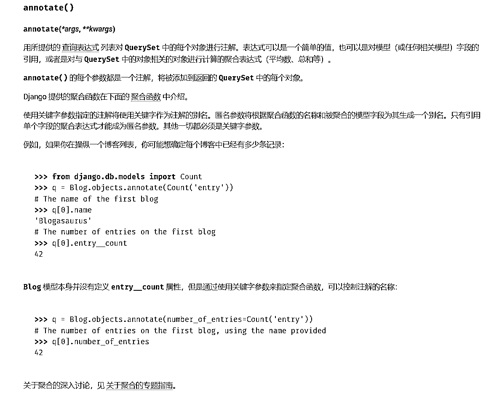

通过 get 传入的参数 field

`CVE202228346.demo.views.users`​

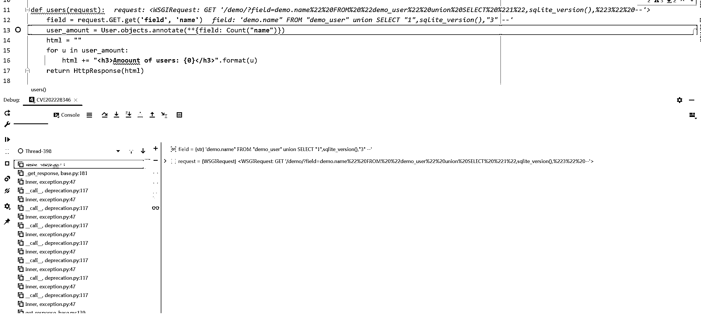

此处的`**{field: Count("name")}`​ 用来表示拆分字典

跟进 `annotate`​ 对传入参数的处理

`django.db.models.query.QuerySet.annotate`​

​

继续将参数传入到 `_annotate`​ 进行处理

`django.db.models.query.QuerySet._annotate`​


在将 `kwargs`​ 的值 `update`​ 到 `annotations`​ 后，调用 `add_annotation`​ 进行处理

`django.db.models.sql.query.Query.add_annotation`​​

`add_annotation`​ 也是漏洞存在的关键位置，因为修复漏洞的关键位置也在此处

调用 `resolve_expression`​ 解析表达式

`django.db.models.aggregates.Aggregate.resolve_expression`​

​

`django.db.models.expressions.Func.resolve_expression`​

​

`django.db.models.expressions.F.resolve_expression`​​

​

`django.db.models.sql.query.Query.resolve_ref`​

最后我们可以看到 clone 对应的值 以及执行的 SQL 语句

整个漏洞分析下来，仍然有很多不太清楚的地方，可能再分析几个关于 Django 的漏洞会好一些

‍

## 漏洞修复

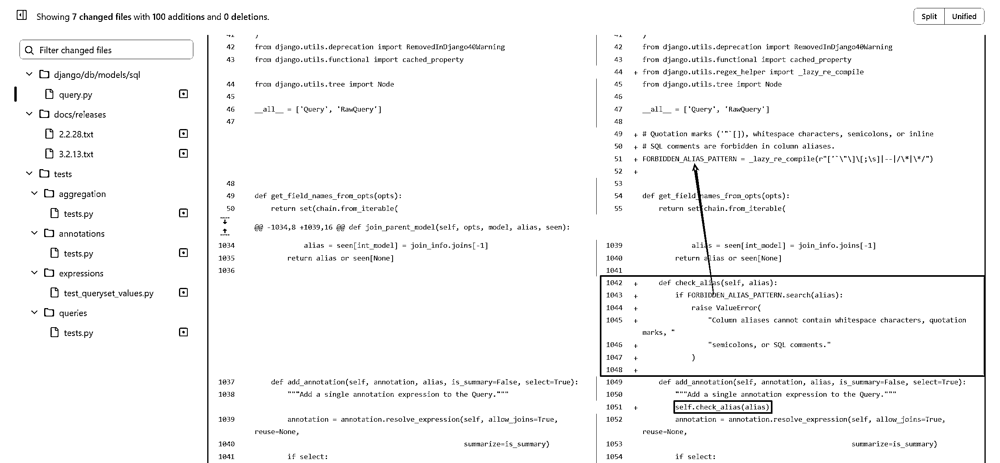在 `add_annotation`​ 添加了 `check_alias`​ 来对传入的参数进行校验

**更多网安技能的在线实操练习，[请点击这里>>](https://www.hetianlab.com/)**