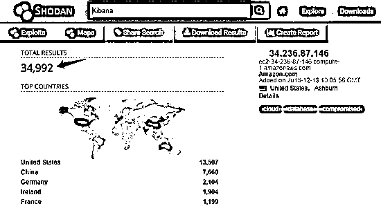
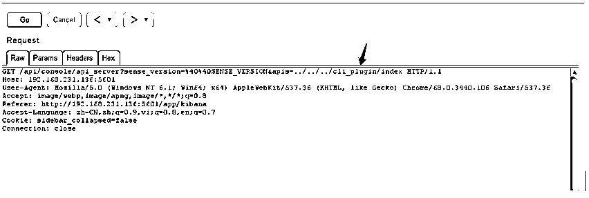
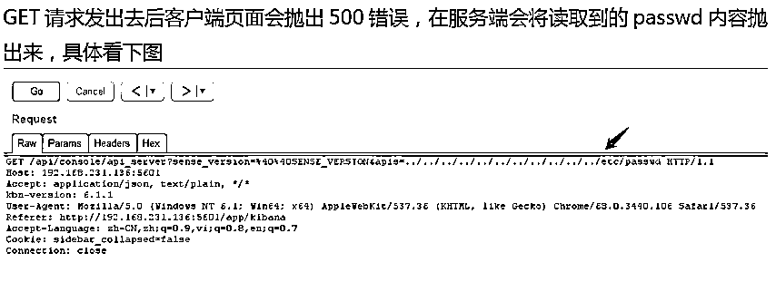
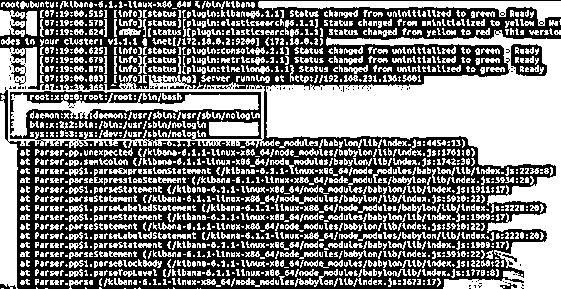
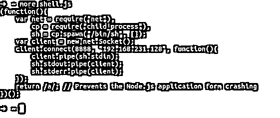
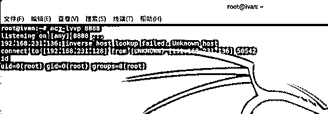
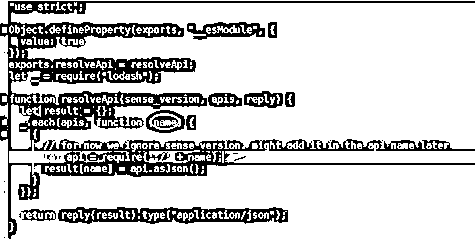
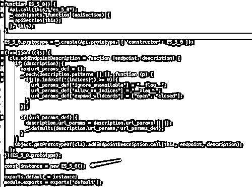
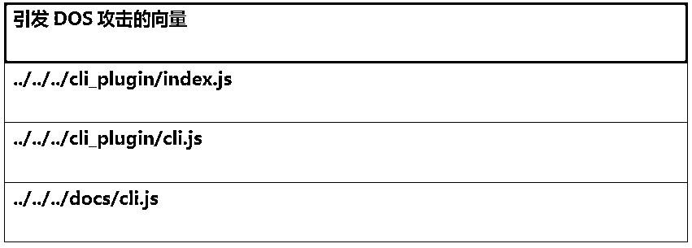

# Elasticsearch 核心插件 Kibana 本地文件包含漏洞分析（CVE-2018-17246） - Ivan1ee - 博客园

> 原文：[`www.cnblogs.com/Ivan1ee/p/10210637.html`](https://www.cnblogs.com/Ivan1ee/p/10210637.html)

不久前 Elasticsearch 发布了最新安全公告， Elasticsearch Kibana 6.4.3 之前版本和 5.6.13 之前版本中的 Console 插件存在严重的本地文件包含漏洞可导致拒绝服务攻击、任意文件读取攻击、配合第三方应用反弹 SHELL 攻击，下文笔者对其漏洞背景、攻击原理和行为进行分析和复现。

# 0X01 影响范围

Elasticsearch Kibana 是荷兰 Elasticsearch 公司的一套开源的、基于浏览器的分析和搜索 Elasticsearch 仪表板工具，作为 Elasticsearch 的核心组件，Kibana 可作为产品或服务提供，并与各种系统，产品，网站和企业中的其他 Elastic Stack 产品配合使用。 由于 Kibana 在大数据领域用途较为广泛，此次漏洞影响范围较大， Shodan 搜索结果如图

# 0x02 漏洞场景

笔者选择 Kibana-6.1.1-linux-x86_64.tar.gz 版本，搭建过程不表，网上很多参考资料

## 2.1、拒绝服务

拒绝服务笔者选择/cli_plugin/index.js 演示，攻击向量如下

GET 请求发出去后客户端打不开应用页面，在服务端 Kibana 进程退出，应用服务挂掉具体看下图

## 2.2、任意文件读取

文件读取笔者选择/etc/passwd 演示，攻击向量如下

## 2.3、配合第三方应用

通常情况下 Kibana 与其他的应用程序一起部署，如果应用程序可以上传或者写入 Javascript 文件的话，攻击者可以通过 Nodejs 创建一个 Reverse Shell，内容如下

路径遍历允许攻击者访问 Kibana 服务器任何文件的位置，如下

Nc 反弹监听得到交互会话

# 0X03 漏洞分析

漏洞污染点位于 \src\core_plugins\console\api_server\server.js

Apis 得到的值传递给赋值参数 name，从图上也能看到 name 变量的内容没有进行任何过滤被引入到 require，而 require 模块在 Nodejs 里表示加载模块的方式，可以加载核心模块，例如内置的“http”，也可以是包含名为“index.js”这样的文件或目录如果参数以“/”、“./”、”../”开头则函数知道该模块是文件或者文件夹，继续跟进到函数 asJson 所在的 api.js 文件中

在同级目录下 ES_5_0.js 中有一个这个类的导出实例

总结一下此函数的正常流程是获取导出 API 类实例并调用函数 asJson 的 JavaScript 文件的名称，但是忽略了过滤验证因此我们可以指定任意文件，配合目录跳转遍历就可以实现 Kibana 服务器上任意文件读取的操作。基于上述的分析很明显 Nodejs 应用程序需要大量的文件，如果这些文件里包含了 process.exit 指令，那么就可能关闭 Kibana 进程并导致拒绝服务攻击，通过搜索找到了三个可能的攻击向量

# 0x04 一点总结

LFI 通常出现在 PHP 应用中，通样是 require 这次应用在 Nodejs 程序中，相信未来还会有更多的 Nodejs 程序存在这种问题，原因是本地包含漏洞出现了很多年，但依旧有很多软件开发人员和架构师没有考虑到这点，这篇文章很好的说明了 Kibana 中存在的一个关键 LFI 漏洞，使得攻击者能够在服务器上运行本地代码，可造成直接的危害就是拒绝服务攻击，若在生产环境下业务实在伤不起，需要引起对 Nodejs LFI 的重视。

# 0x05 参考链接

[`github.com/appsecco/vulnerable-apps/tree/master/node-reverse-shell`](https://github.com/appsecco/vulnerable-apps/tree/master/node-reverse-shell)

[`www.elastic.co/downloads/kibana`](https://www.elastic.co/downloads/kibana)

[`www.cnvd.org.cn/flaw/show/CNVD-2018-23907`](http://www.cnvd.org.cn/flaw/show/CNVD-2018-23907)

[`cve.mitre.org/cgi-bin/cvename.cgi?name=CVE-2018-17246`](http://cve.mitre.org/cgi-bin/cvename.cgi?name=CVE-2018-17246)