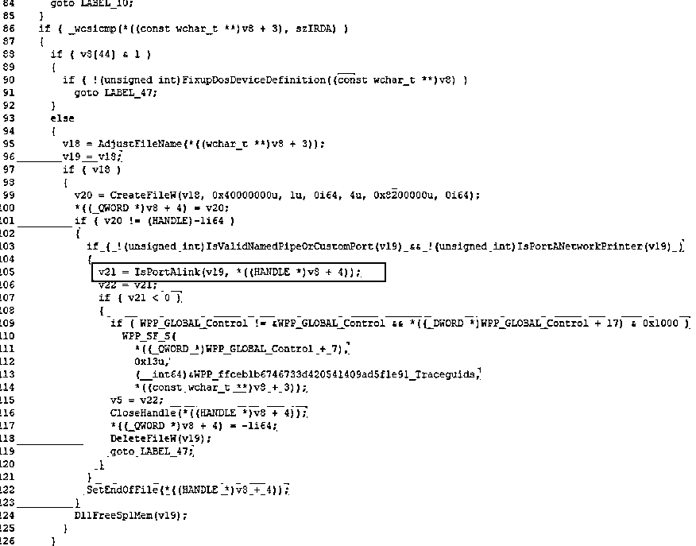
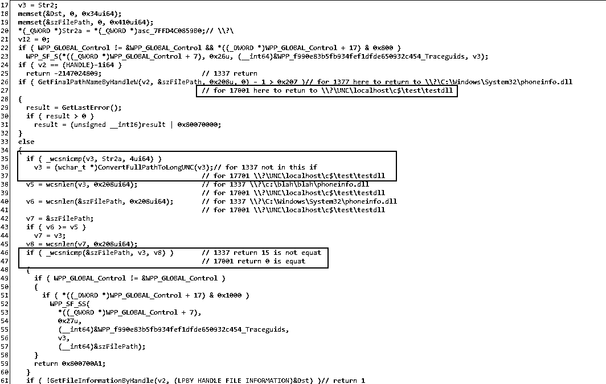
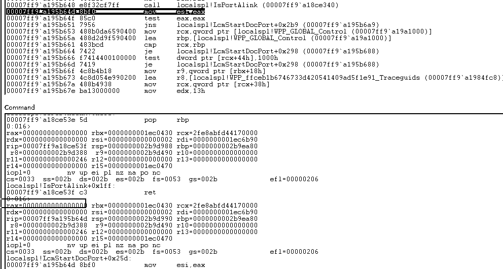
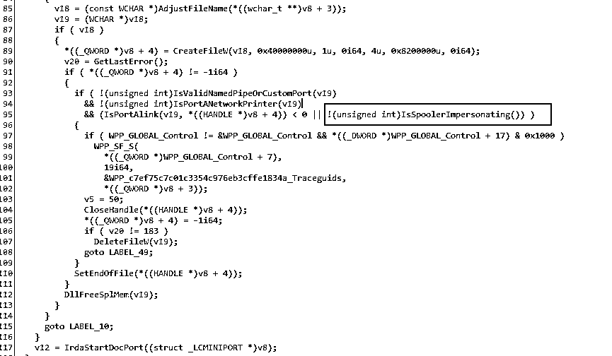
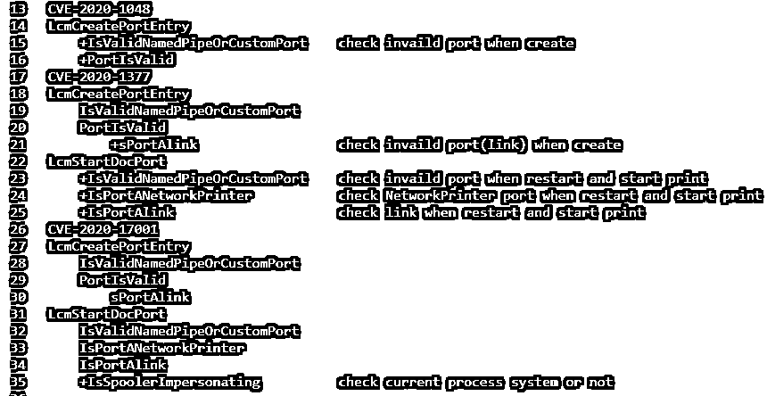

# From CVE-2020-1048 to CVE-2020-17001 - goabout2 - 博客园

> 原文：[`www.cnblogs.com/goabout2/p/13971925.html`](https://www.cnblogs.com/goabout2/p/13971925.html)

2020 年 11 月 11 日的每月微软补丁日修复了一个打印机的任意写漏洞 CVE-2020-17001，该漏洞由 Google project zero 在当天披露了相关细节，有意思的是这个漏洞实际上是之前 CVE-2020-1337 未修复完全所导致，而 CVE-2020-1337 同样又是另一个漏洞 CVE-2020-1048 未完全修复而来，CVE-2020-1048 是一个打印机服务导致的任意文件写漏洞，而该漏洞由于微软在修补上的一再失误致使接连两次补丁都失效，这样的情况在微软的修复史上也是比较少见了，类似的情况我有印象的是 2018 年系列的 vbs 漏洞修复，详情可以见我当时的文章（https://www.cnblogs.com/goabout2/p/10259308.html），这里我们来详细看看这三个漏洞及对应的修复过程，并以此来看看应该如何去很好的修复一个漏洞。

首先是最初的 CVE-2020-1048，该漏洞很简单，就是在创建了一个打印机驱动，打印机 port 之后，通过该打印机驱动及 port 生成的打印机，可以直接往 port 指定的路径写入任意文件，但是这里有一定限制，即需要 exp 运行之后重启打印机服务或系统，正常情况下打印机进程直接运行的时候是有对应的权限模拟的，即不能直接写入到类似 system32 这样的高权限文件夹，因此运行 exp 后会报错，但是当打印机出错之后，对应的打印机进程并不会退出，其会将任务挂起，其本意是针对类似远程打印时网络突然断掉/或打印机服务崩溃这种情况，并将相关打印任务的信息保存到 SHD/SPL 文件中，这样一旦网络恢复或者打印机服务重启，对应的任务能继续下去，但是如果打印机服务重启之后，相关的任务信息都来自于 SHD/SPL 文件，SHD/SPL 文件中却并不会记录之前进程的相关权限信息，因此之前挂起的恶意任务将继续恢复执行，且此时是 system 的权限。

```
Add-PrinterDriver -Name "Generic / Text Only" Add-PrinterPort -Name " C:\Windows\System32\myport.txt " Add-Printer -Name "PrinterDemon" -DriverName "Generic / Text Only" -PortName " C:\Windows\System32\myport.txt " Get-Printer | ft Name,DriverName,PortName

相关代码 poc 引用自参考研究报告，仅用于技术分享，一切非法攻击后果与作者无关
```

而微软针对该漏洞的修复就比较简单了，直接在 port 创建函数 LcmCreatePortEntry 中新增了函数 IsValidNamedPipeOrCustomPort 和 PortIsValid。

 

 其中 IsValidNamedPipeOrCustomPort 检测该 port 是否为命名管道，且是否可以通过 createfile 打开，如果不是命名管道，则会检测 port 中是否包含\和/字符。

而 PortIsValid 则判断这个 port 是否合法，主要是检测是否为 com/lpt port,并尝试通过创建对应的 port 文件句柄来判断是否拥有读写权限。

但是实际上上面的修复方式是有问题的，即只是简单的检测了 port 的创建过程，而创建过程中，IsValidNamedPipeOrCustomPort 和 PortIsValid 只要有一个不返回 0 即可以通过判断。理论上正常情况下无论如何构造都无法通过 IsValidNamedPipeOrCustomPort 的判断，因为路径一定会包含/，但是我们只要绕过 PortIsValid 的判断即可，PortIsValid 只需要判断我们的 port 路径是否具有可读写权限。如果我们一开始 port 生成的时候指向一个有读写权限的路径如下 poc 中的 C:\test\test.dll，在创建打印机之后，删除该目录，并通过目录链接，将删除的目录和 system32 目录链接，这样将导致我们对 test 目录的操作实际转到对 system32 的操作中，从而达到了 port 创建的时候为正常权限目录，而重启之后实际打印的链接却指向了 system 目录，这就是 CVE-2020-1337.

```
mkdir "C:\test" Add-PrinterDriver -Name "Generic / Text Only" Add-PrinterPort -Name "C:\test\test.dll" Add-Printer -Name "PrinterExploit" -DriverName "Generic / Text Only" -PortName "C:\test\test.dll" rmdir "c:\test" New-Item -ItemType Junction -Path "C:\test" -Value "C:\windows\system32" 相关代码 poc 引用自参考研究报告，仅用于技术分享，一切非法攻击后果与作者无关 
```

可以看到直接绕过 PortIsValid 的检测返回 1，并在之后通过文件链接写入到 system 目录。

 

  而此时微软发现了并不能单一的在打印机 port 创建的位置进行检测，此时针对该漏洞在函数 LcmStartDocPort 中进行了处理，LcmStartDocPort 如下所示，其实际上就是用于开始打印工作的函数，在重启打印后会调用，用以完成之前的任务，可以看到 LcmStartDocPort 增加的代码首先是 IsValidNamedPipeOrCustomPort，之后是 IsPortANetworkPrinter，其中 IsValidNamedPipeOrCustomPort 是在 CVE-2020-1048 的补丁中引入，其能有效的识别非法的 port，IsPortANetworkPrinter 则是该次补丁中增加的函数，用于识别是否是一个网络打印机，之后一旦任意函数检验不通过，则通过 IsPortAlink 检测其是否为一个链接，如果是，直接删除对应的文件。



 而这次修补的问题在于 IsPortAlink 函数本身的局限性，IsPortAlink 中，如果我们的 port 路径直接使用一个 UNC 路径\\localhost\c$\test\testdll 时，在 IsPortAlink 的检测中，GetFinalPathNameByHandleW 针对该路径返回的真实路径为\\?\UNC\localhost\c$\test\testdll，这里可以看到 GetFinalPathNameByHandleW 此时返回的真实路径只是简单的在其前面增加了\\?\UNC 的前缀，并不会将其真正对应的 link 链接返回。由于增加了\\?\前缀，导致之后 wcsnicmp 比较成功，调用函数 ConvertFullPathToLongUNC，该函数会尝试将 port 路径转化为 UNC 路径，最终的结果同样为\\?\UNC\localhost\c$\test\testdll，这就导致最终第三个红框中的判断相等，从而不会进入 1337 poc 运行时触发的检测流程，最终 IsPortAlink 返回 0，而这就是第三个漏洞 CVE-2020-17001.



   如下所示可以看到只需要简单的修改 CVE-2020-1337 中的 poc，将 port 的地址换为\\localhost\c$\test\test.dll 即可。

```
mkdir "C:\test" Add-PrinterDriver -Name "Generic / Text Only" Add-PrinterPort -Name "\\localhost\c$\test\test.dll" Add-Printer -Name "PrinterExploit" -DriverName "Generic / Text Only" -PortName "\\localhost\c$\test\test.dll" rmdir "c:\test" New-Item -ItemType Junction -Path "C:\test" -Value "C:\windows\system32" 相关代码 poc 引用自参考研究报告，仅用于技术分享，一切非法攻击后果与作者无关 
```

此时直接可以绕过 IsPortAlink 的检测。



  为了修复 CVE-2020-17001，微软直接在 LcmStartDocPort 中增加了函数 IsSpoolerImpersonating，该函数用于检测当前进程是否运行在 system 权限，如果是则直接进入到检测逻辑中，删除该 port 对应的文件，这里的修补相当于给重启后的打印机进程增加了一层权限模拟，以防止任意文件写入。

 

 IsSpoolerImpersonating 的 system 检测代码。

 

 如下所示为整个该系列漏洞修复过程中微软的修改，针对 CVE-2020-1048 只是简单的在打印机 port 创建的时候判断该 port 指向路径的合法性及对应目录的权限是否正确，而忽视了实际重启后 port 的状态，因此通过目录链接可以直接绕过该检测，这就是 CVE-2020-1337，而 CVE-2020-1337 的修复中在重启后的实际打印任务函数 LcmStartDocPort 中增加了函数 IsPortAlink 以实现对目录链接的检测，同时该函数还增加到了打印机 port 创建函数 LcmCreatePortEntry(在其子函数 PortIsValid)中，这看似万无一失了，但是由于 IsPortAlink 的局限性，其对于 UNC 链接的路径处理的时候不够严谨，直接导致了 CVE-2020-17001。而此时微软也意识到了，以其一味的去检测攻击者不停尝试的各种打印机 port，不如直接在 LcmStartDocPort 中增加函数 IsSpoolerImpersonating 以确保当时的进程权限正确才是一劳永逸的方式，而实际上大多数这种逻辑上导致的任意文件写漏洞也往往都是因为权限控制不当导致的。

 

转载请注明出处

参考链接：
https://github.com/shubham0d/CVE-2020-1048
https://github.com/neofito/CVE-2020-1337/tree/master/BinaryPlanting
https://bugs.chromium.org/p/project-zero/issues/detail?id=2075