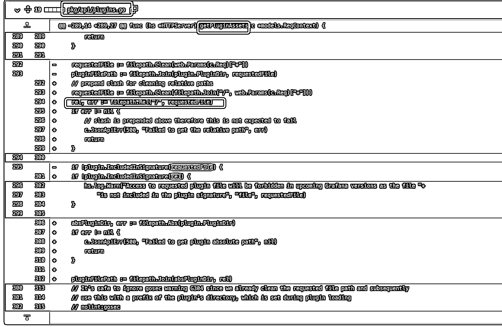

# Grafana 任意文件读取漏洞 （CVE-2021-43798）学习 - 小丸子爱吃桃子 - 博客园

> 原文：[`www.cnblogs.com/ffx1/p/15680305.html`](https://www.cnblogs.com/ffx1/p/15680305.html)

### 漏洞概述

Grafana 是一个跨平台、开源的数据可视化网络应用程序平台。用户配置连接的数据源之后，Grafana 可以在网络浏览器里显示数据图表和警告。
Grafana 的读取文件接口存在未授权，且未对文件地址进行过滤，导致可以目录穿越`/../../../../../../../../../os filepath`实现系统任意文件读取。

### 漏洞详情

1、官方修复代码：[`github.com/grafana/grafana/commit/c798c0e958d15d9cc7f27c72113d572fa58545ce`](https://github.com/grafana/grafana/commit/c798c0e958d15d9cc7f27c72113d572fa58545ce)

2、可以看到问题出在`pkg/api/api.go`中的 `getPluginAssets()`函数，如下：

通过 pluginid 得到插件信息，如果插件不存在就返回 404；
通过`requestedFile := filepath.Clean(web.Params(c.Req)["*"])` 文件 path，并且通过了 clean 函数的处理，但这里没有处理彻底，导致可以通过`../../../../../`方式绕过，`pluginFilePath := filepath.Join(plugin.PluginDir, requestedFile)` 拼接插件目录。

poc:`/public/plugins/exit-plugin-name/../../../../../../../../etc/passwd`

3、官方修复增加了 `rel, err := filepath.Rel("/", requestedFile)`，我们来看看 go 中的`rel()`函数是做什么的：
`Rel(basepath, targpath string) (string, error)`，官方解释有点绕，说人话就是：
函数返回值等于 targpath 减去 basepath ，要求 targpath 和 basepath 必须“都是相对路径”或“都是绝对路径”。

`rel, err := filepath.Rel("/", requestedFile)`中 `/`是绝对路径，我们要实现目录穿越的话，`../../`是相对路径，因此这里就过不去，无法成功利用了。

### 影响范围

Grafana 8.0.0-beta1 - 8.3.0

### 安全版本

Grafana >= 8.3.1
Grafana >= 8.2.7
Grafana >= 8.1.8
Grafana >= 8.0.7

### 受影响 plugins

> alertGroups
> alertlist
> alertmanager
> annolist
> barchart
> bargauge
> canvas
> cloudwatch
> dashboard
> dashlist
> debug
> elasticsearch
> gauge
> geomap
> gettingstarted
> grafana-azure-monitor-datasource
> grafana
> graph
> graphite
> heatmap
> histogram
> influxdb
> jaeger
> live
> logs
> loki
> mixed
> mssql
> mysql
> news
> nodeGraph
> opentsdb
> piechart
> pluginlist
> postgres
> prometheus
> stat
> state-timeline
> status-history
> table-old
> table
> tempo
> testdata
> text
> timeseries
> welcome
> xychart
> zipkin>
> yon