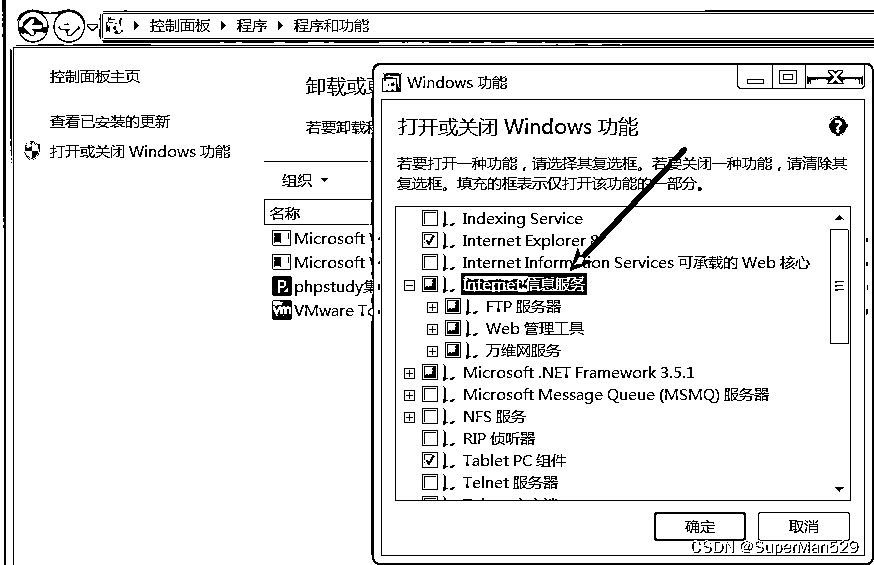
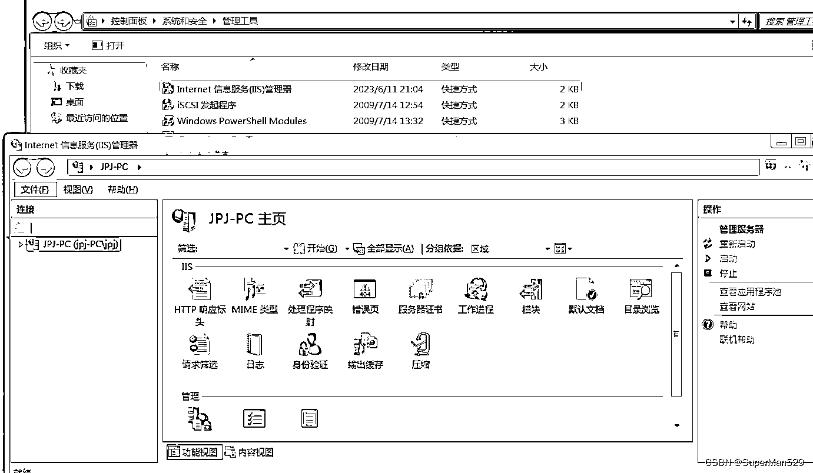
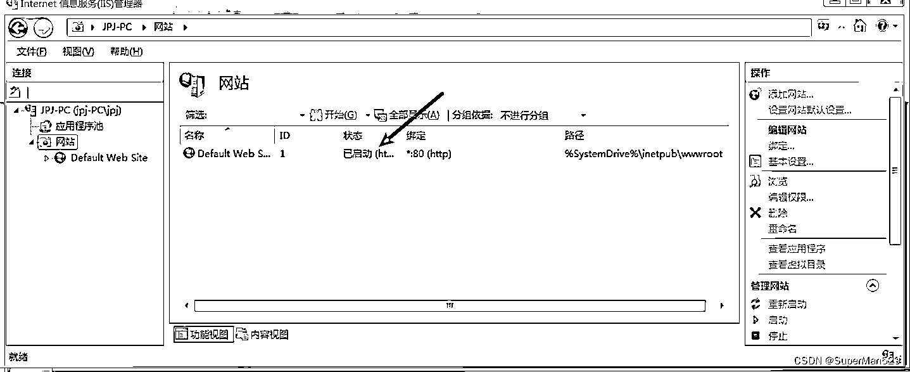
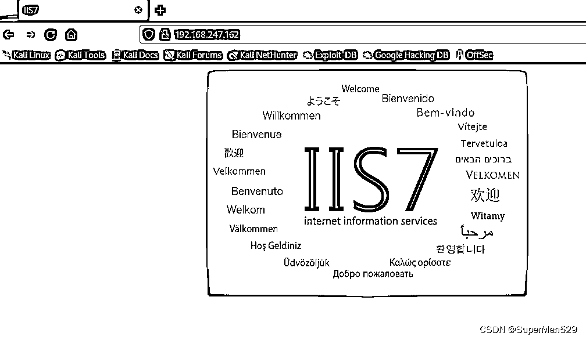
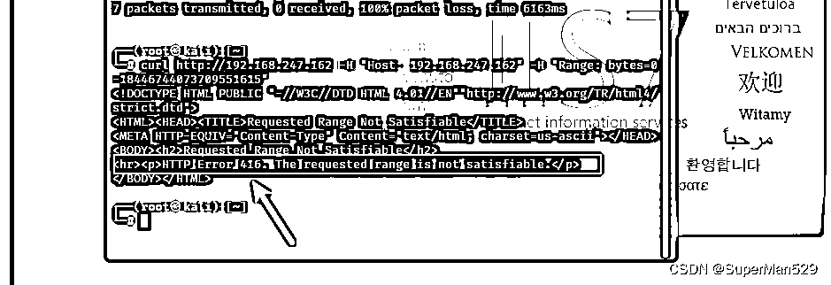
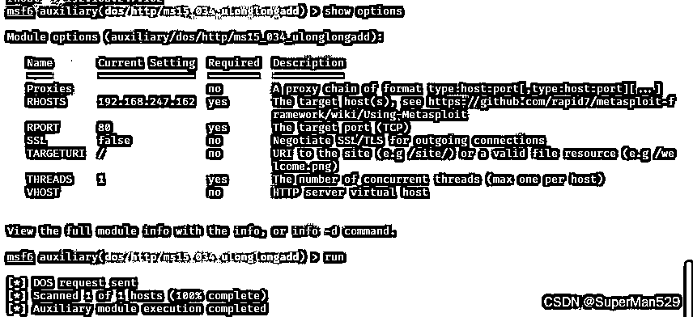
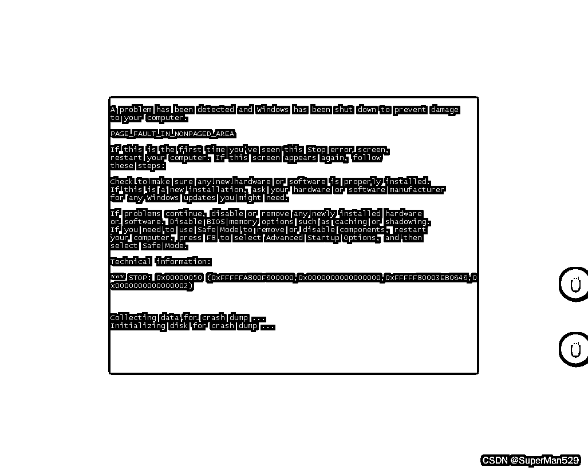
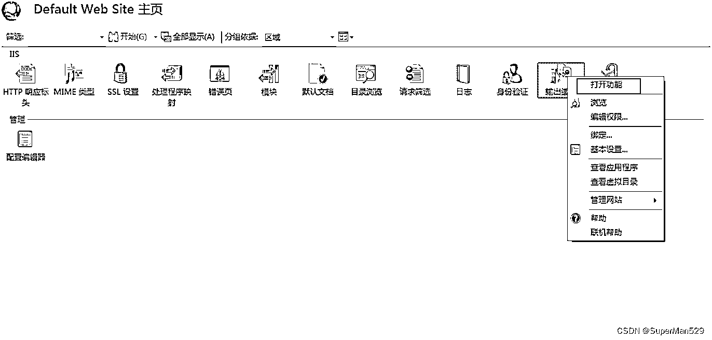
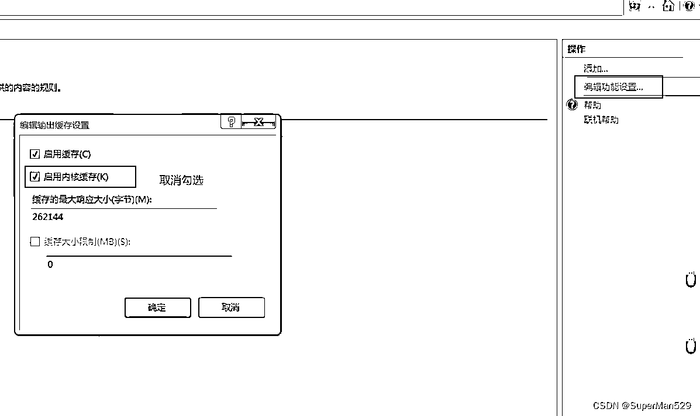

# HTTP.SYS 远程代码执行漏洞验证及其复现(CVE-2015-1635 蓝屏洞) - 了了青山见 - 博客园

> 原文：[`www.cnblogs.com/Pengj/p/17602177.html`](https://www.cnblogs.com/Pengj/p/17602177.html)

# HTTP.SYS 远程代码执行漏洞验证及其复现(CVE-2015-1635 蓝屏洞)

@

目录

*   HTTP.SYS 远程代码执行漏洞验证及其复现(CVE-2015-1635 蓝屏洞)
    *   *   漏洞概述
        *   http.sys 介绍
        *   漏洞成因
        *   漏洞危害
        *   影响版本
        *   漏洞复现环境部署
        *   漏洞验证
        *   防护措施

### 漏洞概述

### http.sys 介绍

HTTP.sys 是 Microsoft Windows 处理 HTTP 请求的内核驱动程序，为了优化 IIS 服务器性能，从 IIS6.0 引入，IIS 服务进程依赖 HTTP.sys。HTTP.sys 远程代码执行漏洞实质是 HTTP.sys 的整数溢出漏洞

### 漏洞成因

远程执行代码漏洞存在于 HTTP 协议堆栈 (HTTP.sys) 中，当 HTTP.sys 未正确分析经特殊设计的 HTTP 请求时会导致此漏洞

### 漏洞危害

攻击者只需要发送恶意的 http 请求数据包，就可能远程读取 IIS 服务器的内存数据，或使服务器系统蓝屏崩溃。

### 影响版本

任何安装了微软 IIS 6.0 以上的的 Windows 7、Windows Server 2008 R2、 Windows Server 2012 R2 、Windows Server 2012、Windows 8、2、Windows 8.1 系统

### 漏洞复现环境部署

windows7 环境下部署 IIS 服务
控制面板-->程序-->程序和功能-->Internet 信息服务

打开 IIS 管理器
控制面板-->系统和安全-->管理工具

查看默认网站首页是否启动

访问本地回环地址，查看 IIS 版本是否为 6 版本及以上


### 漏洞验证

win7 靶机 IP:192.168.147.162
kali 攻击机:192.168.247.164
使用攻击机访问靶机查看网络是否互通

使用 curl 命令查看漏洞是否存在

```
curl http://192.168.247.162 -H "Host: 192.168.247.162" -H "Range: bytes=0-18446744073709551615" 
```

返回状态码为 416 即证明该系统漏洞存在

使用 msfconsole 搜索 ms15_034

使用模块 0 进行 dos 攻击，查看选项设置，端口默认 80 不用设置

设置目标主机地址，并开始进行 dos 攻击


攻击成功，靶机蓝屏重启


### 防护措施

1.  打补丁
    [`learn.microsoft.com/zh-cn/security-updates/Securitybulletins/2015/ms15-034`](https://learn.microsoft.com/zh-cn/security-updates/Securitybulletins/2015/ms15-034)
2.  禁用 IIS 内核缓存
    
    