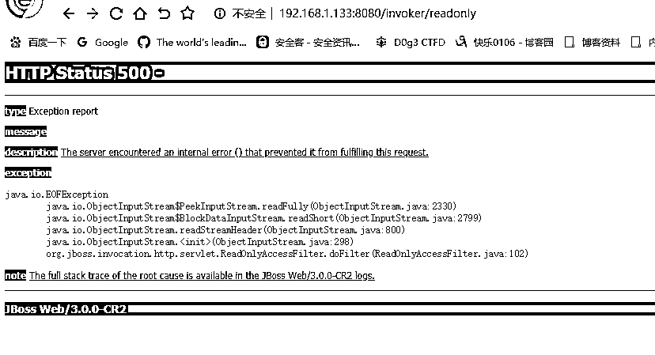
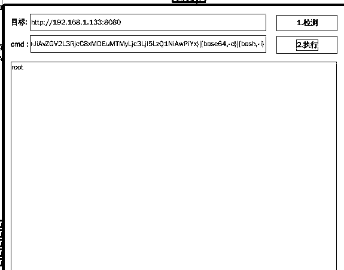
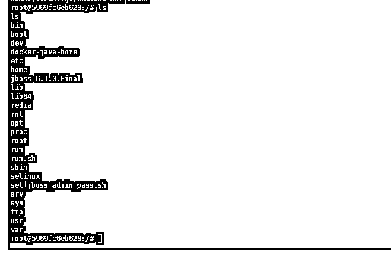

# JBoss 5.x 和 6.x 反序列化漏洞（CVE-2017-12149） - -Zad- - 博客园

> 原文：[`www.cnblogs.com/kuaile1314/p/12060366.html`](https://www.cnblogs.com/kuaile1314/p/12060366.html)

## 0x01 漏洞简介

> 该漏洞为 Java 反序列化错误类型，存在于 Jboss 的 HttpInvoker 组件中的 ReadOnlyAccessFilter 过滤器中。该过滤器在没有进行任何安全检查的情况下尝试将来自客户端的数据流进行反序列化，从而导致了攻击者可以在服务器上执行任意代码。

## 0x02 漏洞版本

漏洞影响 5.x 和 6.x 版本的 JBOSSAS。

## 0x03 漏洞原理

JBOSS Application Server 是一个基于 J2EE 的开放源代码的应用服务器。 JBoss 代码遵循 LGPL 许可，可以在任何商业应用中免费使用。Java 序列化：把 Java 对象转换为字节序列的过程。Java 反序列化：指把字节序列恢复为 Java 对象的过程。
Java 序列化与反序列化作用：便于保存数据，或者进行数据传输。

```
序列化
FileOutputStream fos = new FileOutputStream(file);
ObjectOutputStream oos = new ObjectOutputStream(fos);
oos.writeObject(st);

反序列化
FileInputStream fis = new FileInputStream(file);
ObjectInputStream ois = new ObjectInputStream(fis);
Student st1 = (Student) ois.readObject();
```

漏洞出现在 Jboss 的 HttpInvoker 组件中的 ReadOnlyAccessFilter 过滤器中，源码在 jboss\server\all\deploy\httpha-invoker.sar\invoker.war\WEB-INF\classes\org\jboss\invocation\http\servlet 目录下的 ReadOnlyAccessFilter.class 文件中,其中 doFilter 函数代码如下:

```
public void doFilter(ServletRequest request, ServletResponse response, FilterChain chain) throws IOException, ServletException
  {
    HttpServletRequest httpRequest = (HttpServletRequest)request;
    Principal user = httpRequest.getUserPrincipal(); if ((user == null) && (this.readOnlyContext != null))
    {
      ServletInputStream sis = request.getInputStream();
      ObjectInputStream ois = new ObjectInputStream(sis);
      MarshalledInvocation mi = null; try {
        mi = (MarshalledInvocation)ois.readObject();  //漏洞点
 } catch (ClassNotFoundException e)
      { throw new ServletException("Failed to read MarshalledInvocation", e);
      }
      request.setAttribute("MarshalledInvocation", mi);

  mi.setMethodMap(this.namingMethodMap);
  Method m = mi.getMethod(); if (m != null) {
    validateAccess(m, mi);
  }
}
chain.doFilter(request, response);

  } 
```

直接从 http 中获取数据，在没有进行检查或者过滤的情况下，尝试调用 readobject()方法对数据流进行反序列操作，因此产生了 Java 反序列化漏洞。

## 0x04 漏洞复现

1.进入漏洞页面 http://your-ip/invoker/readonly。http 响应码 500(内部服务器错误——服务器端的 CGI、ASP、JSP 等程序发生错误)，分析猜想，此处服务器将用户提交的 POST 内容进行了 Java 反序列化。



 我们使用 bash 来反弹 shell，但由于 Runtime.getRuntime().exec()中不能使用管道符等 bash 需要的方法，我们需要用进行一次编码


 工具验证（简单粗暴，不优雅。）
[`github.com/yunxu1/jboss-_CVE-2017-12149`](https://github.com/yunxu1/jboss-_CVE-2017-12149)

将刚刚编码后的内容写进去，就可以反弹到 Shell 了


 