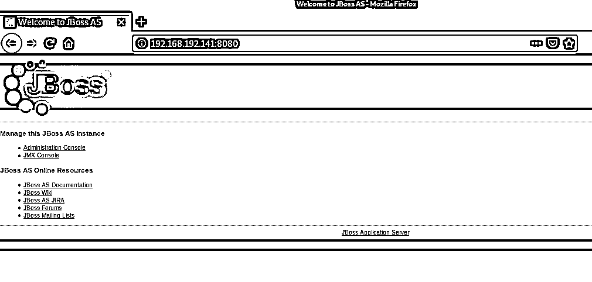
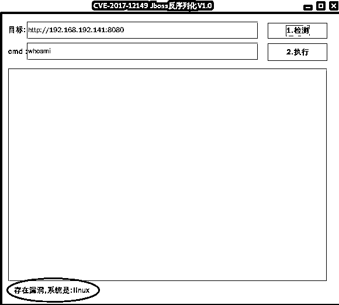
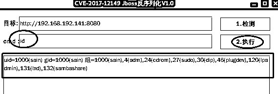
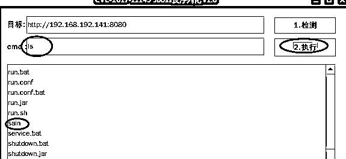
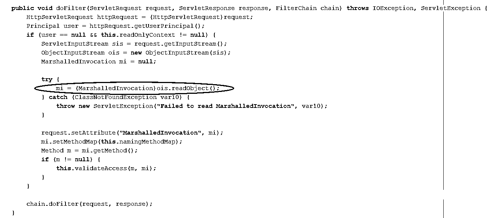
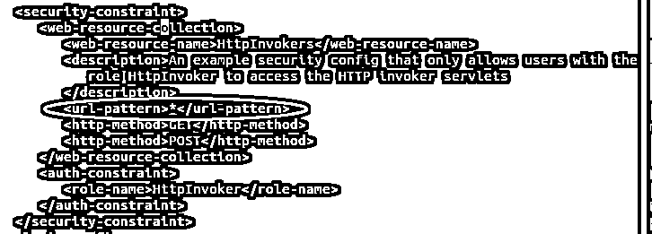
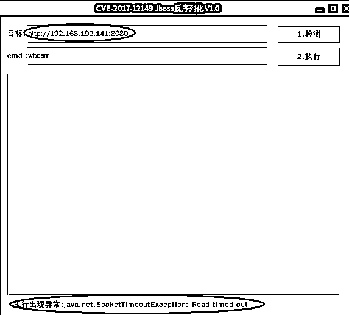
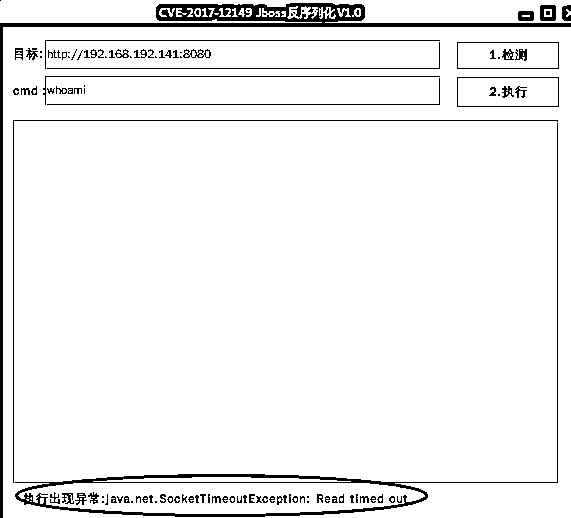

# Jboss 反序列化(CVE-2017-12149)的复现及修复方案 - sainet - 博客园

> 原文：[`www.cnblogs.com/sainet/p/15632205.html`](https://www.cnblogs.com/sainet/p/15632205.html)

## Jboss 反序列化(CVE-2017-12149)的复现

**漏洞名称：** Jboss 反序列化(CVE-2017-12149)

**漏洞描述：** JBoss 是一个管理 EJB 的容器和服务器，支持 EJB 1.1、EJB 2.0 和 EJB3 的规范。在/invoker/readonly 路径下，攻击者可以构造序列化代码传入服务器进行反序列化,由于没有对反序列化操作进行任何检测，导致攻击者可以执行任意代码。

**漏洞影响：** Redhat JBoss Enterprise Application Platform 5.0\

**影响版本：** JBoss 5.x / 6.x

\

**靶机相关环境**

Ubuntu：20.04（要注意 Ubuntu：20.04 一般默认安装了 UFW（Uncomplicated Firewall））

jdk：1.8

jboss：jboss-5.1.0.GA

（因为 jboss 的版本比较老，所以修改配置文件时可以参考：[`wenku.baidu.com/view/18bc1b18c5da50e2524d7ff5.html`](https://wenku.baidu.com/view/18bc1b18c5da50e2524d7ff5.html)）

安装配置成功后启动服务通过另一个虚拟机访问：

\

接下来我们先看下这个漏洞能干什么，直接使用暴力工具 jboss-_CVE-2017-12149-master，（下载地址：[`github.com/yunxu1/jboss-_CVE-2017-12149`](https://github.com/yunxu1/jboss-_CVE-2017-12149)）

\

好，证明存在该漏洞。接下来就可以进行指令了：

\

这样就进入了 Ubuntu 的终端命令，可以在此进行各种行为。例如新建文件等：

\

\

所以，这个漏洞的危险性可显而知，那是这个漏洞是如何产生的呢？

## Jboss 反序列化(CVE-2017-12149)的原理

Java 序列化就是指把 Java 对象转换为字节序列的过程，在传递和保存对象时.保证对象的完整性和可传递性。对象转换为有序字节流,以便在网络上传输或者保存在本地文件中。

Java 反序列化就是指把字节序列恢复为 Java 对象的过程，根据字节流中保存的对象状态及描述信息，通过反序列化重建对象。

序列化：

```
FileOutputStream fos = new FileOutputStream(file);

ObjectOutputStream oos = new ObjectOutputStream(fos);

oos.writeObject(st); 
```

反序列化:

```
ileInputStream fis = new FileInputStream(file);

ObjectInputStream ois = new ObjectInputStream(fis);

Student st1 = (Student) ois.readObject(); 
```

而 jboss 的漏洞出现在 HttpInvoker 组件中的 ReadOnlyAccessFilter 过滤器中，源码在 jboss\server\all\deploy\httpha-invoker.sar\invoker.war\WEB-INF\classes\org\jboss\invocation\http\servlet 目录下的 ReadOnlyAccessFilter.class 文件中,其中 doFilter 函数代码如下:

\

可以看出它从 http 中获取数据，通过调用 readobject()方法对数据流进行反序列操作，但是没有进行检查或者过滤。

知道了大概原理后我们就可以对其进行相应的修复。

## Jboss 反序列化(CVE-2017-12149)的修复方案

**修复原理：** 通过向 http-invoker.sar 的 web.xml 文件中的安全约束添加 url-pattern>来保护对整个 http-invoker 上下文的访问，不想使用 http-invoker.sar 可以将其删除。

**方法一：修改 web.xml 文件**

具体步骤如下：

**步骤一：** 进入/jboss/server/default/deploy/http-invoker.sar/invoker.war/WEB-INF/web.xml，如图所示：

\

**步骤二：** 在安全约束中添加<url-pattern>，就是在 security-constraint 里添加或修改为以下代码（第 158 行）：</url-pattern>

<url-pattern>/*</url-pattern>如图：

\

**步骤三：** 修改完成后，重启 jboss 服务，再次通过另一个虚拟机访问并且使用工具检测，结果如下：

\

发现没有执行漏洞，故修复成功。

**方法二：不需要 http-invoker.sar 组件的直接删除**\

结果同方法一。

\

**方法三：升级 jboss 到 jboss7x 版本**\

以上使用的是 JBoss AS 5.1.0，用 JBoss AS 6.1.0.Final 复现并使用相同步骤修复后结果同上。