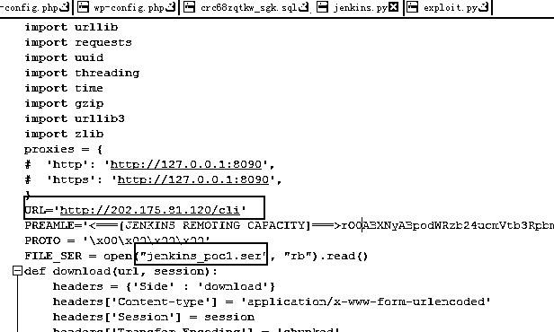
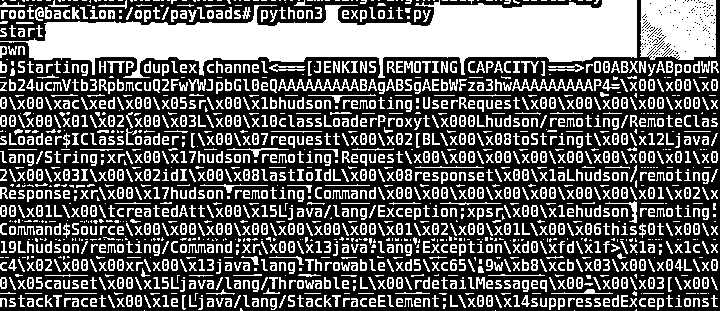
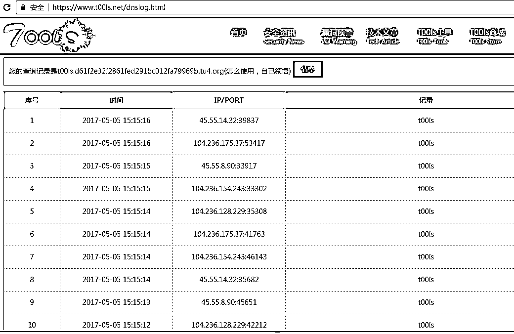

# Jenkins 远程代码执行漏洞检查(CVE-2017-1000353） - 渗透测试中心 - 博客园

> 原文：[`www.cnblogs.com/backlion/p/6813260.html`](https://www.cnblogs.com/backlion/p/6813260.html)

Jenkins 的反序列化漏洞，攻击者使用该漏洞可以在被攻击服务器执行任意代码，漏洞利用不需要任何的权限

漏洞影响范围：

所有 Jenkins 主版本均受到影响(包括<=2.56 版本)
所有 Jenkins LTS 均受到影响( 包括<=2.46.1 版本)

测试步骤：

1.下载生成反序列的 payload:

https://github.com/nobleXu/jenkins

2.生成一个 jenkins_poc1.ser 反序列文件

java  -jar  jenkins_payload.jar  jenkins_poc1.ser  "ping www.baidu.com"

3.下载 jenkins.py 文件：

下载链接: [`pan.baidu.com/s/1misPilU`](https://pan.baidu.com/s/1misPilU%20) 密码: 6qqh

4.编辑 jenkins.py 文件,修改 url 地址：

5.执行 jenkins.py：

python3  exploit.py

6.通过 dnslog 可以看到反序列请求日志记录：

 测试总结：

Jenkins 运行环境是在 linux 下，win 环境利用不成功

参考文献：

https://github.com/phith0n/vulhub/tree/master/jenkins/CVE-2017-1000353

https://blogs.securiteam.com/index.php/archives/3171

https://xianzhi.aliyun.com/forum/read/1567.html